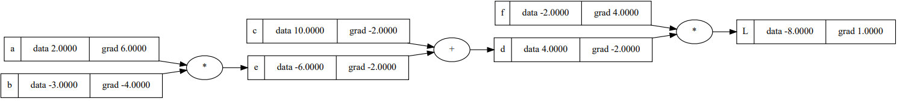
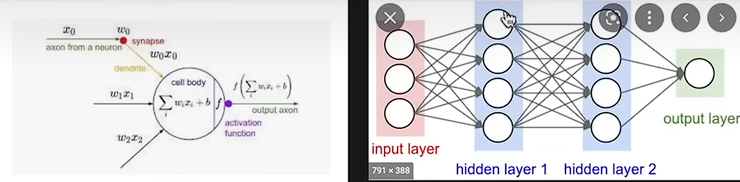

# Build GPT from Scratch

## 资料
* [视频：从零构建 GPT | Neural Networks: Zero to Hero｜Andrej Karpathy](https://www.bilibili.com/video/BV1mqrTBvEaf?spm_id_from=333.788.videopod.sections&vd_source=2a33d03ec3e67e46971208a7faa0dcda)
* [micrograd](https://github.com/karpathy/micrograd#)
* [make more](https://github.com/karpathy/makemore)

## 神经网络与反向传播详解：构建 micrograd

1. 对于 (a * b + c) * f = L，手动进行反向传播，即计算 dL/da, dL/db, dL/dc, dL/df，其中用到导数的链式法则，从当前节点一直追溯到所有叶节点。反向传播本质上是通过计算图反向递归应用链式法则的过程。

    

    然后，沿着梯度方向微调输入，导致输出变大：

    ```python
    a.data += 0.01 * a.grad
    b.data += 0.01 * b.grad
    c.data += 0.01 * c.grad
    f.data += 0.01 * f.grad

    e = a * b
    d = e + c
    L = d * f
    print(L.data) # -7.286496
    ```

2. neuron 是一个简单的函数，它的输出是输入的加权和加上一个偏置项。

    

## 语言建模详解：构建 makemore
## 构建 makemore 第二部分：多层感知机
## 构建 makemore 第三部分：激活函数与梯度，批量归一化
## 构建 makemore 第四部分：成为反向传播高手
## 构建 makemore 第五部分：构建 WaveNet
## 从零开始，用代码详解构建 GPT
## GPT现状 | BRK216HFS
## 构建 GPT 分词器
## 复现 GPT-2 (124M 参数)
