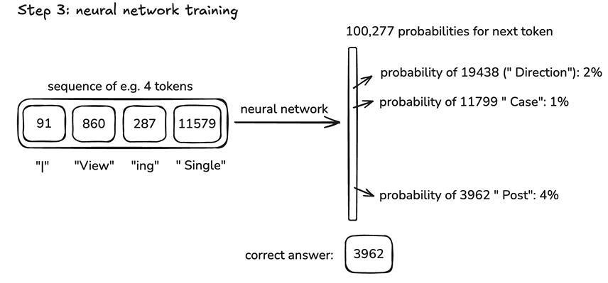
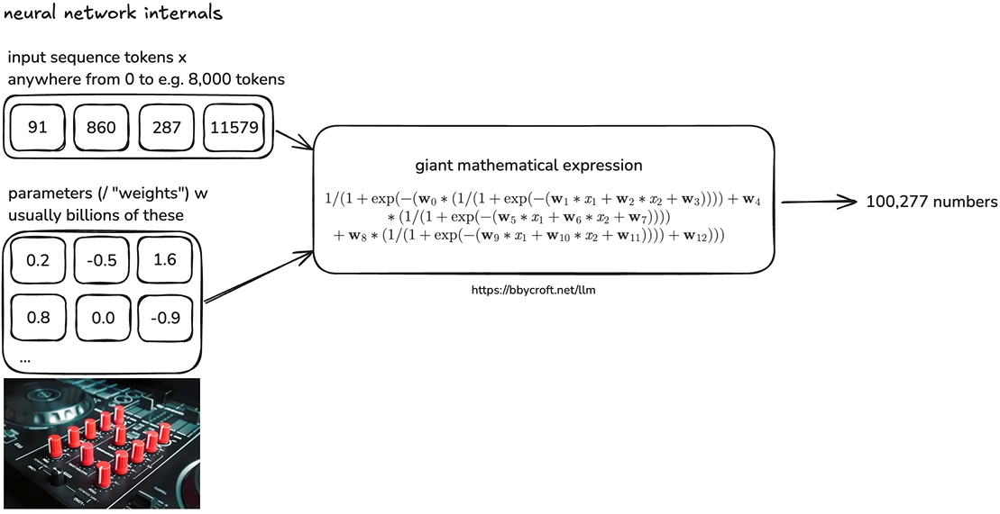
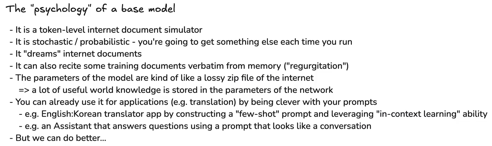
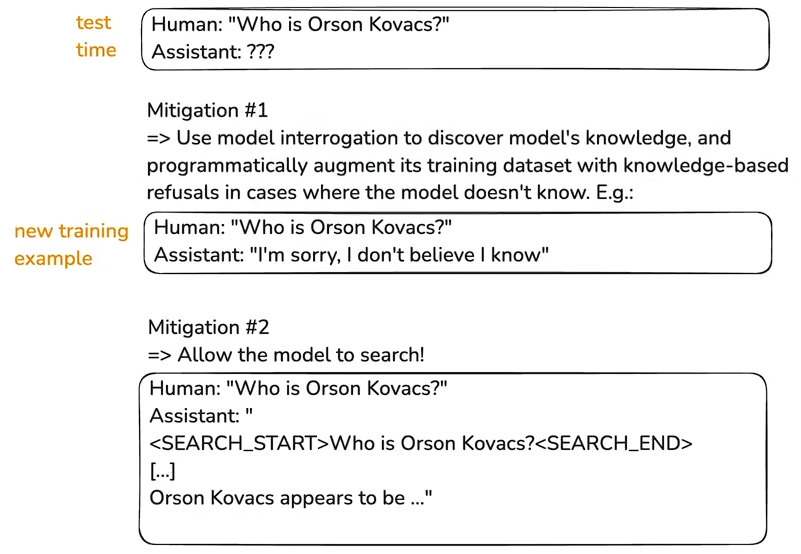
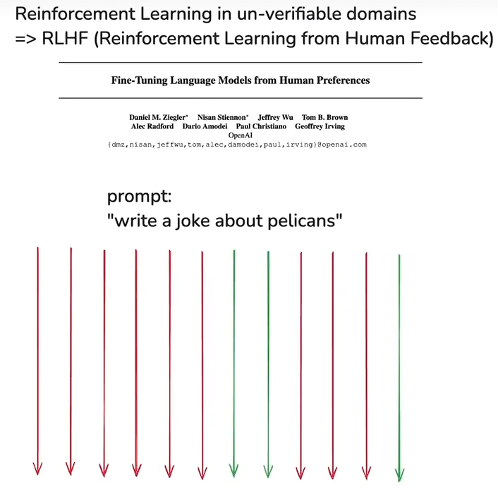
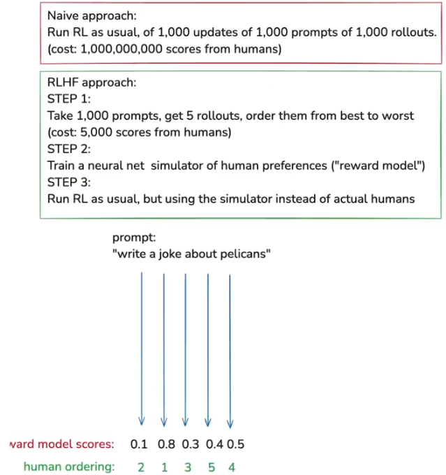

# LLM

## 资料
* [视频：深入探索像ChatGPT这样的大语言模型｜Andrej Karpathy](https://www.bilibili.com/video/BV16cNEeXEer/?spm_id_from=333.1387.favlist.content.click&vd_source=2a33d03ec3e67e46971208a7faa0dcda)

## Pre-Training -> get base model

1. Pre-Training -> get base model ("internet document simulator")

    Step 1: download and preprocess the internet ([FineWeb](https://huggingface.co/spaces/HuggingFaceFW/blogpost-fineweb-v1))

    

2. Step 2: tokenization ([tiktokenizer](https://tiktokenizer.vercel.app/))

3. Step 3: neural network training ([LLM Visualization](https://bbycroft.net/llm))

    

    

4. Whole flow:

    

5. [Karpathy's reproduction with llm.c](https://github.com/karpathy/llm.c/discussions/677)

    

## Post-Training -> supervised finetuning (SFT model)

1. 增加human和assistant之间的对话数据集，Post-Training后得到SFT model (Supervised Fine-Tuning model)

2. 减少模型的幻觉：

    - Use model interrogation to discover model's knowledge, and programmatically augment its training dataset with knowledge-based refusals in cases where the model doesn't know
    - Allow the model to search 

    

    !!! note ""Vague recollection" vs "Working memory""

        Knowledge in the parameters == Vague recollection (e.g. of something you read 1 month ago)

        Knowlege in the tokens of the context window == Working memory

3. 右边的训练更好是因为一步步教会了模型如何推算并得出答案，左边一开始就给了答案，后续步骤均只是答案的解释而言：

    

## Post-Training -> reinforcement learning (RL model)

1. 强化学习：

    

    

    

2. RLHF的优点和缺点：

    