# 吴恩达机器学习

## 资料
* [视频：吴恩达机器学习](https://www.bilibili.com/video/BV16jyuBBEom?spm_id_from=333.788.player.switch&vd_source=2a33d03ec3e67e46971208a7faa0dcda&p=3)

## 机器学习基本概念简介

1. Machine learning: Filed of study that gives computers the ability to learn without being explicit programmed. - Arthur Samuel (1959)

2. Machine learning algorithms：

    - Supervised learning: 监督学习 (最常用🛠️), learn from data labeled with the "right answers".
        - Regression：回归问题，例如预测连续值，例如价格、温度等。
        - Classification：分类问题，例如将邮件分类为垃圾邮件或非垃圾邮件，将用户分类为不同群组等。
    - Unsupervised learning: 无监督学习, find something interesting in unlabeled data.
        - Clustering：聚类问题，例如将用户分为不同的群组，例如根据用户的购买历史将用户分为不同的群组。
        - Anomaly detection：异常值检测问题，例如检测用户行为中的异常值，例如检测用户登录时间中的异常值。
        - Dimensionality reduction：降维问题，例如将高维数据转换为低维数据，例如将用户购买历史转换为低维向量。

3. Supervised learning:

    | Input (X) | Output (Y) | Application |
    | --- | --- | --- |
    | email | spam? (0/1) | spam filtering |
    | audio | text transcripts | speech recognition |
    | English | Spanish | machine translation |
    | ad, user info | click? (0/1) | online advertising |
    | image, radar info | position of other cars | self-driving car |
    | image of phone | defect? (0/1) | visual inspection |

4. Linear regression:

    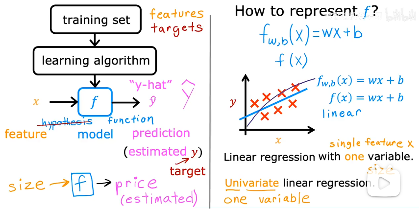

    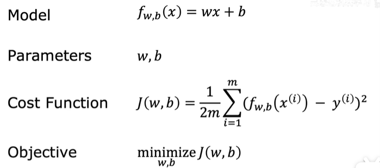

    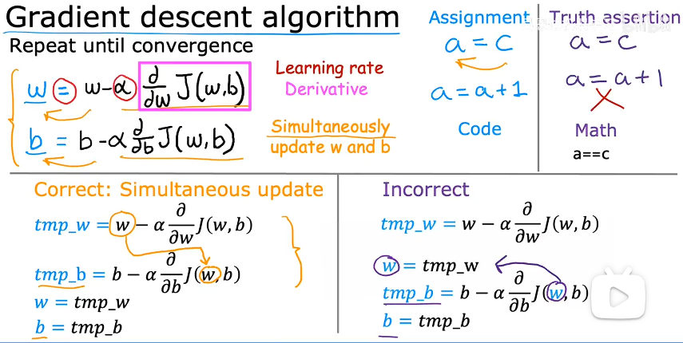

    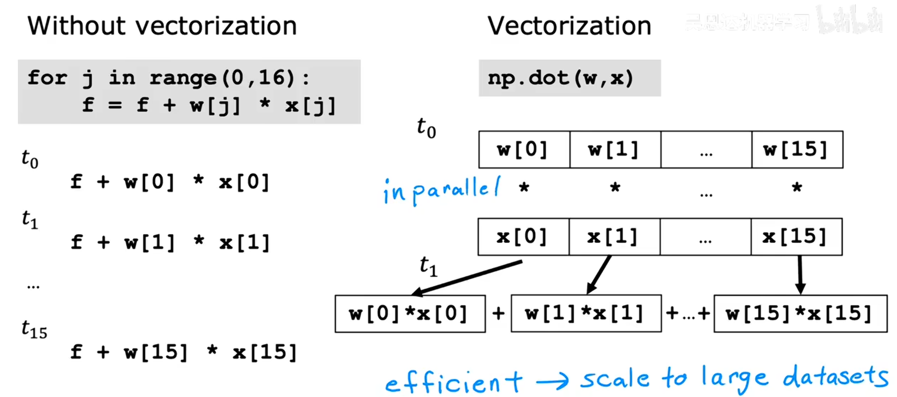

    当不同的feature取值范围差异很大时，需要进行特征一化处理，例如归一化或标准化。否则可能导致梯度下降运行缓慢。
    
    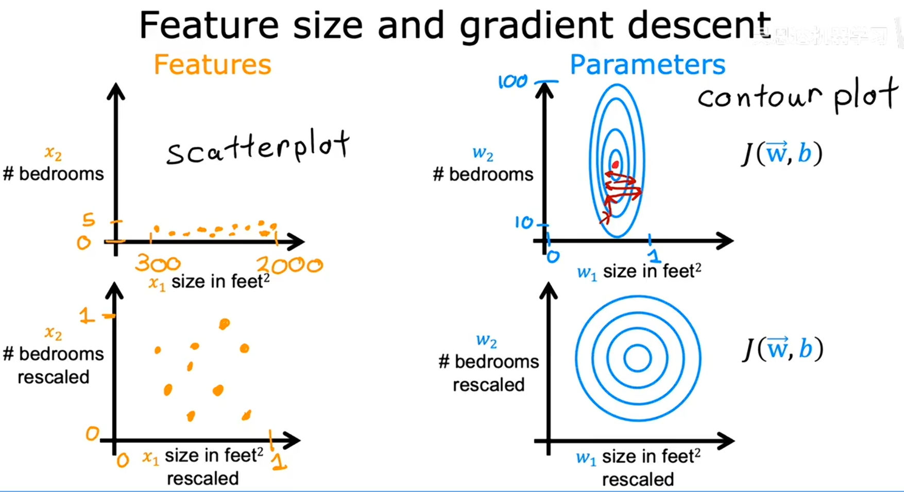

5. Logistic regression: (分类问题)

    用sigmoid函数映射到0-1之间：

    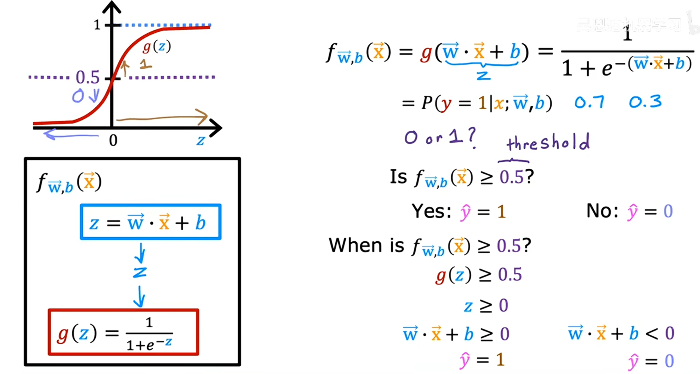

    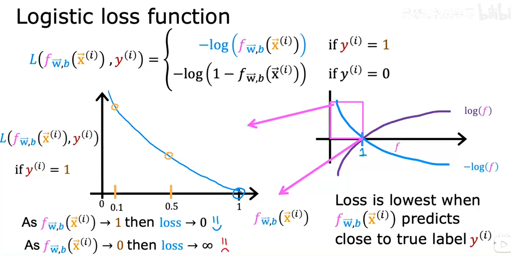

    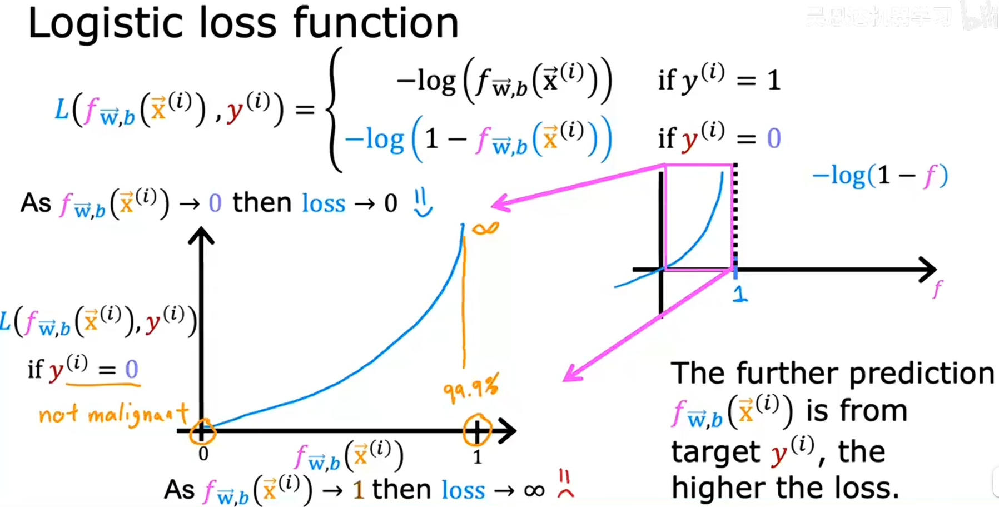

    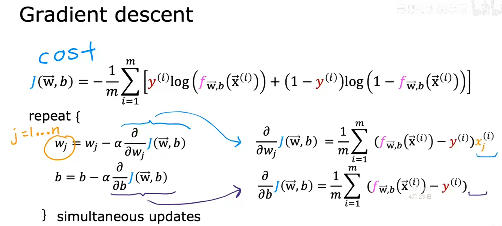

    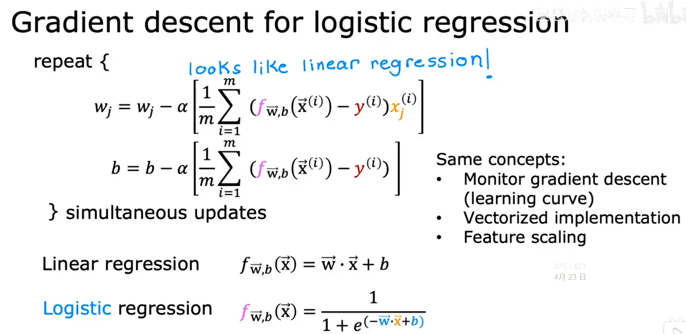

6. Overfitting: 过拟合

    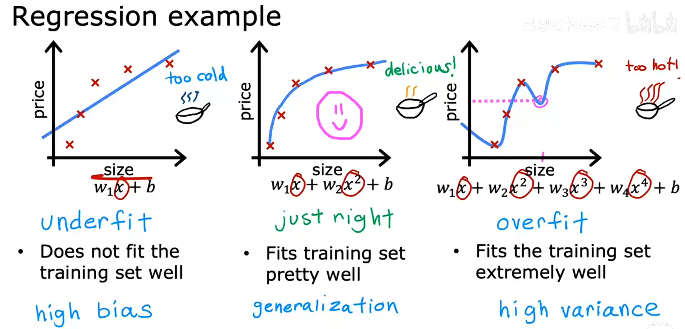

    正则化：能够让你保留所有的特征，但它只是防止特征产生过大的影响 (这有时会导致过拟合)。

    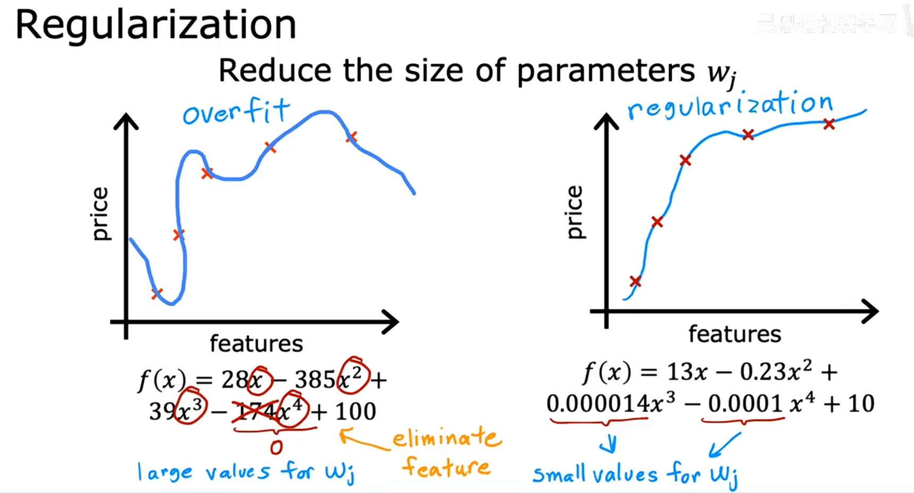

    解决过拟合：

    - Collect more data: 收集更多的数据，以训练模型。
    - Select features: 选择更相关的特征，以减少模型的复杂度。
    - Reduce size of parameters - Use regularization: 使用正则化技术，以防止特征产生过大的影响。

    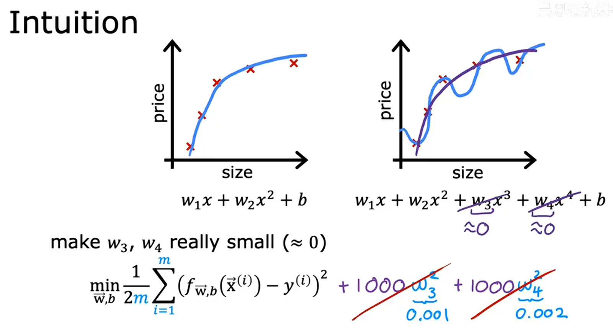