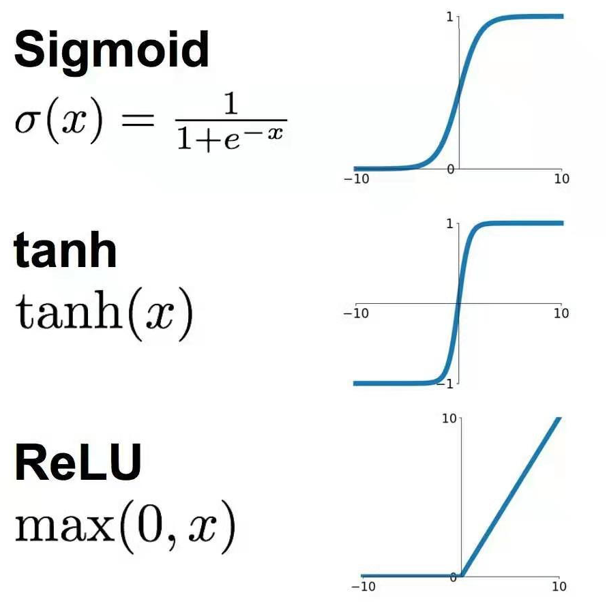

# 李宏毅机器学习

## 资料
* [视频：李宏毅机器学习2025版](https://www.bilibili.com/video/BV1TAtwzTE1S/?spm_id_from=333.337.search-card.all.click&vd_source=2a33d03ec3e67e46971208a7faa0dcda)
* [课程主页](https://courses.d2l.ai/zh-v2/), [课程论坛](https://discuss.d2l.ai/categories)
* [教材](https://zh.d2l.ai/)

## 机器学习基本概念简介

1. 机器学习 ≈ looking for function，例如输入是图片，输出是图片的类别。机器学习的任务：

    - regression: 回归，输出一个标量
    - classification: 分类，输出一个类别标签
    - structured learning: 结构化学习，输出一个结构化数据，例如图片、视频、文本等。

2. Hyperparameter: 超参数，例如学习率、批量大小等，需要通过实验来确定。

3. Activation function: 激活函数，例如ReLU、Sigmoid等，用于将输入映射到输出空间。

    - Sigmoid: 逻辑函数，用于将输入映射到0到1之间。公式：σ(x) = 1 / (1 + e⁻ˣ)
    - Tanh: 双曲正切函数，用于将输入映射到-1到1之间。公式：tanh(x) = (eˣ - e⁻ˣ) / (eˣ + e⁻ˣ)
    - ReLU: Rectified Linear Unit，用于将输入映射到非负区域。公式：ReLU (x) = max (0, x) 

    { width="300" }

4. Loss function: 损失函数，例如均方误差、交叉熵等，用于衡量模型的预测与真实标签之间的差距。

5. Optimization: 优化，例如梯度下降(Gradient Descent)、Adam等，用于最小化损失函数。

6. Overfitting: 过拟合，模型在训练集上的性能好，但在测试集上的性能差。解决overfitting的方法有：

    - Data augmentation: 数据增强，通过生成新的数据来增加数据量，减少过拟合。例如图片左右对称下生成新的图片。
    - Constrained model: 限制模型的复杂度，例如通过一些知识限制模型一定是二次函数。
        - Less parameters, sharing parameters: 减少参数总量，让模型变简单、泛化更强。
        - Less features: 减少噪声干扰，让模型学真实规律，不学噪声。
        - Early stopping: 训练时一旦验证集误差上升，立刻停止训练。见好就收，别学太疯。
        - Regularization: 给 loss 加惩罚项，不让 W 变得太大。不让 W 太大 → 曲线变平滑 → 泛化能力变强。如果 W 太大，就狠狠惩罚模型，让 loss 变高，模型为了降低 loss，就被迫把 W 变小。
        - Dropout: 训练时随机关掉一部分神经元。防止神经元过度依赖彼此，让模型更鲁棒。随机掉线 = 不依赖个别神经元，泛化更强。

7. 线性回归: 用于预测连续值的模型，例如预测房价。公式：y = w · x + b。feature: 特征，例如房屋面积、房间数量等，即输入变量x。label: 标签，例如房屋价格，即输出变量y。

8. Model bias vs Optimization:

    - Model bias: 模型本身 “学不会” 真实规律的能力上限。你的模型太简单，就算给无限数据、无限时间训练，也永远拟合不好真实数据。
    - Optimization: 模型本身没问题，只是你没练好、没收敛好。例如梯度下降，有可能找到的是局部最优而非全局最优。

