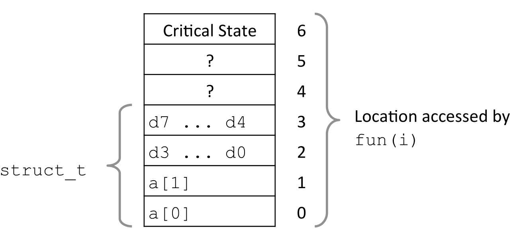

# 绪论

## 资料
* [CMU CSAPP 英文视频](https://www.bilibili.com/video/BV1iW411d7hd/?vd_source=2a33d03ec3e67e46971208a7faa0dcda)
* [课件](https://www.cs.cmu.edu/afs/cs/academic/class/15213-f15/www/schedule.html)
* [九曲阑干](https://www.bilibili.com/video/BV1cD4y1D7uR/?vd_source=2a33d03ec3e67e46971208a7faa0dcda)
* [lab参考](https://arthals.ink/blog/data-lab)
* [blog 1](https://wdxtub.com/work/)
* [blog 2](https://fengmuzi2003.gitbook.io/csapp3e)

## Lecture 1 Course overview

1. 溢出

    ```bash
    (gdb) print 50000 * 50000
    $1 = -1794967296
    (gdb) print 300 * 400 * 500 * 600
    $2 = 1640261632
    (gdb) print 400 * 500 * 600 * 300
    $3 = 1640261632
    ```

    ```c
    #include "stdio.h"

    typedef struct 
    {
        int a[2];
        double d;
    } struct_t;

    double fun(int i)
    {
        volatile struct_t s;
        s.d = 3.14;
        s.a[i] = 1073741824; /* Possibly out of bounds */
        return s.d;
    }

    int main()
    {
        for (int i = 0; i < 7; i++)
        {
            printf("fun(%d): %f\n", i, fun(i));
        }

        return 0;
    }
    ```

    结果：

    ```bash
    fun(0): 3.140000
    fun(1): 3.140000
    fun(2): 3.140000
    fun(3): 2.000001
    fun(4): 3.140000
    fun(5): 3.140000
    *** stack smashing detected ***: terminated
    Aborted (core dumped)
    ```

    下图中一个方框为4个字节，double为8个字节：

    