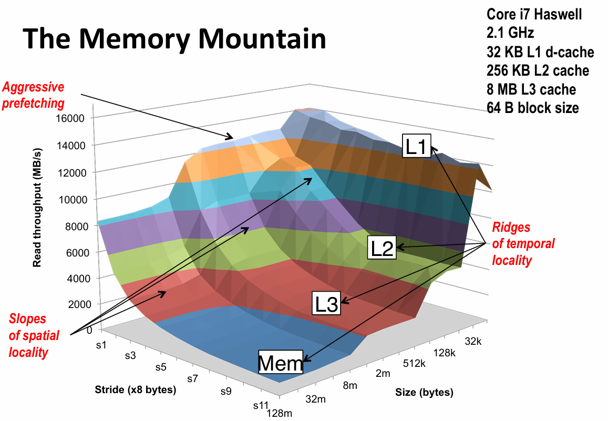
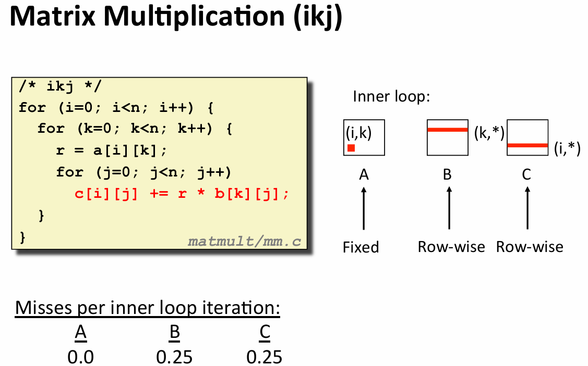
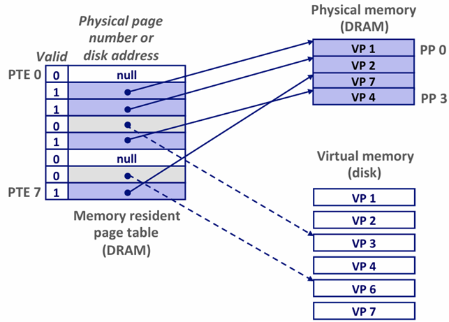
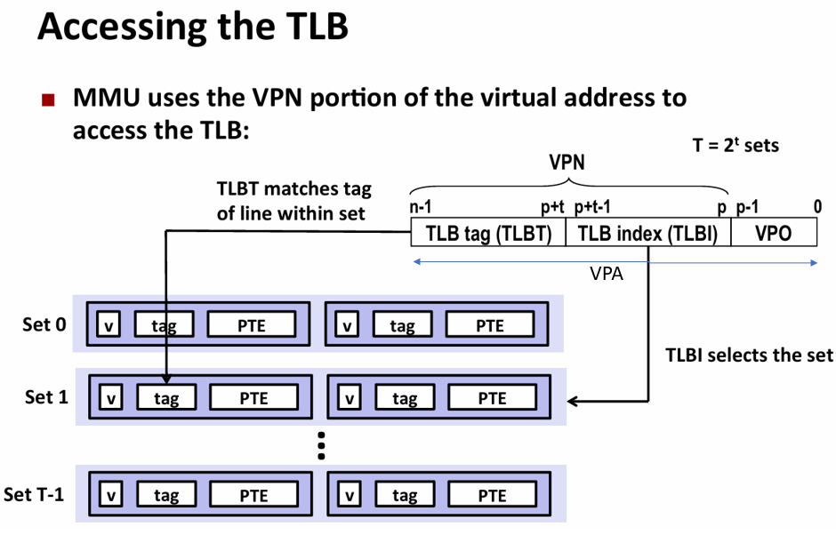
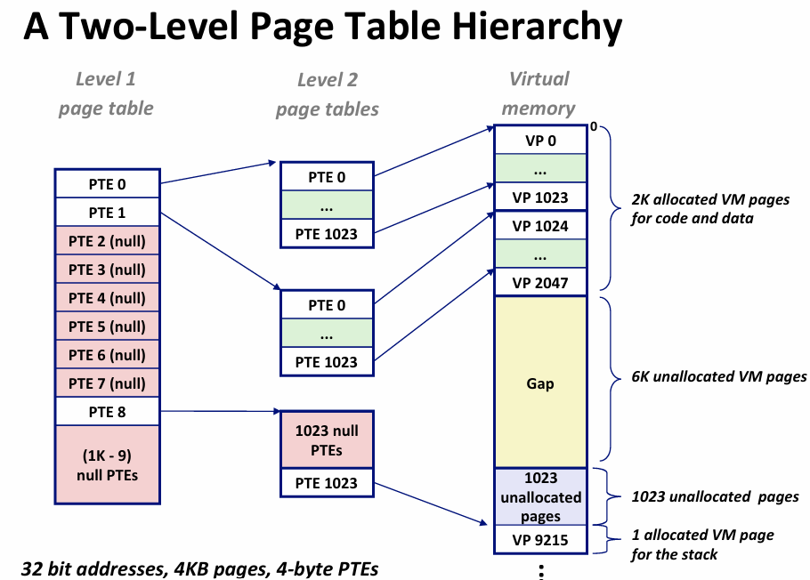

## CH 6 存储器层次结构

1. 随机访问存储器（RAM, Random-Access Memory）
    - 静态RAM (SRAM): 静态RAM的速度比动态RAM快，但是容量小，更贵。SRAM 将每个位存储在一个双稳态的存储器单元中，每个单元是用一个六晶体管电路来实现的。这个电路有这样一个属性，它可以无限期地保持在两个不同的电压配置（configuration）或状态（state）之一。其他任何状态都是不稳定的——从不稳定状态开始，电路会迅速地转移到两个稳定状态中的一个。由于SRAM存储器单元的双稳态特性，只要有电，它就会永远地保持它的值。即使有干扰（例如电子噪音）来扰乱电压，当干扰消除时，电路就会恢复到稳定值。
    - 动态RAM (DRAM)：DRAM 将每个位存储为对一个电容的充电。需要周期性地通过读出，然后重写来刷新。

    |  | 每位晶体管数 | 相对访问时间 | 持续的？ | 敏感的？ | 相对花费 | 应用 |
    | --- | --- | --- | --- | --- | --- | --- |
    | SRAM | 6 | 1X | 是(有电时) | 否 | 1000X | 高速缓存存储器 |
    | DRAM | 1 | 10X | 否 | 是 | 1X | 主存，帧缓冲区 |

2. 单位换算：
    - 与DRAM和SRAM容量相关的计量单位，通常 K = 2^10，M = 2^20，G = 2^30, T = 2^40。
    - 与磁盘和网络这样的的I/O设备容量相关的计量单位，通常 K = 10^3，M = 10^6, G = 10^9, T = 10^12。

3. 存储器山：

4. 重新排列循环以提高空间局部性，n x n 矩阵乘法 (kij or ikj)：
    ```c
    for (int k = 0; k < n; k++) {
        for (int i = 0; i < n; i++) {
            r = a[i][k];
            for (int j = 0; j < n; j++) {
                c[i][j] += r * b[k][j];
            }
        }
    }
    ```
    


## CH 9 虚拟内存
1. 页表 (page table)：存放在物理内存中，页表将虚拟页映射到物理页。页表是一个页表条目(PTE, page table entry)的数组。（操作系统为每个进程提供了一个独立的页表，因而也就是一个独立的虚拟地址空间）
    - valid bit 为1: 地址字段指向DRAM中相应物理页的起始位置
    - valid bit 为0:
        - 空地址：虚拟页还未被分配
        - 非空地址：地址字段指向该虚拟页在磁盘上的起始位置。

    

2. 利用TLB(translation lookaside buffer, 一个硬件cache)加速地址翻译

    

3. 多级页表：如果只用一个单独的页表来进行地址翻译，假设有一个32位的地址空间 (4GB)、每个页大小为4KB，那么页表就需要2^20个PTE (2^32/2^12)。如果每个PTE只需要4个字节，那么页表就需要4MB的内存。每个进程有自己的页表，那么每个进程都需要4MB的内存来存放页表，显然不可接受。因此，我们可以将页表分成多个层次，每个层次的页表都只需要一部分的PTE。

    

    - 如果一级页表中的一个PTE是空的，那么相应的二级页表就根本不会存在，这是一种巨大的节约。
    - 只有一级页表才需要总是在主存中。虚拟内存系统可以在需要时创建、页面调入或调出二级页表，这就减少了主存的压力，只有最常使用的二级页表才需要缓存在主存中。
    - 注意，每个一级页表和二级页表都是4KB，这刚好可以用一个页面存储。以上图为例，只需要1个一级页表和3个二级页表，那么只需要12KB的内存来存放页表。
    - CR3控制寄存器指向第一级页表L1的起始位置。CR3的值是每个进程上下文的一部分，每次上下文切换时，CR3的值都会被恢复。

4. 地址翻译案例可以看课本P573的9.6.4节，总结来说：
    - MMU从虚拟地址中抽取出VPN (从VPN中又能抽取出TLBT和TLBI)，检查TLB，看TLB中是否缓存了该VPN对应的PTE。
    - 如果TLB中缓存了该VPN对应的PTE，那么MMU就从PTE中取出PPN，将PPN和虚拟地址中的偏移量VPO拼接起来，得到物理地址。(TLB未命中时，需要从主存中取出PTE，然后将PTE中的PPN缓存到TLB中)
    - MMU发送物理地址给高速缓存，缓存中物理地址中抽取出CO(缓存偏移)/CI(缓存组索引)/CT(缓存标记)，若缓存命中，则直接从缓存中取出数据。