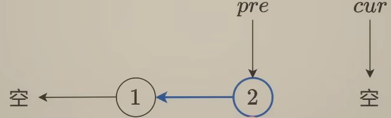
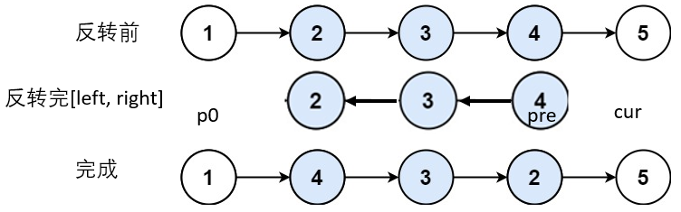
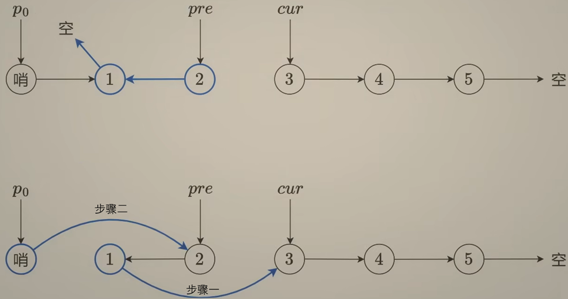
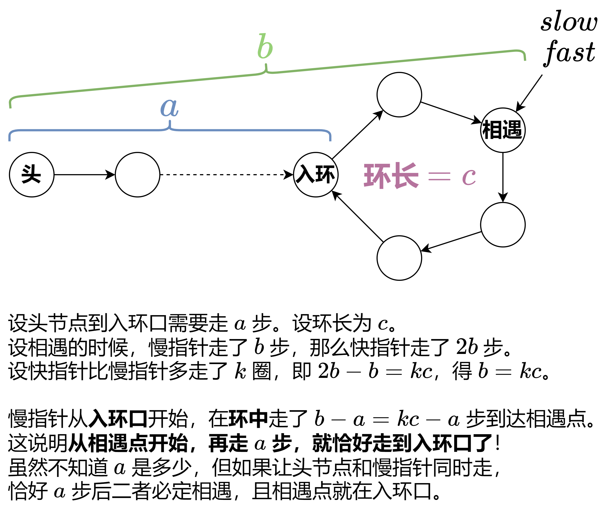
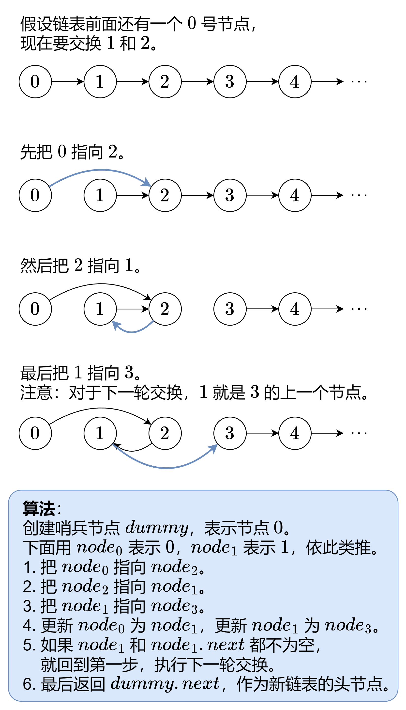
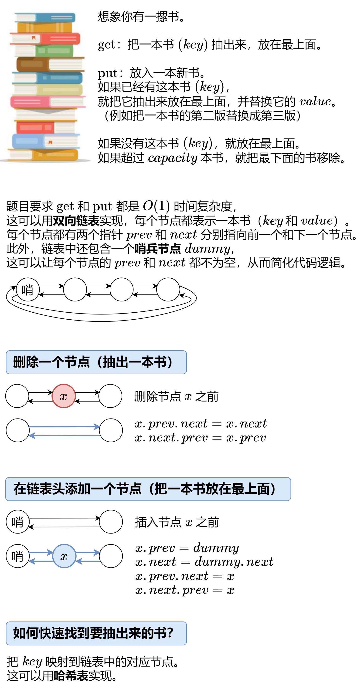
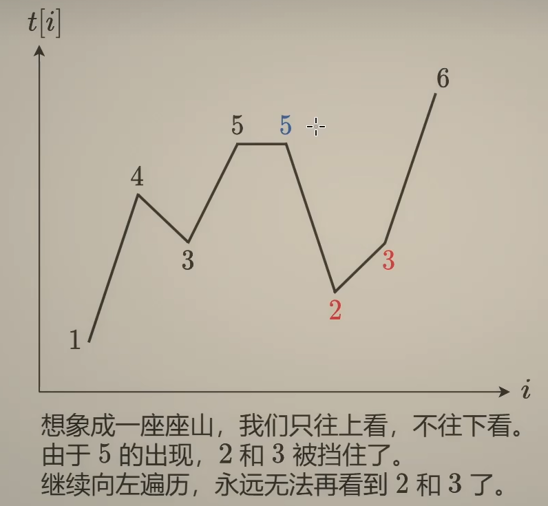
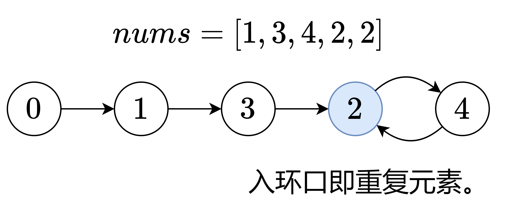

# HOT 100

## 资料
* [HOT 100](https://leetcode.cn/studyplan/top-100-liked/)
* [CodeTop](https://codetop.cc/home)

## 一、哈希

1. [两数之和](https://leetcode.cn/problems/two-sum/description/)：[题解](常用数据结构.md#two-sum)

2. [字母异位词分组](https://leetcode.cn/problems/group-anagrams/description/)：

    **关键思路：将字符串从小到大排序，若排序后后相等，那么两个字符串就互为字母异位词，否则不是。**

    ```python
    class Solution:
        def groupAnagrams(self, strs: List[str]) -> List[List[str]]:
            d = defaultdict(list)
            for s in strs:
                sorted_s = ''.join(sorted(s))
                d[sorted_s].append(s)
            return list(d.values())
    ```

    复杂度分析：

    - 时间复杂度：O(nmlogm)，其中 n 为 strs 的长度，m 为 strs[i] 的长度。每个字符串排序需要 O(mlogm) 的时间，有 n 个字符串，所以总的时间复杂度为 O(nmlogm)。
    - 空间复杂度：O(nm)。


    > sorted('eat') 得到的是 ['a', 'e', 't']，所以还需要 ''.join(sorted('eat')) 得到 'aet'，将 'aet' 作为 key，将 'eat' 加入到 value 中。

3. [最长连续序列](https://leetcode.cn/problems/longest-consecutive-sequence/description/)：

    **关键思路：不能排序，因为排序的时间复杂度是 O(nlogn)，不符合题目 O(n) 的要求。对于 nums 中的元素 x，以 x 为起点，不断查找下一个数 x+1,x+2,⋯ 是否在 nums 中，并统计序列的长度。**

    ```python
    class Solution:
        def longestConsecutive(self, nums: List[int]) -> int:
            st = set(nums)       # 把 nums 转成哈希集合
            ans = 0
            for x in st:         # 遍历哈希集合
                if x - 1 in st:  # 如果 x 不是序列的起点，直接跳过
                    continue
                y = x + 1        # x 是序列的起点
                while y in st:   # 不断查找下一个数是否在哈希集合中
                    y += 1       # 循环结束后，y-1 是最后一个在哈希集合中的数
                ans = max(ans, y - x) # 从 x 到 y-1 一共 y-x 个数
            return ans
    ```

    复杂度分析：

    - 时间复杂度：O(n)，其中 n 是 nums 的长度。在二重循环中，每个元素至多遍历两次：在外层循环中遍历一次，在内层循环中遍历一次。所以二重循环的时间复杂度是 O(n) 的。比如 nums=[1,2,3,4]，其中 2,3,4 不会进入内层循环，只有 1 会进入内层循环。
    - 空间复杂度：O(m)。其中 m 是 nums 中的不同元素个数。

## 二、双指针

1. [移动零](https://leetcode.cn/problems/move-zeroes/description/)：

    **关键思路：双指针，一个是i0，指向最左边0的位置，一个是i，指向当前遍历的位置。**

    ```python
    class Solution:
    def moveZeroes(self, nums: List[int]) -> None:
        i0 = 0
        for i in range(len(nums)):
            if nums[i]:
                nums[i0], nums[i] = nums[i], nums[i0]
                i0 += 1
    ```

    复杂度分析：

    - 时间复杂度：O(n)，其中 n 是 nums 的长度。
    - 空间复杂度：O(1)。

2. [盛最多水的容器](https://leetcode.cn/problems/container-with-most-water/description/)：

    **关键思路：双指针，一开始时宽度最宽，然后向中间收缩。height[left] < height[right]时，如果固定左边的柱子，移动右边的柱子，那么水的高度一定不会增加(受限于height[left])，且宽度一定减少，所以水的面积一定减少，因此此时需要left++。相反的情况类似，即「谁小移动谁」。**

    ```python
    class Solution:
        def maxArea(self, height: List[int]) -> int:
            ans = left = 0
            right = len(height) - 1
            while left < right:
                area = (right - left) * min(height[left], height[right])
                ans = max(ans, area)
                if height[left] < height[right]:
                    left += 1  # height[left]  与右边的任意线段都无法组成一个比 ans 更大的面积
                else:
                    right -= 1 # height[right] 与左边的任意线段都无法组成一个比 ans 更大的面积
            return ans
    ```

    复杂度分析：

    - 时间复杂度：O(n)，其中 n 是 height 的长度。
    - 空间复杂度：O(1)。

3. [三数之和](https://leetcode.cn/problems/3sum/description/)：

    **关键思路：双指针，先排序，然后枚举第一个数，再用双指针枚举第二个数和第三个数。**

    ```python
    class Solution:
        def threeSum(self, nums: List[int]) -> List[List[int]]:
            nums.sort()            # 从小到大排序，方便使用双指针以及跳过相同元素
            n = len(nums)
            ans = []               # 三元组的顺序不重要，那我们自己规定一个顺序 i < j < k
            for i in range(n - 2): # 留下最后的两个元素 n - 2 和 n - 1 作为 j 和 k
                if i > 0 and nums[i] == nums[i - 1]:
                    continue       # 去掉相同的 nums[i]
                # ======= 优化代码 =======
                if nums[i] + nums[i + 1] + nums[i + 2] > 0:
                    break          # 此时不可能再有满足条件的了
                if nums[i] + nums[-2] + nums[-1] < 0:
                    continue       # 这个 nums[i] 太小了，没必要再 j 和 k 双指针了，直接下一个 nums[i]
                # ======= 优化代码 =======
                j = i + 1          # 开始双指针
                k = n - 1
                while j < k:          
                    s = nums[i] + nums[j] + nums[k]
                    if s > 0:
                        k -= 1
                    elif s < 0:
                        j += 1
                    else:
                        ans.append([nums[i], nums[j], nums[k]])
                        j += 1
                        while j < k and nums[j] == nums[j - 1]:
                            j += 1
                        k -= 1
                        while j < k and nums[k] == nums[k + 1]:
                            k -= 1
            return ans
    ```

    复杂度分析：

    - 时间复杂度：O(n^2)，其中 n 为 nums 的长度。排序 O(nlogn)。外层循环枚举第一个数是O(n)，内层双指针也是O(n)，所以总的时间复杂度为 O(n^2)。
    - 空间复杂度：O(1)。

4. [接雨水](https://leetcode.cn/problems/trapping-rain-water/description/)：

    **关键思路：定义前缀最大值和后缀最大值，「谁小移动谁」。**

    ```python
    class Solution:
        def trap(self, height: List[int]) -> int:
            ans = pre_max = suf_max = 0
            left, right = 0, len(height) - 1
            while left < right:
                pre_max = max(pre_max, height[left])  # 前缀最大值
                suf_max = max(suf_max, height[right]) # 后缀最大值
                if pre_max < suf_max:
                    ans += pre_max - height[left]
                    left += 1
                else:
                    ans += suf_max - height[right]
                    right -= 1
            return ans
    ```

    复杂度分析：

    - 时间复杂度：O(n)，其中 n 为 height 的长度。
    - 空间复杂度：O(1)。

## 三、滑动窗口

1. [无重复字符的最长子串](https://leetcode.cn/problems/longest-substring-without-repeating-characters/description/)：[题解](滑动窗口与双指针.md#longest-substring-without-repeating-characters)

2. [找到字符串中所有字母异位词](https://leetcode.cn/problems/find-all-anagrams-in-a-string/description/)：

    **关键思路：定长滑窗。枚举 s 的所有长为 n 的子串 s′，如果 s′的每种字母的出现次数，和 p 的每种字母的出现次数都相同，那么 s′是 p 的异位词。**

    ```python
    class Solution:
        def findAnagrams(self, s: str, p: str) -> List[int]:
            ans = []
            k = len(p)
            cnt1 = Counter(s[:k-1])
            cnt2 = Counter(p)
            for i, (out, in_) in enumerate(zip(s, s[k-1:])):
                cnt1[in_] += 1
                if cnt1 == cnt2:
                    ans.append(i)
                cnt1[out] -= 1
            return ans
    ```

    复杂度分析：

    - 时间复杂度：O(m + n)，其中 m 为 s 的长度，n 为 p 的长度。
    - 空间复杂度：O(1)，总共26个字母的出现次数。

## 四、子串

1. [区域和检索 - 数组不可变](https://leetcode.cn/problems/range-sum-query-immutable/description/)：

    **前置知识：前缀和。**

    **关键思路：s[i] 表示 nums 中前 i - 1 个元素的和，那么[left, right]之间元素的和就是s[right + 1] - s[left]**

    ```python
    class NumArray:

        def __init__(self, nums: List[int]):
            s = [0] * (len(nums) + 1)
            for i, x in enumerate(nums):
                s[i + 1] = s[i] + x
            self.s = s

        def sumRange(self, left: int, right: int) -> int:
            return self.s[right + 1] - self.s[left]
    ```

    复杂度分析：

    - 时间复杂度：O(n)，其中 n 为 nums 的长度。
    - 空间复杂度：O(n)。

    例子：
    nums [i] = [-2, 0, 3, -5, 2, -1]

    则可以得到 s [i] = [0, -2, -2, 1, -4, -2, -3]

    

2. [和为 K 的子数组](https://leetcode.cn/problems/subarray-sum-equals-k/description/)：

3. [滑动窗口最大值](https://leetcode.cn/problems/sliding-window-maximum/description/)：

    **关键思路：双端队列。维护一个单调递减的队列，队列中存储的是 nums 的下标。**

    ```python
    class Solution:
        def maxSlidingWindow(self, nums: List[int], k: int) -> List[int]:
            ans = []
            q = deque()      # 保存 nums 的下标
            for i, x in enumerate(nums):
                # 1. 右边入
                while q and nums[q[-1]] <= x:
                    q.pop()  # 维护 q 的单调性
                q.append(i)
                # 2. 左边出
                if i - q[0] >= k:
                    q.popleft()
                # 3. 更新答案
                if i >= k - 1:
                    ans.append(nums[q[0]])
            return ans
    ```

    复杂度分析：

    - 时间复杂度：O(n)，其中 n 为 nums 的长度。由于每个下标至多入队出队各一次，所以二重循环的循环次数是 O(n) 的。
    - 空间复杂度：O(min(k,U))，其中 U 是 nums 中的不同元素个数（本题至多为 20001）。双端队列至多有 k 个元素，同时又没有重复元素，所以也至多有 U 个元素，所以空间复杂度为 O(min(k,U))。返回值的空间不计入。

    deque 的操作：

    { width="380" }

4. [最小覆盖子串](https://leetcode.cn/problems/minimum-window-substring/description/):

    **关键思路：滑动窗口。**

    ```python
    class Solution:
        def minWindow(self, s: str, t: str) -> str:
            cnt_s = Counter()
            cnt_t = Counter(t)
            ans_left, ans_right = -1, len(s)
            left = 0
            for right, c in enumerate(s):
                cnt_s[c] += 1
                while cnt_s >= cnt_t:                        # 涵盖
                    if right - left < ans_right - ans_left:
                        ans_left, ans_right = left, right    # 找到更短的子串
                    cnt_s[s[left]] -= 1
                    left += 1
            return "" if ans_left < 0 else s[ans_left : ans_right + 1]
    ```

    复杂度分析：

    - 时间复杂度：O(∣Σ∣m+n)，其中 m 为 s 的长度，n 为 t 的长度，∣Σ∣ 为字符集合的大小，本题字符均为英文字母，所以 ∣Σ∣=52。注意 left 只会增加不会减少，left 每增加一次，我们就花费 O(∣Σ∣) 的时间。因为 left 至多增加 m 次，所以二重循环的时间复杂度为 O(∣Σ∣m)，再算上统计 t 字母出现次数的时间 O(n)，总的时间复杂度为 O(∣Σ∣m+n)。
    - 空间复杂度：O(∣Σ∣)。

## 五、普通数组

1. [最大子数组和](https://leetcode.cn/problems/maximum-subarray/description/)：

    **关键思路：当累计和 s 小于等于 0 时，说明当前子数组的和对后续子数组的和没有贡献，所以可以从下一个元素开始重新计算子数组的和。**

    ```python
    class Solution:
        def maxSubArray(self, nums: List[int]) -> int:
            ans = s = 0
            for n in nums:
                s += n
                if s <= 0:
                    s = 0
                else:
                    ans = max(ans, s)
            return ans or max(nums) # 若 ans 为 0，说明 nums 中所有元素均为负数，返回 nums 中的最大值
    ```

    复杂度分析：

    - 时间复杂度：O(n)，其中 n 为 nums 的长度。
    - 空间复杂度：O(1)。

2. [合并区间](https://leetcode.cn/problems/merge-intervals/description/)：

    **关键思路：按照左端点从小到大排序后，遍历 intervals，合并并更新右端点最大值。**

    ```python
    class Solution:
        def merge(self, intervals: List[List[int]]) -> List[List[int]]:
            intervals.sort(key = lambda p: p[0])       # 按照左端点从小到大排序
            ans = []
            for p in intervals:
                if ans and ans[-1][1] >= p[0]:         # 可以合并
                    ans[-1][1] = max(ans[-1][1], p[1]) # 更新右端点最大值
                else:                                  # 不相交，无法合并
                    ans.append(p)                      # 新的合并区间
            return ans
    ```

    复杂度分析：

    - 时间复杂度：O(nlogn)，其中 n 是 intervals 的长度。瓶颈在排序上。
    - 空间复杂度：O(1)。

3. [轮转数组](https://leetcode.cn/problems/rotate-array/description/)：

    **关键思路：先将整个数组翻转，然后将前 k 个元素翻转，再将后 n-k 个元素翻转。**

    ```python
    class Solution:
        def rotate(self, nums: List[int], k: int) -> None:
            def reverse(i: int, j: int) -> None:
                while i < j:
                    nums[i], nums[j] = nums[j], nums[i]
                    i += 1
                    j -= 1
            n = len(nums)
            k = k % n
            reverse(0, n - 1)
            reverse(0, k - 1)
            reverse(k, n - 1)
    ```

    复杂度分析：

    - 时间复杂度：O(n)，其中 n 为 nums 的长度。
    - 空间复杂度：O(1)。

    { width="350" }

4. [除自身以外数组的乘积](https://leetcode.cn/problems/product-of-array-except-self/description/)：

    **关键思路：先从右到左遍历 nums，计算后缀积，再从左到右遍历 nums，计算前缀积，最后将前缀积和后缀积相乘即可。**

    ```python
    class Solution:
        def productExceptSelf(self, nums: List[int]) -> List[int]:
            n = len(nums)
            suf = [1] * n  # 后缀积: suf[i] 表示 nums[i + 1] 到 nums[-1] 的元素乘积 
            for i in range(n - 2, -1, -1):
                suf[i] = nums[i + 1] * suf[i + 1]
            pre = 1        # 前缀积: pre[i] 表示 nums[0] 到 nums[i - 1] 的元素乘积，为了节省遍历时间和空间，这里边遍历边更新pre
            for i, x in enumerate(nums):
                suf[i] *= pre
                pre *= x
            return suf
    ```

    复杂度分析：

    - 时间复杂度：O(n)，其中 n 为 nums 的长度。
    - 空间复杂度：O(1)。返回值不计入。

    { width="200" }

## 六、矩阵

1. [矩阵置零](https://leetcode.cn/problems/set-matrix-zeroes/description/)：

    **关键思路：用两个数组分别记录哪些行和哪些列需要置零，最后根据这两个数组置零即可。**

    ```python
    class Solution:
        def setZeroes(self, matrix: List[List[int]]) -> None:
            m, n = len(matrix), len(matrix[0])
            row, col = [False] * m, [False] * n

            for i in range(m):
                for j in range(n):
                    if matrix[i][j] == 0:
                        row[i] = col[j] = True

            for i in range(m):
                for j in range(n):
                    if row[i] or col[j]:
                        matrix[i][j] = 0
                
    ```

    复杂度分析：

    - 时间复杂度：O(mn)，其中 m 为 matrix 的行数，n 为 matrix 的列数。
    - 空间复杂度：O(m+n)。

2. [螺旋矩阵](https://leetcode.cn/problems/spiral-matrix/description/)：

    **关键思路：定义方向数组，求模转弯。**

    ```python
    class Solution:
        def spiralOrder(self, matrix: List[List[int]]) -> List[int]:
            DIRS = [(0, 1), (1, 0), (0, -1), (-1, 0)] # 表示 右下左上 四个方向
            # 往右走：行号不动，列号 +1；往下走：行号 +1，列号不动
            # 往左走：行号不动，列号 -1；往上走：行号 -1，列号不动
            ans = []
            m, n = len(matrix), len(matrix[0])
            i = j = di = 0 # i 和 j 表示正在访问的矩阵的行和列，di 表示当前的方向
                        # di = 0 : 右, di = 1 : 下, di = 2 : 左, di = 3 : 上
            for _ in range(m * n):         # 一共走 mn 步
                ans.append(matrix[i][j])
                matrix[i][j] = None        # 标记，表示已经访问过（已经加入答案）
                x = i + DIRS[di][0]        # x 和 y 表示下一步要访问的矩阵的行和列
                y = j + DIRS[di][1]
                if x < 0 or x >= m or y < 0 or y >= n or matrix[x][y] is None:
                    di = (di + 1) % 4      # 如果下一步要访问的矩阵的位置出界或已经访问过，右转90°
                i += DIRS[di][0]           # 往前走一步
                j += DIRS[di][1]
            return ans
    ```

    复杂度分析：

    - 时间复杂度：O(mn)，其中 m 为 matrix 的行数，n 为 matrix 的列数。
    - 空间复杂度：O(1)。返回值不计入。

3. [旋转图像](https://leetcode.cn/problems/rotate-image/description/)：

    **关键思路：先将矩阵转置，再将每一行翻转即可。**

    \[
    \begin{bmatrix}
    1 & 2 & 3 \\
    4 & 5 & 6 \\
    7 & 8 & 9
    \end{bmatrix}
    \xrightarrow{\text{转置}}
    \begin{bmatrix}
    1 & 4 & 7 \\
    2 & 5 & 8 \\
    3 & 6 & 9
    \end{bmatrix}
    \xrightarrow{\text{行翻转}}
    \begin{bmatrix}
    7 & 4 & 1 \\
    8 & 5 & 2 \\
    9 & 6 & 3
    \end{bmatrix}
    \]


    ```python
    class Solution:
        def rotate(self, matrix: List[List[int]]) -> None:
            n = len(matrix)
            # 第一步：转置
            for i in range(n):
                for j in range(i): # 只到 i 而不是 n 是因为只需要遍历对角线下方元素
                    matrix[i][j], matrix[j][i] = matrix[j][i], matrix[i][j]
            # 第二步：行翻转
            for row in matrix:
                row.reverse()
    ```

    复杂度分析：

    - 时间复杂度：O(n^2)，其中 n 为 matrix 的行数和列数。
    - 空间复杂度：O(1)。

4. [搜索二维矩阵 II](https://leetcode.cn/problems/search-a-2d-matrix-ii/description/)：

    **关键思路：从矩阵的右上角开始搜索，如果当前元素大于 target，则向左移动；如果当前元素小于 target，则向下移动。**

    ```python
    class Solution:
        def searchMatrix(self, matrix: List[List[int]], target: int) -> bool:
            m, n = len(matrix), len(matrix[0])
            i, j = 0, n - 1                 # 从右上角开始搜索
            while i < m and j >= 0:         # 还有剩余元素
                if matrix[i][j] == target:  # 找到 target
                    return True
                elif matrix[i][j] < target: # 这一行剩余元素全部小于 target，排除
                    i += 1
                else:                       # 这一列剩余元素全部大于 target，排除
                    j -= 1
            return False
    ```

    复杂度分析：

    - 时间复杂度：O(m+n)，其中 m 和 n 分别为 matrix 的行数和列数。每次循环排除掉一行或者一列，一共 m+n 行列，最坏情况下需要排除 m+n−1 行列才能找到答案。
    - 空间复杂度：O(1)。

## 七、链表

1. [相交链表](https://leetcode.cn/problems/intersection-of-two-linked-lists/description/)：

    **关键思路：当我在我的路上走过一遍依然没有遇见你时，那么我会接着来到你走过的路走一遍，如果我们心有灵犀，那么我们终将相遇。**

    **注意题目要求是两个指针完全相同才是相交，并不是仅仅val相同**

    ```python
    class Solution:
        def getIntersectionNode(self, headA: ListNode, headB: ListNode) -> Optional[ListNode]:
            pA, pB = headA, headB
            while pA != pB:
                pA = pA.next if pA else headB # 如果 pA 遍历到了 None，就从 headB 开始遍历
                pB = pB.next if pB else headA # 如果 pB 遍历到了 None，就从 headA 开始遍历
            return pA
    ```

    复杂度分析：

    - 时间复杂度：O(m+n)，其中 m 和 n 分别为链表 headA 和 headB 的长度。
    - 空间复杂度：O(1)。

2. [反转链表](https://leetcode.cn/problems/reverse-linked-list/description/)：

    **关键思路：头插法，使用三个指针 pre, cur, nxt 分别表示前一个节点、当前节点、下一个节点。每次循环将 cur 的 next 指针指向前一个节点 pre，然后更新 pre, cur, nxt 指针。**

    ```python
    class Solution:
        def reverseList(self, head: Optional[ListNode]) -> Optional[ListNode]:
            cur = head
            pre = None
            while cur:
                nxt = cur.next
                cur.next = pre
                pre = cur
                cur = nxt
            return pre
    ```

    复杂度分析：

    - 时间复杂度：O(n)，其中 n 为链表的长度。
    - 空间复杂度：O(1)。

    > 反转结束后，从原来的链表上看：pre 指向反转这一段的末尾，cur 指向反转这一段后续的下一个节点。

    { width="350" }

3. [反转链表 II](https://leetcode.cn/problems/reverse-linked-list-ii/description/)：

    **关键思路：先找到要反转的这一段的头节点和前一个节点 p0，然后使用头插法反转这一段[left, right]，最后将 p0 的 next.next 指针指向 cur，将 p0 的 next 指针指向反转这一段的头节点 pre。**

    ```python
    class Solution:
        def reverseBetween(self, head: Optional[ListNode], left: int, right: int) -> Optional[ListNode]:
            dummy = ListNode(next = head)      # 考虑到 left == 1时没有 p0，因此引入头部的dummy节点
            p0 = dummy
            for _ in range(left - 1):
                p0 = p0.next                   # 此时 p0 指向节点 1

            pre = None                         # 反转[left, right] 这一段的链表
            cur = p0.next
            for _ in range(right - left + 1):
                nxt = cur.next
                cur.next = pre
                pre = cur
                cur = nxt                      # 反转完成后，pre 指向节点4，cur 指向节点5

            p0.next.next = cur                 # 把节点 2 指向 节点5 (cur)
            p0.next = pre                      # 把节点 1 指向 节点4 (pre)

            return dummy.next           
    ```

    复杂度分析：

    - 时间复杂度：O(n)，其中 n 为链表的长度。
    - 空间复杂度：O(1)。

    { width="500" }

4. [K 个一组翻转链表](https://leetcode.cn/problems/reverse-nodes-in-k-group/description/)：

    **关键思路：先统计链表长度 n，然后从链表头开始，每 k 个节点一组进行翻转(和反转链表II一样)。额外要做的是在翻转之后，将 p0 更新成下一段要翻转的链表的上一个节点，即 p0.next。**

    ```python
    class Solution:
        def reverseKGroup(self, head: Optional[ListNode], k: int) -> Optional[ListNode]:
            n = 0                  # 统计链表长度
            cur = head
            while cur:
                n += 1
                cur = cur.next
            
            dummy = ListNode(next = head)
            p0 = dummy
            pre = None
            cur = p0.next

            while n >= k:
                n -= k              # k 个一组处理
                for _ in range(k):
                    nxt = cur.next
                    cur.next = pre
                    pre = cur
                    cur = nxt

                nxt = p0.next       # 下一段要翻转的链表的上一个节点，即新的 p0
                p0.next.next = cur
                p0.next = pre
                p0 = nxt            # 更新 p0

            return dummy.next  
    ```

    复杂度分析：

    - 时间复杂度：O(n)，其中 n 为链表的长度。
    - 空间复杂度：O(1)。

    

5. [链表的中间结点](https://leetcode.cn/problems/middle-of-the-linked-list/description/)：

    **关键思路：使用「快慢指针」，快指针每次走两步，慢指针每次走一步，当快指针到达链表末尾时，慢指针就指向了链表的中间结点。**

    ```python
    class Solution:
        def middleNode(self, head: Optional[ListNode]) -> Optional[ListNode]:
            slow = fast = head
            while fast and fast.next:
                slow = slow.next
                fast = fast.next.next
            return slow
    ```

    复杂度分析：

    - 时间复杂度：O(n)，其中 n 为链表的长度。
    - 空间复杂度：O(1)。

6. [回文链表](https://leetcode.cn/problems/palindrome-linked-list/description/)：

    **关键思路：前两题的结合题，先找到链表的中间结点，然后将后半部分链表反转，最后比较前半部分和后半部分是否相等。**

    ```python
    class Solution:
        # 876. 链表的中间结点
        def middleNode(self, head: Optional[ListNode]) -> Optional[ListNode]:
            slow = fast = head
            while fast and fast.next:
                slow = slow.next
                fast = fast.next.next
            return slow

        # 206. 反转链表
        def reverseList(self, head: Optional[ListNode]) -> Optional[ListNode]:
            cur = head
            pre = None
            while cur:
                nxt = cur.next
                cur.next = pre
                pre = cur
                cur = nxt
            return pre

        def isPalindrome(self, head: Optional[ListNode]) -> bool:
            mid = self.middleNode(head)
            head2 = self.reverseList(mid)
            while head2:
                if head.val != head2.val:
                    return False
                head = head.next
                head2 = head2.next
            return True
    ```

    复杂度分析：

    - 时间复杂度：O(n)，其中 n 为链表的长度。
    - 空间复杂度：O(1)。

7. [环形链表](https://leetcode.cn/problems/linked-list-cycle/description/)：

    **关键思路：使用「快慢指针」，快指针每次走两步，慢指针每次走一步，当快指针追上慢指针时，说明链表有环。用相对速度思考，相当于慢指针不动，快指针相对慢指针每次只走一步，如果有环了话，快指针一定会和慢指针相遇。**

    ```python
    class Solution:
        def hasCycle(self, head: Optional[ListNode]) -> bool:
            slow = fast = head
            while fast and fast.next: # slow 在 fast 后面，如果 fast 不是空，那么 slow 也肯定不是空，所以不用判断 slow
                slow = slow.next
                fast = fast.next.next
                if slow == fast:
                    return True
            return False
    ```

    复杂度分析：

    - 时间复杂度：O(n)，其中 n 为链表的长度。
    - 空间复杂度：O(1)。

8. [环形链表 II](https://leetcode.cn/problems/linked-list-cycle-ii/description/)：<a id="linked-list-cycle"></a>

    **关键思路：快慢指针相遇时，让慢指针从相遇处出发，头结点从头部出发，每次走一步，当它们相遇时，就是环的入口。**

    ```python
    class Solution:
        def detectCycle(self, head: Optional[ListNode]) -> Optional[ListNode]:
            slow = fast = head
            while fast and fast.next:
                slow = slow.next
                fast = fast.next.next
                if slow == fast:          # 快慢指针相遇
                    while slow != head:   # 此时慢指针从相遇处出发，头结点从头部出发 (再走a步)
                        slow = slow.next  # 慢指针和头结点相遇处就是环入口
                        head = head.next
                    return slow
            return None
    ```

    复杂度分析：

    - 时间复杂度：O(n)，其中 n 为链表的长度。
    - 空间复杂度：O(1)。

    { width="450" }

9. [合并两个有序链表](https://leetcode.cn/problems/merge-two-sorted-lists/description/)：

    **关键思路：比较两个链表的节点值，谁小就先加入新链表的末尾，直到其中一个链表为空，再把另一链表的剩余节点加入新链表即可。**

    ```python
    class Solution:
        def mergeTwoLists(self, list1: Optional[ListNode], list2: Optional[ListNode]) -> Optional[ListNode]:
            dummy = cur = ListNode()       # 用 dummy 节点简化代码逻辑，无需特判链表为空的情况
            while list1 and list2:
                if list1.val < list2.val:  # 把 list1 加到新链表中
                    cur.next = list1
                    list1 = list1.next
                else:                      # 把 list2 加到新链表中 (相等的情况加哪个节点都是可以的)
                    cur.next = list2
                    list2 = list2.next
                cur = cur.next
            cur.next = list1 or list2      # 拼接剩余链表
            return dummy.next
    ```

    复杂度分析：

    - 时间复杂度：O(n + m)，其中 n 和 m 分别为两个链表的长度。
    - 空间复杂度：O(1)。

10. [两数相加](https://leetcode.cn/problems/add-two-numbers/description/)：

    **关键思路：模拟竖式加法，使用一个变量 carry 来表示进位。**

    ```python
    class Solution:
        def addTwoNumbers(self, l1: Optional[ListNode], l2: Optional[ListNode]) -> Optional[ListNode]:
            dummy = cur = ListNode() # 意思是此时 dummy 和 cur 是同一个节点
            carry = 0                # 进位
            while l1 or l2 or carry: # 有一个不是空节点，或者还有进位，就继续迭代
                if l1:
                    carry += l1.val
                    l1 = l1.next
            
                if l2:
                    carry += l2.val
                    l2 = l2.next

                cur.next = ListNode(val = carry % 10)
                carry //= 10
                cur = cur.next

            return dummy.next
    ```

    复杂度分析：

    - 时间复杂度：O(n)，其中 n 为 l1 长度和 l2 长度的最大值。
    - 空间复杂度：O(1)。返回值不计入。

11. [删除链表的倒数第 N 个结点](https://leetcode.cn/problems/remove-nth-node-from-end-of-list/description/)：

    **关键思路：使用快慢指针，快指针先走 n 步，然后快慢指针一起走，直到快指针到达链表末尾，慢指针就指向了倒数第 n 个节点的前一个节点。**

    ```python
    class Solution:
        def removeNthFromEnd(self, head: Optional[ListNode], n: int) -> Optional[ListNode]:
            slow = fast = dummy = ListNode(next = head)
            for _ in range(n):
                fast = fast.next         # 快指针先向右走 n 步
            while fast.next:             # 快慢指针一起走，直到快指针走到链表的最后一个节点
                slow = slow.next
                fast = fast.next
            slow.next = slow.next.next   # 此时原先的 slow.next 就是要被删除的节点
            return dummy.next
    ```

    复杂度分析：

    - 时间复杂度：O(m)，其中 m 为链表的长度。
    - 空间复杂度：O(1)。

12. [两两交换链表中的节点](https://leetcode.cn/problems/swap-nodes-in-pairs/description/)：

    **关键思路：画图辅助自己理解。**

    ```python
    class Solution:
        def swapPairs(self, head: Optional[ListNode]) -> Optional[ListNode]:
            dummy = node0 = ListNode(next = head)
            node1 = head
            while node1 and node1.next: # 至少有两个节点才可能交换
                node2 = node1.next
                node3 = node2.next

                node0.next = node2
                node2.next = node1
                node1.next = node3

                node0 = node1
                node1 = node3
            return dummy.next
    ```

    复杂度分析：

    - 时间复杂度：O(n)，其中 n 为链表的长度。
    - 空间复杂度：O(1)。

    { width="350" }

13. [随机链表的复制](https://leetcode.cn/problems/copy-list-with-random-pointer/description/)：

    **关键思路：把新链表和旧链表「混在一起」。**

    ```python
    class Solution:
        def copyRandomList(self, head: 'Optional[Node]') -> 'Optional[Node]':
            if head is None:
                return None
            
            # 复制每个节点，把新节点直接插到原节点的后面：1 → 1′ → 2 → 2′ → 3 → 3′
            cur = head
            while cur:
                cur.next = Node(cur.val, cur.next)
                cur = cur.next.next

            # 遍历交错链表中的原链表节点，完成对 random 指针的复制
            # 假如节点 1 的 random 指向节点 3，那么就把节点 1′ 的 random 指向节点 3 的下一个节点 3′
            # 这样就完成了对 random 指针的复制。
            cur = head
            while cur:
                if cur.random:
                    cur.next.random = cur.random.next # 重点
                cur = cur.next.next
            
            # 遍历交错链表中的新链表节点，分离出 1′ → 2′ → 3′
            cur = head.next
            while cur.next:
                cur.next = cur.next.next
                cur = cur.next
            
            return head.next
    ```

    复杂度分析：

    - 时间复杂度：O(n)，其中 n 为链表的长度。
    - 空间复杂度：O(1)。

14. [排序链表](https://leetcode.cn/problems/sort-list/description/)：

    **关键思路：使用归并排序（分治），先找到链表的中间节点head2，并打断成两个链表，然后递归地对左半部分和右半部分进行排序，最后合并两个有序链表。**

    ```python
    class Solution:
        # 876. 链表的中间结点（快慢指针）
        def middleNode(self, head: Optional[ListNode]) -> Optional[ListNode]:
            slow = fast = head
            while fast and fast.next:
                pre = slow   # 记录 slow 的前一个节点
                slow = slow.next
                fast = fast.next.next
            pre.next = None  # 断开 slow 的前一个节点和 slow 的连接
            return slow

        # 21. 合并两个有序链表（双指针）
        def mergeTwoLists(self, list1: Optional[ListNode], list2: Optional[ListNode]) -> Optional[ListNode]:
            cur = dummy = ListNode()  
            while list1 and list2:
                if list1.val < list2.val:
                    cur.next = list1
                    list1 = list1.next
                else:
                    cur.next = list2
                    list2 = list2.next
                cur = cur.next
            cur.next = list1 if list1 else list2
            return dummy.next

        def sortList(self, head: Optional[ListNode]) -> Optional[ListNode]:
            # 如果链表为空或者只有一个节点，无需排序
            if head is None or head.next is None:
                return head
            # 找到中间节点 head2，并断开 head2 与其前一个节点的连接
            # 比如 head=[4,2,1,3]，那么 middleNode 调用结束后 head=[4,2] head2=[1,3]
            head2 = self.middleNode(head)
            # 分治
            head = self.sortList(head)
            head2 = self.sortList(head2)
            # 合并
            return self.mergeTwoLists(head, head2)
    ```

    复杂度分析：

    - 时间复杂度：O(nlogn)，其中 n 为链表的长度。从图形上理解，递归深度是 O(logn)，每一层的链表长度之和是 O(n)。计算高为 O(logn)，底边长为 O(n) 的矩形面积，得到 O(nlogn)。
    - 空间复杂度：O(logn)。递归需要 O(logn) 的栈空间。

15. [合并 K 个升序链表](https://leetcode.cn/problems/merge-k-sorted-lists/description/)：

    **关键思路：使用分治的思想，先把 k 个链表分成两半，分别递归地合并这两半，最后合并这两半的结果。注意不要先合并前两个链表，再把得到的新链表和第三个链表合并，再和第四个链表合并...这样时间复杂度更高！**

    ```python
    class Solution:
        # 21. 合并两个有序链表
        def mergeTwoLists(self, list1: Optional[ListNode], list2: Optional[ListNode]) -> Optional[ListNode]:
            cur = dummy = ListNode()
            while list1 and list2:
                if list1.val < list2.val:
                    cur.next = list1
                    list1 = list1.next
                else:
                    cur.next = list2
                    list2 = list2.next
                cur = cur.next
            cur.next = list1 if list1 else list2
            return dummy.next

        def mergeKLists(self, lists: List[Optional[ListNode]]) -> Optional[ListNode]:
            m = len(lists)
            if m == 0:
                return None
            if m == 1:
                return lists[0]                      # 无需合并，直接返回
            left = self.mergeKLists(lists[:m // 2])  # 合并左半部分
            right = self.mergeKLists(lists[m // 2:]) # 合并右半部分
            return self.mergeTwoLists(left, right)   # 最后把左半和右半合并
    ```

    复杂度分析：

    - 时间复杂度：O(Llogm)，其中 m 为 lists 的长度，L 为所有链表的长度之和。每个节点参与链表合并的次数为 O(logm) 次，一共有 L 个节点，所以总的时间复杂度为 O(Llogm)。
    - 空间复杂度：O(logm)。递归深度为 O(logm)，需要 O(logm) 的栈空间。Python 忽略切片产生的额外空间。

16. [LRU 缓存](https://leetcode.cn/problems/lru-cache/description/)：

    **关键思路：使用哈希表和双向链表实现 LRU 缓存。哈希表用于快速查找缓存中的节点，双向链表用于维护节点的访问顺序。**

    ```python
    class Node:
        # 提高访问属性的速度，并节省内存
        __slots__ = 'prev', 'next', 'key', 'value'

        def __init__(self, key = 0, value = 0):
            self.key = key
            self.value = value

    class LRUCache:
        def __init__(self, capacity: int):
            self.capacity = capacity
            self.dummy = Node()           # 哨兵节点
            self.dummy.prev = self.dummy
            self.dummy.next = self.dummy
            self.key_to_node = {}

        # 获取 key 对应的节点，同时把该节点移到链表头部
        def get_node(self, key: int) -> Optional[Node]:
            if key not in self.key_to_node:  # 没有这本书
                return None
            node = self.key_to_node[key]     # 有这本书
            self.remove(node)                # 把这本书抽出来
            self.push_front(node)            # 放到最上面
            return node

        def get(self, key: int) -> int:
            node = self.get_node(key)        # get_node 会把对应节点移到链表头部
            return node.value if node else -1

        def put(self, key: int, value: int) -> None:
            node = self.get_node(key)        # get_node 会把对应节点移到链表头部
            if node:                         # 有这本书
                node.value = value           # 更新 value
                return
            self.key_to_node[key] = node = Node(key, value)  # 新书
            self.push_front(node)            # 放到最上面
            if len(self.key_to_node) > self.capacity:        # 书太多了
                back_node = self.dummy.prev
                del self.key_to_node[back_node.key]
                self.remove(back_node)                       # 去掉最后一本书

        # 删除一个节点（抽出一本书）
        def remove(self, x: Node) -> None:
            x.prev.next = x.next
            x.next.prev = x.prev

        # 在链表头添加一个节点（把一本书放到最上面）
        def push_front(self, x: Node) -> None:
            x.prev = self.dummy
            x.next = self.dummy.next
            x.prev.next = x
            x.next.prev = x
    ```

    复杂度分析：

    - 时间复杂度：所有操作均为 O(1)。
    - 空间复杂度：O(min(p,capacity))，其中 p 为 put 的调用次数。

    { width="410" }

## 八、二叉树

1. [二叉树的中序遍历](https://leetcode.cn/problems/binary-tree-inorder-traversal/description/)：

    **关键思路：递归地遍历左子树、根节点、右子树。**

    ```python
    class Solution:
        def inorderTraversal(self, root: Optional[TreeNode]) -> List[int]:
            if root is None:
                return []
            return self.inorderTraversal(root.left) + [root.val] + self.inorderTraversal(root.right)
    ```

    复杂度分析：

    - 时间复杂度：O(n)，其中 n 为二叉树节点的个数。二叉树的遍历中每个节点会被访问一次且只会被访问一次。
    - 空间复杂度：O(n)。空间复杂度取决于递归的栈深度，而栈深度在二叉树为一条链的情况下会达到 O(n) 的级别。

2. [二叉树的最大深度](https://leetcode.cn/problems/maximum-depth-of-binary-tree/description/)：

    **关键思路：递归地计算左子树和右子树的最大深度，取较大值加 1 即可。**

    ```python
    class Solution:
        def maxDepth(self, root: Optional[TreeNode]) -> int:
            if root is None:
                return 0
            l_depth = self.maxDepth(root.left)
            r_depth = self.maxDepth(root.right)
            return max(l_depth, r_depth) + 1
    ```

    复杂度分析：

    - 时间复杂度：O(n)，其中 n 为二叉树的节点个数。
    - 空间复杂度：O(n)。最坏情况下，二叉树退化成一条链，递归需要 O(n) 的栈空间。

    

3. [翻转二叉树](https://leetcode.cn/problems/invert-binary-tree/description/)：

    **关键思路：递归地交换每个节点的左子树和右子树。**

    ```python
    class Solution:
        def invertTree(self, root: Optional[TreeNode]) -> Optional[TreeNode]:
            if root is None:
                return None
            left = self.invertTree(root.left)
            right = self.invertTree(root.right)
            root.left = right
            root.right = left
            return root
    ```

    复杂度分析：

    - 时间复杂度：O(n)，其中 n 为二叉树节点的个数。每个节点会被访问一次且只会被访问一次。
    - 空间复杂度：O(n)。空间复杂度取决于递归的栈深度，而栈深度在二叉树为一条链的情况下会达到 O(n) 的级别。

4. [对称二叉树](https://leetcode.cn/problems/symmetric-tree/description/)：

    **关键思路：递归地判断左子树和右子树是否对称。**

    ```python
    class Solution:
        def isSymmetric(self, root: Optional[TreeNode]) -> bool:
            def sym(left, right):
                if left is None and right is None:
                    return True
                if left is None and right:
                    return False
                if left and right is None:
                    return False
                if left.val == right.val:
                    return True and sym(left.left, right.right) and sym(left.right, right.left)
                return False

            if root is None:
                return True
            return sym(root.left, root.right)
    ```

    复杂度分析：

    - 时间复杂度：O(n)，其中 n 为二叉树节点的个数。每个节点会被访问一次且只会被访问一次。
    - 空间复杂度：O(n)。空间复杂度取决于递归的栈深度，而栈深度在二叉树为一条链的情况下会达到 O(n) 的级别。

## 九、图论

1. [岛屿数量](https://leetcode.cn/problems/number-of-islands/description/)：

    **关键思路：遍历矩阵找到未访问过的岛屿'1' → 使用深度优先搜索（DFS）遍历该岛屿，把这个岛插满(替换)标志为 '2' 的旗子来表示该岛屿被访问过 → ans += 1。**

    ```python
    class Solution:
        def numIslands(self, grid: List[List[str]]) -> int:
            ans = 0
            m, n = len(grid), len(grid[0])

            def dfs(i: int, j: int) -> None:
                if i < 0 or i >= m or j < 0 or j >= n or grid[i][j] != '1':
                    return               # 出界，或者不是 '1'，就不再往下递归
                grid[i][j] = '2'         # 插旗，避免来回横跳无限递归
                dfs(i, j + 1)            # 往四个方向走
                dfs(i, j - 1)
                dfs(i - 1, j)
                dfs(i + 1, j)

            for i, row in enumerate(grid):
                for j, col in enumerate(row):
                    if grid[i][j] == '1': # 找到了一个新的岛
                        dfs(i, j)         # 把这个岛插满(替换)标志为 '2' 的旗子，这样后面遍历到的 '1' 一定是新的岛
                        ans += 1
            return ans
    ```

    复杂度分析：

    - 时间复杂度：O(mn)，其中 m 和 n 分别为 grid 的行数和列数。每个元素最多被访问一次。
    - 空间复杂度：O(mn)，其中 m 和 n 分别为 grid 的行数和列数。主要是递归调用栈的空间。

2. [腐烂的橘子](https://leetcode.cn/problems/rotting-oranges/description/)：

    **关键思路：使用广度优先搜索（BFS）遍历矩阵，每次将新腐烂的橘子加入 bad 列表。**

    ```python
    class Solution:
        def orangesRotting(self, grid: List[List[int]]) -> int:
            m, n = len(grid), len(grid[0])
            fresh = 0
            bad = []
            for i, row in enumerate(grid):
                for j, col in enumerate(row):
                    if grid[i][j] == 1:
                        fresh += 1            # 统计新鲜橘子个数
                    elif grid[i][j] == 2:
                        bad.append((i, j))    # 一开始就腐烂的橘子
            
            ans = 0
            while fresh and bad:
                ans += 1                      # 经过一分钟
                tmp = bad
                bad = []
                for x, y in tmp:              # 腐烂的橘子去感染它上下左右的橘子
                    for i, j in (x - 1, y), (x + 1, y), (x, y - 1), (x, y + 1):
                        if 0 <= i < m and 0 <= j < n and grid[i][j] == 1:
                            fresh -= 1
                            grid[i][j] = 2
                            bad.append((i, j)) # 新腐烂的橘子
            return -1 if fresh else ans
    ```

    复杂度分析：

    - 时间复杂度：O(mn)，其中 m 和 n 分别为 grid 的行数和列数。每个元素最多被访问一次。
    - 空间复杂度：O(mn)，其中 m 和 n 分别为 grid 的行数和列数。主要是 bad 列表的空间。

3. 

4. [实现 Trie (前缀树)](https://leetcode.cn/problems/implement-trie-prefix-tree/description/)：

    **关键思路：使用二十六叉树(26个字母)来存储字符串，每个节点表示一个字符，从根节点到某个节点的路径表示一个字符串。**

    ```python
    class Node:
        __slots__ = 'son', 'end'        # 表示 Node 实例只能有 son 和 end 这两个属性，不能动态添加其他属性

        def __init__(self):
            self.son = {}
            self.end = False

    class Trie:
        def __init__(self):
            self.root = Node()

        def insert(self, word: str) -> None:
            cur = self.root
            for c in word:
                if c not in cur.son:     # 无路可走？
                    cur.son[c] = Node()  # 那就造路！
                cur = cur.son[c]
            cur.end = True

        def find(self, word: str) -> int:
            cur = self.root
            for c in word:
                if c not in cur.son:     # 道不同，不相为谋
                    return 0
                cur = cur.son[c]
            # 走过同样的路（2 = 完全匹配，1 = 前缀匹配）
            return 2 if cur.end else 1

        def search(self, word: str) -> bool:
            return self.find(word) == 2

        def startsWith(self, prefix: str) -> bool:
            return self.find(prefix) != 0
    ```

    复杂度分析：

    - 时间复杂度：初始化为 O(1)，insert 为 O(n∣Σ∣)，其余为 O(n)，其中 n 是 word 的长度，∣Σ∣=26 是字符集合的大小。注意创建一个节点需要 O(∣Σ∣) 的时间（如果用的是数组）。
    - 空间复杂度：O(qn∣Σ∣)。其中 q 是 insert 的调用次数。

## 十、回溯

> append 和 pop 常常成对出现，分为 子集型、组合型、排列型 回溯。

> 分析回溯问题的时间复杂度，有一个简易公式：路径长度×搜索树的叶子数，i.e.总共搜索了叶子数个路径，每次都要将路径长度为len(path)的path加入答案。

> 两种基本回溯思想：站在答案角度 - 枚举选哪个 / 站在输入角度 - 选或不选 

1. [电话号码的字母组合](https://leetcode.cn/problems/letter-combinations-of-a-phone-number/description/)：

    **关键思路：使用回溯算法，枚举所有可能的字母组合。**

    ```python
    class Solution:
        def letterCombinations(self, digits: str) -> List[str]:
            MAPPING = ["", "", "abc", "def", "ghi", "jkl", "mno", "pqrs", "tuv", "wxyz"]
            ans = []
            n = len(digits)
            if n == 0:
                return ans

            path = [''] * n                       # 注意 path 长度一开始就是 n，不是空列表
            def dfs(i: int) -> None:
                if i == n:
                    ans.append(''.join(path))     # 将 path 转换为字符串并加入答案，例如 ['a', 'd'] -> 'ad'
                    return
                for c in MAPPING[int(digits[i])]:
                    path[i] = c                   # 直接覆盖，所以不需要 pop
                    dfs(i + 1)

            dfs(0)
            return ans
    ```

    复杂度分析：

    - 时间复杂度：O(n * 4^n)，其中 n 为 digits 的长度。最坏情况下每次需要枚举 4 个字母，递归次数为一个满四叉树的节点个数，那么一共会递归 O(4^n) 次（等比数列和），再算上加入答案时复制 path 需要 O(n) 的时间，所以时间复杂度为 O(n * 4^n)。
    - 空间复杂度：O(n)。返回值的空间不计入。

    

2. [子集](https://leetcode.cn/problems/subsets/description/)：

    **关键思路：子集型回溯，枚举第一个数选谁，第二个数选谁...**

    ```python
    class Solution:
        def subsets(self, nums: List[int]) -> List[List[int]]:
            n = len(nums)
            ans = []
            path = []

            def dfs(i: int) -> None:
                ans.append(path.copy())  # 复制 path，也可以写 path[:]。因为 path 会一直变化，所以需要复制一份
                for j in range(i, n):    # 枚举选择的数字
                    path.append(nums[j])
                    dfs(j + 1)
                    path.pop()           # 恢复现场

            dfs(0)
            return ans
    ```

    复杂度分析：

    - 时间复杂度：O(n * 2^n)，其中 n 为 nums 的长度。答案的长度为子集的个数，即 2^n，同时每次递归都把一个数组放入答案，因此会递归 2^n次，再算上加入答案时复制 path 需要 O(n) 的时间，所以时间复杂度为 O(n * 2^n)。
    - 空间复杂度：O(n)。返回值的空间不计。

    

3. [分割回文串](https://leetcode.cn/problems/palindrome-partitioning/description/)：

    **关键思路：枚举子串结束位置**

    ```python
    class Solution:
        def partition(self, s: str) -> List[List[str]]:
            n = len(s)
            ans = []
            path = []

            def dfs(i: int) -> None:         # 考虑 s[i:] 怎么分割
                if i == n:                   # s 分割完毕
                    ans.append(path.copy())  # 复制 path
                    return
                for j in range(i, n):        # 枚举子串的结束位置
                    t = s[i: j + 1]          # 分割出子串 t
                    if t == t[::-1]:         # 判断 t 是不是回文串
                        path.append(t)
                        dfs(j + 1)           # 考虑剩余的 s[j+1:] 怎么分割
                        path.pop()           # 恢复现场

            dfs(0)
            return ans
    ```

    复杂度分析：

    - 时间复杂度：O(n * 2^n)，其中 n 为 s 的长度。答案的长度至多为逗号子集的个数，即 O(2^n)，因此会递归 O(2^n) 次，再算上判断回文和加入答案时需要 O(n) 的时间，所以时间复杂度为 O(n * 2^n)。
    - 空间复杂度：O(n)。返回值的空间不计。

4. [组合](https://leetcode.cn/problems/combinations/description/)：

    **关键思路：组合型回溯，枚举下一个数选哪个**

    ```python
    class Solution:
        def combine(self, n: int, k: int) -> List[List[int]]:
            ans = []
            path = []

            def dfs(i: int) -> None:
                if i < k - len(path):        # 剪枝，此时还剩下 k - len(path) 个数要选
                    return                   # 但 i 已经小于了，没有可能能再选出这个组合了

                if len(path) == k:           # 选好了
                    ans.append(path.copy())
                    return
                
                for j in range(i, 0, -1):    # 注意题目要求的是[1, n]中的数
                    path.append(j)
                    dfs(j - 1)               # 倒着枚举是为了更方便地剪枝
                    path.pop()
                    
            dfs(n)
            return ans
    ```

    复杂度分析：

    - 时间复杂度：分析回溯问题的时间复杂度，有一个简易公式：路径长度×搜索树的叶子数。对于本题，路径长度始终为 k，叶子个数为 C(n,k)，所以时间复杂度为 O(k * C(n,k))。
    - 空间复杂度：O(k)。返回值不计入。

5. [组合总和 III](https://leetcode.cn/problems/combination-sum-iii/description/)：

    **关键思路：和上题一样，只是多了一个附加要求，选出来的 k 个数和为 n**

    ```python
    class Solution:
        def combinationSum3(self, k: int, n: int) -> List[List[int]]:
            ans = []
            path = []

            def dfs(i: int, t: int) -> None: # t 为 target，即总和

                # 剪枝
                # case 1: 此时还剩下 d 个数要选，但 i 已经小于 d 了，没有可能能再选出这个组合了
                # case 2: 所选数之和已经超过 n 了，没必要继续递归了。i.e. t < 0
                # case 3: 剩余数字即使全部选最大的，和也不够 t。例如 i = 5, 还需选 d = 3个数，那么如果
                # t > 5 + 4 + 3则可以直接return: t > i + ... + (i - d + 1) = (i + i - d + 1) * d // 2
                d = k - len(path)
                if i < d or t < 0 or t > (i * 2 - d + 1) * d // 2:
                    return

                if len(path) == k:           # 选好了，注意此时不用判断t == 0，因为走到这里 d 是 0
                    ans.append(path.copy())  # 此时上面的剪枝的右边两个判断涵盖了 t < 0 or t > 0
                    return                   # 因此走到这里时一定有 t == 0
                
                for j in range(i, 0, -1):    # 注意题目要求的是[1, 9]中的数
                    path.append(j)
                    dfs(j - 1, t - j)        # 倒着枚举是为了更方便地剪枝，已经选了 j，总和还剩下 t - j
                    path.pop()
                    
            dfs(9, n)
            return ans
    ```

    复杂度分析：

    - 时间复杂度：分析回溯问题的时间复杂度，有一个简易公式：路径长度×搜索树的叶子数。对于本题，路径长度始终为 k，叶子个数为 C(9,k)，所以时间复杂度为 O(k⋅C(9,k))。
    - 空间复杂度：O(k)。返回值不计入。

6. [组合总和](https://leetcode.cn/problems/combination-sum/description/)：

    **关键思路：枚举选哪个。**

    ```python
    class Solution:
        def combinationSum(self, candidates: List[int], target: int) -> List[List[int]]:
            candidates.sort()                # 排序
            ans = []
            path = []

            def dfs(i: int, t: int) -> None:
                if t == 0:
                    ans.append(path.copy())   # 找到一个合法组合
                    return

                # 枚举选哪个
                for j in range(i, len(candidates)):
                    if candidates[j] > t:     # 排序了，后面的数都太大
                        break
                    path.append(candidates[j])
                    dfs(j, t - candidates[j]) # 注意：由于每个数可以选任意次，因此递归时仍从 j 开始
                    path.pop()                # 恢复现场

            dfs(0, target)
            return ans
    ```

7. [括号生成](https://leetcode.cn/problems/generate-parentheses/description/)：

    **关键思路：从 2n 个位置中选 n 个位置放左括号，其他位置放右括号。用选或不选的思路：对于第 i 个位置，选它则放左括号，不选它则放右括号。**

    ```python
    class Solution:
        def generateParenthesis(self, n: int) -> List[str]:
            m = n * 2
            ans = []
            path = [''] * m

            def dfs(i: int, open: int) -> None:
                if i == m:                # i: 左右括号个数总和，open: 左括号的个数
                    ans.append(''.join(path))
                    return
                if open < n:              # 左括号个数 < n, 可以再选左括号
                    path[i] = '('
                    dfs(i + 1, open + 1)
                if i - open < open:       # 右括号个数 < 左括号个数，可以再选右括号
                    path[i] = ')'
                    dfs(i + 1, open)      # 注意此时左括号个数依然为 open
            
            dfs(0, 0)
            return ans
    ```

    复杂度分析：

    - 时间复杂度：时间复杂度：分析回溯问题的时间复杂度，有一个通用公式：路径长度×搜索树的叶子数。对于本题，它等于 O(n * C(2n,n))。
    - 空间复杂度：O(n)。返回值不计入。

8. [全排列](https://leetcode.cn/problems/permutations/description/):

    **关键思路：排列型回溯**

    ```python
    class Solution:
        def permute(self, nums: List[int]) -> List[List[int]]:
            n = len(nums)
            ans = []
            path = [0] * n
            on_path = [False] * n           # 只选不在路径中的数，因为这是排列问题
            def dfs(i: int) -> None:
                if i == n:
                    ans.append(path.copy())
                    return
                for j in range(n):
                    if not on_path[j]:
                        path[i] = nums[j]   # 从没有选的数字中选一个
                        on_path[j] = True   # 已选上
                        dfs(i + 1)
                        on_path[j] = False  # 恢复现场
                        # 注意 path 无需恢复现场，因为排列长度固定，直接覆盖就行
            dfs(0)
            return ans
    ```

    复杂度分析：

    - 时间复杂度：O(n⋅n!)，其中 n 为 nums 的长度。有 O(n!) 个叶节点，每个叶节点花费 O(n) 的时间复制 path 数组，因此时间复杂度为 O(n⋅n!)。
    - 空间复杂度：O(n)。返回值的空间不计入。
    
## 十一、二分查找

## 十二、栈

1. [有效的括号](https://leetcode.cn/problems/valid-parentheses/description/)：

    **关键思路：栈，碰到左括号就把对应的右括号push到栈里面，碰到右括号就把栈顶pop出来并判断是否是和当前右括号相同**

    ```python
    class Solution:
        def isValid(self, s: str) -> bool:
            if len(s) % 2:                     # s 长度必须是偶数
                return False
            st = []
            for c in s:
                if c == '(':                   # c 是左括号, 入栈对应的右括号
                    st.append(')')  
                elif c == '[':
                    st.append(']')
                elif c == '{':
                    st.append('}')
                elif not st or st.pop() != c:  # c 是右括号
                    return False               # 没有左括号，或者左括号类型不对
            return not st                      # 最后 st 为空则消消乐完成，代表valid，否则非法
    ```

    复杂度分析：

    - 时间复杂度：O(n)，其中 n 是 s 的长度。
    - 空间复杂度：O(n)。栈的最大容量为 n/2，空间复杂度为 O(n)。

2. [最小栈](https://leetcode.cn/problems/min-stack/description/)：

    **关键思路：栈中除了保存添加的元素，还保存「前缀最小值」，栈中保存的是 pair**

    ```python
    class MinStack:

        def __init__(self):
            self.st = [(0, inf)]           # 栈底哨兵, 0 用不到，任意数都可以

        def push(self, val: int) -> None:  # 栈里面放的是一个pair: (val, min_val), min_val 是每次push的时候计算的
            self.st.append((val, min(val, self.st[-1][1])))

        def pop(self) -> None:
            self.st.pop()

        def top(self) -> int:
            return self.st[-1][0]

        def getMin(self) -> int:
            return self.st[-1][-1]
    ```

    复杂度分析：

    - 时间复杂度：所有操作均为 O(1)。
    - 空间复杂度：O(q)。其中 q 是 push 调用的次数。最坏情况下，只有 push 操作，需要 O(q) 的空间保存元素。

3. [字符串解码](https://leetcode.cn/problems/decode-string/description/)：

    **关键思路：递归**

    ```python
    class Solution:
        def decodeString(self, s: str) -> str:
            if not s:
                return s

            if s[0].isalpha():       # s[0] 是字母，分离出 s[0]，解码剩下的
                return s[0] + self.decodeString(s[1:])

            i = s.find('[')          # s[0] 是数字，找到第一个 [ 的位置 i
            balance = 1              # '[' 的个数，对于 [...[...]...] 这种情况，第一个右括号并不是我们要找的，第二个才是
            for j in count(i + 1):   # 生成一个从 i+1 开始的无限递增整数序列, 让 j 依次取 i+1, i+2, i+3, ...
                if s[j] == '[':
                    balance += 1
                if s[j] == ']':
                    balance -= 1
                    if balance == 0: # 找到了与位置 i 的 '[' 对应的 ']' 的位置 j
                        return self.decodeString(s[i + 1:j]) * int(s[:i]) + self.decodeString(s[j + 1:])
    ```

    复杂度分析：

    - 时间复杂度：$O(U^m)$，其中 $U \leq 300$ , 为 $k$ (重复数字)的最大值，$m = O\left(\frac{n}{\log U}\right)$，$n$ 是 $s$ 的长度。最坏情况下 $s$ 形如 $300[300[\ldots[300[a]]\ldots]]$，嵌套 $m = O\left(\frac{n}{\log U}\right)$ 层，生成的字符串长度为 $300 \times 300 \times \cdots \times 300 = 300^m$。不过，本题保证答案长度不超过 $10^5$。注意生成的字符串有多长，就需要多少的时间。
    - 空间复杂度：$O(U^m)$。

4. [每日温度](https://leetcode.cn/problems/daily-temperatures/description/)：

    **关键思路：单调栈，进栈之前要先出栈来保证栈底元素最大，栈顶元素最小**

    ```python
    class Solution:
        def dailyTemperatures(self, temperatures: List[int]) -> List[int]:
            st = []                            # 单调栈，保存的是下标
            n = len(temperatures)              # 栈底元素最大，栈顶最小 [大, ..., 小
            ans = [0] * n

            for i in range(n - 1, -1, -1):     # 从右向左
                while st and temperatures[st[-1]] <= temperatures[i]: 
                    st.pop()                   # 出栈
                if st:
                    ans[i] = st[-1] - i
                st.append(i)                   # 入栈

            return ans
    ```

    复杂度分析：

    - 时间复杂度：O(n)，其中 n 为 temperatures 的长度。虽然我们写了个二重循环，但站在每个元素的视角看，这个元素在二重循环中最多入栈出栈各一次，因此循环次数之和是 O(n)，所以时间复杂度是 O(n)。
    - 空间复杂度：O(min(n,U))，其中 U=max(temperatures)−min(temperatures)+1。返回值不计入，仅考虑栈的最大空间消耗。

    { width="300" }

## 十三、堆

1. [数组中的第K个最大元素](https://leetcode.cn/problems/kth-largest-element-in-an-array/description/)：

    📌 **这个答案不满足题目时间复杂度为 O(n)的要求，只是为了学习最小堆的用法。**

    ```python
    class Solution:
        def findKthLargest(self, nums: List[int], k: int) -> int:
            heap = []
            for x in nums:
                heapq.heappush(heap, x)
                if len(heap) > k:
                    heapq.heappop(heap)
            return heap[0]
    ```

    复杂度分析： 

    - 时间复杂度：O(nlogk)。遍历 nums 共 n 次，每次 heappush 和（可能的）heappop 操作的时间复杂度都是 O(logk)。
    - 空间复杂度：O(k)。堆的最大容量为 k+1，空间复杂度为 O(k)。

2. [前 K 个高频元素](https://leetcode.cn/problems/top-k-frequent-elements/description/)：

    **关键思路：使用哈希表统计元素出现的频率，然后使用桶排序，把出现次数相同的元素，放到同一个桶中。**

    ```python
    class Solution:
        def topKFrequent(self, nums: List[int], k: int) -> List[int]:
            # Step1：统计每个元素的出现次数
            cnt = Counter(nums)
            max_cnt = max(cnt.values())

            # Step2：把出现次数相同的元素，放到同一个桶中
            buckets = [[] for _ in range(max_cnt + 1)]
            for key, value in cnt.items():
                buckets[value].append(key)
            
            # Step3：倒序遍历 buckets，把出现次数前 k 大的元素加入答案
            ans = []
            for bucket in reversed(buckets):
                ans += bucket
                if len(ans) == k:
                    return ans
    ```

    复杂度分析：

    - 时间复杂度：O(n)，其中 n 是 nums 的长度。
    - 空间复杂度：O(n)。

3. [数据流的中位数](https://leetcode.cn/problems/find-median-from-data-stream/description/)：

    **关键思路：使用两个堆，一个最大堆，一个最小堆。最大堆用来存储较小的一半数字，最小堆用来存储较大的一半数字。**

    ```python
    class MedianFinder:
        def __init__(self):
            self.left = []   # 入堆的元素取相反数，变成最大堆
            self.right = []  # 最小堆

        def addNum(self, num: int) -> None:
            if len(self.left) == len(self.right):
                heappush(self.left, -heappushpop(self.right, num))
            else:
                heappush(self.right, -heappushpop(self.left, -num))

        def findMedian(self) -> float:
            if len(self.left) > len(self.right):
                return -self.left[0]
            return (self.right[0] - self.left[0]) / 2
    ```

    复杂度分析：

    - 时间复杂度：初始化和 findMedian 都是 O(1)，addNum 是 O(logq)，其中 q 是 addNum 的调用次数。每次操作堆需要 O(logq) 的时间。
    - 空间复杂度：O(q)。

    > 堆是一种特殊的完全二叉树，具有以下重要特性：

    - 堆序性：

        - 最大堆（Max Heap）：每个节点的值都大于或等于其子节点的值
        - 最小堆（Min Heap）：每个节点的值都小于或等于其子节点的值

    - 完全二叉树性质：

        - 除了最后一层，其他层都是满的
        - 最后一层的节点都尽量靠左排列

    > `heappush` 函数和 `heappushpop` 函数的区别：

    - `heappush` 函数：将元素推到堆中，保持堆的性质。
    - `heappushpop` 函数：将元素推到堆中，然后弹出堆顶元素，保持堆的性质。

    !!! note "trick"

        Python 的 heapq 模块只提供最小堆实现。要实现最大堆，我们需要一个技巧：

        - 最小堆性质：堆顶元素是最小的
        - 最大堆技巧：将元素取负数后放入最小堆，这样堆顶的负数对应的正数就是最大的

    { width="350" }

## 十四、贪心算法

1. [买卖股票的最佳时机](https://leetcode.cn/problems/best-time-to-buy-and-sell-stock/description/)：

    **关键思路：遍历数组，记录当前位置之前的最低价格，然后用当前价格减去最低价格，更新最大利润。**

    ```python
    class Solution:
        def maxProfit(self, prices: List[int]) -> int:
            ans = 0
            min_price = prices[0]
            for price in prices[1:]:
                ans = max(ans, price - min_price)
                min_price = min(min_price, price)
            return ans
    ```

    复杂度分析：

    - 时间复杂度：O(n)，其中 n 是数组的长度。我们只需要遍历数组一次。
    - 空间复杂度：O(1)。

2. [跳跃游戏](https://leetcode.cn/problems/jump-game/description/)：

    **关键思路：遍历数组，记录当前位置能够到达的最远位置，不断更新这个最远位置，一旦有一个下标无法达到就返回 False，否则一定可以到达最后一个位置。**

    ```python
    class Solution:
        def canJump(self, nums: List[int]) -> bool:
            mx = 0
            for i, x in enumerate(nums):
                if i > mx:           # 说明无法到达 i
                    return False
                mx = max(mx, i + x)  # 说明从 i 最右可以跳到 i + x
            return True
    ```

    复杂度分析：

    - 时间复杂度：O(n)，其中 n 是 nums 的长度。
    - 空间复杂度：O(1)。

3. [跳跃游戏 II](https://leetcode.cn/problems/jump-game-ii/description/)：

    **关键思路：想象成造桥。**

    ```python
    class Solution:
        def jump(self, nums: List[int]) -> int:           # cur_right:  已建造的桥的右端点
            ans = cur_right = next_right = 0              # next_right: 下一座桥的右端点的最大值
            for i in range(len(nums) - 1):                # 只遍历到 n - 2: for 循环计算的是在到达终点之前需要造多少座桥。n − 1 已经是终点了，不需要造桥
                next_right = max(next_right, i + nums[i]) # 遍历的过程中，记录下一座桥的最远点
                if cur_right == i:                        # 无路可走，必须建桥
                    cur_right = next_right                # 建桥后，最远可以到达 next_right
                    ans += 1
            return ans
    ```

    复杂度分析：

    - 时间复杂度：O(n)，其中 n 是 nums 的长度。
    - 空间复杂度：O(1)。

4. [划分字母区间](https://leetcode.cn/problems/partition-labels/description/)：

    **关键思路：遍历字符串，记录每个字母最后出现的位置。然后从左到右遍历字符串，用一个指针不断更新当前区间的右端点，当遍历到的位置恰好等于当前区间的右端点时，就说明当前区间合并完毕。**

    ```python
    class Solution:
        def partitionLabels(self, s: str) -> List[int]:
            last = {c: i for i, c in enumerate(s)}  # 每个字母最后出现的下标
            ans = []
            start = end = 0                         # 当前正在合并的区间左右端点
            for i, c in enumerate(s):
                end = max(end, last[c])             # 更新当前区间右端点的最大值
                if i == end:                        # 当前区间合并完毕
                    ans.append(end - start + 1)     # 区间长度加入答案
                    start = i + 1                   # 下一个区间的左端点
            return ans
    ```

    复杂度分析：

    - 时间复杂度：O(n)，其中 n 是 s 的长度。
    - 空间复杂度：O(∣Σ∣)。其中 ∣Σ∣ 是字符集合的大小，本题字符均为小写字母，所以 ∣Σ∣=26。

## 十五、动态规划

1. [爬楼梯](https://leetcode.cn/problems/climbing-stairs/description/)：[题解](动态规划.md#climbing-stairs)

2. [杨辉三角](https://leetcode.cn/problems/pascals-triangle/description/)：

    **关键思路：把杨辉三角的每一排左对齐，直接推导出 ans[i][j] = ans[i - 1][j - 1] + ans[i -1][j]，直接填充数组。**

    ```python
    class Solution:
        def generate(self, numRows: int) -> List[List[int]]:
            ans = [[1] * (n + 1) for n in range(numRows)]
            for i in range(2, numRows):
                for j in range(1, i):
                    ans[i][j] = ans[i - 1][j - 1] + ans[i -1][j]
            return ans
    ```

    复杂度分析：

    - 时间复杂度：O(numRows^2)。
    - 空间复杂度：O(1)。不考虑返回值的空间占用。

    ```
    [1]
    [1,1]
    [1,2,1]
    [1,3,3,1]
    [1,4,6,4,1]
    ```

3. [打家劫舍](https://leetcode.cn/problems/house-robber/description/)：[题解](动态规划.md#house-robber)

4. [完全平方数](https://leetcode.cn/problems/perfect-squares/description/)：

    **关键思路：完全背包问题，把完全平方数本身视作物品的体积，物品价值都是 1，相当于求从1,4,9,16,⋯ 这些物品中选(可重复选)，体积恰为 n，物品价值最低。**

    **dfs(i, j) 表示从前 i 个完全平方数中选一些数，满足元素和恰好等于 j，最少要选的数字个数。**

    $$
    dfs(i, j) = 
    \begin{cases}
    dfs(i-1, j), & j < i^2, i = 0, 1, 2, 3, ... \\
    \min\left(dfs(i-1, j),\ dfs(i, j-i^2) + 1\right), & j \geq i^2, i = 0, 1, 2, 3, ... 
    \end{cases}
    $$

    ```python
    @cache                           # 写在 class 是为了所有测试数据可以共享同一个 cache 保存的结果，效率更高。
    def dfs(i: int, j: int) -> int:
        if i == 0:
            return inf if j else 0   # i == 0 时，只能选 0 个物品，若此时 j 还有则返回 inf 表示非法状态，从而 min 可以返回合法解

        if j < i * i:
            return dfs(i - 1, j)
        return min(dfs(i - 1, j), dfs(i, j - i * i) + 1)

    class Solution:
        def numSquares(self, n: int) -> int:
            return dfs(isqrt(n), n)
    ```

    复杂度分析：

    - 时间复杂度：O(n * sqrt(n))。由于每个状态只会计算一次，动态规划的时间复杂度 = 状态个数 × 单个状态的计算时间。i 的取值范围是 [0, √n]，j 的取值范围是 [0, n]，这两个维度是独立的，不是互斥的。每个 i 值都要与每个 j 值配对计算，所以本题状态个数等于 O(n * sqrt(n))，单个状态的计算时间为 O(1)，所以动态规划的时间复杂度为 O(n * sqrt(n))。
    - 空间复杂度：O(n * sqrt(n))。保存多少状态，就需要多少空间。

    > sqrt 是求平方根，返回的是一个浮点数。isqrt 是求整数平方根，返回不大于 x 的最大整数平方根。

5. [零钱兑换](https://leetcode.cn/problems/coin-change/description/)：

    **关键思路：和上题类似，完全背包问题，注意递归终止条件以及最后是否 return -1 的判断。**

    ```python
    class Solution:
        def coinChange(self, coins: List[int], amount: int) -> int:
            @cache
            def dfs(i: int, j: int) -> int:
                if i < 0:                          # 或 i == -1
                    return 0 if j == 0 else inf
                if j < coins[i]:
                    return dfs(i - 1, j)
                return min(dfs(i - 1, j), dfs(i, j - coins[i]) + 1)

            ans = dfs(len(coins) - 1, amount)
            return ans if ans < inf else -1
    ```

    复杂度分析：

    - 时间复杂度：时间复杂度：O(n⋅amount)，其中 n 为 coins 的长度。
    - 空间复杂度：O(n⋅amount)。

6. [单词拆分](https://leetcode.cn/problems/word-break/description/)：

    **关键思路：dfs(i) 表示能否把前缀 s[:i]划分成若干段，使得每段都在 wordDict 中。枚举 s[:i] 最后一段的长度 s[j:i]，只要 s[j:i] 在 wordDict 中，且 dfs(j) 为 True 则整体为 True**

    ```python
    class Solution:
        def wordBreak(self, s: str, wordDict: List[str]) -> bool:
            max_len = max(map(len, wordDict)) # 用于限制下面 j 的循环次数
            words = set(wordDict)             # 便于快速判断 s[j:i] in words

            @cache
            def dfs(i: int) -> bool:
                if i == 0:                    # 成功拆分
                    return True               # 1 <= wordDict[i].length <= 20，1 <= wordDict.length <= 1000，所以不应该枚举 wordDict 中的字符串，而是枚举 s[:i] 最后一段的长度 s[j:i]
                for j in range(i - 1, max(i - max_len - 1, -1), -1): # s[i - max_len, i] 之间有 max_len 个字符，再多字符了话更长的子串必然不在 wordDict 中
                    if s[j:i] in words and dfs(j):
                        return True
                return False

            return dfs(len(s))
    ```

    复杂度分析：

    - 时间复杂度：O(mL+nL^2)，其中 m 是 wordDict 的长度，L≤20 是 wordDict 中字符串的最长长度，n 是 s 的长度。创建哈希集合需要 O(mL) 的时间。由于每个状态只会计算一次，动态规划的时间复杂度 = 状态个数 × 单个状态的计算时间。本题状态个数等于 O(n)，单个状态的计算时间为 O(L^2)（注意判断子串是否在哈希集合中需要 O(L) 的时间），所以记忆化搜索的时间复杂度为 O(nL^2)。
    - 空间复杂度：O(mL+n)。哈希集合需要 O(mL) 的空间。记忆化搜索需要 O(n) 的空间。

7. [最长递增子序列](https://leetcode.cn/problems/longest-increasing-subsequence/description/)：

    **关键思路：枚举子序列的倒数第二个数的下标 j**

    ```python
    class Solution:
        def lengthOfLIS(self, nums: List[int]) -> int:
            n = len(nums)

            @cache
            def dfs(i: int) -> int:             # dfs(i) 表示以 nums[i] 结尾的最长递增子序列的长度
                ans = 0
                for j in range(i):              # 枚举 j
                    if nums[j] < nums[i]:
                        ans = max(ans, dfs(j))
                return ans + 1                  # + 1 是加上 nums[i]

            return max(dfs(i) for i in range(n))
    ```

    复杂度分析：

    - 时间复杂度：O(n^2)，其中 n 为 nums 的长度。由于每个状态只会计算一次，动态规划的时间复杂度 = 状态个数 × 单个状态的计算时间。本题中状态个数等于 O(n)，单个状态的计算时间为 O(n)，所以动态规划的时间复杂度为 O(n^2)。
    - 空间复杂度：O(n)。保存多少状态，就需要多少空间。

## 十六、多维动态规划

## 十七、技巧

1. [只出现一次的数字](https://leetcode.cn/problems/single-number/description/)：

    **关键思路：利用异或运算 a⊕a=0 的性质，我们可以用异或来「消除」所有出现了两次的元素，最后剩下的一定是只出现一次的元素。**

    ```python
    class Solution:
        def singleNumber(self, nums: List[int]) -> int:
            ans = 0
            for num in nums:
                ans ^= num
            return ans
    ```

    复杂度分析：

    - 时间复杂度：O(n)，其中 n 是数组的长度。我们只需要遍历数组一次。
    - 空间复杂度：O(1)。

    python 写法：

    ```python
    class Solution:
        def singleNumber(self, nums: List[int]) -> int:
            return reduce(xor, nums)
    ```

    异或操作有以下性质：

    - 任何数和 0 做异或运算，结果仍然是原来的数，即 a⊕0=a。
    - 任何数和其自身做异或运算，结果是 0，即 a⊕a=0。
    - 异或运算满足交换律和结合律，即 a⊕b⊕a=b⊕a⊕a=b⊕(a⊕a)=b⊕0=b。

2. [多数元素](https://leetcode.cn/problems/majority-element/description/)：

    **关键思路：想象成武林大会打擂台，初始时 nums[0] 是擂主，其初始「生命值」为 1，遍历时如果当前元素和擂主相同，就给擂主加 1 点「生命值」，否则就减 1 点「生命值」。生命值减到 0 时就更新一个新的擂主**

    ```python
    class Solution:
        def majorityElement(self, nums: List[int]) -> int:
            ans = cnt = 0
            for x in nums:
                if cnt == 0:     # x 是初始擂主，生命值为 1
                    ans = x
                    cnt = 1
                else:
                    if x == ans: # 比武, 同门加血
                        cnt += 1
                    else:        # 否则扣血
                        cnt -= 1
            return ans
    ```

    复杂度分析：

    - 时间复杂度：O(n)，其中 n 是数组的长度。我们只需要遍历数组一次。
    - 空间复杂度：O(1)。

3. [颜色分类](https://leetcode.cn/problems/sort-colors/description/)：

    **关键思路：插入排序。由于只有 0, 1, 2 三种元素，所以可以用插入排序的思路，每次把当前元素插入到有序前缀的合适位置：「计数+覆盖」。**

    ```python
    class Solution:
        def sortColors(self, nums: List[int]) -> None:
            # p0: nums里 0 的个数
            # p1: nums里 0 和 1 的个数
            p0 = p1 = 0
            for i, x in enumerate(nums):
                # 假设前缀 nums[0] 到 nums[i−1] 是有序的，把 nums[i] 插入这个有序前缀，
                # 从而把前缀 nums[0] 到 nums[i] 变成有序的。i.e. 总是从后面插入 2
                nums[i] = 2          # step 1: 插入 2
                if x <= 1:
                    nums[p1] = 1     # step 2: 插入 1
                    p1 += 1
                if x == 0:
                    nums[p0] = 0     # step 3: 插入 0
                    p0 += 1
    ```

    复杂度分析：

    - 时间复杂度：O(n)，其中 n 是nums的长度。
    - 空间复杂度：O(1)。

4. [下一个排列](https://leetcode.cn/problems/next-permutation/description/)：

    **关键思路：三步走。**

    ```python
    class Solution:
        def nextPermutation(self, nums: List[int]) -> None:
            n = len(nums)

            # Step1: 找 x，从右向左找到第一个小于右侧相邻数字的数 nums[i]
            i = n - 2
            while i >= 0 and nums[i] >= nums[i + 1]:
                i -= 1

            # Step2: 找 y，从右向左找到 nums[i] 右边最小的大于 nums[i] 的数 nums[j]
            if i >= 0:
                j = n - 1
                while nums[j] <= nums[i]:
                    j -= 1
                nums[i], nums[j] = nums[j], nums[i] # 交换 x 和 y (nums[i] 和 nums[j])

            # Step3: 反转 nums[i+1:]（如果上面跳过第二步，此时 i = -1）
            left, right = i + 1, n - 1
            while left < right:
                nums[left], nums[right] = nums[right], nums[left]
                left += 1
                right -= 1
    ```

    复杂度分析：

    - 时间复杂度：O(n)，其中 n 是 nums 的长度。
    - 空间复杂度：O(1)。

    

5. [寻找重复数](https://leetcode.cn/problems/find-the-duplicate-number/description/)：

    **关键思路：转换为[环形链表](#linked-list-cycle)找环入口。对 i = 0, 1, 2, …, n 这 n + 1 个节点，连一条从 i 到 nums[i] 的有向边，可以得到一个有向图，入环口即为重复元素。**

    ```python
    class Solution:
        def findDuplicate(self, nums: List[int]) -> int:
            slow = fast = 0              # 0 是头节点
            while True:
                slow = nums[slow]        # 等价于 slow = slow.next
                fast = nums[nums[fast]]  # 等价于 fast = fast.next.next
                if fast == slow:         # 快慢指针相遇
                    break
            head = 0
            while head != slow:          # 此时慢指针从相遇处出发，头结点从头部出发
                slow = nums[slow]        # 慢指针和头结点相遇处就是环入口
                head = nums[head]
            return slow                  # 环入口即重复元素
    ```

    复杂度分析：

    - 时间复杂度：O(n)，其中 n 是 nums 的长度。
    - 空间复杂度：O(1)。

    { width="310" }