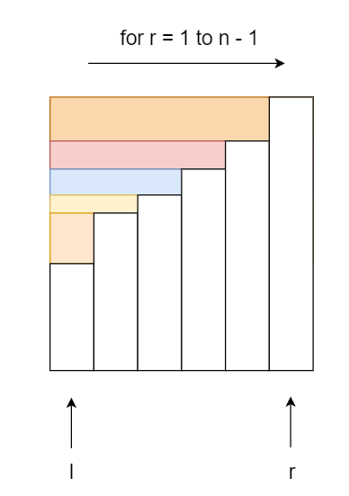
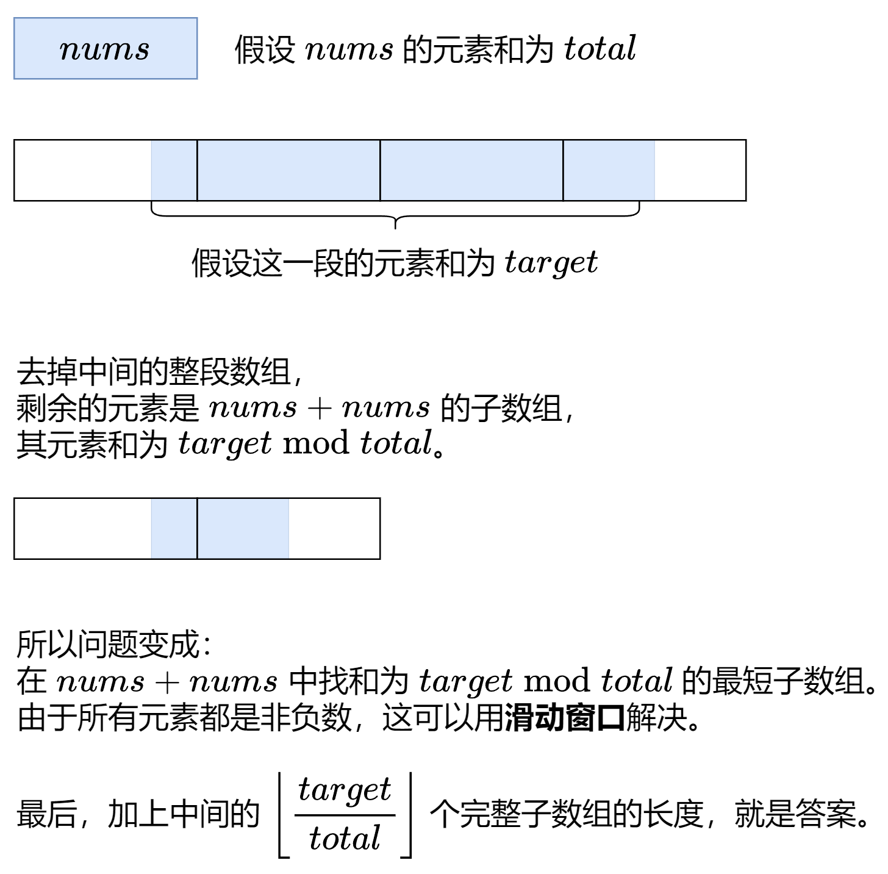

# 滑动窗口与双指针

## 资料
* [滑动窗口与双指针](https://leetcode.cn/circle/discuss/0viNMK/)

## 一、定长滑动窗口

### §1.1 基础
1. [定长子串中元音的最大数目](https://leetcode.cn/problems/maximum-number-of-vowels-in-a-substring-of-given-length/description/)：

    ```python
    class Solution:
        def maxVowels(self, s: str, k: int) -> int:
            ans = vowel = 0
            for i, c in enumerate(s):
                if c in "aeiou":            # 1. 进入窗口
                    vowel += 1
                if i < k - 1:               # 窗口大小不足 k
                    continue
                ans = max(ans, vowel)       # 2. 更新答案
                if s[i - k + 1] in "aeiou": # 3. 离开窗口
                    vowel -= 1
            return ans
    ```

    复杂度分析:

    - 时间复杂度：O(n)，其中 n 是 s 的长度。
    - 空间复杂度：O(1)

2. [爱生气的书店老板](https://leetcode.cn/problems/grumpy-bookstore-owner/description/)：

    **关键思路：将问题拆分成两个子问题**

    ```python
    class Solution:
        def maxSatisfied(self, customers: List[int], grumpy: List[int], minutes: int) -> int:
            # s[0]: 老板不生气时的顾客数量之和
            # s[1]: 长度为 minutes 的连续子数组中，老板生气时的顾客数量之和，通过定长滑动窗口解决
            # 最终答案为 s0 + max_s1
            s = [0, 0]
            max_s1 = 0
            for i, (c, g) in enumerate(zip(customers, grumpy)):
                s[g] += c
                if i < minutes - 1:                     # 窗口长度不足 minutes
                    continue
                max_s1 = max(max_s1, s[1])              # 更新 max_s1
                if grumpy[i - minutes + 1]:             # 因为 s0 和 s1 是分开统计的，所以离开窗口时要判断
                    s[1] -= customers[i - minutes + 1]  # 窗口最左边元素离开窗口
            return s[0] + max_s1
    ```

    复杂度分析:

    - 时间复杂度：O(n)，其中 n 为 customers 的长度。
    - 空间复杂度：O(1)

3. [检查一个字符串是否包含所有长度为 K 的二进制子串](https://leetcode.cn/problems/check-if-a-string-contains-all-binary-codes-of-size-k/description/)：

    **关键思路：统计所有出现过的长度为 k 的 unique 子串，判断结果是否和 2 ** k 相等**

    ```python
    class Solution:
        def hasAllCodes(self, s: str, k: int) -> bool:
            ans = set()
            left = 0
            for right, c in enumerate(s):        # 1. 进入窗口
                if right < k - 1:                # 窗口大小不足
                    continue
                ans.add(s[left : right + 1])     # 2. 更新答案
                left += 1                        # 3. 离开窗口
            return len(ans) == 2 ** k
    ```

    复杂度分析:

    - 时间复杂度：O(n)，其中 n 为 s 的长度。
    - 空间复杂度：O($2^k$), 最多会存储$2^k$个不同的子串。

4. [几乎唯一子数组的最大和](https://leetcode.cn/problems/maximum-sum-of-almost-unique-subarray/description/)：

    **关键思路：利用 Counter 来统计每个数出现的次数**

    ```python
    class Solution:
        def maxSum(self, nums: List[int], m: int, k: int) -> int:
            ans = 0
            s = sum(nums[:k - 1])         # 先统计前 k-1 个数
            cnt = Counter(nums[:k - 1])
            for out, in_ in zip(nums, nums[k - 1:]):
                s += in_                  # 再添加一个数就是 k 个数了
                cnt[in_] += 1
                if len(cnt) >= m:
                    ans = max(ans, s)     # 是几乎唯一子数组，更新答案
                s -= out                  # 离开窗口
                cnt[out] -= 1
                if cnt[out] == 0:
                    del cnt[out]
            return ans
    ```

    复杂度分析:

    - 时间复杂度：O(n)，其中 n 为 nums 的长度。
    - 空间复杂度：O(k)，哈希表的大小不会超过窗口长度 k。

5. [可获得的最大点数](https://leetcode.cn/problems/maximum-points-you-can-obtain-from-cards/description/)：

    **关键思路：逆向思维 - 转换为求最小和 ➡️ 最小化剩下的点数和**

    ```python
    class Solution:
        def maxScore(self, cardPoints: List[int], k: int) -> int:
            n = len(cardPoints)
            m = n - k
            s = 0
            min_s = math.inf
            # 注意 python 的enumerate无法提前取到后面的元素，特殊情况的判断
            if (m == 0):
                return sum(cardPoints)
            for i, num in enumerate(cardPoints):
                s += num
                if i < m - 1:
                    continue
                min_s = min(min_s, s)
                s -= cardPoints[i - m + 1]
            return sum(cardPoints) - min_s
    ```

    更精简的写法：

    ```python
    class Solution:
        def maxScore(self, cardPoints: List[int], k: int) -> int:
            n = len(cardPoints)
            m = n - k
            min_s = s = sum(cardPoints[:m])
            for i in range(m, n):
                s += cardPoints[i] - cardPoints[i - m]
                min_s = min(min_s, s)
            return sum(cardPoints) - min_s
    ```

    复杂度分析:

    - 时间复杂度：O(n)，其中 n 为 cardPoints 的长度。
    - 空间复杂度：O(1)。Python 忽略切片开销。

6. [拆炸弹](https://leetcode.cn/problems/defuse-the-bomb/description/)：

    **关键思路：举例详细推演，找到规律，发现 k > 0 和 k < 0 的情况相同，定义右边界 r 很关键**

    ```python
    class Solution:
        def decrypt(self, code: List[int], k: int) -> List[int]:
            # k > 0，第一个窗口的的下标范围为 [1, k + 1)
            # k < 0，第一个窗口的的下标范围为 [n - |k|, n)
            # 窗口总是向右移动，移入窗口的下标是 r % n, 移出的是 (r - |k|) % n
            n = len(code)
            ans = [0] * n
            r = k + 1 if k > 0 else n  # 关键点：定义右边界 r
            k = abs(k)
            s = sum(code[r - k: r])    # ans[0]
            for i in range(n):
                ans[i] = s
                s += code[r % n] - code[(r - k) % n]
                r += 1
            return ans
    ```

    复杂度分析:

    - 时间复杂度：O(n)，其中 n 为 code 的长度。
    - 空间复杂度：O(1)。返回值不计入，Python 忽略切片的空间。

7. [子串的最大出现次数](https://leetcode.cn/problems/maximum-number-of-occurrences-of-a-substring/description/)：

    **关键思路：maxSize 是干扰项，子串越短，包含的不同字母个数越少，越能满足 ≤ maxLetters 的要求。子串越短，子串在 s 中的出现次数也越多。所以本题只需考虑长度恰好为 minSize 的子串，maxSize 是多余的。**

    ```python
    class Solution:
        def maxFreq(self, s: str, maxLetters: int, minSize: int, maxSize: int) -> int:
            n = len(s)
            d = defaultdict(int)
            for i in range(n - minSize + 1):
                tmp = s[i: i + minSize]
                c = set(tmp)
                if len(c) <= maxLetters:
                    d[tmp] += 1
            return max(d.values()) if d else 0
    ```

    复杂度分析:

    - 时间复杂度：O(n * minSize)
        - 外层循环执行 n - minSize + 1 次，简化为 O(n)
        - 每次循环截取长度为 minSize 的子串（字符串切片和集合转换），单次循环复杂度为 O(minSize)。
        - 因此总时间复杂度为 O(n * minSize)。
    - 空间复杂度：O(n * minSize)
        - 最多会存储所有长度为 minSize 的不同子串，理论上最多 O(n) 个（实际远小于，因为有重复）。
        - 每个子串长度为 minSize，所以空间复杂度为 O(n * minSize)。

### §1.2 进阶

1. [最少交换次数来组合所有的 1 II](https://leetcode.cn/problems/minimum-swaps-to-group-all-1s-together-ii/)：

    **关键思路：**

    **1. 我们已经知道 1 的全部个数，那么我们就拿 1 的个数这么长的窗口来滑动**

    **2. 求出窗口和的最大值，用 1 的个数减去窗口和最大值，就是最少的交换次数**

    **3. 对于环状，我们直接把原来数组再追加到尾部，自然就首尾相接了**

    ```python
    class Solution:
        def minSwaps(self, nums: List[int]) -> int:
            k = sum(nums)
            max_s = s = sum(nums[:k])
            nums.extend(nums)
            for out, in_ in zip(nums, nums[k:]):
                s += in_ - out
                max_s = max(max_s, s)
            return k - max_s
    ```

    复杂度分析:

    - 时间复杂度：O(n)，其中 n 是 nums 的长度。
    - 空间复杂度：O(1)。

2. [滑动子数组的美丽值](https://leetcode.cn/problems/sliding-subarray-beauty/description/)：

    **关键思路：**

    **1. -50 <= nums[i] <= 50, 最多 101 个元素。值域很小，可以借鉴计数排序，用一个 cnt 数组维护窗口内每个数的出现次数。**

    **2. 美丽值是负数或 0，不用考虑正数的那一半**

    **3. 求第 x 小的数：通过遍历 cnt 数组，从最小的数-50出现的次数开始-=，直到<=0，那么那个数就是第 x 小的了**

    ```python
    class Solution:
        def getSubarrayBeauty(self, nums: List[int], k: int, x: int) -> List[int]:
            n = len(nums)
            ans = [0] * (n - k + 1)
            cnt = [0] * 101            # -50 <= nums[i] <= 50, 最多 101 个元素
            # [0, 1, ..., 50, 51, ..., 100]: cnt 数组下标
            #  0     1 ~ 50     -50 ~ -1   : cnt 数组下标代表的数字 num[i]
            for num in nums[:k - 1]:   # 先往窗口内添加 k-1 个数
                cnt[num] += 1          # 利用python的语言特性，num为负数则是往cnt数组后面添加
            for i, (out, in_) in enumerate(zip(nums, nums[k-1:])):
                cnt[in_] += 1           # 进入窗口（保证窗口有恰好 k 个数）
                left = x
                for j in range(-50, 0): # 暴力枚举负数范围 [-50,-1], -50一定是最小的
                    left -= cnt[j]
                    if left <= 0:       # 找到美丽值
                        ans[i] = j
                        break
                cnt[out] -= 1           # 离开窗口
            return ans
    ```

    复杂度分析:

    - 时间复杂度：O(nU)，其中 n 为 nums 的长度，U=50。
    - 空间复杂度：O(U)。

3. 📌 [使二进制字符串字符交替的最少反转次数](https://leetcode.cn/problems/minimum-number-of-flips-to-make-the-binary-string-alternating/description/)：

4. [字符串的排列](https://leetcode.cn/problems/permutation-in-string/)：

    **关键思路：滑动窗口 + 字典 Counter（排列的判断：两个字符串的每个字符的个数都相等）**

    ```python
    class Solution:
        def checkInclusion(self, s1: str, s2: str) -> bool:
            k = len(s1)
            cnt1 = Counter(s1)
            cnt2 = Counter(s2[:k-1])
            for out, in_ in zip(s2, s2[k-1:]):
                cnt2[in_] += 1
                if cnt2 == cnt1:
                    return True
                cnt2[out] -= 1
            return False
    ```

    复杂度分析：

    - 时间复杂度：O(n)，其中 n 为 s2 的长度。
        - 主循环遍历 s2，每次窗口移动只涉及常数次哈希表操作（加减计数、比较），哈希表大小最多为 26（小写字母），所以可以视为常数。
    - 空间复杂度：O(1)。
        - 两个 Counter 哈希表，最多存储 26 个字符的计数，空间为常数。

5. 📌 [串联所有单词的子串](https://leetcode.cn/problems/substring-with-concatenation-of-all-words/description/)：

6. 📌 [查找给定哈希值的子串](https://leetcode.cn/problems/find-substring-with-given-hash-value/description/)：

7. 📌 [统计完全子字符串](https://leetcode.cn/problems/count-complete-substrings/description/)：

8. 📌 [子串能表示从 1 到 N 数字的二进制串](https://leetcode.cn/problems/binary-string-with-substrings-representing-1-to-n/)：

    ```python
    class Solution:
        def queryString(self, s: str, n: int) -> bool:
            return all(bin(i)[2:] in s for i in range(1, n + 1))
    # 1. 暴力枚举 [1,n] 内的数，转成二进制字符串: 
    #    bin函数可以将整数转化为二进制字符串，去除掉前面的 '0b'
    # 2. all接受一个可迭代对象，如果可迭代对象中的所有元素都为 True 才返回True
    ```

### §1.3 其他

1. [学生分数的最小差值](https://leetcode.cn/problems/minimum-difference-between-highest-and-lowest-of-k-scores/description/)：

    **关键思路：先将数组从小到大排序，然后只需取滑动窗口两端的最小差值即可**

    ```python
    class Solution:
        def minimumDifference(self, nums: List[int], k: int) -> int:
            nums.sort()
            return min(in_ - out for out, in_ in zip(nums, nums[k-1:]))
    ```

    复杂度分析：

    - 时间复杂度：O(n log n)
        - 排序操作 nums.sort() 需要 O(n log n)。
        - 滑动窗口遍历 zip(nums, nums[k-1:]) 只需 O(n)。
    - 空间复杂度：O(1)
        - 排序原地进行，遍历只用常数空间。

    ```python
    nums.sort()  # 原地排序，会直接修改原列表 nums 的顺序，不会返回新的列表
    sorted(nums) # 返回排序后的新列表
    ```

2. 📌 [存在重复元素 III](https://leetcode.cn/problems/contains-duplicate-iii/description/)：

## 二、不定长滑动窗口

### §2.1 求最长/最大
1. [无重复字符的最长子串](https://leetcode.cn/problems/longest-substring-without-repeating-characters/description/)：

    **关键思路：维护一个队列，把队列左边的元素移出直到满足题目要求**

    ```python
    class Solution:
    def lengthOfLongestSubstring(self, s: str) -> int:
        ans = left = 0
        cnt = defaultdict(int)
        for i, c in enumerate(s):
            cnt[c] += 1
            while cnt[c] > 1:
                cnt[s[left]] -= 1
                left += 1
            ans = max(ans, i - left + 1)
        return ans
    ```

    写法二：

    ```python
    class Solution:
        def lengthOfLongestSubstring(self, s: str) -> int:
            ans = 0
            seen = []
            for c in s:
                while c in seen:
                    del seen[0]   # 删除队列左边第一个，直到没有重复的字符串
                seen.append(c)
                ans = max(ans, len(seen))
            return ans
    ```

    复杂度分析：

    - 时间复杂度：O(n)，其中 n 为 s 的长度。注意每个字符最多进窗口一次、出窗口一次，left 指针最多移动 n 次，所以整体是 O(n)。
    - 空间复杂度：O(∣Σ∣)，其中 ∣Σ∣ 为字符集合的大小，本题中字符均为 ASCII 字符，所以 ∣Σ∣≤128。

2. [每个字符最多出现两次的最长子字符串](https://leetcode.cn/problems/maximum-length-substring-with-two-occurrences/description/)：

    **关键思路：相当于上题的「出现次数不超过 1」改成「出现次数不超过 2」**

    ```python
    class Solution:
    def maximumLengthSubstring(self, s: str) -> int:
        ans = left = 0
        cnt = defaultdict(int)
        for i, c in enumerate(s):
            cnt[c] += 1
            while cnt[c] > 2:
                cnt[s[left]] -= 1
                left += 1
            ans = max(ans, i - left + 1)
        return ans
    ```

    写法二：

    ```python
    class Solution:
        def maximumLengthSubstring(self, s: str) -> int:
            ans = 0
            seen = []
            cnt = defaultdict(int)
            for c in s:
                cnt[c] += 1
                while c in seen and cnt[c] > 2:
                    cnt[seen[0]] -= 1
                    del seen[0]
                seen.append(c)
                ans = max(ans, len(seen))
            return ans
    ```

3. [删掉一个元素以后全为 1 的最长子数组](https://leetcode.cn/problems/longest-subarray-of-1s-after-deleting-one-element/description/)：

    **关键思路：注意题目要求一定要删除一个元素（即便全是1也要删除一个元素），问题转化为: 求最长子数组的长度（减一），满足子数组至多有一个 0**

    ```python
    class Solution:
        def longestSubarray(self, nums: List[int]) -> int:
            ans = left = cnt0 = 0
            for right, x in enumerate(nums):
                cnt0 += 1 - x                # 维护窗口中的 0 的个数
                while cnt0 > 1:              # 当 0 的数量大于1，左指针就往右滑
                    cnt0 -= 1 - nums[left]   # 如果 nums[left] 是 0，要减掉 
                    left += 1
                ans = max(ans, right - left) # right - left + 1, 但是还要去除被删掉的那个元素
            return ans
    ```

    复杂度分析：

    - 时间复杂度：O(n)，其中 n 是 nums 的长度。虽然写了个二重循环，但是内层循环中对 left 加一的总执行次数不会超过 n 次，所以总的时间复杂度为 O(n)。
    - 空间复杂度：O(1)。


4. [尽可能使字符串相等](https://leetcode.cn/problems/get-equal-substrings-within-budget/description/)：

    **关键思路：每一次字符转化的 cost 已知， 将问题转化为：在连续子数组的和小于等于 maxCost 的情况下，找到最长的连续子数组长度。**

    ```python
    class Solution:
        def equalSubstring(self, s: str, t: str, maxCost: int) -> int:
            ans = sum = left = 0
            for right in range(len(s)):
                sum += abs(ord(s[right]) - ord(t[right]))
                while sum > maxCost:
                    sum -= abs(ord(s[left]) - ord(t[left]))
                    left += 1
                ans = max(ans, right - left + 1)
            return ans
    ```

    复杂度分析：

    - 时间复杂度：O(n)，其中 n 为字符串 s 的长度。
    - 空间复杂度：O(1)。

5. [找到最长的半重复子字符串](https://leetcode.cn/problems/find-the-longest-semi-repetitive-substring/description/)：

    **关键思路：定义 same 来统计相邻相同的情况出现了多少次，如果 same > 1，则不断移动左指针 left 直到 s[left] == s[left − 1]，此时将一对相同的字符移到窗口之外，然后将 same 置为 1**

    > "如果一个字符串 t 中至多有一对相邻字符是相等的，那么称这个字符串 t 是半重复的。" 至多 表示 没有也行，因此ans的初始值是 1

    ```python
    class Solution:
        def longestSemiRepetitiveSubstring(self, s: str) -> int:
            ans, left, same = 1, 0, 0
            for right in range(1, len(s)):
                if s[right] == s[right - 1]:
                    same += 1
                if same > 1:
                    left += 1
                    while s[left] != s[left - 1]:
                        left += 1
                    same = 1
                ans = max(ans, right - left + 1)
            return ans
    ```

    复杂度分析：

    - 时间复杂度：O(n)，其中 n 为 s 的长度。注意 left 只会增加不会减少，所以二重循环的时间复杂度为 O(n)。
    - 空间复杂度：O(1)。仅用到若干额外变量。

6. [最多 K 个重复元素的最长子数组](https://leetcode.cn/problems/length-of-longest-subarray-with-at-most-k-frequency/description/)：

    **关键思路：双指针**

    ```python
    class Solution:
        def maxSubarrayLength(self, nums: List[int], k: int) -> int:
            ans = left = 0
            cnt = Counter() # 或 cnt = defaultdict(int)
            for right, n in enumerate(nums):
                cnt[n] += 1
                while cnt[n] > k:
                    cnt[nums[left]] -= 1
                    left += 1
                ans = max(ans, right - left + 1)
            return ans
    ```

    复杂度分析:

    - 时间复杂度：O(n)，其中 n 为 nums 的长度。
    - 空间复杂度：O(n)。

7. [数组的最大美丽值](https://leetcode.cn/problems/maximum-beauty-of-an-array-after-applying-operation/)：

    **关键思路：**

    **1. 选的是子序列，且操作后子序列的元素都相等，所以元素顺序对答案没有影响，可以先对数组排序**

    **2. 题目要求的「由相等元素组成的最长子序列」，相当于选出若干闭区间，这些区间的交集不为空。排序后，选出的区间是连续的，我们只需考虑最左边的区间 [x − k, x + k] 和最右边的区间 [y − k, y + k]，如果这两个区间的交集不为空，那么选出的这些区间的交集就不为空，即 x + k ≥ y − k，也就是 y - x ≤ 2k**

    **3. 将问题转化为：排序后，找最长的连续子数组，其最大值减最小值 ≤ 2k**

    ```python
    class Solution:
        def maximumBeauty(self, nums: List[int], k: int) -> int:
            nums.sort()
            ans = left = 0
            for right, n in enumerate(nums):
                while n - nums[left] > 2 * k:
                    left += 1
                ans = max(ans, right - left + 1)
            return ans
    ```

    复杂度分析：

    - 时间复杂度：O(nlogn)，其中 n 为 nums 的长度。瓶颈在排序上O(nlogn)。虽然写了个二重循环，但是内层循环中对 left 加一的总执行次数不会超过 n 次，所以滑窗那部分的时间复杂度为 O(n)。
    - 空间复杂度：O(1)。忽略排序的栈开销，仅用到若干额外变量。

8. [考试的最大困扰度](https://leetcode.cn/problems/maximize-the-confusion-of-an-exam/description/)：

    **关键思路：将题目转化为求 answerKey 的一个最长子串，至多包含 k 个 T 或者至多包含 k 个 F，滑动窗口直到 T 和 F 的出现次数至少有一个 ≤ k 即可**

    ```python
    class Solution:
        def maxConsecutiveAnswers(self, answerKey: str, k: int) -> int:
            ans = left = 0
            cnt = defaultdict(int)
            for right, c in enumerate(answerKey):
                cnt[c] += 1
                while cnt['T'] > k and cnt['F'] > k:
                    cnt[answerKey[left]] -= 1
                    left += 1
                ans = max(ans, right - left + 1)
            return ans
    ```

    复杂度分析：

    - 时间复杂度：O(n)，其中 n 是 answerKey 的长度。虽然写了个二重循环，但是内层循环中对 left 加一的总执行次数不会超过 n 次，所以总的时间复杂度为 O(n)。
    - 空间复杂度：O(1)。

9. [最高频元素的频数](https://leetcode.cn/problems/frequency-of-the-most-frequent-element/description/)：

    **关键思路：转化为求面积，排序后，移动窗口时求出相邻两个柱子之间的面积差，不断叠加面积直到消耗完 k，就是此时能够覆盖最多的柱子数量，更新答案**

    { width="350" }

    ```python
    class Solution:
        def maxFrequency(self, nums: List[int], k: int) -> int:
            nums.sort()
            ans = 1
            s = left = 0
            for right in range(1, len(nums)):
                s += (nums[right] - nums[right - 1]) * (right - left)
                while s > k: # 说明当前窗口内的元素无法通过 k 次操作变为相同的值
                    s -= nums[right] - nums[left]
                    left += 1
                ans = max(ans, right - left + 1)
            return ans
    ```

    复杂度分析：

    - 时间复杂度：排序的时间复杂度为 O(nlogn)，遍历数组和滑动窗口的时间复杂度为 O(n)。因此，总的时间复杂度为 O(nlogn)。
    - 空间复杂度：O(1)。


10. [每种字符至少取 K 个](https://leetcode.cn/problems/take-k-of-each-character-from-left-and-right/description/)：

    **关键思路：相当于最大化中间窗口的长度，那么可以一开始将所有元素取走，然后在窗口移动的时候把元素放回窗口，一旦窗口外某个元素的个数降到了 k 个以下，就移动左边界**

    ```python
    class Solution:
        def takeCharacters(self, s: str, k: int) -> int:
            cnt = Counter(s)            # 一开始将所有元素取走
            if any(cnt[c] < k for c in "abc"):
                return -1
            left = mx = 0               # mx 记录窗口的最大长度
            for right, c in enumerate(s):
                cnt[c] -= 1             # 将 c 放到窗口内，也就是取走的元素减1
                while cnt[c] < k:
                    cnt[s[left]] += 1   # 把 left 对应的元素从窗口取走
                    left += 1
                mx = max(mx, right - left + 1)
            return len(s) - mx
    ```

    复杂度分析：

    - 时间复杂度：O(n)，其中 n 为字符串 s 的长度。主循环遍历 s，每个字符最多进窗口一次、出窗口一次，left 指针最多移动 n 次，所以整体是 O(n)。
    - 空间复杂度：O(1)。cnt 哈希表最多存储 3 个字符（'a', 'b', 'c'），空间为常数。

11. 📌[找出最长等值子数组](https://leetcode.cn/problems/find-the-longest-equal-subarray/description/)：

    **关键思路：分组滑窗**

    **1. 把相同元素分组，相同元素的下标记录到哈希表（或者数组）pos_lists 中**

    **2. 遍历 pos_lists 中的每个下标列表 pos，在 pos 里用滑动窗口，此时子数组的长度为 pos[right] − pos[left] + 1，这个子数组有 right − left + 1 个数都是相同的，那么需要删除的元素个数就是 pos[right] − pos[left] − (right − left)，用它来和 k 做比较**

    **3. 代码实现时，为简化上式，pos 实际保存 pos[i] − i，需要删除的元素个数则简化为 pos[right] − pos[left]**

    ```python
    class Solution:
        def longestEqualSubarray(self, nums: List[int], k: int) -> int:
            pos_lists = defaultdict(list)
            for i, n in enumerate(nums):
                pos_lists[n].append(i - len(pos_lists[n]))
            ans = 0
            for pos in pos_lists.values():
                if len(pos) < ans:
                    continue        # 无法让 ans 变得更大
                left = 0
                for right in range(len(pos)):
                    while pos[right] - pos[left] > k:
                        left += 1
                    ans = max(ans, right - left + 1)
            return ans
    ```

12. 📌 [毯子覆盖的最多白色砖块数](https://leetcode.cn/problems/maximum-white-tiles-covered-by-a-carpet/description/)：

13. 📌 [摘水果](https://leetcode.cn/problems/maximum-fruits-harvested-after-at-most-k-steps/description/)：
14. 📌 [两个线段获得的最多奖品](https://leetcode.cn/problems/maximize-win-from-two-segments/description/)：
15. 📌 [使数组连续的最少操作数](https://leetcode.cn/problems/minimum-number-of-operations-to-make-array-continuous/)：
16. 📌 [可见点的最大数目](https://leetcode.cn/problems/maximum-number-of-visible-points/description/)：
17. 📌 [最长合法子字符串的长度](https://leetcode.cn/problems/length-of-the-longest-valid-substring/)：
18. 📌 [执行操作使频率分数最大](https://leetcode.cn/problems/apply-operations-to-maximize-frequency-score/description/)：
19. 📌 [移动石子直到连续 II](https://leetcode.cn/problems/moving-stones-until-consecutive-ii/)：
20. 📌 [至少有 K 个重复字符的最长子串](https://leetcode.cn/problems/longest-substring-with-at-least-k-repeating-characters/)：
21. 📌 [最长的美好子字符串](https://leetcode.cn/problems/longest-nice-substring/)：

### §2.2 求最短/最小

1. [最短且字典序最小的美丽子字符串](https://leetcode.cn/problems/shortest-and-lexicographically-smallest-beautiful-string/description/)：

    ```python
    class Solution:
        def shortestBeautifulSubstring(self, s: str, k: int) -> str:
            if s.count('1') < k:
                return ''
            ans = s
            cnt1 = left = 0
            for right, c in enumerate(s):
                cnt1 += int(c)
                while cnt1 > k or s[left] == '0':
                    cnt1 -= int(s[left])
                    left += 1
                if cnt1 == k:
                    t = s[left: right + 1]
                    if len(t) < len(ans) or len(t) == len(ans) and t < ans:
                    # 要么是t长度更短，要么是长度相同但字典序更小(注意别忘了len(t) == len(ans))
                        ans = t
            return ans
    ```

    复杂度分析：

    - 时间复杂度：O(n)，其中 n 为字符串 s 的长度。主循环遍历 s，每个字符最多进窗口一次、出窗口一次，left 指针最多移动 n 次，所以整体是 O(n)。
    - 空间复杂度：O(n)。存储结果字符串 ans 和临时子串 t，最坏情况下需要 O(n) 空间。

2. [替换子串得到平衡字符串](https://leetcode.cn/problems/replace-the-substring-for-balanced-string/description/)：

    **关键思路：只有当除去「待替换子串」剩下的字符的出现次数 <= m 时，才满足条件。例如 QQQQ，只有 right 走到 2 (「待替换子串」为 QQQ) 或 3 (「待替换子串」为 QQQQ) 的时候才满足条件，此时将 QQQ 替换为类似 WER 即可或将 QQQQ 替换为 WERQ**

    ```python
    class Solution:
        def balancedString(self, s: str) -> int:
            m = len(s) // 4
            cnt = Counter(s) # cnt 记录除去 待替换子串 剩下的字符的出现次数
            if len(cnt) == 4 and min(cnt.values()) == m: # 已经符合要求
                return 0
            ans, left = inf, 0
            for right, c in enumerate(s):
                cnt[c] -= 1
                while max(cnt.values()) <= m: # > m 则根本无法替换得到
                    ans = min(ans, right - left + 1)
                    cnt[s[left]] += 1
                    left += 1
            return ans
    ```

3. [无限数组的最短子数组](https://leetcode.cn/problems/minimum-size-subarray-in-infinite-array/description/)：

    **关键思路：无限数组的处理**

    { width="450" }

    ```python
    class Solution:
        def minSizeSubarray(self, nums: List[int], target: int) -> int:
            total = sum(nums)
            n = len(nums)
            ans = inf
            left = s = 0
            new_target = target % total
            for right in range(2 * n):
                s += nums[right % n]
                while s > new_target:
                    s -= nums[left % n]
                    left += 1
                if s == new_target:
                    ans = min(ans, right - left + 1)
            return ans + target // total * n if ans != inf else -1
    ```
4. [删除最短的子数组使剩余数组有序](https://leetcode.cn/problems/shortest-subarray-to-be-removed-to-make-array-sorted/description/)：

    **关键思路：同向双指针（不定长滑动窗口）**

    ```python
    class Solution:
        def findLengthOfShortestSubarray(self, arr: List[int]) -> int:
            # 删除中间的 (left, right)的这一段，注意两边都是开区间
            n = len(arr)
            right = n - 1
            while right and arr[right - 1] <= arr[right]:
                right -= 1
            if right == 0: # arr 已经是非递减数组
                return 0
            ans = right    # 此时 arr[right-1] > arr[right]，删除 arr[:right]
            left = 0
            while left == 0 or arr[left - 1] <= arr[left]:
                while right < n and arr[left] > arr[right]:
                    right += 1
                # 此时 arr[left] <= arr[right]，删除 arr[left+1:right]
                ans = min(ans, right - left - 1)
                left += 1 # 枚举 left
            return ans
    ```

5. 📌 [最小覆盖子串](https://leetcode.cn/problems/minimum-window-substring/description/)：
6. 📌 [最小区间](https://leetcode.cn/problems/smallest-range-covering-elements-from-k-lists/description/)：

### §2.3 求子数组个数

#### §2.3.1 越长越合法

一般要写 `ans += left`。滑动窗口的内层循环结束时，右端点固定在 right，左端点在 0, 1, 2, …, left − 1 的所有子数组（子串）都是合法的，这一共有 left 个。

1. [包含所有三种字符的子字符串数目](https://leetcode.cn/problems/number-of-substrings-containing-all-three-characters/description/)：

    ```python
    class Solution:
        def numberOfSubstrings(self, s: str) -> int:
            ans = left = 0
            cnt = defaultdict(int)
            for c in s:
                cnt[c] += 1
                while len(cnt) == 3:
                    cnt[s[left]] -= 1
                    if cnt[s[left]] == 0:
                        del cnt[s[left]]
                    left += 1
                # 到这里时，右端点固定在 right，左端点在 0,1,2,⋯,left−1 
                # 的所有子串都是合法的，这一共有 left 个，加入答案
                ans += left
            return ans
    ```

2. [字符至少出现 K 次的子字符串 I](https://leetcode.cn/problems/count-substrings-with-k-frequency-characters-i/description/)：

    ```python
    class Solution:
        def numberOfSubstrings(self, s: str, k: int) -> int:
            ans = left = 0
            cnt = defaultdict(int)
            for c in s:
                cnt[c] += 1
                while cnt[c] >= k:
                    cnt[s[left]] -= 1
                    left += 1
                ans += left
            return ans
    ```

3. [统计好子数组的数目](https://leetcode.cn/problems/count-the-number-of-good-subarrays/description/)：

    **关键思路：注意题目中的 “一对”，此时定义 pairs 正好可以来实现**

    ```python
    class Solution:
        def countGood(self, nums: List[int], k: int) -> int:
            ans = left = pairs = 0
            cnt = defaultdict(int)
            for n in nums:
                pairs += cnt[n] # 注意是先增加 pairs 再增加 cnt
                cnt[n] += 1
                while pairs >= k:
                    cnt[nums[left]] -= 1
                    pairs -= cnt[nums[left]]
                    left += 1
                ans += left
            return ans
    ```

4. 📌 [统计重新排列后包含另一个字符串的子字符串数目 II](https://leetcode.cn/problems/count-substrings-that-can-be-rearranged-to-contain-a-string-ii/description/)

#### §2.3.2 越短越合法

一般要写 `ans += right - left + 1`。滑动窗口的内层循环结束时，右端点固定在 right，左端点在 left, left + 1, …, right 的所有子数组（子串）都是合法的，这一共有 right − left + 1 个。

1. [乘积小于 K 的子数组](https://leetcode.cn/problems/subarray-product-less-than-k/description/)：

    ```python
    class Solution:
        def numSubarrayProductLessThanK(self, nums: List[int], k: int) -> int:
            if k <= 1:          # 否则在 prod >= k 时报错 index out of range
                return 0        # 注意题目 nums[i] >= 1
            ans = left = 0
            prod = 1
            for right, n in enumerate(nums):
                prod *= n
                while prod >= k: # 不满足要求
                    prod //= nums[left]
                    left += 1
                ans += right - left + 1
            return ans
    ```

2. [不间断子数组](https://leetcode.cn/problems/continuous-subarrays/description/)：

    **关键思路：注意 max 对 Counter 比较的是 key**

    ```python
    class Solution:
        def continuousSubarrays(self, nums: List[int]) -> int:
            ans = left = 0
            cnt = Counter()
            for right, n in enumerate(nums):
                cnt[n] += 1
                while max(cnt) - min(cnt) > 2:
                    x = nums[left]
                    cnt[x] -= 1
                    if cnt[x] == 0:
                        del cnt[x]
                    left += 1
                ans += right - left + 1
            return ans
    ```

3. 📌 [找出唯一性数组的中位数](https://leetcode.cn/problems/find-the-median-of-the-uniqueness-array/description/)：

4. 📌 [统计满足 K 约束的子字符串数量 II](https://leetcode.cn/problems/count-substrings-that-satisfy-k-constraint-ii/description/)：

5. 📌 [美观的花束](https://leetcode.cn/problems/1GxJYY/description/)：

#### §2.3.3 恰好型滑动窗口

### §2.4 其他

## 三、单序列双指针

### §3.1 相向双指针

### §3.2 同向双指针

### §3.3 背向双指针

### §3.4 原地修改

## 四、双序列双指针

### §4.1 双指针

### §4.2 判断子序列

### §4.3 其他

## 五、三指针

## 六、分组循环