# Lectures

## 资料
* [课程网站](http://www.why.ink:8080/ICS/2024/Main_Page)
* [课程视频](https://www.bilibili.com/video/BV11BpFe4EmM/?spm_id_from=333.788&vd_source=2a33d03ec3e67e46971208a7faa0dcda)

## Lecture 1 The Missing Course of Your CS Education
1. [为什么要学习计算机系统基础](https://nju-projectn.github.io/ics-pa-gitbook/ics2024/why.html)

2. [man快速入门](https://nju-projectn.github.io/ics-pa-gitbook/ics2024/man.html)

3. [Linux入门教程](https://nju-projectn.github.io/ics-pa-gitbook/ics2024/linux.html)

## Lecture 2 Linux和C语言拾遗
1. 空 == 空 为 true（aa和bb都未定义，是空），因此输出 yes

    ```C
    #include <stdio.h>

    int main()
    {
    #if aa == bb
        printf("Yes\n");
    #else
        printf("No\n");
    #endif
    }
    ```

    ```bash
    linux$ gcc a.c && ./a.out
    Yes
    ```

2. X-Macros：

    `#x` 是一个预处理运算符，它会将参数 `x` 转换为字符串字面量。

    `#x` 两边无论多少空格，输出都是没有空格的:

    `puts("Hello, "#x"!")` 等价于 `puts("Hello, " #x "!")`

    ```C
    #include <stdio.h>

    #define NAMES(X) \
        X(Tom) X(Jerry) X(Tyke) X(Spike)

    int main() 
    { 
        #define PRINT(x) puts("Hello, "#x"!");
        NAMES(PRINT) 
    }
    ```

    ```bash
    linux$ gcc a.c && ./a.out
    Hello, Tom!
    Hello, Jerry!
    Hello, Tyke!
    Hello, Spike!
    ```

## Lecture 3 C语言拾遗: 机制与实践
1. a.c

    ```C
    int foo(int n) 
    { 
        int sum = 0; 
        for (int i = 1; i <= n; i++) 
        { 
            sum += i; 
        } 
        return sum; 
    }
    ```

    `gcc -S a.c` 生成汇编代码 a.s:

    ```asm
    foo:
        pushq	%rbp
        movq	%rsp, %rbp
        movl	%edi, -20(%rbp)  # n   -> -20(%rbp)
        movl	$0, -8(%rbp)     # sum -> -8(%rbp)
        movl	$1, -4(%rbp)     # i   -> -4(%rbp)
        jmp	.L2
    .L3:
        movl	-4(%rbp), %eax
        addl	%eax, -8(%rbp)
        addl	$1, -4(%rbp)
    .L2:
        movl	-4(%rbp), %eax
        cmpl	-20(%rbp), %eax
        jle	.L3
        movl	-8(%rbp), %eax
        popq	%rbp
        ret
    ```

    变量替换后更易读：

    ```asm
    foo:
        pushq	%rbp
        movq	%rsp, %rbp
        movl	%edi, n
        movl	$0, sum
        movl	$1, i
        jmp	.L2
    .L3:
        movl	i, %eax
        addl	%eax, sum
        addl	$1, i
    .L2:
        movl	i, %eax
        cmpl	n, %eax
        jle	.L3
        movl	sum, %eax
        popq	%rbp
        ret
    ```

    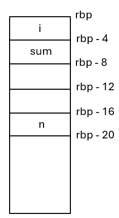{ width=150 }

2. b.c

    ```C
    #include <stdio.h>

    int foo(int n);

    int main()
    {
        printf("%d\n", foo(100));
    }
    ```

    ```bash
    linux$ gcc a.c -c && gcc b.c -c
    linux$ gcc a.o b.o -static
    linux$ objdump -d a.out | less
    0000000000401745 <foo>:
    401745:       f3 0f 1e fa             endbr64 
    401749:       55                      push   %rbp
    40174a:       48 89 e5                mov    %rsp,%rbp
    40174d:       89 7d ec                mov    %edi,-0x14(%rbp)
    401750:       c7 45 f8 00 00 00 00    movl   $0x0,-0x8(%rbp)
    401757:       c7 45 fc 01 00 00 00    movl   $0x1,-0x4(%rbp)
    40175e:       eb 0a                   jmp    40176a <foo+0x25>
    401760:       8b 45 fc                mov    -0x4(%rbp),%eax
    401763:       01 45 f8                add    %eax,-0x8(%rbp)
    401766:       83 45 fc 01             addl   $0x1,-0x4(%rbp)
    40176a:       8b 45 fc                mov    -0x4(%rbp),%eax
    40176d:       3b 45 ec                cmp    -0x14(%rbp),%eax
    401770:       7e ee                   jle    401760 <foo+0x1b>
    401772:       8b 45 f8                mov    -0x8(%rbp),%eax
    401775:       5d                      pop    %rbp
    401776:       c3                      ret    

    0000000000401777 <main>:
    401777:       f3 0f 1e fa             endbr64 
    40177b:       55                      push   %rbp
    40177c:       48 89 e5                mov    %rsp,%rbp
    40177f:       bf 64 00 00 00          mov    $0x64,%edi
    401784:       e8 bc ff ff ff          call   401745 <foo> # e8 is call, bc ff ff ff 是 foo 相对于下一条 pc 的offset
    401789:       89 c6                   mov    %eax,%esi    # 下一条 pc 是这个，地址是 0x401789
    40178b:       48 8d 05 72 68 09 00    lea    0x96872(%rip),%rax        # 498004 <_IO_stdin_used+0x4>
    401792:       48 89 c7                mov    %rax,%rdi
    401795:       b8 00 00 00 00          mov    $0x0,%eax
    40179a:       e8 31 9e 00 00          call   40b5d0 <_IO_printf>
    40179f:       b8 00 00 00 00          mov    $0x0,%eax
    4017a4:       5d                      pop    %rbp
    4017a5:       c3                      ret    
    4017a6:       66 2e 0f 1f 84 00 00    cs nopw 0x0(%rax,%rax,1)
    4017ad:       00 00 00 
    ```

    0x401789 + bc ff ff ff = 0x401745 (foo的地址)

    之所以是相对于下一条 pc 的 offset，是因为：复杂指令集每一条指令的长度并不固定，如果是相对当前指令的 offset 会有点麻烦，还得计算当前指令的长度是多少。

3. 数字逻辑电路模拟器

    ```C
    int  X = 0,  Y = 0;
    int X1 = 0, Y1 = 0;
    while (1)
    {
        X1 = (!X && Y) || (X && !Y);
        Y1 = !Y;
        X = X1; Y = Y1;
    }
    ```

    改写后，增加一个 Z 也很容易：

    ```C
    #define FORALL_REGS(_)      _(X) _(Y) 
    #define LOGIC               X1 = (!X && Y) || (X && !Y); \
                                Y1 = !Y;
    #define DEFINE(X)           static int X, X##1;
    #define UPDATE(X)           X = X##1;
    #define PRINT(X)            printf(#X " = %d; ", X);

    int main() 
    { 
        FORALL_REGS(DEFINE); 

        while (1) // clock
        {
            FORALL_REGS(PRINT); 
            putchar('\n’); 
            sleep(1); 
            LOGIC; 
            FORALL_REGS(UPDATE); 
        } 
    }
    ```

4. 使用顺时针螺旋法则的案例：

    ```C
    void (*signal (int sig, void (*func)(int)))(int);
    ```

    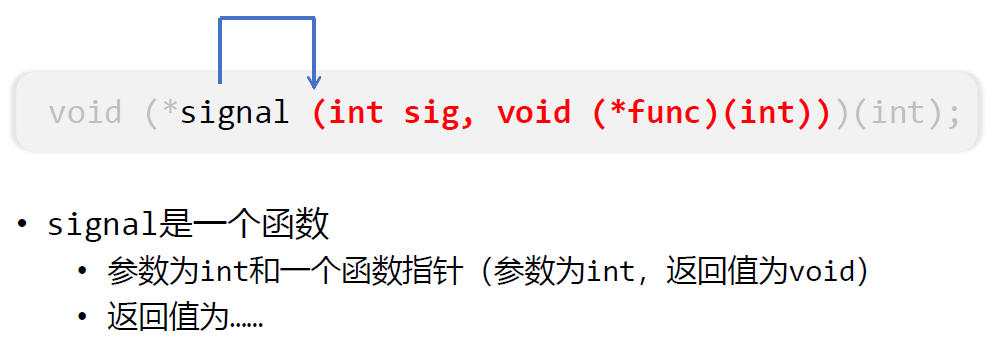{ width=550 }

    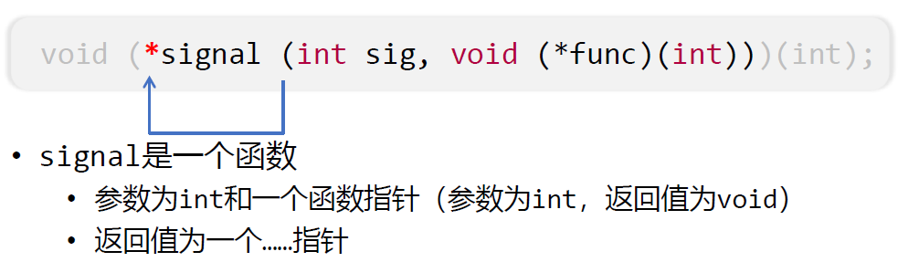{ width=550 }

    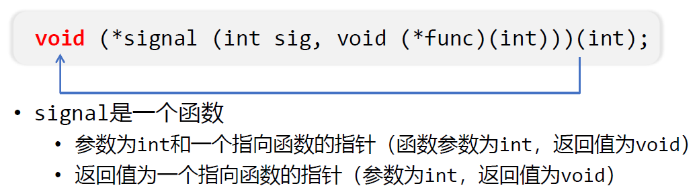{ width=550 }

    可读版本：

    ```C
    typedef void (*sighandler_t)(int);
    sighandler_t signal(int, sighandler_t);
    ```


## Lecture 4 代码选讲1：编译运行
1. [A Visual Git Reference](https://marklodato.github.io/visual-git-guide/index-en.html)

2. 计算机是个状态机，可以把计算机划分成两部分：

    * 时序逻辑部件(存储器，计数器，寄存器)
    * 组合逻辑部件(加法器等)

    在每个时钟周期到来的时候，计算机根据当前时序逻辑部件的状态，在组合逻辑部件的作用下，计算出并转移到下一时钟周期的新状态。


## Lecture 5 代码选讲2：代码导读
1. static inline：如果你的程序较短且性能攸关，则可以使用 static inline 函数定义在头文件中。例子 (/riscv32/reg.h)：

    ```C
    static inline int check_reg_index(int idx) { 
        IFDEF(CONFIG_RT_CHECK, assert(idx >= 0 && index < 32)); 
        return idx; 
    }
    ```

    如果仅仅使用 static，那么由于 x.c 仅仅是 include 了 a.h，但却未使用 function f，编译器会报 warning，在 `-Wall -Werror` 选项下则是 error 了：

    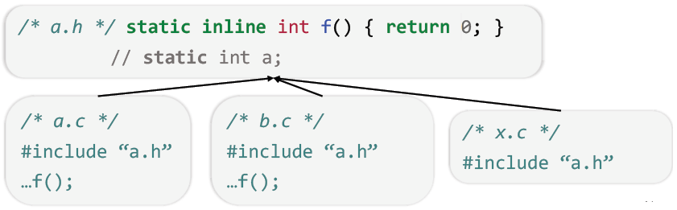

    注意 static inline 仅仅是对编译器的建议，编译器未必一定遵循它。

2. 错误的 assert 写法：

    ```C
    #define assert(cond) if (!(cond)) panic(...);
    ```

    原因：

    ```C
    if (...) assert(0); // 上面的assert错了，导致两个if一个else，不匹配
    else ...    
    ```

    正确的写法：用 do while(0) 或者 ({}) 包裹起来：

    ```C
    #define assert(cond) \ // nemu/**/debug.h
    do { \
        if (!(cond)) { \
            fprintf(stderr, "Fail @ %s:%d", __FILE__, __LINE__); \
            exit(1); \
        } \
    } while (0)

    #define assert(cond) ({ ... }) // GCC
    ```

3. `ls -l --color`也是使用 ANSI 的转义序列 (ANSI Escape Sequences) 来控制输出的颜色。

    ```bash
    linux$ ls -l | less
    total 56K
    drwxr-xr-x 3 user user 4.0K Nov 23 20:47 build
    drwxr-xr-x 2 user user 4.0K Nov 23 20:47 scripts
    -rw-r--r-- 1 user user    6 Nov 23 20:46 test.txt
    -rw-r--r-- 1 user user    0 Nov 23 18:18 Misc
    (END)
    linux$ ls -l --color | less
    total 56K
    drwxr-xr-x 3 user user 4.0K Nov 23 20:47 ESC[0mESC[01;34mbuildESC[0m
    drwxr-xr-x 2 user user 4.0K Nov 23 20:47 ESC[01;34mscriptsESC[0m
    -rw-r--r-- 1 user user    6 Nov 23 20:46 test.txt
    -rw-r--r-- 1 user user    0 Nov 23 18:18 Misc
    (END)
    ```

4. 宏嵌套太多，人肉展开太难？我们既然知道 Makefile 里哪一行是 .c → .o 的转换，我们添一个一模一样的 gcc -E 是不是就行了？

    ```Makefile
    $(OBJ_DIR)/%.o: src/%.c
        @$(CC) $(CFLAGS) $(SO_CFLAGS) -c -o $@ $<
        @$(CC) $(CFLAGS) $(SO_CFLAGS) -E -MF /dev/null $< | \
            grep -ve '^#' | \
            clang-format - > $(basename $@).i
    ```

    * `-MF` 是GCC编译器的一个选项，用于指定生成的依赖文件的名称。具体来说，`-MF` 选项后面跟着一个文件名，这个文件名是用来存储编译器解析源文件后生成的依赖关系信息的。
    * `clang-format`：这是一个代码格式化工具，用于统一代码风格。`-` 是 `clang-format` 的一个输入选项，表示从标准输入读取数据。

## Lecture 6 数据的机器级表示
1. Bit Set: 求 S 二进制表示有多少个1

    ```C
    int bitset_size(uint32_t S) { 
        int n; 
        for (int i = 0; i < 32; i++) { 
            n += bitset_contains(S, i); 
        } 
        return n; 
    }

    int bitset_size1(uint32_t S) { // SIMD，更快
        S = (S & 0x55555555) + ((S >> 1)  & 0x55555555);  // 0101 0101 0101 0101 0101 0101 0101 0101
        S = (S & 0x33333333) + ((S >> 2)  & 0x33333333);  // 0011 0011 0011 0011 0011 0011 0011 0011
        S = (S & 0x0F0F0F0F) + ((S >> 4)  & 0x0F0F0F0F);  // 0000 1111 0000 1111 0000 1111 0000 1111
        S = (S & 0x00FF00FF) + ((S >> 8)  & 0x00FF00FF);  // 0000 0000 1111 1111 0000 0000 1111 1111
        S = (S & 0x0000FFFF) + ((S >> 16) & 0x0000FFFF);  // 0000 0000 0000 0000 1111 1111 1111 1111
        return S; 
    }
    ```

    每两位的 1 的个数相加，然后再每四位数的 1 的个数相加，以此类推，最后得到的结果就是 1 的个数。example：S 是 0x47CBAE6B = 0b 0100 0111 1100 1011 1010 1110 0110 1011，那么：

    ```
    每2位的 1 的个数相加后:  10 12 20 12 11 21 11 12 = 0b 0100 0110 1000 0110 0101 1001 0101 0110
    每4位的 1 的个数相加后:  1  3  2  3  2  3  2  3  = 0b 0001 0011 0010 0011 0010 0011 0010 0011
    每8位的 1 的个数相加后:  4     5     5     5     = 0b 0000 0100 0000 0101 0000 0101 0000 0101
    每16位的 1 的个数相加后: 9           10          = 0b 0000 0000 0000 1001 0000 0000 0000 1010
    每32位的 1 的个数相加后: 19                      = 0b 0000 0000 0000 0000 0000 0000 0001 0011 = 19
    ```

2. Lowbit：找到最右边的1 ➡️ `x & -x`

    有二进制数x = 0b+++++100，我们希望得到最后那个100

    | 表达式 | 结果 |
    | ---- | ---- |
    | x | `0b+++++100` |
    | ~x | `0b-----011` |
    | ~x+1 | `0b-----100` |

3. 求 $\lfloor \log_2(x) \rfloor$ 

    方法一：等同于求 31 − clz(x)

    ```C
    int clz(uint32_t x) { 
        int n = 0; 
        if (x <= 0x0000ffff) n += 16, x <<= 16; 
        if (x <= 0x00ffffff) n += 8, x <<= 8; 
        if (x <= 0x0fffffff) n += 4, x <<= 4; 
        if (x <= 0x3fffffff) n += 2, x <<= 2; 
        if (x <= 0x7fffffff) n ++; 
        return n; 
    }
    ```

    例子：0100 是 4，$\lfloor \log_2(4) \rfloor$ = 2；0111 是 7，$\lfloor \log_2(7) \rfloor$ = 2。也就是说，其实是求比特串中最高位的 1 后面的 0/1 的个数。那么我们只要找到最高位 1 左边有多少个0，用 32 - 左边 0 的个数 - 1 就是最高位 1 后面的 0/1 的个数。

    方法二：查表法

    ```C
    #include <stdio.h>
    #include <stdint.h>

    #define LOG2(x) ("-01W2?XG3<@kYCHf4-=:AnlLZNDcI\\g_5P-V>F;jBeo9mKMb[^OUEid8Ja]Th7`S6RQ"[(x) % 67] - '0')
    // 通过将字符串中的第 x 个字符减去字符 '0' 的 ASCII 值得到 LOG2(x) 的值

    int main() {
        for (int i = 0; i < 64; i++) {
            uint64_t x = 1ULL << i;
            printf("%016llx %d\n", x, LOG2(x));
        }
    }
    ```

    ```bash
    0000000000000001 0
    0000000000000002 1
    0000000000000004 2
    0000000000000008 3
    0000000000000010 4
    ...
    2000000000000000 61
    4000000000000000 62
    8000000000000000 63
    ```

    如何得到这串神奇的字符串？

    ```python
    import json

    n, base = 64, '0'

    for m in range(n, 10000): 
        # 检查是否存在一个 m，使得 2 的 i 次方对 m 取模的
        # 结果集合的长度等于 n。这意味着对于 n 个不同的 i 值，
        # 2 的 i 次方对 m 取模的结果都是不同的。
        if len({ (2**i) % m for i in range(n) }) == n: 
            M = { j: chr(ord(base) + i) 
                for j in range(0, m) 
                    for i in range(0, n) 
                        if (2**i) % m == j } 
            break

    magic = json.dumps(''.join( 
        [ M.get(j, '-') for j in range(0, m) ] 
        )).strip('"') 

    print(f'#define LOG2(x) ("{magic}"[(x) % {m}] - \'{base}\')')
    ```

4. IEEE754: 越大的数字，距离下一个实数的距离就越大

    * 可能会带来相当的绝对误差
    * 因此很多数学库都会频繁做归一化

    ```C
    #include <stdio.h>
    #include <float.h>
    #include <stdint.h>
    #include <math.h>

    int main() {
    float x = FLT_MAX;
    printf("x = %e (10^%.1f)\n", x, log10(x));

    printf("========================================\n");

    float y = 1e38;
    printf("y         = %.0f\n", y);
    printf("y + 1e30f = %.0f\n", y + 1e30f);
    printf("y + 1e31f = %.0f\n", y + 1e31f);

    printf("========================================\n");

    unsigned long n1 = 0, n2 = 0, n3 = 0;
    union { float f; int i; } z;

    for (uint32_t i = 0; ; i++) {
        z.i = i;
        if (-1.0 < z.f && z.f < 1.0) n1++;
        if (-0.5f < z.f && z.f < 0.5f) n2++;
        if (-0.001 < z.f && z.f < 0.001) n3++;
        if (i == UINT32_MAX) break;
    }

    double n = (double)UINT32_MAX + 1;
    printf("%.2lf%% of floats are in (-1, 1)\n", (double)n1 / n * 100);
    printf("%.2lf%% of floats are in (-0.5, 0.5)\n", (double)n2 / n * 100);
    printf("%.2lf%% of floats are in (-0.001, 0.001)\n", (double)n3 / n * 100);
    }
    ```

    ```bash
    linux$ gcc a.c -lm # -lm 选项告诉编译器链接到数学库
    linux$ ./a.out
    x = 3.402823e+38 (10^38.5)
    ========================================
    y         = 99999996802856924650656260769173209088
    y + 1e30f = 99999996802856924650656260769173209088
    y + 1e31f = 100000006944061726476491472742798852096
    ========================================
    49.61% of floats are in (-1, 1)
    49.22% of floats are in (-0.5, 0.5)
    45.71% of floats are in (-0.001, 0.001)
    ```

5. 例子：计算 $1 + \frac{1}{2} + \frac{1}{3} + \cdots + \frac{1}{n}$

    ```C
    #define SUM(T, st, ed, d) ({ \
        T s = 0; \
        for (int i = st; i != ed + d; i += d) \
            s += (T)1 / i; \
        s; \
    })

    #define n 1000000

    int main() {
        printf("%.16f\n", SUM(float, 1, n, 1));  // 先加大数，误差大
        printf("%.16f\n", SUM(float, n, 1, -1)); // 先加小数，误差小
        printf("%.16f\n", SUM(double, 1, n, 1));
        printf("%.16f\n", SUM(double, n, 1, -1));
    }
    ```

    ```bash
    linux$ ./a.out
    14.3573579788208008
    14.3926515579223633
    14.3927267228649889
    14.3927267228657723
    ```

## Lecture 7 ABI与内联汇编
1. ABI（Application Binary Interface）

    * 区别于API (Application Programming Interface)
        - 程序源代码中的规范
    * 约定binary的行为（Linux ABI）
        - 二进制文件的格式
        - 函数调用、系统调用……
            + C语言规范只定义了运行时内存和内存上的计算
            + printf都无法实现，必须借助外部的库函数
        - 链接、加载的规范

## Lecture 8 I/O设备
1. `printf("Hello World\n")` 的全过程: [markmap](https://ysyx.oscc.cc/slides/hello-x86.html)

    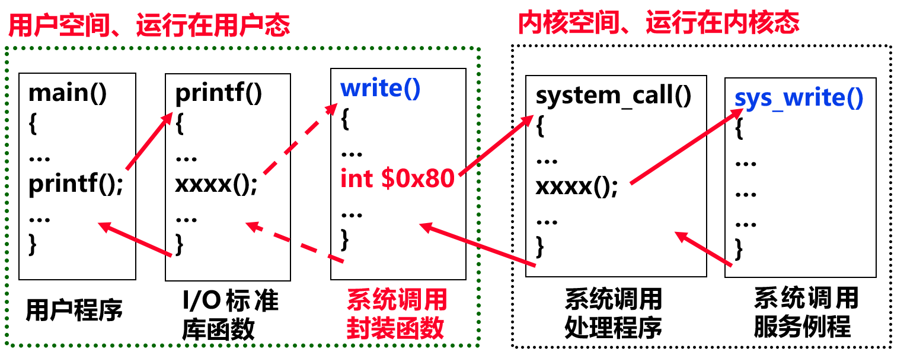

2. CPU v.s. GPU

    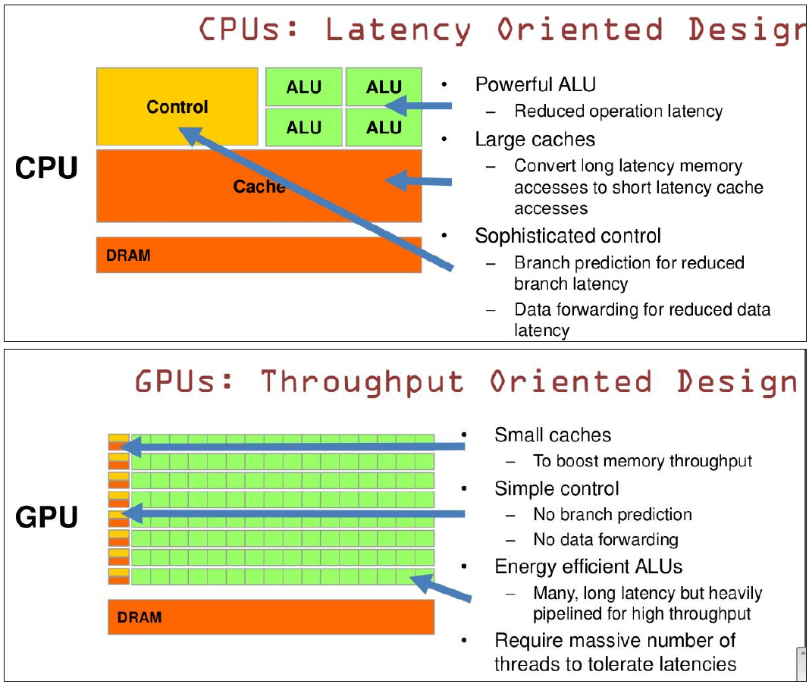

## Lecture 9 链接与加载
1. ELF 文件

    | ELF文件类型 | 说明 | 实例 |
    | ---- | ---- | ---- |
    | 可重定位文件 (Relocatable File) | 这类文件包括代码和数据，可以被用来链接成可执行文件或共享目标文件，静态链接库也可归为这一类 | Linux的.o / Windows的.obj |
    | 可执行文件 (Executable File) | 这类文件包含了可以直接执行的程序，它的代表就是ELF可执行文件 | /bin/bash，a.out, Windows的.exe |
    | 共享目标文件 (Shared Object File) | 这种文件包含了代码和数据，可以在下面两种情况下使用：1. 链接器使用此文件和其他可重定位文件和共享目标文件链接，产生新的目标文件；2. 动态链接器将几种共享目标文件与可执行文件结合，作为进程映像的一部分运行 | Linux的.so (e.g. /lib/glibc-2.5.so) / Windows的DLL |
    | 核心转储文件 (Core Dump File) | 当进程意外终止时，系统可以将该进程地址空间的内容及终止时的一些信息转储到此 | Linux下的core dump |

2. ELF 头：定义了ELF魔数、版本、小端/大端、操作系统平台、目标文件的类型、机器结构类型、节头表的起始位置和长度等

    ```C
    /* The ELF file header.  This appears at the start of every ELF file.  */

    #define EI_NIDENT (16)

    typedef struct
    {
        unsigned char	e_ident[EI_NIDENT];	/* Magic number and other info */
        Elf32_Half	    e_type;			    /* Object file type */
        Elf32_Half	    e_machine;		    /* Architecture */
        Elf32_Word	    e_version;		    /* Object file version */
        Elf32_Addr	    e_entry;		    /* Entry point virtual address */
        Elf32_Off	    e_phoff;		    /* Program header table file offset */
        Elf32_Off	    e_shoff;		    /* Section header table file offset */
        Elf32_Word	    e_flags;		    /* Processor-specific flags */
        Elf32_Half	    e_ehsize;		    /* ELF header size in bytes */
        Elf32_Half	    e_phentsize;		/* Program header table entry size */
        Elf32_Half	    e_phnum;		    /* Program header table entry count */
        Elf32_Half	    e_shentsize;		/* Section header table entry size */
        Elf32_Half	    e_shnum;		    /* Section header table entry count */
        Elf32_Half	    e_shstrndx;		    /* Section header string table index */
    } Elf32_Ehdr;
    ```

    <div style="text-align: center;">
        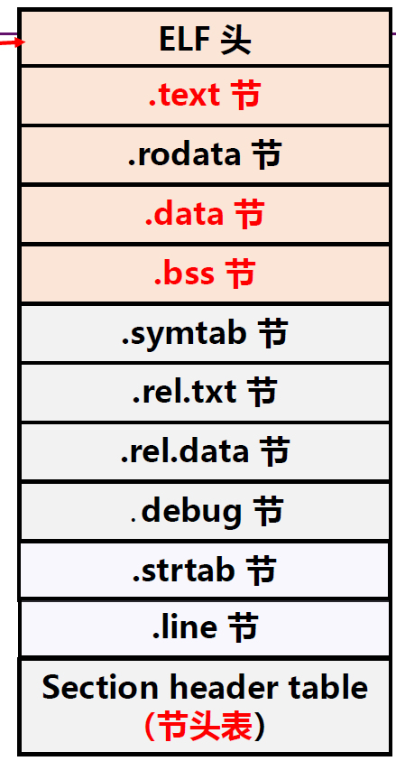{ width=230 }
    </div>

    * .text 节：编译汇编后的代码部分
    * .rodata 节：只读数据，如printf 格式串、switch 跳转表等
    * .data 节：已初始化且初值不为0的全局/静态变量
    * .bss 节：未初始化或初值为0的全局/静态变量，仅是占位符，不占任何实际磁盘空间。区分bss节是为了空间效率。

    Section header table (节头表)：存储了ELF文件的各个节的信息。

    ```C
    /* Section header.  */

    typedef struct
    {
        Elf32_Word	sh_name;		/* Section name (string tbl index) */
        Elf32_Word	sh_type;		/* Section type */
        Elf32_Word	sh_flags;		/* Section flags */
        Elf32_Addr	sh_addr;		/* Section virtual addr at execution */
        Elf32_Off	sh_offset;		/* Section file offset */
        Elf32_Word	sh_size;		/* Section size in bytes */
        Elf32_Word	sh_link;		/* Link to another section */
        Elf32_Word	sh_info;		/* Additional section information */
        Elf32_Word	sh_addralign;   /* Section alignment */
        Elf32_Word	sh_entsize;		/* Entry size if section holds table */
    } Elf32_Shdr;
    ```

    <div style="text-align: center;">
        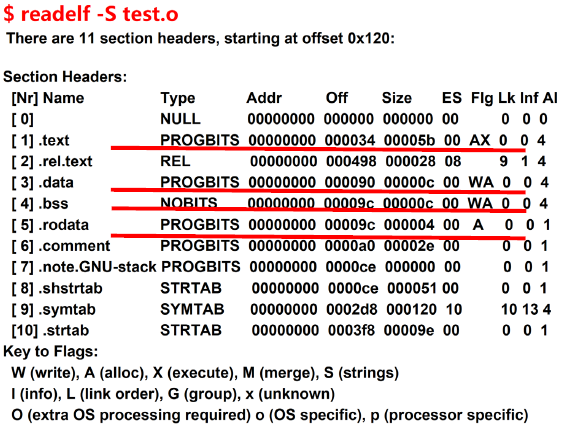{ width=530 }
    </div>
    <div style="text-align: center;">
        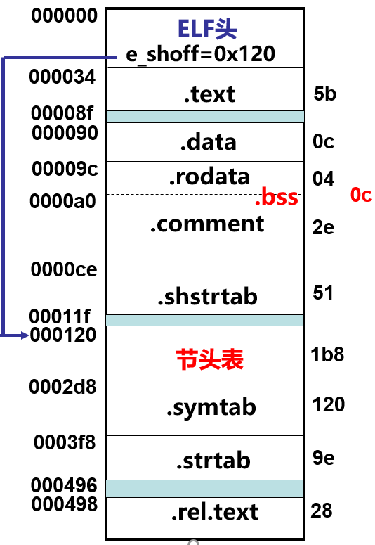{ width=250 }
    </div>

3. 链接多个 .o: 合并相同的节

    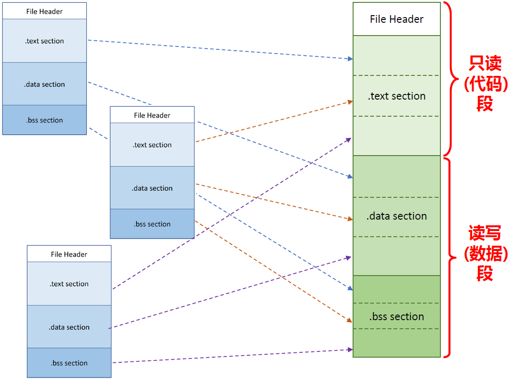

    链接 Two-pass linking

    * 空间和地址的分配
        - 重新建立符号表，合并段，并计算段长度建立映射关系
    * 符号解析和重定位
        - 确定标号引用关系

    a.c 

    ```C
    int foo(int a, int b) {
        return a + b;
    }
    ```

    b.c

    ```C
    int x = 100, y = 200;
    ```

    main.c

    ```C
    extern int x, y;
    int foo(int a, int b); // 可以试试extern int foo;
    int main() {
        printf("%d + %d = %d\n", x, y, foo(x, y));
    }
    ```


    ```bash
    linux$ gcc -c -fno-pic a.c
    linux$ gcc -c -fno-pic b.c
    linux$ gcc -c -fno-pic main.c
    linux$ gcc -static a.o b.o main.o
    linux$ ./a.out 
    100 + 200 = 300
    linux$ readelf -a main.o
    Relocation section '.rela.text' at offset 0x210 contains 7 entries:
    Offset          Info           Type           Sym. Value    Sym. Name + Addend
    00000000000a  000500000002 R_X86_64_PC32     0000000000000000 y - 4
    000000000010  000600000002 R_X86_64_PC32     0000000000000000 x - 4
    000000000019  000700000004 R_X86_64_PLT32    0000000000000000 foo - 4
    000000000021  000500000002 R_X86_64_PC32     0000000000000000 y - 4
    000000000027  000600000002 R_X86_64_PC32     0000000000000000 x - 4
    00000000002e  00030000000a R_X86_64_32       0000000000000000 .rodata + 0
    000000000038  000800000004 R_X86_64_PLT32    0000000000000000 printf - 4
    linux$ objdump -d main.o
    Disassembly of section .text:

    0000000000000000 <main>:
    0:    f3 0f 1e fa             endbr64 
    4:    55                      push   %rbp
    5:    48 89 e5                mov    %rsp,%rbp
    8:    8b 15 00 00 00 00       mov    0x0(%rip),%edx        # e <main+0xe>
    e:    8b 05 00 00 00 00       mov    0x0(%rip),%eax        # 14 <main+0x14>
    14:   89 d6                   mov    %edx,%esi
    16:   89 c7                   mov    %eax,%edi
    18:   e8 00 00 00 00          call   1d <main+0x1d>
    1d:   89 c1                   mov    %eax,%ecx
    1f:   8b 15 00 00 00 00       mov    0x0(%rip),%edx        # 25 <main+0x25>
    25:   8b 05 00 00 00 00       mov    0x0(%rip),%eax        # 2b <main+0x2b>
    2b:   89 c6                   mov    %eax,%esi
    2d:   bf 00 00 00 00          mov    $0x0,%edi
    32:   b8 00 00 00 00          mov    $0x0,%eax
    37:   e8 00 00 00 00          call   3c <main+0x3c>
    3c:   b8 00 00 00 00          mov    $0x0,%eax
    41:   5d                      pop    %rbp
    42:   c3                      ret    
    linux$ objdump -d a.out
    000000000040175d <main>:
    40175d:       f3 0f 1e fa             endbr64 
    401761:       55                      push   %rbp
    401762:       48 89 e5                mov    %rsp,%rbp
    401765:       8b 15 89 39 0c 00       mov    0xc3989(%rip),%edx        # 4c50f4 <y>
    40176b:       8b 05 7f 39 0c 00       mov    0xc397f(%rip),%eax        # 4c50f0 <x>
    401771:       89 d6                   mov    %edx,%esi
    401773:       89 c7                   mov    %eax,%edi
    401775:       e8 cb ff ff ff          call   401745 <foo>
    40177a:       89 c1                   mov    %eax,%ecx
    40177c:       8b 15 72 39 0c 00       mov    0xc3972(%rip),%edx        # 4c50f4 <y>
    401782:       8b 05 68 39 0c 00       mov    0xc3968(%rip),%eax        # 4c50f0 <x>
    401788:       89 c6                   mov    %eax,%esi
    40178a:       bf 04 80 49 00          mov    $0x498004,%edi
    40178f:       b8 00 00 00 00          mov    $0x0,%eax
    401794:       e8 27 9e 00 00          call   40b5c0 <_IO_printf>
    401799:       b8 00 00 00 00          mov    $0x0,%eax
    40179e:       5d                      pop    %rbp
    40179f:       c3                      ret  
    linux$ readelf -a a.out
    Symbol table '.symtab' contains 2096 entries:
    Num:    Value          Size Type    Bind   Vis      Ndx Name
    ...
    1639: 00000000004c50f4     4 OBJECT  GLOBAL DEFAULT   21 y
    ```

    为什么是 y - 4? ➡️ y 是相对当前指令的 offset，而我们在 8b 15 后要填的是相对于下一条 pc 的 offset

    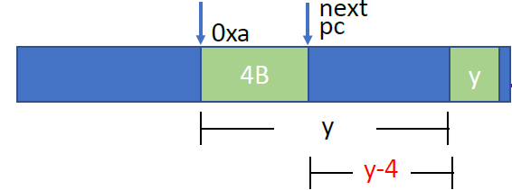{ width=320 }

    0x4c50f4 = 0x40176b + 0x0c3989

4. 可执行文件：

    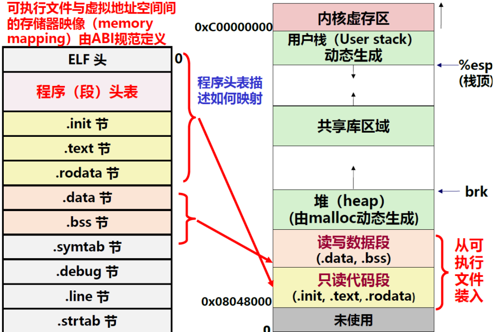

5. 动态链接：基本款就是 GOT，而豪华款 PLT 可以 lazy binding，用到哪个才会去链接，只有在第一次的时候才需要填表，后面再次用到的时候已有了。

    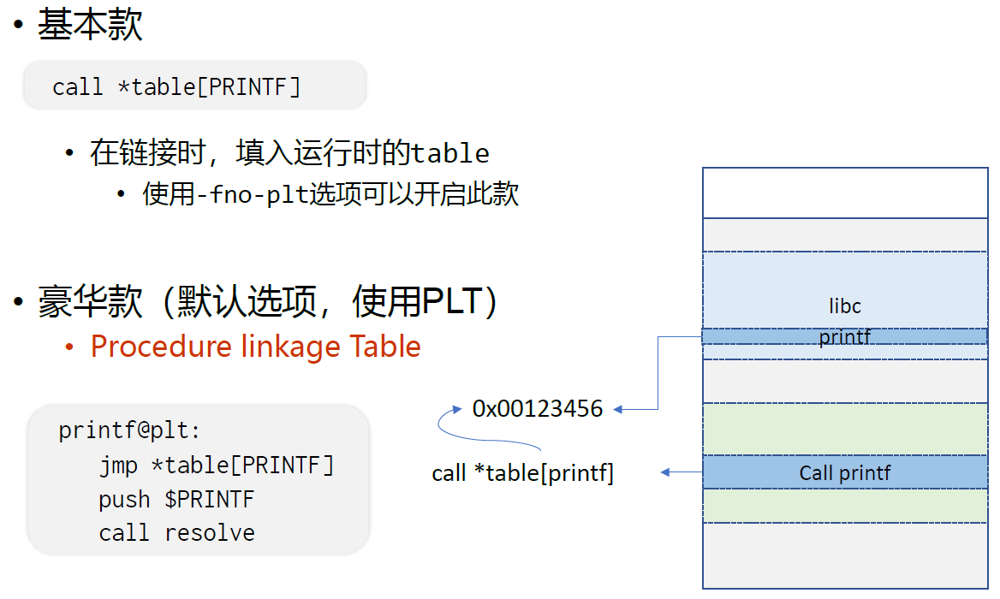

6. 静态链接 v.s 动态链接

    <div style="text-align: center;">
        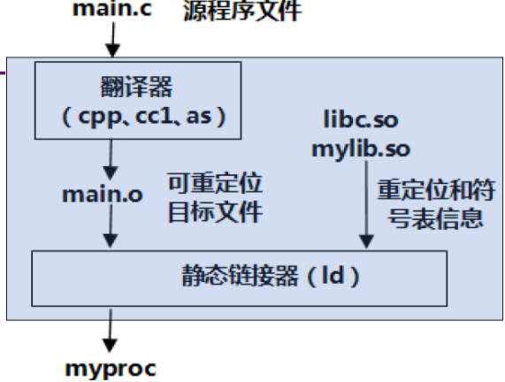{ width=300 }
        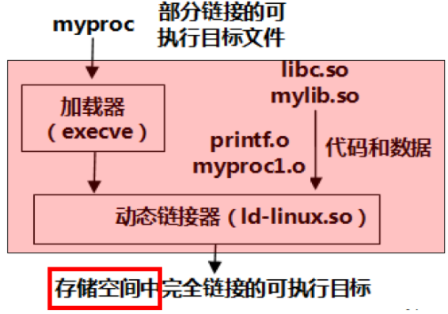{ width=300 }
    </div>

## Lecture 10 系统编程与基础设施
1. Differential Testing

    ```python
    import sys

    for i in range(int(sys.argv[1])):
        print('\n'.join(['si'] + [f'p ${r}' for r in ['eax', ...]]))
    ```

    ```bash
    N=10000

    diff <(python3 cmdgen.py $N | ./x86-nemu-datui img) \
        <(python3 cmdgen.py $N | ./x86-nemu img)
    ```

## Lecture 11 中断与分时多任务
