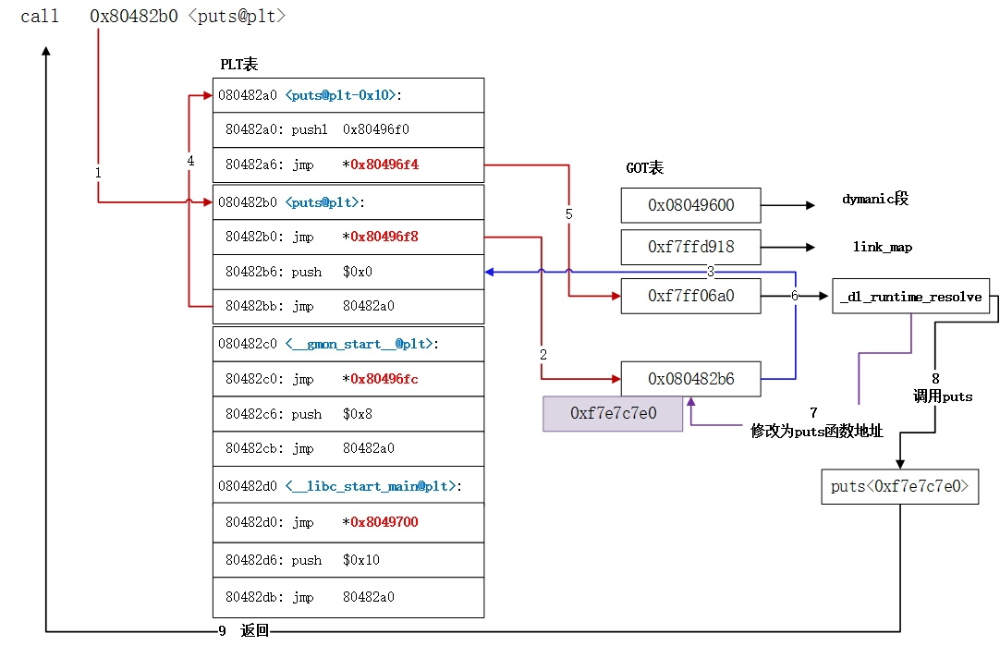

# 程序的表示、转换与链接

## 资料
* [课程视频](https://www.icourse163.org/learn/NJU-1001625001?tid=1474139493#/learn/content?type=detail&id=1262957763&cid=1301347968)

## Lec 1 计算机系统概述
1. 用系统思维分析问题
    - 案例一：ISO C90标准下，在32位系统上以下C表达式的结果是什么？➡️ <span style="color:blue;">**若同时存在无符号和带符号整数，则C编译器将带符号整数强制转换为无符号整数 (C语言中的“Integer Promotion”规则)</span>**

        { width=150 }

    ```c
    -2147483648 < 2147483647     ➡️ false
    // 编译器编译时，它把负号和后面的字面量2147483648是分开处理的
    // 按照C90标准，编译器会把2147483648看成一个无符号整数
    // 结果变成了左右均为无符号整数的对比
    // 10000000 00000000 00000000 00000000 < 01111111 11111111 11111111 11111111 ➡️ false
    // 注意：C99标准则是true
    ```
    ```c
    int i = -2147483648;
    i < 2147483647               ➡️ true
    // 左右均为带符号整数的对比
    ```
    ```c
    // 2147483647是在范围内的，被认为是带符号整数
    -2147483647 - 1 < 2147483647 ➡️ true
    ```

    

    - 案例二：当len为0时，返回值应该是0，但是在机器上执行时，却发生了访存异常。➡️ 将len改为int型即可。

    ```c
    sum(int a[], unsigned len)
    {
        int i, sum = 0;
        for (i = 0; i <= len - 1; i++)
            sum += a[i];
        return sum;
    }
    ```

    - 案例三：若x和y为int型，当x = 65535时，y = x*x, y的值为多少？➡️ y = -131071。

    - 案例四：对于任何int型变量x和y，(x > y) == (-x < -y) 总成立吗？➡️ 当x = -2147483648时，y任意(除-2147483648外) 时不成立。

    - 案例五：打印结果是什么？➡️ d = 0, x = 1072693248

    ```c
    // main.c
    int d = 100;
    int x = 200;
    int main()
    {
        p1();
        printf("d= %d, x= %d\n", d, x);
        return 0;
    }

    // p1.c
    double d;
    void p1()
    {
        d = 1.0;
    }
    // 两个同名全局变量 d 在不同编译单元中分别声明为不同类型，
    // 违反C语言的 单一定义规则（ODR），导致链接器将它们视为同一个变量操作。
    // 假设是小端存储：
    // 注意double d = 1.0 的二进制表示为：00 00 00 00 00 00 F0 3F（IEEE754小端）
    // 0|011 1111 1111| 0000 0000 0000 0000 0000 0000 0000 0000 0000 0000 0000 0000 0000
    // S|   Exponent  | Significand
    // 原内存 | 64 00 00 00 | C8 00 00 00 |
    // 写入后 | 00 00 00 00 | 00 00 F0 3F |

    ```

    

    - 案例六：当count = 2^30+1时，程序会发生什么情况？➡️ count * sizeof(int)会溢出，最终结果为4，导致堆heap中大量数据被破坏。

    ```c
    int copy_array(int *array, int count)
    {
        int i;
        // 在堆区申请一块内存
        int *myarray = (int *) malloc(count * sizeof(int));
        if (myarray == NULL)
            return -1;
        for (i = 0; i < count; i++)
            myarray[i] = array[i];
        return count;
    }
    ```

    - 案例七：objdump反汇编代码，得知除以-1被优化成取负指令neg，故未发生除法溢出；而a/b则是用除法指令IDIV实现的，虽然不生成OF标志，但是“除法错”异常#DE会触发SIGFPE信号。

    ```c
    int a = 0x80000000;
    int b = a / -1;
    printf("%d\n", b); // 输出结果为 -2147483648 
    // 注意0x80000000取负[各位取反，末位+1]依然是0x80000000
    ```

    ```c
    int a = 0x80000000;
    int b = -1;
    int c = a / b;
    printf("%d\n", c); // 输出结果为 "Floating point exception"
    // 32位系统能表示的范围是 -2147483648 ~ 2147483647，
    // 当a/b时，结果超出了这个范围，会触发“除法错”异常
    ```

    - 案例八：在IA-32上运行时，结果为a=0; 在x86-64上运行时，打印结果a是一个不确定值。原因是：
        - IA-32系统用的是栈来传递参数，先执行 fldl 将a从局部变量区装入ST(0)寄存器中，然后执行 fstpl 从 ST(0) 中存入参数区 EBP + 12。
        - x86-64系统用的是[128位的xmm寄存器](#xmm)来传递浮点数，因此a的值10实际上是放在%xmm里的，然而call printf时第二个参数a它从ESI中取打印参数进行处理，此时ESI里放的什么不确定。

    ```c
    #include <stdio.h>
    int main()
    {
        double a = 10;
        printf("a= %d\n", a);
        return 0;
    }
    // 0|10000000010|0100000000000000000000000000000000000000000000000000
    // S|  Exponent | Significand
    ```

    - 案例九：关键差别在于一条指令：fldl和fildl
        - fldl: 直接把a这个01序列当成浮点数打印出来。
        - fildl: 先把a看成int型，再转换成double型去打印。

    ```c
    #include <stdio.h>
    int main(int argc, char *argv[])
    {
        int a = 10;
        double *p = (double*)&a;
        printf("%f\n", *p);           // 结果为 0.000000  (fldl)
        printf("%f\n", (double(a)));  // 结果为 10.000000 (fildl)
        return 0;
    }
    ```

2. 为什么要学习计算机系统基础
    { type=application/pdf style="width:100%; min-height:70vh;" }

3. 计算机系统基本组成与基本功能
   { type=application/pdf style="width:100%; min-height:70vh;" }

4. 程序开发和执行过程简介
   { type=application/pdf style="width:100%; min-height:70vh;" }

5. 计算机系统层次结构
   { type=application/pdf style="width:100%; min-height:70vh;" }

6. 本课程的主要学习内容
   { type=application/pdf style="width:100%; min-height:70vh;" }

## Lec 2 数据的表示和存储
1. 数制与编码
    { type=application/pdf style="width:100%; min-height:70vh;" }

    十进制0.1对应分数1/10，其分母10无法表示为2的幂次（如2^n），转换为二进制时为0.0001100110011...（"0011"无限重复）

    ```
    0.1 × 2 = 0.2 → 整数位0，余0.2  
    0.2 × 2 = 0.4 → 整数位0，余0.4  
    0.4 × 2 = 0.8 → 整数位0，余0.8  
    0.8 × 2 = 1.6 → 整数位1，余0.6  
    0.6 × 2 = 1.2 → 整数位1，余0.2 → 回到初始状态，无限循环
    ```

2. 定点数的编码表示
    { type=application/pdf style="width:100%; min-height:70vh;" }

    - 注意只用到了原码、补码和移码：
        - 原码：无符号整数。
        - 补码：有符号整数。
        - 移码：浮点数的指数（阶码）。
        - 反码：不用。

3. C语言中的整数
    { type=application/pdf style="width:100%; min-height:70vh;" }

    

4. 浮点数的编码表示
   { type=application/pdf style="width:100%; min-height:70vh;" }

    <a id="float"></a>

    | Exponent       | Significand | 表示         |
    |----------------|-------------|-------------|
    | 全0            | 全0         | ±0          |
    | 全0            | nonzero     | 非规格化数   |
    | 1-254          | 任意        | 规格化数     |
    | 全1（即255）   | 全0         | ±∞          |
    | 全1（即255）   | nonzero     | NaN         |

   

5. 非数值数据的编码表示
   { type=application/pdf style="width:100%; min-height:70vh;" }

6. 数据宽度和存储容量的单位
   { type=application/pdf style="width:100%; min-height:70vh;" }

    !!! note "字 vs 字长"

        字和字长的概念不一样，32位系统的字长是32位，64位系统字长是64位，但字永远都是16位，字长要看机器是多少位的，其实也就是总线上能一次传输的位数，这里说的字长隐含的是指机器字长。

        | 字 | 数据宽度 |
        | ---- | ---- |
        | 字 (word) | 16位 |
        | 双字 (dword) | 32位 |
        | 四字 (qword) | 64位 |

7. 数据存储时的字节排列（小端是低位保存在低地址，高位保存在高地址）
   { type=application/pdf style="width:100%; min-height:70vh;" }

## Lec 3 运算电路基础
1. 数字逻辑电路基础
   { type=application/pdf style="width:100%; min-height:70vh;" }

    - 根据电路是否具有存储功能，将数字逻辑电路分为组合逻辑电路和时序逻辑电路：
        - 组合逻辑电路：没有存储功能，输出仅依赖于输入。
        - 时序逻辑电路：具有存储功能，输出不仅依赖于输入，还依赖于存储单元的当前状态。

2. 从C表达式到逻辑电路
   { type=application/pdf style="width:100%; min-height:70vh;" }

3. C语言中的各类运算
   { type=application/pdf style="width:100%; min-height:70vh;" }

4. 整数加减运算
   { type=application/pdf style="width:100%; min-height:70vh;" }

## Lec 4 乘除运算及浮点数运算
1. 整数乘法运算
   { type=application/pdf style="width:100%; min-height:70vh;" }

2. 整数除法运算
   { type=application/pdf style="width:100%; min-height:70vh;" }

3. 浮点数运算
   { type=application/pdf style="width:100%; min-height:70vh;" }

    - 为什么整数除0会发生异常，而浮点数除0不会发生异常？
        - 整数除0：无法通过一个01序列来表示结果。
        - 浮点数除0：结果可以用无穷大来表示。[浮点数的表示](#float)
    - 解释了大数吃小数的现象，因为计算前总要对阶，小数对完阶后会变成0，所以被吃掉。

## Lec 5 IA-32指令系统概述
1. 程序转换概述
   { type=application/pdf style="width:100%; min-height:70vh;" }

2. IA-32指令系统概述
   { type=application/pdf style="width:100%; min-height:70vh;" }

## Lec 6 IA-32指令类型
1. 传送指令 
    - `mov %esp, %ebp` 是 R[esp] ➡️ R[ebp]
    - `cmpl %ecx, %edx` 是 R[edx] - R[ecx] 判断，若大于则跳转 `jg .L2`
    - b: 8bits, w: 16bits (字), l: 32bits (双字), q: 64bits (四字)

    { type=application/pdf style="width:100%; min-height:70vh;" }

2. 定点算术运算指令
   { type=application/pdf style="width:100%; min-height:70vh;" }

3. 按位运算指令
   { type=application/pdf style="width:100%; min-height:70vh;" }

4. 控制转移指令
    - jb/ja：无符号数的比较
        - b: below
        - a: above
    - jl/jg: 有符号数的比较
        - l: less
        - g: greater

    { type=application/pdf style="width:100%; min-height:70vh;" }

5. x87浮点处理指令
    - 解释了 `a = f(10); b = f(10);` 和 `a = f(10); b = f(10); c = f(10);` 结果不同的原因。
        - 前者a计算完后被 store 到内存中去了，有精度损失，比较的时候load回来直接和b比较，b是计算完后在ST(0)里，无精度损失。
        - 后者a和b计算完后都被 store 到内存中去了，都有精度损失。
    
    { type=application/pdf style="width:100%; min-height:70vh;" }

6. MMX及SSE指令集
   { type=application/pdf style="width:100%; min-height:70vh;" }

## Lec 7 C语言语句的机器级表示
1. 过程(函数)调用的机器级表示
    - EBP: 帧指针寄存器，指向当前栈帧的底部。
    - ESP: 栈指针寄存器，指向当前栈帧的顶部。
    - 长出一个新的栈：

        ```asm
        pushl %ebp        # 保存旧的帧指针
        movl  %esp, %ebp  # 设置新的帧指针
        subl  $24, %esp   # 为局部变量分配空间 (长出新的栈)
        ```

    - 退栈：

        ```asm
        movl  %ebp, %esp  # 恢复旧的栈指针
        popl  %ebp        # 恢复旧的帧指针
        ```

    - 返回值(整数)总在EAX中，若是返回浮点数，则在ST(0)这个寄存器中。
    - 入口参数1在 EBP + 8 中，入口参数2在 EBP + 12 中，入口参数3在 EBP + 16 中。EBP + 4 是返回地址。
    - 调用者保存：EAX、ECX、EDX，被调用者保存：EBX、ESI、EDI。

    { type=application/pdf style="width:100%; min-height:70vh;" }

    - 调用过程举例：参数入栈，返回地址入栈

    

    - 递归不仅要不停的长栈，空间效率低，而且每一次函数调用都需要准备好入口参数和返回地址，要执行多余的函数调用准备指令，时间效率也低！

2. 选择和循环语句的机器级表示
   { type=application/pdf style="width:100%; min-height:70vh;" }

## Lec 8 复杂数据类型的机器级表示
1. 数组和指针类型的分配和访问
    - 在讨论指向int型数组的指针的时候，指针 + 1 实际上地址是 + 4，指向的是下一个数组元素。
    - &A[i] - A 得到的是整数类型 (ptrdiff_t，通常为int)，而非指针类型。
        - 指针减法规则：两个int*类型的指针相减，结果表示两者之间的元素个数，类型为ptrdiff_t（本质上是整数，如int）
        - 假设A的首地址为base_addr，则&A[i]的地址为`base_addr + i * sizeof(int)`
        - 表达式&A[i] - A等价于`(base_addr + i * sizeof(int) - base_addr) / sizeof(int) = i`，即结果为整数i
    - 二维数组里：num == num[0] == &num[0][0]

    { type=application/pdf style="width:100%; min-height:70vh;" }

2. 结构和联合数据类型的分配和访问
    - 通常按地址传递，而不是按值传递：
        - 按值传递：开销大，因为它需对结构体成员整体从静态区复制到栈中，需要很多条mov或其他指令，从而执行时间更长，并占更多栈空间和代码空间。
        - 按地址传递：传递时不需要进行结构体的复制。

    { type=application/pdf style="width:100%; min-height:70vh;" }

3. 数据的对齐存放
    - &(((ts*)0)->f1): 
        - 作用是计算结构体ts中成员f1的偏移量（offset）
        - 由于结构体起始地址为0，此时f1的地址值等于该成员在结构体中的偏移量（以字节为单位）
        - 当通过0地址计算结构体成员偏移量（如&(((ts*)0)->f1)）时，编译器可能仅在编译时计算偏移量，无需实际访问内存，因此不会访存异常

    { type=application/pdf style="width:100%; min-height:70vh;" }

4. 越界访问和缓冲区溢出攻击
   { type=application/pdf style="width:100%; min-height:70vh;" }


## Lec 9 x86-64指令系统
1. x86-64指令系统概述
    - 新增了很多寄存器，因此不需要再像IA-32那样通过栈（EBP + 8, EBP + 12, EBP + 16...）来传递参数了，直接通过寄存器来传递参数。参数一在 rdi 中，参数二在 rsi 中，参数三在 rdx 中，参数四在 rcx 中。
    - movl == movzlq

    { type=application/pdf style="width:100%; min-height:70vh;" }

2. x86-64的基本指令
   { type=application/pdf style="width:100%; min-height:70vh;" }

3. x86-64的过程调用 
    <a id="xmm"></a>

    { type=application/pdf style="width:100%; min-height:70vh;" }

## Lec 10 链接概述和目标文件格式
1. 可执行文件生成概述
   { type=application/pdf style="width:100%; min-height:70vh;" }

2. 目标文件格式概述
   { type=application/pdf style="width:100%; min-height:70vh;" }

3. ELF可重定位目标文件
   { type=application/pdf style="width:100%; min-height:70vh;" }

4. ELF可执行目标文件
   { type=application/pdf style="width:100%; min-height:70vh;" }

## Lec 11 符号及符号解析
1. 符号及符号表

    - 凡是前面有一个符号来说明它类型的，都是定义，如 `int a = 10;` 其他则是引用。
    - 此外局部变量不是符号，不会出现在符号表里，链接器也不关心局部变量。
    - 若一个符号被定义为一次强符号和多次弱符号，则按强定义为准，这就导致可能在别的c文件里改写了这个符号的值，造成意想不到的结果。

    { type=application/pdf style="width:100%; min-height:70vh;" }

2. 静态链接和符号解析
    - 被链接模块应按调用顺序指定，好的做法是将静态库放在命令行的最后，否则一开始扫描的时候就会丢弃库，认为U是空的，造成链接错误。
    - 链接操作：
        - ① 符号解析：把符号的引用和符号的定义建立关联。符号解析后：
            - E: 有main.0和swap.o两个模块, .o文件中的重定位条目中有重定位信息：符号引用的位置、绑定的定义符号名、重定位类型
            - D: 有所有定义的符号
            - U: 空
        - ② 重定位：同节合并，确定地址，修改引用。有两种最基本的重定位类型
            - R_386_32: 绝对地址
            - R_386_PC32: PC相对地址

    { type=application/pdf style="width:100%; min-height:70vh;" }

## Lec 12 重定位及动态链接
1. 符号的重定位
   { type=application/pdf style="width:100%; min-height:70vh;" }

2. 可执行文件的加载
   { type=application/pdf style="width:100%; min-height:70vh;" }

3. 共享库和动态链接
    - 加载时动态链接(load-time linking): 由动态链接器(ld-linux.so)自动处理
    

        注意此图中myproc中只包含了printf的重定位信息，并没有将printf.o包含进来，因此myproc并不是很大，在动态链接时才由动态链接器将printf.o链接进来。

    - 运行时动态链接(run-time linking): 通过调用dlopen()等接口来实现

    { type=application/pdf style="width:100%; min-height:70vh;" }

4. 动态链接的过程详解
    - [参考链接1](https://blog.csdn.net/linyt/category_6267121.html)
    - [参考链接2](https://www.yuque.com/hxfqg9/bin/ug9gx5#5dvaL)，[视频](https://www.bilibili.com/video/BV1a7411p7zK/?spm_id_from=333.1387.favlist.content.click&vd_source=2a33d03ec3e67e46971208a7faa0dcda)

    以下举例说明，test.c：

    ```c
    #include <stdio.h>

    void print_banner()
    {
        printf("Welcome to World of PLT and GOT\n");
    }

    int main(void)
    {
        print_banner();

        return 0;
    }
    ```

    编译：`gcc -Wall -g -o test.o -c test.c -m32`，链接：`gcc -o test test.o -m32`。

    反汇编：`objdump -d test.o`如下，注意到`7:    e8 fc ff ff ff          call   8 <print_banner+0x8>`，printf() 函数是在 glibc 动态库里面的，只有当程序运行起来的时候才能确定地址，所以此时的 printf() 函数先用 `fc ff ff ff` 也就是有符号数的 -4 代替。

    ```bash
    linux:~$ objdump -d test.o

    test.o:     file format elf32-i386


    Disassembly of section .text:

    00000000 <print_banner>:
    0:    55                      push   %ebp
    1:    89 e5                   mov    %esp,%ebp
    3:    53                      push   %ebx
    4:    83 ec 04                sub    $0x4,%esp
    7:    e8 fc ff ff ff          call   8 <print_banner+0x8>
    c:    05 01 00 00 00          add    $0x1,%eax
    11:   83 ec 0c                sub    $0xc,%esp
    14:   8d 90 00 00 00 00       lea    0x0(%eax),%edx
    1a:   52                      push   %edx
    1b:   89 c3                   mov    %eax,%ebx
    1d:   e8 fc ff ff ff          call   1e <print_banner+0x1e>
    22:   83 c4 10                add    $0x10,%esp
    25:   90                      nop
    26:   8b 5d fc                mov    -0x4(%ebp),%ebx
    29:   c9                      leave
    2a:   c3                      ret

    0000002b <main>:
    2b:   55                      push   %ebp
    2c:   89 e5                   mov    %esp,%ebp
    2e:   83 e4 f0                and    $0xfffffff0,%esp
    31:   e8 fc ff ff ff          call   32 <main+0x7>
    36:   05 01 00 00 00          add    $0x1,%eax
    3b:   e8 fc ff ff ff          call   3c <main+0x11>
    40:   b8 00 00 00 00          mov    $0x0,%eax
    45:   c9                      leave
    46:   c3                      ret

    Disassembly of section .text.__x86.get_pc_thunk.ax:

    00000000 <__x86.get_pc_thunk.ax>:
    0:   8b 04 24                mov    (%esp),%eax
    3:   c3                      ret
    ```

    **注意：一旦编译完成，代码段是不可修改的，只能修改数据段。因此，动态链接时 printf函数地址只能回写到数据段内，而不能回写到代码段上。**既然如此，那在编译阶段就已生成好的call指令，怎么感知重定位好的数据段内容（printf的实际地址）呢？

    答案是：链接器生成一段额外的小代码片段，通过这段代码来获取printf函数地址，并完成对它的调用。链接器生成额外的伪代码如下：

    ```asm
    .text
    ...

    // 调用printf的call指令
    call printf_stub
    ...

    printf_stub:
        mov rax, [printf函数的储存地址] // 获取printf重定位之后的地址
        jmp rax // 跳过去执行printf函数


    .data
    ...
    printf函数的储存地址：
    　　这里储存printf函数重定位后的地址
    ```

    

    从上面的反汇编代码也知道：c + fc ff ff ff = 12 + -4 = 8，即 call 的函数地址是 8。(要call跳转到的地址 = 下一条 pc 的地址 + 本指令相对于下一条 pc 的 offset)

    总体来说，需要动态链接的函数需要两个东西：

    1. 用来存放外部函数地址的数据表[在数据段]          ➡️ 全局偏移表 (GOT, Global Offset Table)
    2. 用来获取数据段记录的外部函数地址的代码[在代码段] ➡️ 程序链接表 (PLT，Procedure Link Table)

    

    如果可执行文件调用的动态库函数很多，那在进程初始化时都对这些函数做地址解析和重定位工作，会大大增加进程的启动时间。所以Linux提出**延迟绑定机制**，只有动态库函数在被调用时，才会地址解析和重定位工作。

    在想要调用的函数xxx没有被调用过，想要调用它的时候，是按照这个过程来调用的:

    xxx@plt -> xxx@got -> xxx@plt -> 公共@plt -> _dl_runtime_resolve

    - 第一次调用：将printf址解析出来，并重定位回printf@got项内。
    - 第二次调用：通过printf@got直接跳到printf函数执行。

    ```c
    //一开始没有重定位的时候将 printf@got 填成 lookup_printf 的地址
    void printf@plt()
    {
    address_good:
        jmp *printf@got   
    lookup_printf:
        调用重定位函数查找 printf 地址，并写到 printf@got
        goto address_good;//再返回去执行address_good
    }
    ```

    通过 `objdump -d test > test.asm` 可以看到其中 plt 表项有三条指令

    ```asm
    Disassembly of section .plt:

    00001020 <common@plt-0x10>:
        1020:	ff b3 04 00 00 00    	push   0x4(%ebx)  # 调用参数压栈
        1026:	ff a3 08 00 00 00    	jmp    *0x8(%ebx) # 进程未运行时是0x0，进程运行起来后是_dl_runtime_resolve函数的地址
        102c:	00 00                	add    %al,(%eax) # _dl_runtime_resolve函数的地址是运行起来后由动态链接器ld-linux.so写进去的
        ...

    00001030 <__libc_start_main@plt>:
        1030:	ff a3 0c 00 00 00    	jmp    *0xc(%ebx)
        1036:	68 00 00 00 00       	push   $0x0
        103b:	e9 e0 ff ff ff       	jmp    1020 <_init+0x20>

    00001040 <puts@plt>:
        1040:	ff a3 10 00 00 00    	jmp    *0x10(%ebx)       # 第一次是 jmp 到 1046，即下一条指令；之后则是找到的 printf 的地址
        1046:	68 08 00 00 00       	push   $0x8              # 调用参数压栈，这里是函数id，动态链接器通过它就可以知道是要解析哪个函数了
        104b:	e9 d0 ff ff ff       	jmp    1020 <_init+0x20> # jmp to common@plt
    ```

    这里将第一个plt表项修改成 common@plt 了，objdump -d 输出结果会使用错误的符号名，那是因为该项是没有符号的，而objdump输出时给它改成了离它最近的一项同名的符号，为了避免误解这里手动改成了 common，随着不断深入学习会发现确实可以叫 common。

    其中除第一个表项以外，plt 表的第一条都是跳转到对应的 got 表项，而 got 表项的内容我们可以通过 gdb 来看一下：
    
    - 如果函数还没有执行过，这里的地址是对应 plt 表项的下一条指令，例如 push 0x8。
    - 如果函数已经执行过了，这里的地址是函数的实际地址

    （说一下怎么查看，先 gdb test 然后 b main，再 run， 再 x/x 地址 就可以）

    所以第一次执行该函数时，jmp 到的 got 表项里放的是当前指令的下一条指令的地址，而下一条指令是将参数压栈，继续 jmp，跳到的是 common@plt，也就是说最后所有plt都跳转到common@plt中执行，这是动态链接做符号解析和重定位的公共入口，而不是每个plt表都有重复的一份指令，为了减少PLT指令条数，Linux提炼成了公共函数。

    目前还有三个问题：

    - _dl_runtime_resolve 是怎么知道要查找 printf 函数的
    - _dl_runtime_resolve 找到 printf 函数地址之后，它怎么知道回填到哪个GOT表项
    - 到底 _dl_runtime_resolve 是什么时候被写到GOT表的

    前２个问题，只需要一个信息就可以了知道，这个信息就在藏在在函数对应的xxx@plt表中，以puts@plt为例：

    ```asm
    puts@plt>:
        jmp  *0x10(%ebx)
        push $0x8
        jmp  common@plt
    ```

    第二条指令就是秘密所在，每个xxx@plt的第二条指令push的操作数都是不一样的，它就相当于函数的id，动态链接器通过它就可以知道是要解析哪个函数了。

    真有这么神吗？这不是神，是编译器和动态链接器故意安排的巧合罢了。使用 `readelf -r test` 命令可以查看test可执行文件中的重定位信息，其中.rel.plt这一段就大有秘密：

    ```asm
    $ readelf -r test
    ....
    Relocation section '.rel.plt' at offset 0x3c4 contains 2 entries:
    Offset     Info    Type              Sym.Value  Sym. Name
    00003fe4  00000107 R_386_JUMP_SLOT   00000000   __libc_start_main@GLIBC_2.34
    00003fe8  00000407 R_386_JUMP_SLOT   00000000   puts@GLIBC_2.0
    # Offset里的 00003fe8 就是 0x10(%ebx) 对应的地址
    ```

    再看看各函数plt指令中的push操作数：(.rel.plt 表的一个表项为 8 字节，因此 0x0代表第一项，0x8代表第二项)

    - __libc_start_main 对应 push 0x0
    - printf 对应 push 0x8

    这2个push操作数刚好对应2个函数在.rel.plt段的偏移量，在_dl_runtime_resolve函数内，根据这个偏移量和.rel.plt段的信息，就知道要解析的函数是什么。再看看.rel.plt最左边的Offset字段，它就是GOT表项的地址，也即_dl_runtime_resolve做完符号解析之后，重定位找到的实际函数地址回写的地方。

    第三个问题：到底_dl_runtime_resolve是什么时候被写到GOT表的?

    答案很简单，可执行文件在Linux内核通过exeve装载完成之后，不直接执行，而是先跳到动态链接器（ld-linux.so）执行。在ld-linux.so里将_dl_runtime_resolve地址写到GOT表项内。

    事实上，不单单是预先写_dl_runtime_resolve地址到GOT表项中，在i386架构下，除了每个函数占用一个GOT表项外，GOT表项还保留了3个公共表项，也即got的前3项，分别保存：

    - got[0]：本ELF动态节(.dynamic节）的首地址，该节包含动态链接器需要的基本信息，如符号表位置、重定位表位置等
    - got[1]：本ELF的link_map数据结构描述符地址
    - got[2]：_dl_runtime_resolve函数的地址

    动态链接器在加载完ELF之后，都会将这 3 个地址写到GOT表的前3项。

    **最后总结下，**
    
    **编译时的PLT和GOT关系图：**

    

    PLT表结构有以下特点：

    - PLT表中的第一项为公共表项，剩下的是每个动态库函数为一项（当然每项是由多条指令组成的，jmp *0xXX这条指令是所有plt的开始指令）
    - 每项PLT都从对应的GOT表项中读取目标函数地址

    GOT表结构有以下特点：

    - GOT表中前3个为特殊项，分别用于保存 .dynamic节地址、本ELF的link_map数据结构地址和_dl_runtime_resolve函数地址；但在编译时，无法获取知道link_map地址和_dl_runtime_resolve函数地址，所以编译时填零地址，进程启动时由动态链接器进行填充
    - 3个特殊项后面依次是每个动态库函数的GOT表项

    如果将PLT和GOT抽象起来描述，可以写成以下的伪代码：

    ```asm
    plt[0]:
        pushl got[1]
        jmp  *got[2]

    plt[n]:                  // n >= 1
        jmp *got[n+2]        // GOT前3项为公共项，第3项开始才是函数项，plt[1]对应的GOT[3]，依次类推
        push (n-1)*8
        jmp plt[0]

    got[0]  = address of .dynamic section
    got[1]  = address of link_map object (编译时填充0)
    got[2]  = address of _dl_runtime_resolve function (编译时填充为0)
    got[n+2]  = plt[n] + 6 (即plt[n]代码片段的第二条指令)
    ```

    **进程起动后的PLT和GOT关系图：**

    PLT属于代码段，在进程加载和运行过程都不会发生改变，PLT指向GOT表的关系在编译时已完全确定，唯一能发生变化的是GOT表。

    Linux加载进程时，通过execve系统调用进入内核态，将ELF加载到内存，然后返回用户态执行。返回用户态时，它的控制权并不是交给可执行文件，而是给动态链接器去完成一些基础的功能，比如上述的GOT[1]，GOT[2]的填写就是这个阶段完成的。下图是动态链接器填完GOT[1]，GOT[2]后的GOT图：

    

    动态链接器怎么知道GOT的首地址？这个秘密就藏在ELF的.dynamic段里面，详见下面 `readelf -d test`输出结果中的PLTGOT项：

    ```asm
    linux$ readelf -d test

    Dynamic section at offset 0x600 contains 24 entries:
    Tag        Type                         Name/Value
    0x00000001 (NEEDED)                     Shared library: [libc.so.6]
    0x0000000c (INIT)                       0x8048274
    0x0000000d (FINI)                       0x8048488
    0x00000019 (INIT_ARRAY)                 0x80495f4
    0x0000001b (INIT_ARRAYSZ)               4 (bytes)
    0x0000001a (FINI_ARRAY)                 0x80495f8
    0x0000001c (FINI_ARRAYSZ)               4 (bytes)
    0x00000004 (HASH)                       0x8048168
    0x00000005 (STRTAB)                     0x80481e0
    0x00000006 (SYMTAB)                     0x8048190
    0x0000000a (STRSZ)                      74 (bytes)
    0x0000000b (SYMENT)                     16 (bytes)
    0x00000015 (DEBUG)                      0x0
    0x00000003 (PLTGOT)                     0x80496ec # 🏠 address of PLTGOT
    0x00000002 (PLTRELSZ)                   24 (bytes)
    0x00000014 (PLTREL)                     REL
    0x00000017 (JMPREL)                     0x804825c
    0x00000011 (REL)                        0x8048254
    0x00000012 (RELSZ)                      8 (bytes)
    0x00000013 (RELENT)                     8 (bytes)
    0x6ffffffe (VERNEED)                    0x8048234
    0x6fffffff (VERNEEDNUM)                 1
    0x6ffffff0 (VERSYM)                     0x804822a
    0x00000000 (NULL)                       0x0
    ```

    **动态重定位执行过程**:

    Linux 动态链接器提供动态重位功能，所有外部函数只有调用时才做重定位，实现延迟绑定功能。下面是以调用puts函数为例画出了整个动态重定位的执行过程：在 _dl_runtime_resolve函数内完成puts符号查找后，将该函数地址地址重定位到对应的GOT表项，并调用。

    

    第一次调用：

    

    第二次调用：

    