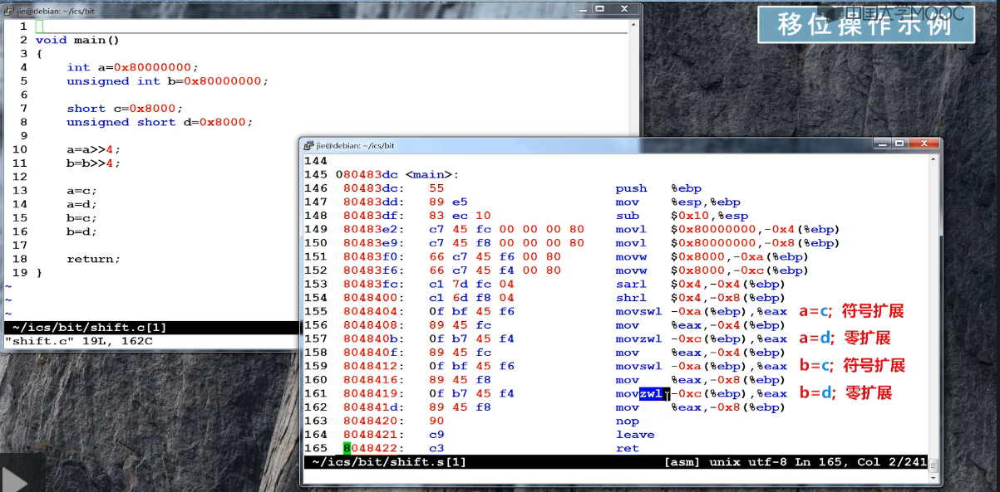
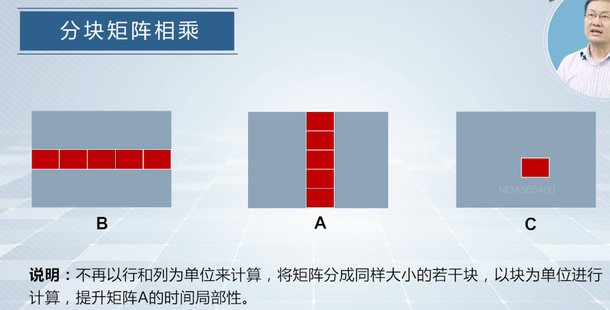
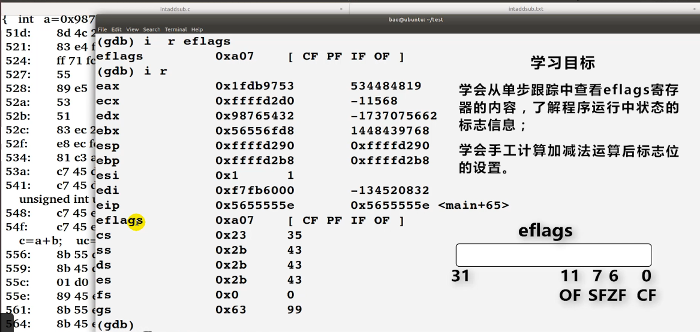
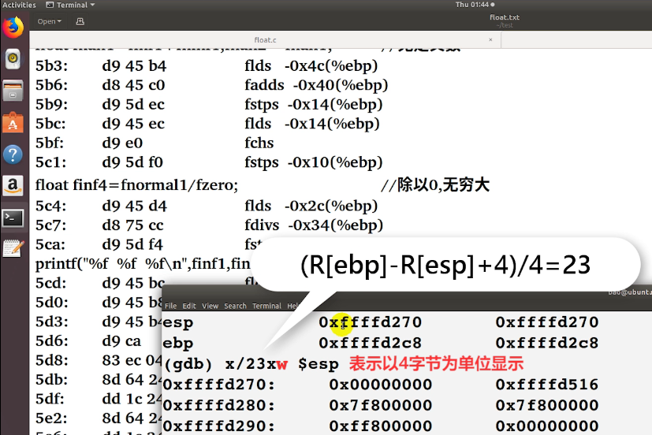

# 编程与调试实践

## 资料
* [课程视频](https://www.icourse163.org/learn/NJU-1449521162?tid=1474200460#/learn/content?type=detail&id=1262322703&sm=1)

## Lec 1 实验与开发环境安装和使用
1. 从程序员角度认识系统
    { type=application/pdf style="width:100%; min-height:58vh;" }

2. 虚拟机、Linux及其上实验环境的安装
    { type=application/pdf style="width:100%; min-height:58vh;" }

    debian-9.9.0-i386-xfce-CD-1.iso下载：https://mirrors.huaweicloud.com/debian-cd/9.9.0/i386/iso-cd/ 虚拟机不如使用 wsl。

3. 基本实验工具的使用
    { type=application/pdf style="width:100%; min-height:58vh;" }

## Lec 2 C语言编程与实践
1. ppt:
    { type=application/pdf style="width:100%; min-height:58vh;" }

2. 执行符号扩展还是零扩展：由等号右边的变量类型决定，与等号左边无关。
    

3. Kahan累加算法：
    - 主要思想：设法计算出每次累加所带来的舍入误差，并将其添加在下一次的加数上，这样就可以获得更为准确的结果。
    - 使用前提：尽量在浮点数数值相近时进行加减计算才能充分利用有效位数。

    各参数含义：

    - c: 累加产生的误差
    - y: 经过误差修正后的加数
    - t: 经过本次累加后的和
    - t-sum: 本次累加实际加上的加数

4. 分块矩阵乘法
   

    ```C
    #include <stdio.h>
    #include <stdlib.h>
    #include <sys/time.h>
    #include <math.h>
    void multMat(int n, float *A, float *B, float *C, int blocksize) 
    {
        int i, j, k, b_i, b_j, b_k;
        register float temp = 0;
        int block_num = n / blocksize;
        printf("block_num = %d\n", block_num);
        /* This is ijk loop order */
        for (b_i = 0; b_i < block_num; b_i++) {
            for (b_j = 0; b_j < block_num; b_j++) {
                for (b_k = 0; b_k < block_num; b_k++) {
                    for (i = 0; i < blocksize; i++) {
                        for (j = 0; j < blocksize; j++) {
                            temp = 0;
                            for (k = 0; k < blocksize; k++) {
                                temp += A[(b_i * blocksize + i) * n + (b_k * blocksize + k)] * 
                                        B[(b_k * blocksize + k) * n + (b_j * blocksize + j)];
                            }
                            C[(b_i * blocksize + i) * n + (b_j * blocksize + j)] += temp;
                        }
                    }
                }
            }
        }
    }

    void multMat3(int n, float *A, float *B, float *C) 
    {
        int i, j, k;
        register float temp = 0;
        for (i = 0; i < n; i++) {
            for (j = 0; j < n; j++) {
                temp = 0;
                for (k = 0; k < n; k++) {
                    temp += A[i * n + k] * B[k * n + j];
                }
                C[i * n + j] = temp;
            }
        }
    }

    int main(int argc, char **argv) 
    {
        int nmax = 2048, i, j;
        int blocksize = 16;
        float temp = 0;
        double seconds;

        float *A = (float *)malloc(nmax * nmax * sizeof(float));
        float *B = (float *)malloc(nmax * nmax * sizeof(float));   
        float *C = (float *)malloc(nmax * nmax * sizeof(float));
        float *D = (float *)malloc(nmax * nmax * sizeof(float));

        struct timeval start, end;

        for(i = 0; i < nmax * nmax; i++) A[i] = drand48() * 2 - 1;
        for(i = 0; i < nmax * nmax; i++) B[i] = drand48() * 2 - 1;
        for(i = 0; i < nmax * nmax; i++) C[i] = 0;
        for(i = 0; i < nmax * nmax; i++) D[i] = 0;

        gettimeofday(&start, NULL);
        multMat3(nmax, A, B, D);
        gettimeofday(&end, NULL);

        seconds = (end.tv_sec - start.tv_sec) + 1.0e-6 *(end.tv_usec - start.tv_usec);
        printf("n = %d, time = %.3f seconds\n", nmax, seconds);

        gettimeofday(&start, NULL);
        multMat(nmax, A, B, C, blocksize);
        gettimeofday(&end, NULL);
        
        seconds = (end.tv_sec - start.tv_sec) + 1.0e-6 *(end.tv_usec - start.tv_usec);
        printf("n = %d, blocksize = %d, time = %.3f seconds\n", nmax, blocksize, seconds);
        
        for (i = 0; i < nmax; i++)
            for (j = 0; j < nmax; j++)
                temp += (C[i * nmax + j] - D[i * nmax + j]) * (C[i * nmax + j] - D[i * nmax + j]);
        printf("error = %.4f\n", temp);

        free(A);
        free(B);
        free(C);
        free(D);
        
        return 0;
    }
    ```

    output:
    ```shell
    linux$ ./matrixMB 
    n = 2048, time = 90.180 seconds
    block_num = 128
    n = 2048, blocksize = 16, time = 26.730 seconds
    error = 0.0007
    ```

5. 信号处理函数与setjmp/longjmp

    ```C
    #include <stdio.h>
    #include <setjmp.h>
    #include <signal.h>
    #include <unistd.h>

    sigjmp_buf buf;

    void FLPhandler(int sig) 
    {
        printf("I am in FLPhandler...\n");
        siglongjmp(buf, 1);
    }

    int main()
    {
        int a, t;
        signal(SIGFPE, FLPhandler);

        if (sigsetjmp(buf, 1) == 0) 
        {
            printf("starting\n");
            a = 100;
            t = 0;
            a = a / t;
        } 
        else 
        {
            printf("I am still alive...\n");
        }
        return 0;
    }
    ```

    output:
    ```shell
    linux$ ./signal 
    starting
    I am in FLPhandler...
    I am still alive...
    ```

    <a id="setjmp_longjmp"></a>

       { type=application/pdf style="width:100%; min-height:58vh;" }

## Lec 3 数据的存储与运算
1. 真值与机器数:
    { type=application/pdf style="width:100%; min-height:58vh;" }

2. 数据的宽度与存储
    { type=application/pdf style="width:100%; min-height:58vh;" }

3. 数据类型的转换
    { type=application/pdf style="width:100%; min-height:58vh;" }

    整数和浮点数之间的转换：要进行数据编码格式上的转换，而不是机器数上的直接复制。

    - 补码 -> float 编码 -> 补码

    ```C
    #include "stdio.h"
    int main()
    {   
        int i1 = 0x7fffffff, i2, itemp;
        float f1 = 0x987654321, f2, ftemp;
        ftemp = i1;
        i2 = ftemp;  // i2 = (int)(float)i1;
        itemp = f1;
        f2 = itemp;  // f2 = (float)(int)f1;
        // 注意在某些编译优化选项下，注释里的代码i1和i2会相等，f1和f2会相等
        printf("i1 = %d, i2  = %d, f1 = %f, f2 = %f\n", i1, i2, f1, f2);
        // i1 ≠ i2: 因为i1转换为浮点数ftemp时做过+1的近似处理，精度损失
        // f1 ≠ f2: 因为转换过程中有溢出，36位 -> 32 位
    }
    ```

    output:
    ```shell
    linux$./type_conversion
    i1 = 2147483647, i2  = -2147483648, f1 = 40926265344.000000, f2 = -2147483648.000000
    ```

4. 整数加减运算
    { type=application/pdf style="width:100%; min-height:58vh;" }

    

5. 浮点数的表示和运算
    { type=application/pdf style="width:100%; min-height:58vh;" }

     显示栈帧里的局部变量：
     

## Lec 4 程序的机器级表示
1. 传送指令
   { type=application/pdf style="width:100%; min-height:58vh;" }

2. 📌 整数加减运算指令
    { type=application/pdf style="width:100%; min-height:58vh;" }

3. 📌 整数乘法指令
    { type=application/pdf style="width:100%; min-height:58vh;" }

4. 📌 控制转移指令
    { type=application/pdf style="width:100%; min-height:58vh;" }

5. 📌 栈和过程调用
    { type=application/pdf style="width:100%; min-height:58vh;" }

6. 📌 缓冲区溢出
    { type=application/pdf style="width:100%; min-height:58vh;" }

## Lec 5 二进制程序逆向工程
1. ppt:
   { type=application/pdf style="width:100%; min-height:58vh;" }

2. 实验文档
   { type=application/pdf style="width:100%; min-height:58vh;" }

3. phase_0:

    ```asm
    0804946f <phase_0>:
    804946f:	55                   	push   %ebp
    8049470:	89 e5                	mov    %esp,%ebp
    8049472:	83 ec 08             	sub    $0x8,%esp
    8049475:	83 ec 08             	sub    $0x8,%esp
    8049478:	68 98 a1 04 08       	push   $0x804a198
    804947d:	ff 75 08             	push   0x8(%ebp)
    8049480:	e8 52 07 00 00       	call   8049bd7 <strings_not_equal>
    8049485:	83 c4 10             	add    $0x10,%esp
    8049488:	85 c0                	test   %eax,%eax
    804948a:	74 0c                	je     8049498 <phase_0+0x29>
    804948c:	e8 ae 09 00 00       	call   8049e3f <explode_bomb>
    8049491:	b8 00 00 00 00       	mov    $0x0,%eax
    8049496:	eb 05                	jmp    804949d <phase_0+0x2e>
    8049498:	b8 01 00 00 00       	mov    $0x1,%eax
    804949d:	c9                   	leave
    804949e:	c3                   	ret
    ```

    重点关注0x804a198地址处的字符串内容，它即是我们要比较的字符串，不相等则炸弹爆炸：

    ```shell
    (gdb) b *0x8049480
    Breakpoint 1 at 0x8049480
    (gdb) r
    Breakpoint 1, 0x08049480 in phase_0 ()
    (gdb) x/1s 0x804a198
    0x804a198:      "Disks are constructed from platters."
    ```

4. phase_1:

    ```asm
    0804949f <phase_1>:
    804949f:	55                   	push   %ebp
    80494a0:	89 e5                	mov    %esp,%ebp
    80494a2:	83 ec 28             	sub    $0x28,%esp
    80494a5:	c7 45 f4 f6 cc 4e 1a 	movl   $0x1a4eccf6,-0xc(%ebp)
    80494ac:	db 45 f4             	fildl  -0xc(%ebp)
    80494af:	dd 5d e8             	fstpl  -0x18(%ebp)
    # 用整型常量0x1a4eccf6对-0x18(%ebp)中存储的浮点数进行初始化
    80494b2:	8d 45 e0             	lea    -0x20(%ebp),%eax
    80494b5:	50                   	push   %eax
    80494b6:	8d 45 e4             	lea    -0x1c(%ebp),%eax
    80494b9:	50                   	push   %eax
    80494ba:	68 bd a1 04 08       	push   $0x804a1bd
    80494bf:	ff 75 08             	push   0x8(%ebp)
    # 0x8(%ebp)中存储了phase_1主函数的第一个参数，即本阶段输入字符串的地址
    # gdb查看0x804a1bd地址处的格式化字符串为"%d %d"，因此需要输入两个整数
    # int sscanf(const char *s, const char *format, ...)
    80494c2:	e8 09 fc ff ff       	call   80490d0 <__isoc99_sscanf@plt>
    80494c7:	83 c4 10             	add    $0x10,%esp
    80494ca:	83 f8 02             	cmp    $0x2,%eax
    # 读入的整数数量为2个时才继续检查执行，否则直接爆炸
    80494cd:	74 0c                	je     80494db <phase_1+0x3c>
    80494cf:	e8 6b 09 00 00       	call   8049e3f <explode_bomb>
    80494d4:	b8 00 00 00 00       	mov    $0x0,%eax
    80494d9:	eb 2c                	jmp    8049507 <phase_1+0x68>
    80494db:	8d 45 e8             	lea    -0x18(%ebp),%eax
    80494de:	8b 10                	mov    (%eax),%edx
    80494e0:	8b 45 e4             	mov    -0x1c(%ebp),%eax
    80494e3:	39 c2                	cmp    %eax,%edx
    80494e5:	75 0f                	jne    80494f6 <phase_1+0x57>
    80494e7:	8d 45 e8             	lea    -0x18(%ebp),%eax
    80494ea:	83 c0 04             	add    $0x4,%eax
    80494ed:	8b 10                	mov    (%eax),%edx
    80494ef:	8b 45 e0             	mov    -0x20(%ebp),%eax
    80494f2:	39 c2                	cmp    %eax,%edx
    80494f4:	74 0c                	je     8049502 <phase_1+0x63>
    80494f6:	e8 44 09 00 00       	call   8049e3f <explode_bomb>
    80494fb:	b8 00 00 00 00       	mov    $0x0,%eax
    8049500:	eb 05                	jmp    8049507 <phase_1+0x68>
    8049502:	b8 01 00 00 00       	mov    $0x1,%eax
    8049507:	c9                   	leave
    8049508:	c3                   	ret
    ```

    重点关注0x1a4eccf6，它即是我们要比较的浮点数，不相等则炸弹爆炸，整型值0x1a4eccf6对应的双精度浮点数IEEE754编码为0x，低32位为0x，十进制是，高32位为0x，十进制是，因此答案是。

    ```shell
    (gdb) b *0x80494b9
    Breakpoint 1 at 0x80494b9
    (gdb) r
    Breakpoint 1, 0x080494b9 in phase_1 ()
    (gdb) x/1s 0x804a1bd
    0x804a1bd:      "%d %d"
    ```

## Lec 6 缓冲区溢出攻击
1. ppt:
   { type=application/pdf style="width:100%; min-height:58vh;" }

2. 实验文档
   { type=application/pdf style="width:100%; min-height:58vh;" }

3. 📌

## Lec 7 程序的链接
1. ppt:
   { type=application/pdf style="width:100%; min-height:58vh;" }

## Lec 8 程序性能分析与优化
1. ppt:
   { type=application/pdf style="width:100%; min-height:58vh;" }