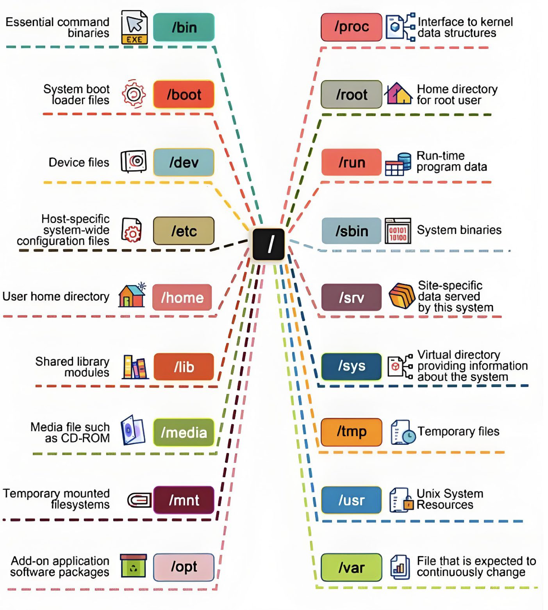

# Linux

## Learning Material
1. [兄弟连Linux教程](https://www.bilibili.com/video/BV1mW411i7Qf?p=1)，[参考笔记](https://blog.csdn.net/yy150122/article/details/106146414)

## Linux vs Windows

1. Linux和Windows对比：

    | Linux | Windows | Note |
    | ---- | ---- | ---- |
    | cat a.csv | type a.csv | 打印文件内容 |
    | ls | dir | 看目录下的有哪些文件 |

    - Linux的cmd是区分大小写的，而Windows不区分
    - Linux所有内容以文件形式保存，包括硬件，例如硬盘是/dev/sd[a-p]
    - Linux是不靠扩展名来区分文件的，少数有扩展名的文件仅仅是为了我们自己方便区分而已

## Linux目录
1. Linux各目录的作用：

    | 目录 | 作用 |
    | ---- | ---- |
    | /bin | 存放系统命令的目录，普通用户和超级用户都可以执行。不过放在/bin下的命令在单用户模式下也可以执行 |
    | /sbin | 保存和系统环境设置相关的命令，只有超级用户可以使用这些命令进行系统环境设置，但是有些命令可以允许普通用户查看 |
    | /usr/bin | 存放系统命令的目录，普通用户和超级用户都可以执行。这些命令和系统启动无关，在单用户模式下不能执行 |
    | /usr/sbin | 存放根文件系统不必要的系统管理命令，例如多数服务程序。只有超级用户可以使用。大家其实可以注意到Linux的系统，在所有"sbin"目录中保存的命令只有超级用户可以使用，"bin"目录中保存的命令所有用户都可以使用。|
    | /boot | 系统启动目录，保存系统启动相关的文件，如内核文件和启动引导程序(grub)文件等 |
    | /dev | 设备文件保存位置。我们已经说过Linux中所有内容以文件形式保存，包括硬件。那么这个目录就是用来保存所有硬件设备文件的 |
    | /etc | 配置文件保存位置。系统内所有采用默认安装方式（rpm安装）的服务的配置文件全部都保存在这个目录当中，如用户账户和密码，服务的启动脚本，常用服务的配置文件等 |
    | /home | 普通用户的家目录。建立每个用户时，每个用户要有一个默认登录位置，这个位置就是这个用户的家目录，所有普通用户的家目录就是在/home下建立一个和用户名相同的目录。如用户user1的家目录就是/home/user1 |
    | /lib | 系统调用的函数库保存位置 |
    | /lost+found | 当系统意外崩溃或机器意外关机，而产生一些文件碎片放在这里。当系统启动的过程中fsck工具会检查这里，并修复已经损坏的文件系统。这个目录只在每个分区中出现，例如/lost+found就是根分区的备份恢复目录，/boot/lost+found就是 /boot分区的备份恢复目录 |
    | /media | 挂载目录。系统建议是用来挂载媒体设备的，例如软盘和光盘 |
    | /mnt | 挂载目录，早期Linux中只有这一个挂载目录，并没有细分。现在这个目录系统建议挂载额外设备，如U盘，移动硬盘和其他操作系统的分区 |
    | /misc | 挂载目录。系统建议用来挂载NFS服务的共享目录。我们在刚刚已经解释了挂载，童鞋们应该知道只要是一个已经建立的空目录就可以作为挂载点。那么系统虽然准备了三个默认挂载目录/media、/mnt、/misc，但是到底在哪个目录中挂载什么设备都可以由管理员自己决定。例如超哥接触Linux的时候，默认挂载目录只有/mnt一个，所以养成了在/mnt下建立不同目录挂载不同设备的习惯。如/mnt/cdrom挂载光盘，/mnt/usb挂载U盘，这都是可以的 |
    | /opt | 第三方安装的软件保存位置。这个目录就是放置和安装其他软件的位置，我手工安装的源码包软件都可以安装到这个目录当中。不过我还是更加习惯把软件放置到/usr/local/目录当中，也就是说/usr/local/目录也可以用来安装软件 |
    | /proc | 虚拟文件系统，该目录中的数据并不保存到硬盘当中，而是保存到内存当中。主要保存系统的内核，进程，外部设备状态和网络状态灯。如/proc/cpuinfo是保存CPU信息的， /proc/devices是保存设备驱动的列表的，/proc/filesystems是保存文件系统列表的， /proc/net/是保存网络协议信息的 |
    | /sys | 虚拟文件系统。和/proc目录相似，都是保存在内存当中的，主要是保存于内核相关信息的 |
    | /root | 超级用户的家目录。普通用户家目录在"/home"下，超级用于家目录直接在"/"下 |
    | /srv | 服务数据目录。一些系统服务启动之后，可以在这个目录中保存所需要的数据 |
    | /tmp | 临时目录。系统存放临时文件的目录，该目录下所有用户都可以访问和写入。我们建议此目录中不能保存重要数据，最好每次开机都把该目录清空 |
    | /usr | 系统软件资源目录。注意usr不是user的缩写，而是"Unix Softwre Resource"的缩写，所以不是存放用户数据，而是存放系统软件资源的目录。系统中安装的软件大多数保存在这里 |
    | /var | 动态数据保存位置。主要保存缓存、日志以及软件运行所产生的文件 |

    

!!! note "sbin / usr"

    sbin中的s表示super，就是超级用户的意思。usr不是user，而是`unix software resource`

## 命令格式
1. 命令格式：  
 命令 [—选项] [参数]  
 例：ls -la /etc

    说明：  
  1）个别命令使用不遵循此格式  
  2）当有多个选项时，可以写在一起  
  3）简化选项与完整选项：-a 等于 -all 

## 常用命令

