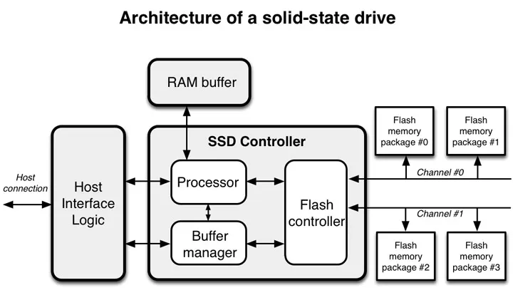

# Coding for SSD

## 资料
* [Coding for SSD](https://codecapsule.com/2014/02/12/coding-for-ssds-part-1-introduction-and-table-of-contents/)

## Architecture of an SSD
1. A solid-state drives (SSD) is a flash-memory based data storage device. Bits are stored into cells, which exist in three types: 

    * 1 bit per cell (single level cell, SLC) ➡️ the best choice for high-update workloads
    * 2 bits per cell (multiple level cell, MLC)
    * 3 bits per cell (triple-level cell, TLC) ➡️ for high-read and low-write workloads (ex: video storage and streaming)

    

        { width=530 }
        <figcaption>Architecture of a solid-state drive</figcaption>
    

## Workloads and metrics
1. The parameters used are generally the following:

    * The type of workload: can be a specific benchmark based on data collected from users, or just only sequential or random accesses of the same type (ex: only random writes)
    * The percentages of reads and writes performed concurrently (ex: 30% reads and 70% writes)
    * The queue length: this is the number of concurrent execution threads running commands on a drive
    * The size of the data chunks being accessed (4 KB, 8 KB, etc.)

2. Benchmark results are presented using different metrics. The most common are:

    * Throughput: The speed of transfer, generally in KB/s or MB/s, respectively kilobytes per second, and megabytes per second. This is the metric chosen for sequential benchmarks.
    * IOPS: the number of Input/Output Operations Per Second, each operations being of the same data chunk size (generally 4 KB/s). This is the metrics chosen for the random benchmarks.
    * Latency: the response time of a device after a command is emitted, generally in μs or ms, respectively microseconds or milliseconds.

## Pages, Blocks, and the Flash Translation Layer
1. Read, write, erase

    * Reads are aligned on page size
    * Writes are aligned on page size
    * Erases are aligned on block size
    * Pages cannot be overwritten

2. Write amplification and read-modify-write

    * Never write less than a page
        - Any write operation that is not both aligned on the page size and a multiple of the page size will require more data to be written than necessary, a concept called write amplification
    * Align writes
        - Writing data in an unaligned way causes the pages to be read into cache before being modified and written back to the drive, which is slower than directly writing pages to the disk. This operations is known as read-modify-write, and should be avoided whenever possible
    * Buffer small writes

3. Flash Translation Layer (FTL) has two main purposes: 

    * logical block mapping
    * garbage collection

4. 📌 Flash Translation Layer (FTL)
