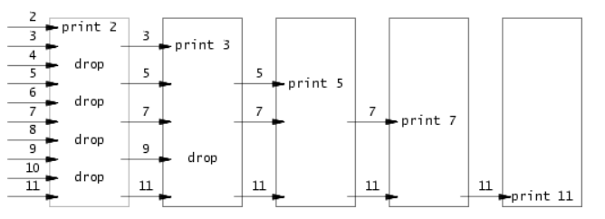
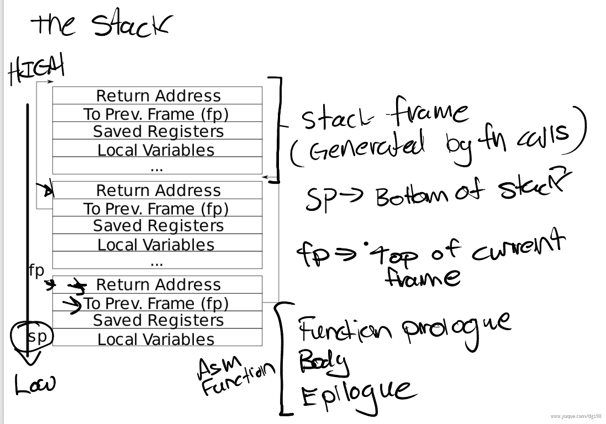

# MIT6.S081

## 资料
* [课程网站](https://pdos.csail.mit.edu/6.828/2020/schedule.html)
* [课程视频](https://www.bilibili.com/video/BV19k4y1C7kA/?spm_id_from=333.337.search-card.all.click&vd_source=2a33d03ec3e67e46971208a7faa0dcda)，[视频中文文字版(推荐👍)](https://mit-public-courses-cn-translatio.gitbook.io/mit6-s081)
* [英文教材](https://pdos.csail.mit.edu/6.828/2021/xv6/book-riscv-rev2.pdf), [中文翻译教材(网页)](https://th0ar.gitbooks.io/xv6-chinese/content/index.html), [中文翻译教材(pdf，翻译较差)](https://blog.betteryuan.top/archives/xv6-riscv-book-zh-cn)
* [课程作业](https://pdos.csail.mit.edu/6.828/2020/schedule.html)
* [xv6中文文档](https://th0ar.gitbooks.io/xv6-chinese/content/index.html)
* Lab 参考：
    - [XV6-labs-2021操作系统](https://www.notion.so/XV6-labs-2021-0894f931b3324edea30dca7826c01a97)，[b站视频](https://www.bilibili.com/video/BV1ou41127p9?vd_source=2a33d03ec3e67e46971208a7faa0dcda&spm_id_from=333.788.videopod.sections)
    - [MIT6.S081-All-in-one](https://xv6.dgs.zone/): 值得推荐的课本翻译及lab翻译👍
    - [代码实现参考](https://github.com/PKUFlyingPig/MIT6.S081-2020fall/blob/master/reports/Utils.md)

## Lect0 操作系统接口
1. 使用 wsl 来完成：
    - 安装这些 [Tools Used in 6.S081](https://pdos.csail.mit.edu/6.828/2020/tools.html)
    - 在直接clone下来的代码下编译 `make qemu` 报错 `user/sh.c: In function 'runcmd': user/sh.c:58:1: error: infinite recursion detected [-Werror=infinite-recursion]`，解决：加上`__attribute__((noreturn))`: `__attribute__((noreturn)) void runcmd(struct cmd *cmd)`
    - 安装 riscv64-unknown-elf-gdb:

        ```bash
        # 下载预编译包（以v2020.12版本为例）
        wget https://static.dev.sifive.com/dev-tools/freedom-tools/v2020.12/riscv64-unknown-elf-toolchain-10.2.0-2020.12.8-x86_64-linux-ubuntu14.tar.gz
        # 解压并安装
        tar -xzvf riscv64-unknown-elf-toolchain-*.tar.gz
        mv riscv64-unknown-elf-toolchain-10.2.0-2020.12.8-x86_64-linux-ubuntu14 riscv64-unknown-elf-toolchain
        sudo mv riscv64-unknown-elf-toolchain /opt/
        # 添加环境变量（以.bashrc为例）
        echo 'export PATH="/opt/riscv64-unknown-elf-toolchain/bin:$PATH"' >> ~/.bashrc
        source ~/.bashrc
        ```

    - Follow [GDB调试最佳实践步骤](https://www.notion.so/Lab0-Environment-Setup-5a1084d3b695416c8740977b9f1ba77e) 或 [video](https://www.bilibili.com/video/BV1ou41127p9/?vd_source=2a33d03ec3e67e46971208a7faa0dcda)

2. 一个新分配的文件描述符永远都是当前进程的最小的未被使用的文件描述符。

3. 管道 p[0]是读端，p[1]是写端。read 系统调用在从管道读取数据时，若管道为空，会有不同的行为表现，这取决于管道的状态：

    - 管道有写端打开：若管道至少有一个写端是打开状态，并且当前管道为空，read 调用会阻塞，也就是暂停当前进程的执行，直到有数据被写入管道或者写端都关闭。
    - 管道所有写端关闭：若管道的所有写端都已关闭，并且管道为空，read 调用会返回 0，表示已经到达文件末尾（EOF）。

3. 为何 fork 和 exec 是单独的两种系统调用 ➡️ 这种区分使得 shell 可以在子进程执行指定程序之前对子进程进行修改，例如重定向，在 fork 之后 exec 之前打开或关闭一些文件描述符。

4. xv6 syscall: If not otherwise stated, these calls return 0 for no error, and -1 if
there’s an error.

    | System call | Description | 
    | --- | --- | 
    | `int fork()` | Create a process, return child’s PID. | 
    | `int exit(int status)` | Terminate the current process; status reported to wait(). No return. | 
    | `int wait(int *status)` | Wait for a child to exit; exit status in *status; returns child PID. | 
    | `int kill(int pid)` | Terminate process PID. Returns 0, or -1 for error. | 
    | `int getpid()` | Return the current process’s PID. | 
    | `int sleep(int n)` | Pause for n clock ticks. | 
    | `int exec(char *file, char *argv[])` | Load a file and execute it with arguments; only returns if error. | 
    | `char *sbrk(int n)` | Grow process’s memory by n bytes. Returns start of new memory. | 
    | `int open(char *file, int flags)` | Open a file; flags indicate read/write; returns an fd (file descriptor). | 
    | `int write(int fd, char *buf, int n)` | Write n bytes from buf to file descriptor fd; returns n. | 
    | `int read(int fd, char *buf, int n)` | Read n bytes into buf; returns number read; or 0 if end of file. | 
    | `int close(int fd)` | Release open file fd. | 
    | `int dup(int fd)` | Return a new file descriptor referring to the same file as fd. | 
    | `int pipe(int p[])` | Create a pipe, put read/write file descriptors in p[0] and p[1]. | 
    | `int chdir(char *dir)` | Change the current directory. | 
    | `int mkdir(char *dir)` | Create a new directory. | 
    | `int mknod(char *file, int, int)` | Create a device file, param: major and minor device numbers. | 
    | `int fstat(int fd, struct stat *st)` | Place info about an open file into *st. | 
    | `int stat(char *file, struct stat *st)` | Place info about a named file into *st. | 
    | `int link(char *file1, char *file2)` | Create another name (file2) for the file file1. | 
    | `int unlink(char *file)` | Remove a file. |

5. 创建一个临时 inode 的最佳方式，这个 inode 会在进程关闭 fd 或者退出的时候被清空:

    ```c
    fd = open("/tmp/xyz", O_CREATE|O_RDWR);
    unlink("/tmp/xyz");
    ```

    这两行代码会创建并打开一个文件，接着删除该文件在文件系统中的目录项。不过，由于文件已经被打开，文件所占用的磁盘空间不会立刻释放，只要程序仍然持有有效的文件描述符 fd，就可以继续对该文件进行读写操作。当程序关闭这个文件描述符（通过 close(fd)），或者程序终止时，系统才会真正释放文件占用的磁盘空间。这种技术常用于创建临时文件，程序结束后文件会自动消失，不会在文件系统中留下痕迹。

## Lab1: Xv6 and Unix utilities
1. sleep:

    ```C
    #include "kernel/types.h"
    #include "kernel/stat.h"
    #include "user/user.h"

    int 
    main(int argc, char const *argv[])
    {
        if (argc != 2)
        {
            fprintf(2, "Usage: sleep seconds\n");
            exit(1);
        }
        int time = atoi(argv[1]);
        sleep(time);
        
        exit(0);
    }
    ```

2. pingpong:

    ```C
    #include "kernel/types.h"
    #include "kernel/stat.h"
    #include "user/user.h"

    int main(int argc, char const *argv[])
    {
        int pid;
        int p[2];
        pipe(p);

        if (fork() == 0) // child (receive -> send)
        {
            pid = getpid();
            char buf[2];
            // 若管道为空，read 调用会阻塞，也就是暂停当前进程的执行，
            // 直到有数据被写入管道或者写端都关闭。
            if (read(p[0], buf, 1) != 1)
            {
                fprintf(2, "failed to read in child\n");
                exit(1);
            }
            close(p[0]);
            printf("%d: received ping\n", pid);
            if (write(p[1], buf, 1) != 1)
            {
                fprintf(2, "failed to write in child\n");
                exit(1);
            }
            close(p[1]);
            exit(0);
        }
        else
        {	// parent (send -> receive)
            pid = getpid();
            char info[2] = "a";
            char buf[2];
            buf[1] = 0;
            if (write(p[1], info, 1) != 1)
            {
                fprintf(2, "failed to write in parent\n");
                exit(1);
            }
            // wait for child to receive ping
            close(p[1]);
            wait(0);
            if (read(p[0], buf, 1) != 1)
            {
                fprintf(2, "failed to read in parent\n");
                exit(1);
            }
            printf("%d: received pong\n", pid);
            close(p[0]);
            exit(0);
        }
    }
    ```

3. primes:

    ```C
    p = get a number from left neighbor
    print p
    loop:
        n = get a number from left neighbor
        if (p does not divide n) // n不能被p整除
            send n to right neighbor
    ```

    

    > 生成进程可以将数字2、3、4、…、35输入管道的左端：行中的第一个进程消除2的倍数，第二个进程消除3的倍数，第三个进程消除5的倍数，依此类推。

    ```C
    #include "kernel/types.h"
    #include "kernel/stat.h"
    #include "user/user.h"

    void new_proc(int p[2])
    {
        int prime;
        int flag;
        int n;
        close(p[1]);
        if (read(p[0], &prime, 4) != 4)
        {
            fprintf(2, "child process failed to read\n");
            exit(1);
        }
        // 每次传送的第一个数据都一定是一个素数
        printf("prime %d\n", prime);

        flag = read(p[0], &n, 4);
        if (flag)
        {
            int newp[2];
            pipe(newp);
            if (fork() == 0)
            {
                new_proc(newp);
            }
            else
            {
                close(newp[0]);
                // 若 n 不能被当前素数 prime 整除，将 n 写入新管道。
                if (n % prime) 
                {
                    write(newp[1], &n, 4);
                }
                
                // 循环读取原管道中的数据，将不能被 prime 整除的数写入新管道。
                while (read(p[0], &n, 4))
                {
                    if (n % prime)
                    {
                        write(newp[1], &n, 4);
                    }
                }
                close(p[0]);
                close(newp[1]);
                wait(0);
            }
        }
        exit(0);
    }

    int main(int argc, char const *argv[])
    {
        int p[2];
        pipe(p);
        if (fork() == 0)
        {
            new_proc(p);
        }
        else
        {
            close(p[0]);
            for (int i = 2; i <= 35; i++)
            {
                if (write(p[1], &i, 4) != 4)
                {
                    fprintf(2, "first process failed to write %d into the pipe\n", i);
                    exit(1);
                }
            }
            close(p[1]);
            wait(0);
            exit(0);
        }
        return 0;
    }
    ```

4. find:

    > 目录的本质：在文件系统中，目录实际上是一种特殊的文件，它存储了一系列目录项（dirent）。每个目录项代表目录下的一个文件或子目录，包含文件名、inode 编号等信息。

    ```C
    #include "kernel/types.h"
    #include "kernel/stat.h"
    #include "user/user.h"
    #include "kernel/fs.h"

    void find_helper(char const *path, char const *target)
    {
        char buf[512], *p;
        int fd;
        struct dirent de;
        struct stat st;
        if ((fd = open(path, 0 /*O_RDONLY*/)) < 0)
        {
            fprintf(2, "find: cannot open %s\n", path);
            exit(1);
        }

        if (fstat(fd, &st) < 0)
        {
            fprintf(2, "find: cannot stat %s\n", path);
            exit(1);
        }

        switch (st.type)
        {
            case T_FILE:
            case T_DEVICE:
                fprintf(2, "Usage: find dir file\n");
                exit(1);
            case T_DIR:
                if (strlen(path) + 1 + DIRSIZ + 1 > sizeof(buf))
                {   // strlen 函数并不会把字符串末尾的空字符 '\0' 计算在内, 但是 sizeof 会算入 '\0'
                    // 加 1 是为了预留路径分隔符 / 的位置，再加 1 则是为了新拼接的字符串末尾的结束符 '\0' 预留空间
                    // DIRSIZ 定义了文件名允许的最大字节数
                    printf("find: path too long\n");
                    break;
                }
                strcpy(buf, path);
                p = buf + strlen(buf);
                *p++ = '/';               // *p = '/'; p++;
                // 遍历目录中的所有条目
                while (read(fd, &de, sizeof(de)) == sizeof(de))
                {
                    if (de.inum == 0 || strcmp(de.name, ".") == 0 || strcmp(de.name, "..") == 0)
                    {
                        continue;
                        // inum 为 0 表示该目录项无效，跳过
                        // . 表示当前目录，无需递归查找，跳过
                        // .. 表示父目录，为避免无限递归，跳过
                    }
                    memmove(p, de.name, DIRSIZ);
                    p[DIRSIZ] = 0;
                    if (stat(buf, &st) < 0)
                    {
                        printf("find: cannot stat %s\n", buf);
                        continue;
                    }
                    if (st.type == T_DIR)
                    {
                        find_helper(buf, target);
                    }
                    else if (st.type == T_FILE)
                    {
                        if (strcmp(de.name, target) == 0)
                        {
                            printf("%s\n", buf);
                        }
                    }
                }
                break;
        }
        close(fd);
    }
    int main(int argc, char const *argv[])
    {
        if (argc != 3)
        {
            fprintf(2, "Usage: find dir file\n");
            exit(1);
        }

        char const *path = argv[1];
        char const *target = argv[2];
        find_helper(path, target);
        exit(0);
    }
    ```

5. xargs:

    > 实现一个简单的 xargs 工具，它可以将多个命令行参数组合成一个字符串，并将其传递给另一个命令。

    > 管道（|）是 Unix/Linux 系统中用于进程间通信的一种机制，它的作用是把一个命令（发送进程）的标准输出连接到另一个命令（接收进程）的标准输入。这样，发送进程产生的输出数据就会直接作为接收进程的输入数据。

    ```bash
    $ echo hello too | xargs echo bye
    bye hello too
    ```

    ```C
    #include "kernel/types.h"
    #include "kernel/stat.h"
    #include "user/user.h"
    #include "kernel/param.h"

    int readline(char *new_argv[32], int curr_argc)
    {
        char buf[1024];
        int n = 0;
        // 从标准输入（文件描述符 0）逐字符读取数据，存储到 buf 数组中
        while (read(0, buf + n, 1))
        {
            if (n == 1023)
            {
                fprintf(2, "argument is too long\n");
                exit(1);
            }
            if (buf[n] == '\n')
            {
                break;
            }
            n++;
        }
        buf[n] = 0; // 字符串结束符 '\0'
        if (n == 0) return 0;
        // 此时 buf 为 "hello too"
        int offset = 0;
        while (offset < n)
        {
            new_argv[curr_argc++] = buf + offset;
            while (buf[offset] != ' ' && offset < n)
            {
                offset++;
            }
            while (buf[offset] == ' ' && offset < n)
            {
                // 遇到空格时，将其替换为字符串结束符 '\0'，以分割参数
                buf[offset++] = 0;
            }
        }
        return curr_argc;
    }

    int main(int argc, char const *argv[])
    {
        if (argc <= 1)
        {
            fprintf(2, "Usage: xargs command (arg ...)\n");
            exit(1);
        }
        char *command = malloc(strlen(argv[1]) + 1);
        char *new_argv[MAXARG];
        strcpy(command, argv[1]); // 考虑xargs echo bye, command 为 echo
        for (int i = 1; i < argc; ++i)
        {
            new_argv[i - 1] = malloc(strlen(argv[i]) + 1);
            strcpy(new_argv[i - 1], argv[i]);
        }
        // 此时 new_argv 为 {echo, bye}

        int curr_argc;
        while ((curr_argc = readline(new_argv, argc - 1)) != 0)
        {
            new_argv[curr_argc] = 0;
            if (fork() == 0)
            {
                exec(command, new_argv);
                fprintf(2, "exec failed\n");
                exit(1);
            }
            wait(0);
        }
        exit(0);
    }
    ```

    output:

    ```bash
    # sleep
    $ sleep 10

    # pingpong
    $ pingpong
    5: received ping
    4: received pong

    # primes
    $ primes
    prime 2
    prime 3
    prime 5
    prime 7
    prime 11
    prime 13
    prime 17
    prime 19
    prime 23
    prime 29
    prime 31

    # find
    $ echo > b
    $ mkdir a
    $ echo > a/b
    $ find . b
    ./b
    ./a/b

    # xargs
    $ echo hello too | xargs echo bye
    bye hello too
    $ 
    ```

## Lab2: System calls
1. System call tracing

    首先在`proc`结构体中添加一个数据字段，用于保存`trace`的参数，并在`sys_trace()`的实现中实现参数的保存:

    ```C
    // kernel/proc.h
    struct proc {
        // ...
        int trace_mask;    // trace系统调用参数
    };

    // kernel/sysproc.c
    uint64
    sys_trace(void)
    {
        int trace_mask;
        // argint: 从用户空间读取一个整数参数(第0个参数)到内核空间的变量 trace_mask
        if(argint(0, &trace_mask) < 0)
            return -1;
        myproc()->trace_mask = trace_mask;
        return 0;
    }
    ```

    由于`struct proc`中增加了一个新的变量, 当`fork`的时候我们也需要将这个变量传递到子进程中:

    ```C
    //kernel/proc.c
    int
    fork(void)
    {
        // ...

        safestrcpy(np->name, p->name, sizeof(p->name));

        // 将trace_mask拷贝到子进程
        np->trace_mask = p->trace_mask;

        pid = np->pid;
        // ...

        return pid;
    }
    ```

    系统调用追踪在`syscall()`函数中实现:

    ```C
    void
    syscall(void)
    {
        int num;
        struct proc *p = myproc();

        num = p->trapframe->a7;  // 系统调用编号，参见书中4.3节
        if(num > 0 && num < NELEM(syscalls) && syscalls[num]) 
        {
            p->trapframe->a0 = syscalls[num]();  // 执行系统调用，然后将返回值存入a0

            // 系统调用是否匹配
            if ((1 << num) & p->trace_mask)
            {
                printf("%d: syscall %s -> %d\n", p->pid, syscalls_name[num], p->trapframe->a0);
            } 
        }
        else 
        {
            printf("%d %s: unknown sys call %d\n",
                    p->pid, p->name, num);
            p->trapframe->a0 = -1;
        }
    }
    ```

    在上面的代码中，我们还有一些引用的变量尚未定义，在syscall.c中定义他们:

    ```C
    // ...
    extern uint64 sys_trace(void);

    static uint64 (*syscalls[])(void) = {
    // ...
    [SYS_trace]   sys_trace,
    };

    static char *syscalls_name[] = {
    [SYS_fork]    "fork",
    [SYS_exit]    "exit",
    [SYS_wait]    "wait",
    [SYS_pipe]    "pipe",
    [SYS_read]    "read",
    [SYS_kill]    "kill",
    [SYS_exec]    "exec",
    [SYS_fstat]   "fstat",
    [SYS_chdir]   "chdir",
    [SYS_dup]     "dup",
    [SYS_getpid]  "getpid",
    [SYS_sbrk]    "sbrk",
    [SYS_sleep]   "sleep",
    [SYS_uptime]  "uptime",
    [SYS_open]    "open",
    [SYS_write]   "write",
    [SYS_mknod]   "mknod",
    [SYS_unlink]  "unlink",
    [SYS_link]    "link",
    [SYS_mkdir]   "mkdir",
    [SYS_close]   "close",
    [SYS_trace]   "trace",
    };
    ```

2. sysinfo:

    内存是使用链表进行管理的，因此遍历kmem中的空闲链表就能够获取所有的空闲内存:

    ```C
    // kernel/kalloc.c
    uint64 
    freemem(void)
    {
        struct run *r;
        uint64 freepage = 0;
        acquire(&kmem.lock);
        r = kmem.freelist;
        while (r)
        {
            freepage += 1;
            r = r->next;
        }
        release(&kmem.lock);
        return (freepage << 12);
    }
    ```

    遍历proc数组，统计处于活动状态的进程即可，循环的写法参考scheduler函数:

    ```C
    // kernel/proc.c
    uint64
    procnum(void)
    {
        struct proc *p;
        uint64 procnum = 0;

        for(p = proc; p < &proc[NPROC]; p++)
        {
            if(p->state != UNUSED) 
            {
                procnum++;
            }
        }

        return procnum;
    }
    ```

    实现`sys_sysinfo`，将数据写入结构体并传递到用户空间:

    ```C
    // kernel/sysproc.c
    uint64
    sys_sysinfo(void)
    {
        uint64 addr;
        // argaddr 是 XV6 操作系统中用于从系统调用参数中获取用户空间地址的函数。
        // 它的主要作用是从系统调用的参数列表中读取一个用户空间的地址（64位指针），
        // 并将其存储在提供的指针变量中。
        if(argaddr(0, &addr) < 0)
            return -1;
        struct proc *p = myproc();
        struct sysinfo info;
        info.freemem = freemem();
        info.nproc = procnum(); 
        // Copy from kernel to user.
        // Copy len bytes from src to virtual address dstva in a given page table.   
        // copyout(pagetable_t pagetable, uint64 dstva, char *src, uint64 len)
        if(copyout(p->pagetable, addr, (char *)&info, sizeof(info)) < 0)
            return -1;
        return 0;
    }
    ```

    output:

    ```bash
    $ trace 32 grep hello README # 32是1<<SYS_read，仅跟踪read系统调用
    3: syscall read -> 1023
    3: syscall read -> 968
    3: syscall read -> 235
    3: syscall read -> 0
    $ sysinfotest
    sysinfotest: start
    sysinfotest: OK
    ```

## Lab3: Page tables
1. Print a page table:

    ```C
    // kernel/vm.c
    void vmprinthelper(pagetable_t pagetable, int level)
    {
        // there are 2^9 = 512 PTEs in a page table.
        for (int i = 0; i < 512; i++)
        {
            pte_t pte = pagetable[i];
            if (pte & PTE_V)
            {
                for (int i = 0; i < level; i++) printf(".. ");
                uint64 child = PTE2PA(pte);
                printf("%d: pte %p pa %p\n", i, pte, PTE2PA(pte));
                if ((pte & (PTE_R|PTE_W|PTE_X)) == 0)
                // 最后一层页表中页表项中W位，R位，X位起码有一位会被设置为1
                // 读/写/执行位都为0：该页表项被视为无效或保留状态
                {
                    // this PTE points to a lower-level page table.
                    vmprinthelper((pagetable_t)child, level + 1);
                }
            } 
        }
    }

    void vmprint(pagetable_t pagetable)
    {
        printf("page table %p\n", pagetable);
        vmprinthelper(pagetable, 1);
    }

    // exec function: 打印第一个进程的页表
    if(p->pid==1) vmprint(p->pagetable);
    ```

    output:

    ```bash
    xv6 kernel is booting

    hart 1 starting
    hart 2 starting
    page table 0x0000000087f6f000
    .. 0: pte 0x0000000021fdac01 pa 0x0000000087f6b000
    .. .. 0: pte 0x0000000021fda801 pa 0x0000000087f6a000
    .. .. .. 0: pte 0x0000000021fdb01f pa 0x0000000087f6c000
    .. .. .. 1: pte 0x0000000021fda40f pa 0x0000000087f69000
    .. .. .. 2: pte 0x0000000021fda01f pa 0x0000000087f68000
    .. 255: pte 0x0000000021fdb801 pa 0x0000000087f6e000
    .. .. 511: pte 0x0000000021fdb401 pa 0x0000000087f6d000
    .. .. .. 510: pte 0x0000000021fddc07 pa 0x0000000087f77000
    .. .. .. 511: pte 0x0000000020001c0b pa 0x0000000080007000
    init: starting sh
    ```

2. A kernel page table per process:

    > 本实验主要是让每个进程都有自己的内核页表，这样在内核中执行时使用进程自己的内核页表。

    (1) 首先给kernel/proc.h里面的 `struct proc` 加上内核页表的字段 `kernelpt`:

    ```c
    uint64 kstack;               // Virtual address of kernel stack
    uint64 sz;                   // Size of process memory (bytes)
    pagetable_t pagetable;       // User page table
    pagetable_t kernelpt;        // 进程的内核页表，加这一句 🏠
    struct trapframe *trapframe; // data page for trampoline.S
    ```

    (2) 在vm.c中添加新的方法 `proc_kpt_init`，该方法用于在 `allocproc` 中初始化进程的内核页表。这个函数还需要一个辅助函数 `uvmmap`，该函数和 `kvmmap` 方法几乎一致，不同的是 `kvmmap` 是对XV6的内核页表进行映射，而 `uvmmap`用于对进程的内核页表进行映射。

    ```C
    // 用于用户进程的内核页表进行映射
    void uvmmap(pagetable_t pagetable, uint64 va, uint64 pa, uint64 sz, int perm)
    {
        if (mappages(pagetable, va, sz, pa, perm) != 0)
            panic("uvmmap");
    }

    // proc's version of kvminit
    // Create a kernel page table for the process
    pagetable_t proc_kpt_init()
    {
        pagetable_t kernelpt = uvmcreate();
        if (kernelpt == 0) return 0;

        // uart registers
        uvmmap(kernelpt, UART0, UART0, PGSIZE, PTE_R | PTE_W);

        // virtio mmio disk interface
        uvmmap(kernelpt, VIRTIO0, VIRTIO0, PGSIZE, PTE_R | PTE_W);

        uvmmap(kernelpt, CLINT, CLINT, 0x10000, PTE_R | PTE_W);

        // PLIC
        uvmmap(kernelpt, PLIC, PLIC, 0x400000, PTE_R | PTE_W);

        // map kernel text executable and read-only.
        uvmmap(kernelpt, KERNBASE, KERNBASE, (uint64)etext-KERNBASE, PTE_R | PTE_X);

        // map kernel data and the physical RAM we'll make use of.
        uvmmap(kernelpt, (uint64)etext, (uint64)etext, PHYSTOP-(uint64)etext, PTE_R | PTE_W);

        // map the trampoline for trap entry/exit to
        // the highest virtual address in the kernel.
        uvmmap(kernelpt, TRAMPOLINE, (uint64)trampoline, PGSIZE, PTE_R | PTE_X);

        return kernelpt;
    }
    ```

    (3) 在 kernel/proc.c 里面的 `allocproc` 调用 `proc_kpt_init` 初始化进程的内核页表, 并参考 `proc_mapstacks` 将内核栈映射到进程的内核页表中。

    ```C
    ...

    // An empty user page table.
    p->pagetable = proc_pagetable(p);
    if(p->pagetable == 0){
        freeproc(p);
        release(&p->lock);
        return 0;
    }

    // Init the kernal page table
    p->kernelpt = proc_kpt_init();
    if(p->kernelpt == 0){
        freeproc(p);
        release(&p->lock);
        return 0;
    }

    // 参考 proc_mapstacks
    // Allocate a page for the process's kernel stack.
    // Map it high in memory, followed by an invalid
    // guard page.
    char *pa = kalloc();
    if(pa == 0)
        panic("kalloc");
    uint64 va = KSTACK((int) (p - proc));
    uvmmap(p->kernelpt, va, (uint64)pa, PGSIZE, PTE_R | PTE_W);
    p->kstack = va;

    ...
    ```

    (4) 需要修改 `scheduler()` 来加载进程的内核页表到SATP寄存器。参考 `kvminithart()`。

    ```C
    // Store kernel page table to SATP register
    void proc_inithart(pagetable_t kpt)
    {
        w_satp(MAKE_SATP(kpt));
        sfence_vma();
    }
    ```

    然后在 `scheduler()`内调用即可，但在结束的时候，需要切换回原先的kernel_pagetable:

    ```C
    ...
    p->state = RUNNING;
    c->proc = p;

    // Store the kernal page table into the SATP
    proc_inithart(p->kernelpt);

    // 进行上下文切换，把 CPU 控制权交给该进程。
    swtch(&c->context, &p->context);

    // 当进程主动让出 CPU 或被抢占后，控制权回到 scheduler，
    // 此时再调用 kvminithart()，切回全局内核页表，恢复内核的虚拟内存环境。

    // Switch to the global kernel page table
    kvminithart();
    ...
    ```

    (5) 在 `freeproc`中释放一个进程的内核页表。首先释放页表内的内核栈，调用`uvmunmap`可以解除映射，最后的一个参数 `do_free` 为1的时候，会释放实际内存。再通过`proc_freekernelpt`释放内核页表。

    ```c
    // free the kernel stack in the RAM
    // uvmunmap(pagetable_t pagetable, uint64 va, uint64 npages, int do_free)
    uvmunmap(p->kernelpt, p->kstack, 1, 1);
    p->kstack = 0;
    // 释放进程的内核页表
    proc_freekernelpt(p->kernelpt);
    ```

    ```c
    void proc_freekernelpt(pagetable_t kernelpt)
    {
        // similar to the freewalk method
        // there are 2^9 = 512 PTEs in a page table.
        for(int i = 0; i < 512; i++)
        {
            pte_t pte = kernelpt[i];
            if(pte & PTE_V)
            {
                kernelpt[i] = 0;
                if ((pte & (PTE_R|PTE_W|PTE_X)) == 0)
                {
                    uint64 child = PTE2PA(pte);
                    proc_freekernelpt((pagetable_t)child);
                }
            }
        }
        kfree((void*)kernelpt);
    }
    ```

    (6) 修改vm.c中的kvmpa，将原先的 `kernel_pagetable`改成 `myproc()->kernelpt`，使用进程的内核页表。

    ```C
    // translate a kernel virtual address to
    // a physical address. only needed for
    // addresses on the stack.
    // assumes va is page aligned
    uint64 kvmpa(uint64 va)
    {
        uint64 off = va % PGSIZE;
        pte_t *pte;
        uint64 pa;
        
        // kernel_pagetable ➡️ myproc()->kernelpt
        pte = walk(myproc()->kernelpt, va, 0); // 改这一句 🏠
        if(pte == 0)
            panic("kvmpa");
        if((*pte & PTE_V) == 0)
            panic("kvmpa");
        pa = PTE2PA(*pte);
        return pa+off;
    }
    ```

    output:

    ```bash
    $ usertests
    usertests starting
    test execout: 2
    OK
    test copyin: OK
    test copyout: OK
    test bigfile: OK
    ...
    test dirfile: OK
    test iref: OK
    test forktest: OK
    test bigdir: OK
    ALL TESTS PASSED
    ```

3. Simplify copyin/copyinstr

    > 本实验是实现将用户空间的映射添加到每个进程的内核页表，将进程的页表复制一份到进程的内核页表即可。

    (1) 添加复制函数 `u2kvmcopy`。需要注意的是，在内核模式下，无法访问设置了PTE_U的页面，所以我们要将其移除。

    ```C
    void u2kvmcopy(pagetable_t pagetable, pagetable_t kernelpt, uint64 oldsz, uint64 newsz)
    {
        pte_t *pte_from, *pte_to;
        oldsz = PGROUNDUP(oldsz);
        for (uint64 i = oldsz; i < newsz; i += PGSIZE)
        {
            if((pte_from = walk(pagetable, i, 0)) == 0)
                panic("u2kvmcopy: src pte does not exist");
            if((pte_to = walk(kernelpt, i, 1)) == 0)
                panic("u2kvmcopy: pte walk failed");
            uint64 pa = PTE2PA(*pte_from);
            uint flags = (PTE_FLAGS(*pte_from)) & (~PTE_U);
            // PTE_FLAGS(*pte_from)：获取用户页表页表项的标志位
            // & (~PTE_U)：清除 PTE_U 标志位
            // 因为在内核模式下，无法访问设置了PTE_U的页面
            *pte_to = PA2PTE(pa) | flags;
        }
    }
    ```

    (2) 在内核更改进程的用户映射的每一处 （`fork()`, `exec()`, `sbrk()`和`userinit()`），都复制一份到进程的内核页表。

    exec():

    ```C
    int exec(char *path, char **argv)
    {
        ...
        sp = sz;
        stackbase = sp - PGSIZE;

        // =========== solution for pgtbl ---- part 3 =============
        u2kvmcopy(pagetable, p->kernelpt, 0, sz);
        // =================添加复制逻辑============================

        // Push argument strings, prepare rest of stack in ustack.
        for(argc = 0; argv[argc]; argc++) 
        ...
    }
    ```

    fork():

    ```C
    int fork(void)
    {
        ...
        // Copy user memory from parent to child.
        if(uvmcopy(p->pagetable, np->pagetable, p->sz) < 0){
            freeproc(np);
            release(&np->lock);
            return -1;
        }
        np->sz = p->sz;
        ...
        // =========== solution for pgtbl ---- part 3 =============
        u2kvmcopy(np->pagetable, np->kernelpt, 0, np->sz);
        // ================复制到新进程的内核页表====================
        ...
    }
    ```

    sbrk():
    
    在`kernel/sysproc.c`里面找到`sys_sbrk(void)`，可以知道只有`growproc`是负责将用户内存增加或缩小 n 个字节。以防止用户进程增长到超过PLIC的地址，我们需要给它加个限制。

    ```C
    int growproc(int n)
    {
        uint sz;
        struct proc *p = myproc();

        sz = p->sz;
        if(n > 0)
        {
            // =========== solution for pgtbl ---- part 3 ==========
            if (PGROUNDUP(sz + n) >= PLIC)
            {
                return -1;
            }
            // ===================加上PLIC限制=======================
            if((sz = uvmalloc(p->pagetable, sz, sz + n)) == 0) 
            {
                return -1;
            }
            // =========== solution for pgtbl ---- part 3 =============
            u2kvmcopy(p->pagetable, p->kernelpt, sz - n, sz);
            // ===================复制一份到内核页表=====================
        } 
        else if(n < 0)
        {
            sz = uvmdealloc(p->pagetable, sz, sz + n);
        }
        p->sz = sz;
        return 0;
    }
    ```

    userinit():

    > 不要忘记在userinit的内核页表中包含第一个进程的用户页表

    ```c
    // Set up first user process.
    void userinit(void)
    {
        struct proc *p;

        p = allocproc();
        initproc = p;
        
        // allocate one user page and copy init's instructions
        // and data into it.
        uvminit(p->pagetable, initcode, sizeof(initcode));
        p->sz = PGSIZE;

        // prepare for the very first "return" from kernel to user.
        p->trapframe->epc = 0;      // user program counter
        p->trapframe->sp = PGSIZE;  // user stack pointer

        safestrcpy(p->name, "initcode", sizeof(p->name));
        p->cwd = namei("/");

        p->state = RUNNABLE;

        // =========== solution for pgtbl ---- part 3 =============
        u2kvmcopy(p->pagetable, p->kernelpt, 0, p->sz);
        // ========================================================

        release(&p->lock);
    }
    ```

    (3) 替换掉原有的copyin()和copyinstr()

    ```C
    int copyin(pagetable_t pagetable, char *dst, uint64 srcva, uint64 len)
    {
        return copyin_new(pagetable, dst, srcva, len);
    }

    int copyinstr(pagetable_t pagetable, char *dst, uint64 srcva, uint64 max)
    {
        return copyinstr_new(pagetable, dst, srcva, max);
    }
    ```

    (4) 添加函数声明到 kernel/defs.h 中

    ```C
    int             copyin_new(pagetable_t, char *, uint64, uint64);
    int             copyinstr_new(pagetable_t, char *, uint64, uint64);
    void            u2kvmcopy(pagetable_t pagetable, pagetable_t kernelpt, uint64 oldsz, uint64 newsz);
    ```

    output:

    ```bash
    $ make grade
    == Test   usertests: copyin == 
    usertests: copyin: OK 
    == Test   usertests: copyinstr1 == 
    usertests: copyinstr1: OK 
    == Test   usertests: copyinstr2 == 
    usertests: copyinstr2: OK 
    == Test   usertests: copyinstr3 == 
    usertests: copyinstr3: OK 
    == Test   usertests: sbrkmuch == 
    usertests: sbrkmuch: OK 
    == Test   usertests: all tests == 
    usertests: all tests: OK 
    ```

## Lect6 Isolation & system call entry/exit
1. 一些寄存器：

    - SATP（Supervisor Address Translation and Protection）寄存器：它包含了指向page table的物理内存地址。
    - STVEC（Supervisor Trap Vector Base Address Register）寄存器：它指向了内核中处理trap的指令的起始地址。它会保存当trap，page fault或者中断发生时，CPU运行的用户程序的程序计数器，这样才能在稍后恢复程序的运行。
    - SEPC（Supervisor Exception Program Counter）寄存器：在trap的过程中保存用户代码的程序计数器的值。
    - SSRATCH（Supervisor Scratch Register）寄存器：在进入到user space之前，内核会将trapframe page的地址保存在这个寄存器中，也就是0x3fffffe000这个地址。
    - STVAL寄存器: 触发page fault的的虚拟内存地址。
    - SIE（Supervisor Interrupt Enable）寄存器：这个寄存器中有一个bit（E）专门针对例如UART的外部设备的中断；有一个bit（S）专门针对软件中断，软件中断可能由一个CPU核触发给另一个CPU核；还有一个bit（T）专门针对定时器中断。我们这节课只关注外部设备的中断。
    - SSTATUS（Supervisor Status）寄存器：这个寄存器中有一个bit来打开或者关闭中断。每一个CPU核都有独立的SIE和SSTATUS寄存器，除了通过SIE寄存器来单独控制特定的中断，还可以通过SSTATUS寄存器中的一个bit来控制所有的中断。
    - SIP（Supervisor Interrupt Pending）寄存器：当发生中断时，处理器可以通过查看这个寄存器知道当前是什么类型的中断。
    - SCAUSE寄存器：它会表明当前状态的原因是中断。
    - `csrrw a0,sscratch,a0`：这条指令将a0的数据保存在了sscratch中，同时又将sscratch内的数据保存在a0中，之后内核就可以任意的使用a0寄存器了。
    - `sret` 指令是由RISC-V定义的用来从supervisor mode转换到user mode。
    - `sfence.vma`：清空页表缓存。

2. ecall实际上只会改变三件事情：

    - ecall将代码从user mode改到supervisor mode。
    - ecall将用户代码的程序计数器的值保存在了SEPC寄存器。
    - ecall会跳转到STVEC寄存器指向的指令，即内核中处理trap的指令的起始地址。

3. sret是我们在kernel中的最后一条指令，当我执行完这条指令：

    - 程序会切换回user mode
    - SEPC寄存器的数值会被拷贝到PC寄存器（程序计数器）
    - 重新打开中断

## Lab4: Traps
1. RISC-V assembly

    xv6仓库中有一个文件user/call.c。执行make fs.img编译它，并在user/call.asm中生成可读的汇编版本。

    call.c:

    ```C
    #include "kernel/param.h"
    #include "kernel/types.h"
    #include "kernel/stat.h"
    #include "user/user.h"

    int g(int x) 
    {
        return x+3;
    }

    int f(int x) 
    {
        return g(x);
    }

    void main(void) 
    {
        printf("%d %d\n", f(8)+1, 13);
        exit(0);
    }
    ```

    (1) 哪些寄存器保存函数的参数？例如，在main对printf的调用中，哪个寄存器保存13？

    ➡️ 在a0-a7中存放参数，13存放在a2中: `li	a2,13`, li是 load immediate 的缩写，即立即数加载指令，它的作用是将一个立即数加载到指定的寄存器中。

    (2) main的汇编代码中对函数f的调用在哪里？对g的调用在哪里(提示：编译器可能会将函数内联)

    ➡️ 在生成的汇编中，main函数进行了内联优化处理，从代码`li a1,12`可以看出，main直接计算出了结果并储存。

    (3) printf函数位于哪个地址？

    ➡️ 在0x628: `34:	5f8080e7          	jalr	1528(ra) # 628 <printf>`

    (4) 在main中printf的jalr之后的寄存器ra中有什么值？

    ➡️ 执行此行代码后，将跳转到printf函数执行，并将PC+4=0x34+0x4=0x38保存到ra中，供之后返回使用。

    (5) 运行以下代码，程序的输出是什么？

    ```C
    unsigned int i = 0x00646c72;
    printf("H%x Wo%s", 57616, &i);
    ```

    ➡️ 57616=0xE110，0x00646c72小端存储为72-6c-64-00，对照ASCII码表，72:r 6c:l 64:d 00:充当字符串结尾标识，因此输出为HE110 World

    (6) 在下面的代码中，“y=”之后将打印什么(注：答案不是一个特定的值)？为什么会发生这种情况？

    ```C
    printf("x=%d y=%d", 3);
    ```

    ➡️ 原本需要两个参数，却只传入了一个，因此y=后面打印的结果取决于之前a2中保存的数据

2. Backtrace

    (1) 在`kernel/defs.h`添加函数原型：

    ```C
    void            backtrace(void);
    ```

    (2) 在`kernel/riscv.h`添加`r_fp`来读取当前正在执行的函数的帧指针(保存在s0寄存器)：

    ```C
    static inline uint64 r_fp()
    {
        uint64 x;
        asm volatile("mv %0, s0" : "=r" (x) );
        return x;
    }
    ```

    (3) 在`kernel/printf.c`中添加`backtrace`函数：

    ```C
    /**
    * @brief backtrace 回溯函数调用的返回地址
    */
    void backtrace(void) 
    {
        printf("backtrace:\n");
        // 读取当前帧指针
        uint64 fp = r_fp();
        while (PGROUNDUP(fp) - PGROUNDDOWN(fp) == PGSIZE) 
        {
            // 返回地址保存在-8偏移的位置
            uint64 ret_addr = *(uint64*)(fp - 8);
            printf("%p\n", ret_addr);
            // 前一个帧指针保存在-16偏移的位置
            fp = *(uint64*)(fp - 16);
        }
    }
    ```

    注意返回地址位于栈帧帧指针的固定偏移(-8)位置，并且保存的上一个栈帧的帧指针位于当前帧指针的固定偏移(-16)位置。XV6在内核中以页面对齐的地址为每个栈分配一个页面，通过PGROUNDDOWN(fp)和PGROUNDUP(fp)来计算栈页面的顶部和底部地址。

    

    (4) 在`sys_sleep(void)`中调用`backtrace`，输出：

    ```bash
    $ bttest
    backtrace:
    0x0000000080002cd6
    0x0000000080002bb2
    0x000000008000289c
    ```

3. Alarm

    程序计数器的过程是这样的：

    - `ecall`指令中将`PC`保存到`SEPC`
    - 在`usertrap`中将`SEPC`保存到`p->trapframe->epc`
    - `p->trapframe->epc`加4指向下一条指令
    - 执行系统调用
    - 在`usertrapret`中将`SEPC`改写为`p->trapframe->epc`中的值
    - 在`sret`中将`PC`设置为`SEPC`的值

    可见执行系统调用后返回到用户空间继续执行的指令地址是由`p->trapframe->epc`决定的，因此在`usertrap`中主要就是完成它的设置工作。

    另外要解决的主要问题是寄存器保存恢复和防止重复执行的问题，考虑一下没有`alarm`时运行的大致过程：

    - 进入内核空间，保存用户寄存器到进程陷阱帧
    - 陷阱处理过程
    - 恢复用户寄存器，返回用户空间

    而当添加了`alarm`后，变成了以下过程：

    - 进入内核空间，保存用户寄存器到进程陷阱帧
    - 陷阱处理过程
    - 恢复用户寄存器，返回用户空间，但此时返回的并不是进入陷阱时的程序地址，而是处理函数`handler`的地址，而`handler`可能会改变用户寄存器
    
    因此我们要在`usertrap`中再次保存用户寄存器，当`handler`调用`sigreturn`时将其恢复，并且要防止在`handler`执行过程中重复调用:

    (1) Makefile 里添加 `$U/_alarmtest\`, usys.pl里添加:

    ```c
    entry("sigalarm");
    entry("sigreturn");
    ```

    user.h里添加函数原型：

    ```c
    int sigalarm(int ticks, void (*handler)());
    int sigreturn(void);
    ```

    (2) 在struct proc中增加字段:

    ```C
    // Per-process state
    struct proc {
        ...
        int alarm_interval;                 // 报警间隔
        void (*alarm_handler)();            // 报警处理函数
        int ticks_count;                    // 两次报警间的滴答计数
        int is_alarming;                    // 是否正在执行告警处理函数
        struct trapframe* alarm_trapframe;  // 告警陷阱帧
    };
    ```

    (3) 添加`sys_sigalarm`读取参数，添加`sys_sigreturn`恢复陷阱帧:

    ```c
    uint64 sys_sigalarm(void) 
    {
        if(argint(0, &myproc()->alarm_interval) < 0 ||
            argaddr(1, (uint64*)&myproc()->alarm_handler) < 0)
            return -1;

        return 0;
    }

    uint64 sys_sigreturn(void) 
    {
        memmove(myproc()->trapframe, myproc()->alarm_trapframe, sizeof(struct trapframe));
        myproc()->is_alarming = 0;
        return 0;
    }
    ```

    (4) 修改usertrap()

    ```C
    //
    // handle an interrupt, exception, or system call from user space.
    // called from trampoline.S
    //
    void usertrap(void)
    {
        ...

        // give up the CPU if this is a timer interrupt.
        if(which_dev == 2) 
        {
            if(p->alarm_interval != 0 && ++p->ticks_count == p->alarm_interval && p->is_alarming == 0) 
            {
                // 保存寄存器内容
                memmove(p->alarm_trapframe, p->trapframe, sizeof(struct trapframe));
                // 更改陷阱帧中保留的程序计数器，注意一定要在保存寄存器内容后再设置epc
                p->trapframe->epc = (uint64)p->alarm_handler;
                p->ticks_count = 0;
                p->is_alarming = 1;
            }
            yield();
        }

        usertrapret();
    }
    ```

    (5) 在`allocproc`和`freeproc`中设定好相关分配，回收内存的代码:

    ```C
    static struct proc* allocproc(void)
    {
        ...

        // 初始化告警字段
        if((p->alarm_trapframe = (struct trapframe*)kalloc()) == 0) 
        {
            freeproc(p);
            release(&p->lock);
            return 0;
        }
        p->is_alarming = 0;
        p->alarm_interval = 0;
        p->alarm_handler = 0;
        p->ticks_count = 0;

        return p;
    }

    static void freeproc(struct proc *p)
    {
        ...

        if(p->alarm_trapframe)
            kfree((void*)p->alarm_trapframe);
        p->alarm_trapframe = 0;
        p->is_alarming = 0;
        p->alarm_interval = 0;
        p->alarm_handler = 0;
        p->ticks_count = 0;
    }
    ```

    output:

    ```bash
    $ alarmtest
    test0 start
    ....................alarm!
    test0 passed
    test1 start
    ....alarm!
    .....alarm!
    .....alarm!
    ....alarm!
    ....alarm!
    ....alarm!
    ....alarm!
    ....alarm!
    .....alarm!
    .....alarm!
    .test1 passed
    test2 start
    ...............................................alarm!
    test2 passed
    ```

## Lab5: xv6 lazy page allocation
1. Eliminate allocation from sbrk()

    > 仅仅改动`sys_sbrk()`函数即可，将实际分配内存的函数删除，而仅仅改变进程的sz属性

    ```C
    uint64
    sys_sbrk(void)
    {
        int addr;
        int n;

        if(argint(0, &n) < 0)
            return -1;
        addr = myproc()->sz;
        // =========== solution for lazy =============
        // lazy allocation
        myproc()->sz += n;
        // ===========================================

        return addr;
    }
    ```

2. Lazy allocation

    (1) 修改`usertrap()`函数，使用`r_scause()`判断是否为页面错误，在页面错误处理的过程中，先判断发生错误的虚拟地址（`r_stval()`读取）是否位于栈空间之上，进程大小（虚拟地址从0开始，进程大小表征了进程的最高虚拟地址）之下，然后分配物理内存并添加映射

    ```C
    //
    // handle an interrupt, exception, or system call from user space.
    // called from trampoline.S
    //
    void
    usertrap(void)
    {
        int which_dev = 0;

        if((r_sstatus() & SSTATUS_SPP) != 0)
            panic("usertrap: not from user mode");

        // send interrupts and exceptions to kerneltrap(),
        // since we're now in the kernel.
        w_stvec((uint64)kernelvec);

        struct proc *p = myproc();
        
        // save user program counter.
        p->trapframe->epc = r_sepc();
        
        uint64 cause = r_scause();
        if(cause == 8)
        {
            // system call

            if(p->killed)
                exit(-1);

            // sepc points to the ecall instruction,
            // but we want to return to the next instruction.
            p->trapframe->epc += 4;

            // an interrupt will change sstatus &c registers,
            // so don't enable until done with those registers.
            intr_on();

            syscall();
        } 
        else if((which_dev = devintr()) != 0)
        {
            // ok
        } 
        // ===================== solution for lazy =======================
        else if(cause == 13 || cause == 15) 
        // cause == 13 加载指令触发的页面错误，cause == 15 存储指令触发的页面错误
        {
            // 处理页面错误
            uint64 fault_va = r_stval();  // 产生页面错误的虚拟地址
            char* pa;                     // 分配的物理地址
            if(PGROUNDUP(p->trapframe->sp) - 1 < fault_va 
                && fault_va < p->sz 
                && (pa = kalloc()) != 0) 
            // PGROUNDUP(p->trapframe->sp) - 1 < fault_va: 检查页面错误的虚拟地
            // 址是否位于栈空间之上。PGROUNDUP(p->trapframe->sp) 的作用是把当前用
            // 户栈指针 sp 向上对齐到最近的页边界（即得到“下一页”的起始地址）。减去 
            // 1 后，得到的是"当前栈顶所在页的最后一个字节地址"。意思是：只有当 
            // fault_va 落在栈顶所在页的下一页（即栈向下增长时新扩展的那一页）时，才
            // 允许分配新页。即只允许“逐页”扩展用户栈。
            // fault_va < p->sz: 地址在进程内存范围内
            {
                memset(pa, 0, PGSIZE);
                if(mappages(p->pagetable, PGROUNDDOWN(fault_va), PGSIZE, (uint64)pa, PTE_R | PTE_W | PTE_X | PTE_U) != 0) 
                {
                    kfree(pa);
                    p->killed = 1;
                }
            }
        } 
        // ===============================================================
        else 
        {
            printf("usertrap(): unexpected scause %p pid=%d\n", r_scause(), p->pid);
            printf("            sepc=%p stval=%p\n", r_sepc(), r_stval());
            p->killed = 1;
        }

        if(p->killed)
            exit(-1);

        // give up the CPU if this is a timer interrupt.
        if(which_dev == 2)
            yield();

        usertrapret();
    }
    ```

    (2) 修改`uvmunmap()`，之所以修改这部分代码是因为lazy allocation中首先并未实际分配内存，所以当解除映射关系的时候对于这部分内存要略过，而不是使系统崩溃。

    ```C
    // Remove npages of mappings starting from va. va must be
    // page-aligned. The mappings must exist.
    // Optionally free the physical memory.
    void
    uvmunmap(pagetable_t pagetable, uint64 va, uint64 npages, int do_free)
    {
        uint64 a;
        pte_t *pte;

        if((va % PGSIZE) != 0)
            panic("uvmunmap: not aligned");

        for(a = va; a < va + npages*PGSIZE; a += PGSIZE)
        {
            if((pte = walk(pagetable, a, 0)) == 0)
                panic("uvmunmap: walk");
            // ===================== solution for lazy ==================
            if((*pte & PTE_V) == 0)
                continue;
            // ==========================================================
            if(PTE_FLAGS(*pte) == PTE_V)
                panic("uvmunmap: not a leaf");
            if(do_free)
            {
                uint64 pa = PTE2PA(*pte);
                kfree((void*)pa);
            }
            *pte = 0;
        }
    }
    ```

3. Lazytests and Usertests (📌未通过测试)

    (1) 处理`sbrk()`参数为负数的情况，参考之前`sbrk()`调用的`growproc()`程序，如果为负数，就调用`uvmdealloc()`函数，但需要限制缩减后的内存空间不能小于0。

    ```C
    uint64 sys_sbrk(void)
    {
        int addr;
        int n;

        if(argint(0, &n) < 0)
            return -1;

        // ===================== solution for lazy ==================
        struct proc* p = myproc();
        addr = p->sz;
        uint64 sz = p->sz;

        if(n > 0) 
        {
            p->sz += n;
        } 
        else if(sz + n > 0) 
        {
            sz = uvmdealloc(p->pagetable, sz, sz + n);
            p->sz = sz;
        } 
        // ==========================================================
        else 
        {
            return -1;
        }
        return addr;
    }
    ```

    (2) 正确处理`fork`的内存拷贝：`fork`调用了`uvmcopy`进行内存拷贝，所以修改`uvmcopy`如下:

    ```C
    int uvmcopy(pagetable_t old, pagetable_t new, uint64 sz)
    {
        pte_t *pte;
        uint64 pa, i;
        uint flags;
        char *mem;

        for(i = 0; i < sz; i += PGSIZE)
        {
            // ===================== solution for lazy ==================
            if((pte = walk(old, i, 0)) == 0)
                continue;
            if((*pte & PTE_V) == 0)
                continue;
            // ==========================================================
            pa = PTE2PA(*pte);
            flags = PTE_FLAGS(*pte);
            if((mem = kalloc()) == 0)
                goto err;
            memmove(mem, (char*)pa, PGSIZE);
            if(mappages(new, i, PGSIZE, (uint64)mem, flags) != 0)
            {
                kfree(mem);
                goto err;
            }
        }
        return 0;

        err:
            uvmunmap(new, 0, i / PGSIZE, 1);
            return -1;
    }
    ```

    (3) 还需要继续修改`uvmunmap`，否则会运行出错:

    ```C
    void uvmunmap(pagetable_t pagetable, uint64 va, uint64 npages, int do_free)
    {
        uint64 a;
        pte_t *pte;

        if((va % PGSIZE) != 0)
            panic("uvmunmap: not aligned");

        for(a = va; a < va + npages*PGSIZE; a += PGSIZE)
        {
            // ===================== solution for lazy ==================
            if((pte = walk(pagetable, a, 0)) == 0)
                continue;
            if((*pte & PTE_V) == 0)
                continue;
            // ==========================================================
            if(PTE_FLAGS(*pte) == PTE_V)
                panic("uvmunmap: not a leaf");
            if(do_free)
            {
                uint64 pa = PTE2PA(*pte);
                kfree((void*)pa);
            }
            *pte = 0;
        }
    }
    ```

    (4) 处理通过`sbrk`申请内存后但还未实际分配时就进行系统调用的情况，系统调用的处理会陷入内核，`scause`寄存器存储的值是8，如果此时传入的地址还未实际分配，就不能走到上文`usertrap`中判断`scause`是13或15后进行内存分配的代码，`syscall`执行就会失败:

    - 系统调用流程：陷入内核 ==> usertrap中`r_scause() == 8` 的分支 ==> syscall() ==> 回到用户空间
    - 页面错误流程：陷入内核 ==> usertrap中`r_scause() == 13 || r_scause() == 15`的分支 ==> 分配内存 ==> 回到用户空间

    因此就需要找到在何时系统调用会使用这些地址，将地址传入系统调用后，会通过`argaddr`函数从寄存器中读取，因此在这里添加物理内存分配的代码:

    ```c
    // Retrieve an argument as a pointer.
    // Doesn't check for legality, since
    // copyin/copyout will do that.
    int argaddr(int n, uint64 *ip)
    {
        *ip = argraw(n);
        // ===================== solution for lazy ==================
        struct proc* p = myproc();

        // 处理向系统调用传入lazy allocation地址的情况
        if(walkaddr(p->pagetable, *ip) == 0) 
        {
            if(PGROUNDUP(p->trapframe->sp) - 1 < *ip && *ip < p->sz) 
            {
                char* pa = kalloc();
                if(pa == 0)
                {
                    p->killed = 1;
                    return -1;
                }
                memset(pa, 0, PGSIZE);

                if(mappages(p->pagetable, PGROUNDDOWN(*ip), PGSIZE, (uint64)pa, PTE_R | PTE_W | PTE_X | PTE_U) != 0) 
                {
                    kfree(pa);
                    p->killed = 1;
                    return -1;
                }
            } 
            else 
            {
                return -1;
            }
        }
        // ==========================================================
        return 0;
    }
    ```

## Lab6: Copy-on-Write Fork for xv6
1. Implement copy-on write

    (1) 在`kernel/riscv.h`中选取PTE中的保留位定义标记一个页面是否为COW Fork页面的标志位`PTE_F`:

    ```C
    #define PTE_V (1L << 0) // valid
    #define PTE_R (1L << 1)
    #define PTE_W (1L << 2)
    #define PTE_X (1L << 3)
    #define PTE_U (1L << 4) // 1 -> user can access
    // ===================== solution for COW ==================
    #define PTE_F (1L << 8) // 记录应用了COW策略后fork的页面
    // ==========================================================
    ```

    (2) 在`kalloc.c`中定义引用计数的全局变量`ref`并在`kinit`中初始化`ref`的自旋锁:

    ```C
    // ===================== solution for COW ==================
    struct ref_stru {
        struct spinlock lock;
        int cnt[PHYSTOP / PGSIZE];  // 引用计数
    } ref;
    // ==========================================================

    void kinit()
    {
        initlock(&kmem.lock, "kmem");
        // ===================== solution for COW ==================
        initlock(&ref.lock, "ref");
        // ==========================================================
        freerange(end, (void*)PHYSTOP);
    }
    ```

    修改`kalloc`和`kfree`函数，在`kalloc`中初始化内存引用计数为1，在`kfree`函数中对内存引用计数减1，如果引用计数为0时才真正删除，并修改`freerange`函数:

    ```C
    void freerange(void *pa_start, void *pa_end)
    {
        char *p;
        p = (char*)PGROUNDUP((uint64)pa_start);
        for(; p + PGSIZE <= (char*)pa_end; p += PGSIZE) 
        {
            // ===================== solution for COW ==================
            // 在kfree中将会对cnt[]减1，这里要先设为1，否则就会减成负数
            ref.cnt[(uint64)p / PGSIZE] = 1;
            // ==========================================================
            kfree(p);
        }
    }

    // Free the page of physical memory pointed at by v,
    // which normally should have been returned by a
    // call to kalloc().  (The exception is when
    // initializing the allocator; see kinit above.)
    void kfree(void *pa)
    {
        struct run *r;

        if(((uint64)pa % PGSIZE) != 0 || (char*)pa < end || (uint64)pa >= PHYSTOP)
            panic("kfree");

        // ===================== solution for COW ==================
        // 只有当引用计数为0了才回收空间
        // 否则只是将引用计数减1
        acquire(&ref.lock);
        if(--ref.cnt[(uint64)pa / PGSIZE] == 0) 
        {
            release(&ref.lock);
        // ==========================================================

            // Fill with junk to catch dangling refs.
            memset(pa, 1, PGSIZE);

            r = (struct run*)pa;

            acquire(&kmem.lock);
            r->next = kmem.freelist;
            kmem.freelist = r;
            release(&kmem.lock);
        } 
        else 
        {
            release(&ref.lock);
        }
    }

    // Allocate one 4096-byte page of physical memory.
    // Returns a pointer that the kernel can use.
    // Returns 0 if the memory cannot be allocated.
    void * kalloc(void)
    {
        struct run *r;

        acquire(&kmem.lock);
        r = kmem.freelist;
        // ===================== solution for COW ==================
        if(r) 
        {
            kmem.freelist = r->next;
            acquire(&ref.lock);
            ref.cnt[(uint64)r / PGSIZE] = 1;  // 将引用计数初始化为1
            release(&ref.lock);
        }
        // ==========================================================
        release(&kmem.lock);

        if(r)
            memset((char*)r, 5, PGSIZE); // fill with junk
        return (void*)r;
    }
    ```

    在`kalloc.c`中新增如下四个函数：

    ```C
    /**
    * @brief cowpage 判断一个页面是否为COW页面
    * @param pagetable 指定查询的页表
    * @param va 虚拟地址
    * @return 0 是, -1 不是
    */
    int cowpage(pagetable_t pagetable, uint64 va) 
    {
        if(va >= MAXVA)
            return -1;
        pte_t* pte = walk(pagetable, va, 0);
        if(pte == 0)
            return -1;
        if((*pte & PTE_V) == 0)
            return -1;
        return (*pte & PTE_F ? 0 : -1);
    }

    /**
    * @brief cowalloc copy-on-write分配器
    * @param pagetable 指定页表
    * @param va 指定的虚拟地址,必须页面对齐
    * @return 分配后va对应的物理地址，如果返回0则分配失败
    */
    void* cowalloc(pagetable_t pagetable, uint64 va) 
    {
        if(va % PGSIZE != 0)
            return 0;

        uint64 pa = walkaddr(pagetable, va);  // 获取对应的物理地址
        if(pa == 0)
            return 0;

        pte_t* pte = walk(pagetable, va, 0);  // 获取对应的PTE

        if(krefcnt((char*)pa) == 1) 
        {
            // 只剩一个进程对此物理地址存在引用
            // 则直接修改对应的PTE即可
            *pte |= PTE_W;
            *pte &= ~PTE_F;
            return (void*)pa;
        } 
        else 
        {
            // 多个进程对物理内存存在引用
            // 需要分配新的页面，并拷贝旧页面的内容
            char* mem = kalloc();
            if(mem == 0)
                return 0;

            // 复制旧页面内容到新页
            memmove(mem, (char*)pa, PGSIZE);

            // 清除PTE_V，否则在mappagges中会判定为remap
            *pte &= ~PTE_V;

            // 为新页面添加映射
            if(mappages(pagetable, va, PGSIZE, (uint64)mem, (PTE_FLAGS(*pte) | PTE_W) & ~PTE_F) != 0) 
            {
                kfree(mem);
                *pte |= PTE_V;
                return 0;
            }

            // 将原来的物理内存引用计数减1
            kfree((char*)PGROUNDDOWN(pa));
            return mem;
        }
    }

    /**
    * @brief krefcnt 获取内存的引用计数
    * @param pa 指定的内存地址
    * @return 引用计数
    */
    int krefcnt(void* pa) 
    {
        return ref.cnt[(uint64)pa / PGSIZE];
    }

    /**
    * @brief kaddrefcnt 增加内存的引用计数
    * @param pa 指定的内存地址
    * @return 0:成功 -1:失败
    */
    int kaddrefcnt(void* pa) 
    {
        if(((uint64)pa % PGSIZE) != 0 || (char*)pa < end || (uint64)pa >= PHYSTOP)
            return -1;
        acquire(&ref.lock);
        ++ref.cnt[(uint64)pa / PGSIZE];
        release(&ref.lock);
        return 0;
    }
    ```

    (3) 修改`uvmcopy`，不为子进程分配内存，而是使父子进程共享内存，但禁用`PTE_W`，同时标记`PTE_F`，记得调用`kaddrefcnt`增加引用计数:

    ```C
    // Given a parent process's page table, copy
    // its memory into a child's page table.
    // Copies both the page table and the
    // physical memory.
    // returns 0 on success, -1 on failure.
    // frees any allocated pages on failure.
    int
    uvmcopy(pagetable_t old, pagetable_t new, uint64 sz)
    {
        pte_t *pte;
        uint64 pa, i;
        uint flags;

        for(i = 0; i < sz; i += PGSIZE)
        {
            if((pte = walk(old, i, 0)) == 0)
                panic("uvmcopy: pte should exist");
            if((*pte & PTE_V) == 0)
                panic("uvmcopy: page not present");
            pa = PTE2PA(*pte);
            flags = PTE_FLAGS(*pte);

            // ===================== solution for COW ==================
            // 仅对可写页面设置COW标记
            if(flags & PTE_W) 
            {
                // 禁用写并设置COW Fork标记
                flags = (flags | PTE_F) & ~PTE_W;
                *pte = PA2PTE(pa) | flags;
            }

            if(mappages(new, i, PGSIZE, pa, flags) != 0) 
            {
                uvmunmap(new, 0, i / PGSIZE, 1);
                return -1;
            }
            // 增加内存的引用计数
            kaddrefcnt((char*)pa);
            // ==========================================================
        }
        return 0;
    }
    ```

    (4) 修改`usertrap`，处理页面错误:

    ```C
    //
    // handle an interrupt, exception, or system call from user space.
    // called from trampoline.S
    //
    void
    usertrap(void)
    {
        int which_dev = 0;

        if((r_sstatus() & SSTATUS_SPP) != 0)
            panic("usertrap: not from user mode");

        // send interrupts and exceptions to kerneltrap(),
        // since we're now in the kernel.
        w_stvec((uint64)kernelvec);

        struct proc *p = myproc();
        
        // save user program counter.
        p->trapframe->epc = r_sepc();
        
        uint64 cause = r_scause();
        if(cause == 8)
        {
            // system call

            if(p->killed)
            exit(-1);

            // sepc points to the ecall instruction,
            // but we want to return to the next instruction.
            p->trapframe->epc += 4;

            // an interrupt will change sstatus &c registers,
            // so don't enable until done with those registers.
            intr_on();

            syscall();
        } 
        else if((which_dev = devintr()) != 0)
        {
            // ok
        } 
        // ===================== solution for COW ==================
        else if (cause == 13 || cause == 15) 
        {
            uint64 fault_va = r_stval();  // 获取出错的虚拟地址
            if(fault_va >= p->sz
            || cowpage(p->pagetable, fault_va) != 0
            || cowalloc(p->pagetable, PGROUNDDOWN(fault_va)) == 0)
            {
                p->killed = 1;
            }
        } 
        // ==========================================================
        else 
        {
            printf("usertrap(): unexpected scause %p pid=%d\n", r_scause(), p->pid);
            printf("            sepc=%p stval=%p\n", r_sepc(), r_stval());
            p->killed = 1;
        }

        if(p->killed)
            exit(-1);

        // give up the CPU if this is a timer interrupt.
        if(which_dev == 2)
            yield();

        usertrapret();
    }
    ```

    (5) 在`copyout`中处理相同的情况，如果是COW页面，需要更换pa0指向的物理地址:

    ```C
    // Copy from kernel to user.
    // Copy len bytes from src to virtual address dstva in a given page table.
    // Return 0 on success, -1 on error.
    int copyout(pagetable_t pagetable, uint64 dstva, char *src, uint64 len)
    {
        uint64 n, va0, pa0;

        while(len > 0)
        {
            va0 = PGROUNDDOWN(dstva);
            pa0 = walkaddr(pagetable, va0);

            // ===================== solution for COW ==================
            // 处理COW页面的情况
            if(cowpage(pagetable, va0) == 0) 
            {
                // 更换目标物理地址
                pa0 = (uint64)cowalloc(pagetable, va0);
            }
            // ==========================================================

            if(pa0 == 0)
            return -1;
            n = PGSIZE - (dstva - va0);
            if(n > len)
            n = len;
            memmove((void *)(pa0 + (dstva - va0)), src, n);

            len -= n;
            src += n;
            dstva = va0 + PGSIZE;
        }
        return 0;
    }
    ```

## Lab7: Multithreading
1. Uthread: switching between threads

    (1) 定义存储上下文的结构体`tcontext`:

    ```C
    // 用户线程的上下文结构体
    struct tcontext {
        uint64 ra;
        uint64 sp;

        // callee-saved
        uint64 s0;
        uint64 s1;
        uint64 s2;
        uint64 s3;
        uint64 s4;
        uint64 s5;
        uint64 s6;
        uint64 s7;
        uint64 s8;
        uint64 s9;
        uint64 s10;
        uint64 s11;
    };
    ```

    (2) 修改`thread`结构体，添加`context`字段:

    ```C
    struct thread 
    {
        char            stack[STACK_SIZE];  /* the thread's stack */
        int             state;              /* FREE, RUNNING, RUNNABLE */
        struct tcontext context;            /* 用户进程上下文 */
    };
    ```

    (3) 模仿`kernel/swtch.S`，在`kernel/uthread_switch.S`中写入如下代码:

    ```C
    .text

    /*
    * save the old thread's registers,
    * restore the new thread's registers.
    */

    .globl thread_switch
    thread_switch:
        /* YOUR CODE HERE */
        sd ra, 0(a0)
        sd sp, 8(a0)
        sd s0, 16(a0)
        sd s1, 24(a0)
        sd s2, 32(a0)
        sd s3, 40(a0)
        sd s4, 48(a0)
        sd s5, 56(a0)
        sd s6, 64(a0)
        sd s7, 72(a0)
        sd s8, 80(a0)
        sd s9, 88(a0)
        sd s10, 96(a0)
        sd s11, 104(a0)

        ld ra, 0(a1)
        ld sp, 8(a1)
        ld s0, 16(a1)
        ld s1, 24(a1)
        ld s2, 32(a1)
        ld s3, 40(a1)
        ld s4, 48(a1)
        ld s5, 56(a1)
        ld s6, 64(a1)
        ld s7, 72(a1)
        ld s8, 80(a1)
        ld s9, 88(a1)
        ld s10, 96(a1)
        ld s11, 104(a1)
        ret    /* return to ra */
    ```

    (4) 修改thread_schedule，添加线程切换语句

    ```C
    if (current_thread != next_thread) 
    {   /* switch threads  */
        next_thread->state = RUNNING;
        t = current_thread;
        current_thread = next_thread;
        /* YOUR CODE HERE
        * Invoke thread_switch to switch from t to next_thread:
        */
        thread_switch((uint64)&t->context, (uint64)&current_thread->context);
    }
    ```

    (5) 在`thread_create`中对`thread`结构体做一些初始化设定，主要是`ra`返回地址和`sp`栈指针:

    ```C
    // YOUR CODE HERE
    t->context.ra = (uint64)func;                   // 设定函数返回地址
    t->context.sp = (uint64)t->stack + STACK_SIZE;  // 设定栈指针，高地址向低地址增长
    ```

2. Using threads

    (1) 为每个散列桶定义一个锁，将五个锁放在一个数组中，并进行初始化，`ph.c`:

    ```C
    pthread_mutex_t lock[NBUCKET] = { PTHREAD_MUTEX_INITIALIZER }; // 每个散列桶一把锁
    ```

    (2) 在`put`函数中对insert上锁:

    ```C
    if(e){
        // update the existing key.
        e->value = value;
    } else {
        pthread_mutex_lock(&lock[i]);   // 🔒
        insert(key, value, &table[i], table[i]);
        pthread_mutex_unlock(&lock[i]); // 🔓
    }
    ```

3. Barrier: 只要保证下一个round的操作不会影响到上一个还未结束的round中的数据就可以。

    ```C
    static void barrier()
    {
        // YOUR CODE HERE
        //
        // Block until all threads have called barrier() and
        // then increment bstate.round.
        // 申请持有锁
        pthread_mutex_lock(&bstate.barrier_mutex);

        bstate.nthread++;
        if(bstate.nthread == nthread) 
        {
            // 所有线程已到达
            bstate.round++;
            bstate.nthread = 0;
            /* Wake up all threads waiting for condition variables COND.  */
            pthread_cond_broadcast(&bstate.barrier_cond);
        } 
        else 
        {
            // 等待其他线程
            // 调用pthread_cond_wait时，mutex必须已经持有
            pthread_cond_wait(&bstate.barrier_cond, &bstate.barrier_mutex);
        }
        // 释放锁
        pthread_mutex_unlock(&bstate.barrier_mutex);
    }
    ```

## Lab8: Locks
1. Memory allocator

    > 本实验完成的任务是为每个CPU都维护一个空闲列表，初始时将所有的空闲内存分配到某个CPU，此后各个CPU需要内存时，如果当前CPU的空闲列表上没有，则窃取其他CPU的。例如，所有的空闲内存初始分配到CPU0，当CPU1需要内存时就会窃取CPU0的，而使用完成后就挂在CPU1的空闲列表，此后CPU1再次需要内存时就可以从自己的空闲列表中取。

    (1) 将`kmem`定义为一个数组，包含`NCPU`个元素，即每个CPU对应一个:

    ```C
    struct {
        struct spinlock lock;
        struct run *freelist;
    } kmem[NCPU];
    ```

    (2) 修改`kinit`，为所有锁初始化以“kmem”开头的名称，该函数只会被一个CPU调用，`freerange`调用`kfree`将所有空闲内存挂在该CPU的空闲列表上:

    ```C
    void kinit()
    {
        char lockname[8];
        // ============== solution for MEM Alloc ================
        for(int i = 0; i < NCPU; i++) 
        {
            snprintf(lockname, sizeof(lockname), "kmem_%d", i);
            initlock(&kmem[i].lock, lockname);
        }
        // ======================================================
        freerange(end, (void*)PHYSTOP);
    }
    ```

    (3) 修改`kfree`，使用`cpuid()`和它返回的结果时必须关中断，请参考《XV6使用手册》第7.4节:

    ```C
    void kfree(void *pa)
    {
        struct run *r;

        if(((uint64)pa % PGSIZE) != 0 || (char*)pa < end || (uint64)pa >= PHYSTOP)
            panic("kfree");

        // Fill with junk to catch dangling refs.
        memset(pa, 1, PGSIZE);

        r = (struct run*)pa;

        // ============== solution for MEM Alloc ================
        push_off();  // 关中断
        int id = cpuid();
        acquire(&kmem[id].lock);
        r->next = kmem[id].freelist;
        kmem[id].freelist = r;
        release(&kmem[id].lock);
        pop_off();  //开中断
        // ======================================================
    }
    ```

    (4) 修改`kalloc`，使得在当前CPU的空闲列表没有可分配内存时窃取其他内存的:

    ```C
    void * kalloc(void)
    {
        struct run *r;

        // ============== solution for MEM Alloc ================
        push_off();// 关中断
        int id = cpuid();
        acquire(&kmem[id].lock);
        r = kmem[id].freelist;
        if(r)
            kmem[id].freelist = r->next;
        else 
        {
            int antid;  // another id
            // 遍历所有CPU的空闲列表
            for(antid = 0; antid < NCPU; ++antid) 
            {
                if(antid == id)
                    continue;
                acquire(&kmem[antid].lock);
                r = kmem[antid].freelist;
                if(r) 
                {
                    kmem[antid].freelist = r->next;
                    release(&kmem[antid].lock);
                    break;
                }
                release(&kmem[antid].lock);
            }
        }
        release(&kmem[id].lock);
        pop_off();  //开中断
        // ======================================================

        if(r)
            memset((char*)r, 5, PGSIZE); // fill with junk
        return (void*)r;
    }
    ```

2. Buffer cache

    > 这个实验的目的是将缓冲区的分配与回收并行化以提高效率。

    (1) 定义哈希桶结构，并在`bcache`中删除全局缓冲区链表，改为使用素数个散列桶:

    ```C
    #define NBUCKET 13
    #define HASH(id) (id % NBUCKET)

    struct hashbuf {
        struct buf head;       // 头节点
        struct spinlock lock;  // 锁
    };

    struct {
        struct buf buf[NBUF];
        struct hashbuf buckets[NBUCKET];  // 散列桶
    } bcache;
    ```

    ```text
    bcache
    ├─ buckets[NBUCKET]
    │  ├─ lock        // 桶锁
    │  └─ head        // 链表头
    │     ├─ prev
    │     └─ next
    └─ buf[NBUF]      // 缓冲区数组
       ├─ dev         // 设备号
       ├─ blockno     // 块号
       └─ ...         // 其他元数据
    ```

    (2) 在`binit`中:
    
    - 初始化散列桶的锁

    - 将所有散列桶的`head->prev`、`head->next`都指向自身表示为空

    - 将所有的缓冲区挂载到`bucket[0]`桶上

    ```C
    void binit(void) 
    {
        struct buf* b;
        char lockname[16];

        for(int i = 0; i < NBUCKET; ++i) 
        {
            // 初始化散列桶的自旋锁
            snprintf(lockname, sizeof(lockname), "bcache_%d", i);
            initlock(&bcache.buckets[i].lock, lockname);

            // 初始化散列桶的头节点
            bcache.buckets[i].head.prev = &bcache.buckets[i].head;
            bcache.buckets[i].head.next = &bcache.buckets[i].head;
        }

        // Create linked list of buffers
        for(b = bcache.buf; b < bcache.buf + NBUF; b++) 
        {
            // 利用头插法初始化缓冲区列表,全部放到散列桶0上
            b->next = bcache.buckets[0].head.next;
            b->prev = &bcache.buckets[0].head;
            initsleeplock(&b->lock, "buffer");
            bcache.buckets[0].head.next->prev = b;
            bcache.buckets[0].head.next = b;
        }
    }
    ```

    (3) 在`buf.h`中增加新字段`timestamp`，这里来理解一下这个字段的用途：在原始方案中，每次`brelse`都将被释放的缓冲区挂载到链表头，表明这个缓冲区最近刚刚被使用过，在`bget`中分配时从链表尾向前查找，这样符合条件的第一个就是最久未使用的。而在提示中建议使用时间戳作为LRU判定的法则，这样我们就无需在`brelse`中进行头插法更改结点位置:

    ```C
    struct buf {
        ...
        ...
        uint timestamp;  // 时间戳
    };
    ```

    (4) 更改`brelse`，不再获取全局锁:

    ```C
    // Release a locked buffer.
    // Move to the head of the most-recently-used list.
    void brelse(struct buf* b) 
    {
        if(!holdingsleep(&b->lock))
            panic("brelse");

        int bid = HASH(b->blockno);

        releasesleep(&b->lock);

        acquire(&bcache.buckets[bid].lock);
        b->refcnt--;

        // 更新时间戳
        // 由于LRU改为使用时间戳判定，不再需要头插法
        acquire(&tickslock);
        b->timestamp = ticks;
        release(&tickslock);

        release(&bcache.buckets[bid].lock);
    }
    ```

    (5) 更改`bget`，当没有找到指定的缓冲区时进行分配，分配方式是优先从当前列表遍历，找到一个没有引用且`timestamp`最小的缓冲区，如果没有就申请下一个桶的锁，并遍历该桶，找到后将该缓冲区从原来的桶移动到当前桶中，最多将所有桶都遍历完，在代码中要注意锁的释放:

    ```C
    static struct buf* bget(uint dev, uint blockno) 
    {
        struct buf* b;

        int bid = HASH(blockno);
        acquire(&bcache.buckets[bid].lock);

        // Is the block already cached?
        for(b = bcache.buckets[bid].head.next; b != &bcache.buckets[bid].head; b = b->next) 
        {
            if(b->dev == dev && b->blockno == blockno) 
            {
                b->refcnt++;

                // 记录使用时间戳
                acquire(&tickslock);
                b->timestamp = ticks;
                release(&tickslock);

                release(&bcache.buckets[bid].lock);
                acquiresleep(&b->lock);
                return b;
            }
        }

        // Not cached.
        b = 0;
        struct buf* tmp;

        // Recycle the least recently used (LRU) unused buffer.
        // 从当前散列桶开始查找
        for(int i = bid, cycle = 0; cycle != NBUCKET; i = (i + 1) % NBUCKET) 
        {
            ++cycle;
            // 如果遍历到当前散列桶，则不重新获取锁
            if(i != bid) 
            {
                if(!holding(&bcache.buckets[i].lock))
                    acquire(&bcache.buckets[i].lock);
                else
                    continue;
            }

            for(tmp = bcache.buckets[i].head.next; tmp != &bcache.buckets[i].head; tmp = tmp->next)
                // 使用时间戳进行LRU算法，而不是根据结点在链表中的位置
                if(tmp->refcnt == 0 && (b == 0 || tmp->timestamp < b->timestamp))
                    b = tmp;

            if(b) 
            {
                // 如果是从其他散列桶窃取的，则将其以头插法插入到当前桶
                if(i != bid) {
                    b->next->prev = b->prev;
                    b->prev->next = b->next;
                    release(&bcache.buckets[i].lock);

                    b->next = bcache.buckets[bid].head.next;
                    b->prev = &bcache.buckets[bid].head;
                    bcache.buckets[bid].head.next->prev = b;
                    bcache.buckets[bid].head.next = b;
                }

                b->dev = dev;
                b->blockno = blockno;
                b->valid = 0;
                b->refcnt = 1;

                acquire(&tickslock);
                b->timestamp = ticks;
                release(&tickslock);

                release(&bcache.buckets[bid].lock);
                acquiresleep(&b->lock);
                return b;
            } 
            else 
            {
                // 在当前散列桶中未找到，则直接释放锁
                if(i != bid)
                    release(&bcache.buckets[i].lock);
            }
        }

        panic("bget: no buffers");
    }
    ```

    (6) 最后将末尾的两个小函数也改一下:

    ```C
    void bpin(struct buf* b) 
    {
        int bid = HASH(b->blockno);
        acquire(&bcache.buckets[bid].lock);
        b->refcnt++;
        release(&bcache.buckets[bid].lock);
    }

    void bunpin(struct buf* b) 
    {
        int bid = HASH(b->blockno);
        acquire(&bcache.buckets[bid].lock);
        b->refcnt--;
        release(&bcache.buckets[bid].lock);
    }
    ```

## Lab9: file system
1. Large files

    (1) 在`fs.h`中添加宏定义:

    ```C
    #define NDIRECT 11                                 // 直接块数量
    #define NINDIRECT (BSIZE / sizeof(uint))           // 单个间接块可寻址的块数 = 1024/4=256
    #define NDINDIRECT ((BSIZE / sizeof(uint)) * (BSIZE / sizeof(uint))) // 双重间接块可寻址块数=256*256=65536
    #define MAXFILE (NDIRECT + NINDIRECT + NDINDIRECT) // 最大文件块数=11+256+65536=65803
    #define NADDR_PER_BLOCK (BSIZE / sizeof(uint))     // 每个块存储的地址数量=256
    ```

    ```text
    inode.addrs[] 
    ├─ [0-10]: (NDIRECT) 直接数据块 (11 blocks)
    ├─ [11]  : (NINDIRECT) 一级间接块指针 → 256数据块 
    └─ [12]  : (NDINDIRECT) 二级间接块指针 → 256个一级间接块 → 每个指向256数据块 (共256*256)
    ```

    (2) 由于`NDIRECT`定义改变，其中一个直接块变为了二级间接块，需要修改`inode`结构体中`addrs`元素数量:

    ```C
    // fs.h
    struct dinode {
        ...
        uint addrs[NDIRECT + 2];   // Data block addresses
    };

    // file.h
    struct inode {
        ...
        uint addrs[NDIRECT + 2];
    };
    ```

    (3) 修改`bmap`支持二级索引:

    `bmap` 函数的作用是将文件的逻辑块号（bn）映射为磁盘上的物理块号，并在需要时分配新的磁盘块。它是 xv6 文件系统实现中 inode 块寻址的核心函数，支持直接块、一级间接块和二级间接块三种寻址方式。具体流程如下：

    - 直接块(Direct Block):

        如果 bn 小于 NDIRECT，说明要访问的是直接块。直接块的物理地址直接存储在 inode 的 addrs 数组中。如果该地址为 0，说明还没有分配物理块，则调用 balloc 分配一个新块，并写入 addrs。最后返回物理块号。

    - 一级间接块(Singly Indirect Block):

        如果 bn 超过了直接块范围但小于 NINDIRECT，则说明要访问的是一级间接块。此时，inode 的 addrs[NDIRECT] 存储的是一级间接块的地址。若该地址为 0，则先分配一个间接块。然后读取该间接块，查找对应的条目（即数据块地址），如果为 0，则分配新数据块并写入。最后释放缓冲区并返回物理块号。

    - 二级间接块(Doubly Indirect Block):

        如果 bn 还更大，落在二级间接块范围内，则需要两级查找。首先，addrs[NDIRECT+1] 存储二级间接块的地址。若为 0，则分配一个二级间接块。读取二级间接块，找到第一级间接块的地址（level2_idx），如果为 0，则分配一级间接块。然后读取一级间接块，找到最终的数据块地址（level1_idx），如果为 0，则分配新数据块。每次分配新块后都要用 log_write 标记缓冲区已修改，最后释放缓冲区并返回物理块号。

    - 超出支持范围:
    
        如果 bn 超过了所有支持的寻址范围，则直接 panic，提示 "bmap: out of range"。

    通过这种分级寻址和按需分配机制，xv6 文件系统既能高效支持小文件，也能支持较大的文件存储。

    ```C
    // Inode content
    //
    // The content (data) associated with each inode is stored
    // in blocks on the disk. The first NDIRECT block numbers
    // are listed in ip->addrs[].  The next NINDIRECT blocks are
    // listed in block ip->addrs[NDIRECT].

    // Return the disk block address of the nth block in inode ip.
    // If there is no such block, bmap allocates one.
    static uint bmap(struct inode *ip, uint bn)
    {
        uint addr, *a;
        struct buf *bp;

        if(bn < NDIRECT)
        {
            if((addr = ip->addrs[bn]) == 0)
                ip->addrs[bn] = addr = balloc(ip->dev);
            return addr;
        }
        bn -= NDIRECT;

        if(bn < NINDIRECT)
        {
            // Load indirect block, allocating if necessary.
            if((addr = ip->addrs[NDIRECT]) == 0)
                ip->addrs[NDIRECT] = addr = balloc(ip->dev);
            bp = bread(ip->dev, addr);
            a = (uint*)bp->data;
            if((addr = a[bn]) == 0)
            {
                a[bn] = addr = balloc(ip->dev);
                log_write(bp); // 记录块修改
            }
            brelse(bp);
            return addr;
        }
        bn -= NINDIRECT;

        // ============== solution for Large files ================
        // 二级间接块的情况
        if(bn < NDINDIRECT) 
        {
            int level2_idx = bn / NADDR_PER_BLOCK;  // 要查找的块号位于二级间接块中的位置
            int level1_idx = bn % NADDR_PER_BLOCK;  // 要查找的块号位于一级间接块中的位置
            // 读出二级间接块
            if((addr = ip->addrs[NDIRECT + 1]) == 0)
                ip->addrs[NDIRECT + 1] = addr = balloc(ip->dev);
            bp = bread(ip->dev, addr);
            a = (uint*)bp->data;

            if((addr = a[level2_idx]) == 0) 
            {
                a[level2_idx] = addr = balloc(ip->dev);
                // 更改了当前块的内容，标记以供后续写回磁盘
                log_write(bp);
            }
            brelse(bp);

            bp = bread(ip->dev, addr);
            a = (uint*)bp->data;
            if((addr = a[level1_idx]) == 0) 
            {
                a[level1_idx] = addr = balloc(ip->dev);
                log_write(bp);
            }
            brelse(bp);
            return addr;
        }
        // ==========================================================

        panic("bmap: out of range");
    }
    ```

    (4) 修改`itrunc`释放所有块:

    ```C
    // Truncate inode (discard contents).
    // Caller must hold ip->lock.
    void itrunc(struct inode *ip)
    {
        int i, j;
        struct buf *bp;
        uint *a;

        for(i = 0; i < NDIRECT; i++)
        {
            if(ip->addrs[i])
            {
                bfree(ip->dev, ip->addrs[i]);
                ip->addrs[i] = 0;
            }
        }

        if(ip->addrs[NDIRECT])
        {
            bp = bread(ip->dev, ip->addrs[NDIRECT]);
            a = (uint*)bp->data;
            for(j = 0; j < NINDIRECT; j++)
            {
                if(a[j])
                    bfree(ip->dev, a[j]);
            }
            brelse(bp);
            bfree(ip->dev, ip->addrs[NDIRECT]);
            ip->addrs[NDIRECT] = 0;
        }

        // ============== solution for Large files ================
        struct buf* bp1;
        uint* a1;
        if(ip->addrs[NDIRECT + 1]) 
        {
            bp = bread(ip->dev, ip->addrs[NDIRECT + 1]);
            a = (uint*)bp->data;
            for(i = 0; i < NADDR_PER_BLOCK; i++) 
            {
                // 每个一级间接块的操作都类似于上面的
                // if(ip->addrs[NDIRECT])中的内容
                if(a[i]) 
                {
                    bp1 = bread(ip->dev, a[i]);
                    a1 = (uint*)bp1->data;
                    for(j = 0; j < NADDR_PER_BLOCK; j++) 
                    {
                        if(a1[j])
                            bfree(ip->dev, a1[j]);
                    }
                    brelse(bp1);
                    bfree(ip->dev, a[i]);
                }
            }
            brelse(bp);
            bfree(ip->dev, ip->addrs[NDIRECT + 1]);
            ip->addrs[NDIRECT + 1] = 0;
        }
        // ==========================================================

        ip->size = 0;
        iupdate(ip);
    }
    ```

2. Symbolic links

    (1) 配置系统调用的常规操作，如在`user/usys.pl`、`user/user.h`中添加一个条目，在`kernel/syscall.c`、`kernel/syscall.h`中添加相关内容

    (2) 添加提示中的相关定义，`T_SYMLINK`以及`O_NOFOLLOW`

    ```C
    // fcntl.h
    #define O_NOFOLLOW 0x004
    // stat.h
    #define T_SYMLINK 4
    ```

    (3) 在`kernel/sysfile.c`中实现`sys_symlink`，这里需要注意的是`create`返回已加锁的`inode`，此外`iunlockput`既对`inode`解锁，还将其引用计数减1，计数为0时回收此`inode`

    ```C
    uint64 sys_symlink(void) 
    {
        char target[MAXPATH], path[MAXPATH];
        // target: 符号链接指向的目标路径
        // path: 符号链接本身的路径
        struct inode* ip_path;

        if(argstr(0, target, MAXPATH) < 0 || argstr(1, path, MAXPATH) < 0) 
        {
            return -1;
        }

        begin_op();
        // 分配一个inode结点，create返回锁定的inode
        ip_path = create(path, T_SYMLINK, 0, 0);
        if(ip_path == 0) 
        {
            end_op();
            return -1;
        }
        // 向inode数据块中写入target路径
        if(writei(ip_path, 0, (uint64)target, 0, MAXPATH) < MAXPATH) 
        {
            iunlockput(ip_path);
            end_op();
            return -1;
        }

        iunlockput(ip_path);
        end_op();
        return 0;
    }
    ```

    (4) 修改`sys_open`支持打开符号链接:

    ```C
    uint64 sys_open(void)
    {
        ...

        if(ip->type == T_DEVICE && (ip->major < 0 || ip->major >= NDEV))
        {
            ...
        }

        // O_NOFOLLOW：指示在打开文件时，如果目标路径是符号链接，不要追踪
        // 该符号链接指向的实际文件，而是直接将符号链接本身作为打开对象。

        // 只有当要打开的文件是符号链接，并且没有要求不追踪符号链接时，
        // 代码才会执行追踪符号链接的逻辑，去找到符号链接实际指向的文件

        // 处理符号链接
        if(ip->type == T_SYMLINK && !(omode & O_NOFOLLOW)) 
        {
            // 若符号链接指向的仍然是符号链接，则递归的跟随它
            // 直到找到真正指向的文件
            // 但深度不能超过MAX_SYMLINK_DEPTH
            for(int i = 0; i < MAX_SYMLINK_DEPTH; ++i) 
            {
                // 读出符号链接指向的路径
                if(readi(ip, 0, (uint64)path, 0, MAXPATH) != MAXPATH) 
                {
                    iunlockput(ip);
                    end_op();
                    return -1;
                }
                iunlockput(ip);
                ip = namei(path); // 根据读取到的路径查找对应的 inode 节点
                if(ip == 0) 
                {
                    end_op();
                    return -1;
                }
                ilock(ip);
                if(ip->type != T_SYMLINK)
                    break;       // 新节点不是符号链接，跳出循环
            }
            // 超过最大允许深度后仍然为符号链接，则返回错误
            if(ip->type == T_SYMLINK) 
            {
                iunlockput(ip);
                end_op();
                return -1;
            }
        }

        if((f = filealloc()) == 0 || (fd = fdalloc(f)) < 0)
        {
            ...
        }

        ...
        return fd;
    }
    ```

## Lab10: mmap
1. mmap

    > 本实验是实现一个内存映射文件的功能，将文件映射到内存中，从而在与文件交互时减少磁盘操作。

    (1) 首先是配置`mmap`和`munmap`系统调用，修改syscall.c/syscall.h/user.h/usys.pl，以及在 Makefile 里添加 mmaptest。

    ```C
    void* mmap(void* addr, int length, int prot, int flags, int fd, int offset);
    int munmap(void* addr, int length);
    ```

    (2) 定义VMA结构体，并添加到进程结构体中：

    ```C
    #define NVMA 16
    // 虚拟内存区域结构体
    struct vm_area {
        int used;           // 是否已被使用
        uint64 addr;        // 起始地址
        int len;            // 长度
        int prot;           // 权限
        int flags;          // 标志位
        int vfd;            // 对应的文件描述符
        struct file* vfile; // 对应文件
        int offset;         // 文件偏移，本实验中一直为0
    };

    struct proc {
        ...
        struct vm_area vma[NVMA];    // 虚拟内存区域
    }
    ```

    (3) 在`allocproc`中将`vma`数组初始化为全0:

    ```C
    static struct proc* allocproc(void)
    {
        ...

        found:
        ...

        memset(&p->vma, 0, sizeof(p->vma));
        return p;
    }
    ```

    (4) 根据提示2、3、4，参考lazy实验中的分配方法（将当前p->sz作为分配的虚拟起始地址，但不实际分配物理页面），此函数写在sysfile.c中就可以使用静态函数argfd同时解析文件描述符和struct file:

    ```C
    uint64 sys_mmap(void) 
    {
        uint64 addr;
        int length;
        int prot;
        int flags;
        int vfd;
        struct file* vfile;
        int offset;
        uint64 err = 0xffffffffffffffff;

        // 获取系统调用参数
        if(argaddr(0, &addr) < 0 || argint(1, &length) < 0 || argint(2, &prot) < 0 ||
            argint(3, &flags) < 0 || argfd(4, &vfd, &vfile) < 0 || argint(5, &offset) < 0)
            return err;

        // 实验提示中假定addr和offset为0，简化程序可能发生的情况
        if(addr != 0 || offset != 0 || length < 0)
            return err;

        // 文件不可写则不允许拥有PROT_WRITE权限时映射为MAP_SHARED
        if(vfile->writable == 0 && (prot & PROT_WRITE) != 0 && flags == MAP_SHARED)
            return err;

        struct proc* p = myproc();
        // 没有足够的虚拟地址空间
        if(p->sz + length > MAXVA)
            return err;

        // 遍历查找未使用的VMA结构体
        for(int i = 0; i < NVMA; ++i) 
        {
            if(p->vma[i].used == 0) 
            {
                p->vma[i].used = 1;
                p->vma[i].addr = p->sz;
                p->vma[i].len = length;
                p->vma[i].flags = flags;
                p->vma[i].prot = prot;
                p->vma[i].vfile = vfile;
                p->vma[i].vfd = vfd;
                p->vma[i].offset = offset;

                // 增加文件的引用计数
                filedup(vfile);

                p->sz += length;
                return p->vma[i].addr;
            }
        }

        return err;
    }
    ```

    (5) 根据提示5，此时访问对应的页面就会产生页面错误，需要在usertrap中进行处理，主要完成三项工作：分配物理页面，读取文件内容，添加映射关系:

    ```C
    void
    usertrap(void)
    {
        ...
        if(cause == 8) 
        {
            ...
        } else if((which_dev = devintr()) != 0)
        {
            // ok
        } else if(cause == 13 || cause == 15) 
        {
        #ifdef LAB_MMAP
            // 读取产生页面故障的虚拟地址，并判断是否位于有效区间
            uint64 fault_va = r_stval();
            if(PGROUNDUP(p->trapframe->sp) - 1 < fault_va && fault_va < p->sz) 
            {
                if(mmap_handler(r_stval(), cause) != 0) 
                {
                    p->killed = 1;
                }
            } 
            else
            {
                p->killed = 1;
            }
        #endif
        } 
        else 
        {
            ...
        }

        ...
    }

    /**
    * @brief mmap_handler 处理mmap惰性分配导致的页面错误
    * @param va 页面故障虚拟地址
    * @param cause 页面故障原因
    * @return 0成功，-1失败
    */
    int mmap_handler(int va, int cause) 
    {
        int i;
        struct proc* p = myproc();
        // 根据地址查找属于哪一个VMA
        for(i = 0; i < NVMA; ++i) 
        {
            if(p->vma[i].used && p->vma[i].addr <= va && va <= p->vma[i].addr + p->vma[i].len - 1) 
            {
                break;
            }
        }
        if(i == NVMA)
            return -1;

        int pte_flags = PTE_U;
        if(p->vma[i].prot & PROT_READ) pte_flags |= PTE_R;
        if(p->vma[i].prot & PROT_WRITE) pte_flags |= PTE_W;
        if(p->vma[i].prot & PROT_EXEC) pte_flags |= PTE_X;


        struct file* vf = p->vma[i].vfile;
        // 读导致的页面错误
        if(cause == 13 && vf->readable == 0) return -1;
        // 写导致的页面错误
        if(cause == 15 && vf->writable == 0) return -1;

        void* pa = kalloc();
        if(pa == 0)
            return -1;
        memset(pa, 0, PGSIZE);

        // 读取文件内容
        ilock(vf->ip);
        // 计算当前页面读取文件的偏移量，实验中p->vma[i].offset总是0
        // 要按顺序读读取，例如内存页面A,B和文件块a,b
        // 则A读取a，B读取b，而不能A读取b，B读取a
        int offset = p->vma[i].offset + PGROUNDDOWN(va - p->vma[i].addr);
        int readbytes = readi(vf->ip, 0, (uint64)pa, offset, PGSIZE);
        // 什么都没有读到
        if(readbytes == 0) 
        {
            iunlock(vf->ip);
            kfree(pa);
            return -1;
        }
        iunlock(vf->ip);

        // 添加页面映射
        if(mappages(p->pagetable, PGROUNDDOWN(va), PGSIZE, (uint64)pa, pte_flags) != 0) 
        {
            kfree(pa);
            return -1;
        }

        return 0;
    }
    ```

    (6) 根据提示6实现munmap，且提示7中说明无需查看脏位就可写回:

    ```C
    uint64 sys_munmap(void) 
    {
        uint64 addr;
        int length;
        if(argaddr(0, &addr) < 0 || argint(1, &length) < 0)
            return -1;

        int i;
        struct proc* p = myproc();
        for(i = 0; i < NVMA; ++i) 
        {
            if(p->vma[i].used && p->vma[i].len >= length) 
            {
                // 根据提示，munmap的地址范围只能是
                // 1. 起始位置
                if(p->vma[i].addr == addr) 
                {
                    p->vma[i].addr += length;
                    p->vma[i].len -= length;
                    break;
                }
                // 2. 结束位置
                if(addr + length == p->vma[i].addr + p->vma[i].len) 
                {
                    p->vma[i].len -= length;
                    break;
                }
            }
        }
        if(i == NVMA)
            return -1;

        // 将MAP_SHARED页面写回文件系统
        if(p->vma[i].flags == MAP_SHARED && (p->vma[i].prot & PROT_WRITE) != 0) 
        {
            filewrite(p->vma[i].vfile, addr, length);
        }

        // 判断此页面是否存在映射
        uvmunmap(p->pagetable, addr, length / PGSIZE, 1);


        // 当前VMA中全部映射都被取消
        if(p->vma[i].len == 0) 
        {
            fileclose(p->vma[i].vfile);
            p->vma[i].used = 0;
        }

        return 0;
    }
    ```

    (7) 回忆lazy实验中，如果对惰性分配的页面调用了uvmunmap，或者子进程在fork中调用uvmcopy复制了父进程惰性分配的页面都会导致panic，因此需要修改uvmunmap和uvmcopy检查PTE_V后不再panic:

    ```C
    if((*pte & PTE_V) == 0)
        continue;
    ```

    (8) 根据提示8修改exit，将进程的已映射区域取消映射:

    ```C
    void exit(int status)
    {
        // Close all open files.
        for(int fd = 0; fd < NOFILE; fd++)
        {
            ...
        }

        // 将进程的已映射区域取消映射
        for(int i = 0; i < NVMA; ++i) 
        {
            if(p->vma[i].used) 
            {
                if(p->vma[i].flags == MAP_SHARED && (p->vma[i].prot & PROT_WRITE) != 0) 
                {
                    filewrite(p->vma[i].vfile, p->vma[i].addr, p->vma[i].len);
                }
                fileclose(p->vma[i].vfile);
                uvmunmap(p->pagetable, p->vma[i].addr, p->vma[i].len / PGSIZE, 1);
                p->vma[i].used = 0;
            }
        }

        begin_op();
        iput(p->cwd);
        end_op();
        ...
    }
    ```

    (9) 根据提示9，修改fork，复制父进程的VMA并增加文件引用计数:

    ```C
    int fork(void)
    {
        // increment reference counts on open file descriptors.
        for(i = 0; i < NOFILE; i++)
            ...
        ...

        // 复制父进程的VMA
        for(i = 0; i < NVMA; ++i) 
        {
            if(p->vma[i].used) 
            {
                memmove(&np->vma[i], &p->vma[i], sizeof(p->vma[i]));
                filedup(p->vma[i].vfile);
            }
        }

        safestrcpy(np->name, p->name, sizeof(p->name));

        ...
    }
    ```