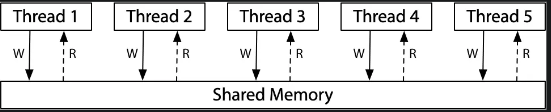
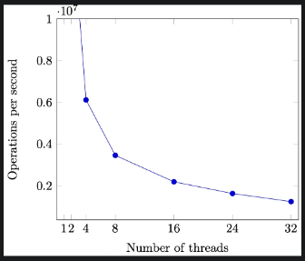
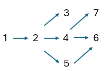
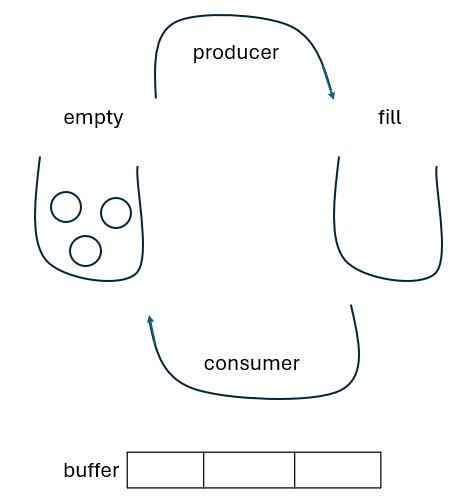
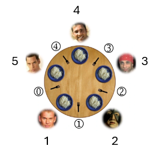
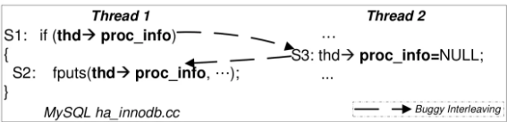
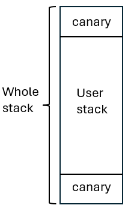

# 并发

## Lecture 5 多处理器编程
!!! abstract "Take-away Messages"

    在简化多线程的模型中，并发程序就是 “状态机的集合”，每一步选一个状态机执行一步。然而，真实的系统却因为 “编译器” 的无处不在，使共享内存并发的行为十分复杂。

    不幸的是，人类本质上是物理世界 (宏观时间) 中的 “sequential creature”，因此我们在编程时，我们的直觉也只习惯于单线程的顺序/选择/循环结构，真实多处理器上的并发编程是非常具有挑战性的 “底层技术”。在后续的课程中，我们将会提出若干并发控制技术，使得我们可以在需要的时候避免并发的发生，使并发程序退回到顺序程序，从而使我们能够理解和控制并发。

1. 简化的线程 API (thread.h)
    * `create(fn)`
        - 创建一个入口函数是 `fn` 的线程，并立即开始执行
            + `void fn(int tid) { ... }`
            + 参数 `tid` 从 1 开始编号
        - 行为：`sys_spawn(fn, tid)`
    * `join()`
        - 等待所有运行线程的返回 (也可以不调用)
        - 行为：`while (done != T) sys_sched()`
2. hello.c交替打印 a 和 b

    ```C
    #include "thread.h"

    void T_a() { while (1) { printf("a"); } }
    void T_b() { while (1) { printf("b"); } }

    int main() {
        create(T_a);
        create(T_b);
    }
    ```

    `top -d 0.5`: 查看进程的 CPU 占用率，可以看到 CPU 使用率近乎 200%，说明两个线程几乎同时运行。操作系统会自动把线程放置在不同的处理器上，以提高效率。

    ```bash
    PID   USER      PR   NI  VIRT   RES  SHR S %CPU   %MEM  TIME+   COMMAND
    26408 username  20   0   84796  956  868 S 196.0  0.0   0:43.42 hello
    ```

3. T_a 和 T_b 真的共享内存吗？→ memory.c

    ```C
    #include "thread.h"

    // We claim that n is shared among threads.
    int n;

    void T_hello(int id) {
        // To validate this claim, each thread reads and increments
        // n, and we expect to see different numbers being printed.
        int i = n++;
        printf("%d\n", i);
    }

    int main() {
        for (int i = 0; i < 10; i++) {
            create(T_hello);
        }
    }
    ```

4. 如何证明线程具有独立堆栈 (以及确定堆栈的范围)？→ stack.c

    ```C
    #include "thread.h"

    #define N 4

    char * volatile low[N];
    char * volatile high[N];

    void update_range(int T, char *ptr) {
        // We have a witness of thread T accessing stack pointer
        // ptr. So we keep this record.
        if (ptr < low[T]) {
            low[T] = ptr;
        }
        if (ptr > high[T]) {
            high[T] = ptr;
        }
    }

    void probe(int T, int n) {
        // Local variables are stack-allocated.
        char scratch[64];
        update_range(T, scratch);

        printf("Stack(T%d) >= %ld KB\n",
            T, (high[T] - low[T]) / 1024);

        probe(T, n + 1); // Infinite recursion.
    }

    void T_probe(int T) {
        T -= 1; // 创建的线程pid从1开始，所以T-1以拿到正确的low[T]
        low[T] = (char *)-1;  // 0xffffffffffffffff
        high[T] = (char *)0;  // 0x0000000000000000
        probe(T, 0);
    }

    int main() {
        // Disable printf buffering. Try to make more lines being
        // printed, because the program will eventually crash (and
        // all buffered contents are lost).
        setbuf(stdout, NULL);

        for (int i = 0; i < N; i++) {
            create(T_probe);
        }
    }
    ```

    程序输出：
    ```bash
    ----- Shared Memory Test -----
    0
    1
    2
    3
    4
    5
    6
    7
    8
    9
    ----- Stack Probe Test -----
    Segmentation fault (core dumped)
    Stack(T2) >= 8177 KB
    ```
    8177KB最接近8192KB，也就是说线程库默认提供的stack大小是8MB，这个大小足以够一般的程序使用了。

5. 对于并发编程，要舍弃一些我们之前对单线程顺序程序的理解:
    * 状态迁移原子性的假设: <span style="color:blue;">共享内存</span>推翻了 “原子性” 假设
        - 任何时候，load 读到的值都可能是别的线程写入的
        - 我们习以为常的简化会漏掉并发程序可能的行为
    * 程序顺序执行的假设: 编译器会试图优化状态迁移，改变执行流
    * 存在全局指令执行顺序的假设: 不同处理器可能看到不同的共享内存, “一个共享内存” 只是个简化的幻觉。由于动态指令调度和缓存的共同作用，实际程序的运行结果更可能超出我们的预期。

6. 状态迁移原子性的假设: alipay.c
    ```C
    #include "thread.h"

    unsigned long balance = 100;

    void Alipay_withdraw(int amt) {
        if (balance >= amt) {
            // Bugs may only manifest on specific timings. Sometimes
            // we reproduce bugs by inserting sleep()s.
            usleep(1); // 引发sys_sched()

            balance -= amt;
        }
    }

    void T_alipay() {
        Alipay_withdraw(100);
    }

    int main() {
        create(T_alipay);
        create(T_alipay);
        join();
        printf("balance = %lu\n", balance);
    }
    ```

    在usleep(1)的情况下输出是`balance = 18446744073709551516`，两个线程同时满足`balance >= amt`，相当于减了两次100。

7. 以下代码 sum 的最小值是2的情况：该线程执行到最后一个for循环时，load到的sum为1（注意不可能load到sum为0，因为对于本线程而言已经执行过两个for循环了，如果是load本线程的sum应当是2，一定是load别的线程改写后的sum。别的线程一定要至少执行过一次load-store把sum写进去，所以此时别的线程里sum最小为1），然后接着其他线程都执行完所有循环结束了。该线程继续执行完剩下的`t += 1; store(sum, t);`导致最后sum为2。
    ```C
    // 初始时 sum = 0; 假设单行语句的执行是原子的
    // 并发执行三个 T_sum，sum 的最小值是多少？→ 是2
    void T_sum() {
        for (int i = 0; i < 3; i++) {
            int t = load(sum);
            t += 1;
            store(sum, t);
        }
    }
    ```

8. sum.c：
    ```C
    #include "thread.h"

    #define N 100000000

    long sum = 0;

    void T_sum() {
        for (int i = 0; i < N; i++) {
            sum++;

            // Won't work even if we force a single-instruction
            // increment.

            // asm volatile(
            //     "incq %0" : "+m"(sum)
            // );
        }
    }

    int main() {
        create(T_sum);
        create(T_sum);

        join();

        printf("sum = %ld\n", sum);
        printf("2*n = %ld\n", 2L * N);
    }
    ```

    不同的编译优化输出不一样：

    * -O0输出`sum = 119137703 2*n = 200000000`

        ```bash
        00000000000013d9 <T_sum>:
            13d9:       f3 0f 1e fa             endbr64 
            13dd:       55                      push   %rbp
            13de:       48 89 e5                mov    %rsp,%rbp
            13e1:       c7 45 fc 00 00 00 00    movl   $0x0,-0x4(%rbp)
            13e8:       eb 16                   jmp    1400 <T_sum+0x27>
            13ea:       48 8b 05 4f 2c 00 00    mov    0x2c4f(%rip),%rax        # 4040 <sum>
            13f1:       48 83 c0 01             add    $0x1,%rax
            13f5:       48 89 05 44 2c 00 00    mov    %rax,0x2c44(%rip)        # 4040 <sum>
            13fc:       83 45 fc 01             addl   $0x1,-0x4(%rbp)
            1400:       81 7d fc ff e0 f5 05    cmpl   $0x5f5e0ff,-0x4(%rbp)
            1407:       7e e1                   jle    13ea <T_sum+0x11>
            1409:       90                      nop
            140a:       90                      nop
            140b:       5d                      pop    %rbp
            140c:       c3                      ret
        ```

    * -O1输出`sum = 100000000 2*n = 200000000`

        ```bash
        00000000000011e3 <T_sum>:
            11e3:       f3 0f 1e fa             endbr64 
            11e7:       48 8b 15 52 2e 00 00    mov    0x2e52(%rip),%rdx        # 4040 <sum>
            11ee:       48 8d 42 01             lea    0x1(%rdx),%rax
            11f2:       48 81 c2 01 e1 f5 05    add    $0x5f5e101,%rdx
            11f9:       48 89 c1                mov    %rax,%rcx
            11fc:       48 83 c0 01             add    $0x1,%rax
            1200:       48 39 d0                cmp    %rdx,%rax
            1203:       75 f4                   jne    11f9 <T_sum+0x16>
            1205:       48 89 0d 34 2e 00 00    mov    %rcx,0x2e34(%rip)        # 4040 <sum>
            120c:       c3                      ret
        ```

    * -O2输出`sum = 200000000 2*n = 200000000`，即便如此，直接变成一条addq指令，sum的输出仍旧不一定正确！如同alipay的例子一样如果加入usleep(1)还是可以看到每次结果都不一样。

        ```bash
        0000000000001260 <T_sum>:
            1260:       f3 0f 1e fa             endbr64 
            1264:       48 81 05 d1 2d 00 00    addq   $0x5f5e100,0x2dd1(%rip)        # 4040 <sum>
            126b:       00 e1 f5 05 
            126f:       c3                      ret
        ```

9. memory model:
    * 你以为的共享内存:
    
    * 实际的共享内存: 每个线程都有自己的内存副本，他们之间通过某种方式同步
    
    * x86：市面 “最强” 内存模型 (类比 ARM/RISC-V)
    

    mem_model.c:
    ```c
    #include <thread.h>
    #include <stdatomic.h>

    int x = 0, y = 0;
    atomic_int flag;

    #define F1  1
    #define F2  2

    #define FLAG \
        atomic_load(&flag)
    #define FLAG_XOR(val) \
        atomic_fetch_xor(&flag, val)
    #define WAIT_FOR(cond) \
        while (!(cond))    \
            ;

    __attribute__((noinline))
    void write_x_read_y() {
        int y_val;

        asm volatile(
            "movl $1, %0;" // x = 1
            "movl %2, %1;" // y_val = y
            : "=m"(x), "=r"(y_val)
            : "m"(y)
        );

        printf("%d ", y_val);
    }

    __attribute__((noinline))
    void write_y_read_x() {
        int x_val;

        asm volatile(
            "movl $1, %0;" // y = 1
            "movl %2, %1;" // x_val = x
            : "=m"(y), "=r"(x_val)
            : "m"(x)
        );

        printf("%d ", x_val);
    }

    void T_1(int id) {
        while (1) {
            // Wait until F1 is raised.
            WAIT_FOR((FLAG & F1));

            write_x_read_y();

            // Put F1 down.
            FLAG_XOR(F1);
        }
    }

    void T_2() {
        while (1) {
            // Wait until F2 is raised.
            WAIT_FOR((FLAG & F2));

            write_y_read_x();

            // Put F2 down.
            FLAG_XOR(F2);
        }
    }

    void T_flag() {
        while (1) {
            x = 0;
            y = 0;
            __sync_synchronize(); // full barrier
            usleep(1);            // + delay

            // Now, x = 0, y = 0, and flag = 0.
            // T_1 and T_2 should be waiting for their flags.
            assert(FLAG == 0);

            // flag = F1 | F2; Both flags are raised.
            FLAG_XOR(F1 | F2);

            // T1 and T2 are ready to go...
            // They will eventually put F1 and F2 down.
            WAIT_FOR(FLAG == 0);

            printf("\n");
            fflush(stdout);
        }
    }

    int main() {
        // All infinite loops
        create(T_1);
        create(T_2);
        create(T_flag);
    }
    ```

    `./mem-model  | head -n 10000 | sort | uniq -c`输出：
    ```bash
    7978 0 0 
    1783 0 1 
     237 1 0 
       2 1 1
    ```

    | T_1 | T_2 |
    | ---- | ---- |
    | ① x = 1 <br> ② load y | ③ y = 1 <br> ④ load x|

    出现0 0的原因是真正的memory model和我们想象的并不一样。处理器也是编译器:

    * 预取状态机执行的<span style="color:blue;">若干步</span>，然后像编译器一样优化
    * Load(x); Store(y)
    * x ≠ y → 两条指令执行的先后顺序就无所谓
    * Load cache miss → store 可以直接执行


## Lecture 6 并发控制：互斥 (1)
!!! abstract "Take-away Messages"

    并发编程 “很难”：想要完全理解并发程序的行为，是非常困难的——我们甚至可以利用一个 “万能” 的调度器去帮助我们求解 NP-完全问题。因此，人类应对这种复杂性的方法就是退回到不并发。通过互斥实现 stop/resume the world，我们就可以使并发程序的执行变得更容易理解——而只要程序中 “能并行” 的部分足够多，串行化一小部分也并不会对性能带来致命的影响。

1. 实现互斥：Stop the World。能否使当前程序状态机独占计算机系统？
    * 单处理器系统中 “其他任何事”：仅有中断，因此关中断即可。例如x86中`cli` 清除 `eflags` 中的 `IF` bit即可关中断。注意：只有操作系统内核可以关中断，用户程序关中断会Segmentation fault。
    * 但是注意处理器有不可屏蔽中断 NMI (Non-Maskable Interrupts)，可以利用 NMI 实现错误监控
        - 设置硬件定时触发
        - 操作系统定时复位定时器
        - 触发 timeout，执行 NMI 处理程序，例如重启计算机
    * 而且单处理器系统关中断可以，多处理器系统不行
        - 每个处理器有独立的寄存器组
        - 中断是每个处理器内部状态
2. Peterson 算法：厕所是临界资源，需要<span style="color:blue;">互斥使用</span>。（**注意Peterson 算法仅仅能解决两个线程互斥的情况**）
    * 若希望进入厕所，按顺序执行以下操作：
        1. 举起自己的旗子 (store)
        2. 把写有对方名字的字条贴在厕所门上 (store; 覆盖)（看起来是谦让，实际上是利己）
    * 然后进入持续的观察模式：
        1. 观察对方是否举旗 (load)
        2. 观察厕所门上的名字 (load)
            - <span style="color:blue;">对方不举旗或厕所门上的名字是自己，进入厕所，否则继续观察</span>
    * 出厕所后，放下自己的旗子
        - <span style="color:blue;">不用管门上的字条</span>
3. Peterson 算法进入临界区的情况
    * 如果只有一个人举旗，他就可以直接进入
    * 如果两个人同时举旗，由厕所门上的标签决定谁进
        - 手快有(被另一个人的标签覆盖)、手慢无
    
    代码实现：（仅为模型算法，并非正确的实现，因为模型的假设：Atomic load & store，但这个假设在现代多处理器上并不成立，除非使用内存屏障 Memory Barrier `__sync_synchronize()`(= Compiler Barrier + x86: `mfence`)）
    ```C
    a = 1;    // 举起自己的旗子
    turn = B; // 贴上对方的名字
    do {      // 进入持续观察模式
    } while (b && turn == B); // 对方举旗且门上是对方的的名字

    // 临界区

    a = 0;    // 放下自己的旗子

    /* b 同理 =================== */
    b = 1;
    turn = A;
    do {
    } while (a && turn == A);

    // 临界区

    b = 0;
    ```

4. Peterson 算法探究，如果有两个线程同时进入临界区，会有cs同时为1/2的情况。通过mosaic model checker `mosaic -c peterson.py | grep \"cs\" | sort | uniq`的输出可以看到没有同时为1/2的情况。

    ```bash
    "cs": ""
    "cs": "❶"
    "cs": "❷"
    ```

    ```python
    def T1():
        while True:
            heap.x = '🏴'    # T1的旗子
            sys_sched()
            heap.turn = '❷'   # 厕所门上的标签
            sys_sched()
            while True:
                t = heap.turn
                sys_sched()
                y = heap.y != ''
                sys_sched()
                if not y or t == '❶':
                    break
            sys_sched()
            heap.cs += '❶'   # 进厕所后写cs为1
            sys_sched()
            heap.cs = heap.cs.replace('❶', '') # 出厕所后删除cs
            sys_sched()
            heap.x = ''
            sys_sched()
    
    def T2():
        while True:
            heap.y = '🏁'
            sys_sched()
            heap.turn = '❶'
            sys_sched()
            while True:
                t = heap.turn
                sys_sched()
                x = heap.x
                sys_sched()
                if not x or t == '❷':
                    break
                sys_sched()
            sys_sched()
            heap.cs += '❷'
            sys_sched()
            heap.cs = heap.cs.replace('❷', '')
            sys_sched()
            heap.y = ''
            sys_sched()

    def main():
        heap.x = ''
        heap.y = ''
        heap.turn = ''
        heap.cs = ''
        sys_spawn(T1)
        sys_spawn(T2)
    ```

5. 真正正确的perterson算法实现：

    ```C
    #include <thread.h>
    #include <stdatomic.h>

    #define A 1
    #define B 2

    // The caveat is: no matter how many times we run this test
    // without seeing it fail, we cannot be certain that we have
    // inserted sufficient barriers. Understanding the correctness
    // of this code is far beyond the scope of this course.
    // 
    #define BARRIER __sync_synchronize()
    //
    // Peterson's algorithm is wrong without proper barriers:
    //
    // #define BARRIER

    atomic_int inside;
    long count;

    void critical_section() {
        // We expect this thread executing code exclusively,
        // if the critical section is correctly implemented.
    
        assert(
            // assert(inside == 0);
            // inside++
            atomic_fetch_add(&inside, +1) == 0
        );

        // On some machines, printing a character will hide
        // the bug!
        // putchar('.');

        assert(
            // assert(inside == 1);
            // inside--
            atomic_fetch_add(&inside, -1) == 1
        );
    }

    int volatile a = 0, b = 0, turn;

    void T_A() {
        while (1) {
            a = 1;                    BARRIER;
            turn = B;                 BARRIER; // <- this is critcal for x86
            while (1) {
                if (!b) break;        BARRIER;
                if (turn != B) break; BARRIER;
            }

            // T_B can't execute critical_section now.
            critical_section();

            a = 0;                    BARRIER;
        }
    }

    void T_B() {
        while (1) {
            b = 1;                    BARRIER;
            turn = A;                 BARRIER;
            while (1) {
                if (!a) break;        BARRIER;
                if (turn != A) break; BARRIER;
            }

            // T_A can't execute critical_section now.
            critical_section();

            b = 0;                    BARRIER;
        }
    }

    int main() {
        create(T_A);
        create(T_B);
    }
    ```

6. 在多处理器上实现互斥: <span style="color:blue;">**软件不够，硬件来凑**</span>, 硬件提供原子指令 - 前缀`lock`
    * 原子指令：一小段时间的 “Stop the World” 执行
    * 不可打断的 load + 计算 + store
        - x86: Bus Lock; RISC-V: LR/SC (来自 MIPS) + atomic
    * 在多处理器上实现正确的 1 + 1：`asm volatile("lock addq $1, %0" : "+m"(sum));` or `asm volatile("lock incq %0" : "+m"(sum));`

7. 通过硬件原子指令`atomic_xchg` or `lock cmpxchgl`实现自旋锁：

    ```C
    int status = ✅; // 此时厕所门是✅，我们想用❌去换它，got得到✅是想要的状态，否则就重新尝试

    void lock() {
    retry:
        int got = atomic_xchg(&status, ❌);
        if (got != ✅) {
            goto retry;
        }
    }

    void unlock() {
        atomic_xchg(&status, ✅);
    }
    ```

    sum-locked.c得到正确的求和sum:
    ```C
    #include <thread.h>

    // We create 3 threads in this example.
    #define T        3
    #define N  1000000

    #define LOCKED   1
    #define UNLOCKED 0

    int status = UNLOCKED;

    void lock() {
        int expected;
        do {
            // Try compare status with expected.
            // If the comparison succeeded, perform
            // an exchange.
            expected = UNLOCKED;
            asm volatile (
                "lock cmpxchgl %2, %1"
                : "+a" (expected) // Value for comparison.
                                // x86 uses eax/rax.
                : "m" (status),   // Memory location.
                "r" (LOCKED)    // Value to be written if
                                // status == expected
                : "memory", "cc"
            );
        } while (expected != UNLOCKED);
    }

    void unlock() {
        // To be safer:
        //
        // asm volatile (
        //     "movl %1, %0"
        //     : "=m" (status)
        //     : "r" (UNLOCKED)
        //     : "memory"
        // );

        // But actually we can do this:
        asm volatile("" ::: "memory");
        status = UNLOCKED;
    }


    long volatile sum = 0;

    void T_sum(int tid) {
        for (int i = 0; i < N; i++) {
            lock();

            // This critical section is even longer; but
            // it should be safe--the world is stopped.
            // We also marked sum as volatile to make
            // sure it is loaded and stored in each
            // loop iteration.
            for (int _ = 0; _ < 10; _++) {
                sum++;
            }

            unlock();
        }

        printf("Thread %d: sum = %ld\n", tid, sum);
    }

    int main() {
        for (int i = 0; i < T; i++) {
            create(T_sum);
        }

        join();

        printf("sum  = %ld\n", sum);
        printf("%d*n = %ld\n", T * 10, T * 10L * N);
    }
    ```

    然而，在用户态实现自旋锁有个问题：一个核占用了这个lock后，假设中断来了切换到了其他核心上的线程，也想拥有这把lock，由于之前的lock没有被释放，其他核心上的线程就会一直自旋等待，浪费资源。另一种情况是，假设中断到来，中断处理程序本身也想访问这个lock保护的内容，然而因为lock没有被释放，中断处理程序会一直等待，陷入死锁。实际上操作系统内核态的自旋锁实现时会关中断。

8. 上述代码里`unlock()`里需要compiler barrier`asm volatile("" ::: "memory");`的原因：
    * 从循环 10 次改成循环 1 次，sum 错了！
    * 防止编译器做优化，否则编译器在编译的时候，直接把`unlock()`代码复制到到sum++之后，可能的优化是，先做释放锁，再做sum++，就会有问题。

    错误代码：
    ```C
    void unlock() {
        status = UNLOCKED;
    }
    ``` 
    编译后：
    ```asm
    movq    sum(%rip), %rax
    andl    $0, status(%rip)
    addq    $1, %rax
    movq    %rax, sum(%rip)
    ```

    正确代码：
    ```C
    void unlock() {
        asm volatile("" ::: "memory");
        status = UNLOCKED;
    }
    ``` 
    编译后：
    ```asm
    movq    sum(%rip), %rax
    addq    $1, %rax
    movq    %rax, sum(%rip)
    andl    $0, status(%rip)
    ```

    [Compiler Explorer](https://godbolt.org/z/r1h1bMe7h)

## Lecture 7 并发控制：互斥 (2)
!!! abstract "Take-away Messages"

    “互斥” 看起来简单，用自旋锁就能实现，但如果在实际的场景 (例如可被中断的操作系统内核、不希望浪费 CPU 资源的应用程序等)，实际的互斥实现就不再简单。我们在 xv6 的自旋锁实现中，发现了许多 “防御性编程” 的例子，先假设程序员可能会犯一切可能的错误——然后不断加以检查。而 “正确性完全由开发者负责” 的时代将要过去，我们将会在未来越来越多地看到编程语言中的机制，帮助我们写出正确的代码。

1. 操作系统内核中的自旋锁实现：利用计算机系统状态机的视角，操作系统内核中的自旋锁不仅要实现处理器间的互斥，还要正确处理中断，以及锁的嵌套。当多个需求叠加时，作出一个正确的实现就不再显然。

    ```C
    #include <am.h>
    #include <spinlock.h>

    // This is a ported version of spin-lock
    // from xv6-riscv to AbstractMachine:
    // https://github.com/mit-pdos/xv6-riscv

    void push_off();
    void pop_off();
    bool holding(spinlock_t *lk);

    void spin_lock(spinlock_t *lk) {
        // Disable interrupts to avoid deadlock.
        push_off();

        // This is a deadlock.
        if (holding(lk)) {
            panic("acquire %s", lk->name);
        }

        // This our main body of spin lock.
        int got;
        do {
            got = atomic_xchg(&lk->status, LOCKED);
        } while (got != UNLOCKED);

        lk->cpu = mycpu;
    }

    void spin_unlock(spinlock_t *lk) {
        if (!holding(lk)) {
            panic("release %s", lk->name);
        }

        lk->cpu = NULL;
        atomic_xchg(&lk->status, UNLOCKED);

        pop_off();
    }

    // Check whether this cpu is holding the lock.
    // Interrupts must be off.
    bool holding(spinlock_t *lk) {
        return (
            lk->status == LOCKED &&
            lk->cpu == &cpus[cpu_current()]
        );
    }

    // push_off/pop_off are like intr_off()/intr_on()
    // except that they are matched:
    // it takes two pop_off()s to undo two push_off()s.
    // Also, if interrupts are initially off, then
    // push_off, pop_off leaves them off.
    void push_off(void) {
        int old = ienabled();
        struct cpu *c = mycpu;

        iset(false);
        if (c->noff == 0) {
            c->intena = old;
        }
        c->noff += 1;
    }

    void pop_off(void) {
        struct cpu *c = mycpu;

        // Never enable interrupt when holding a lock.
        if (ienabled()) {
            panic("pop_off - interruptible");
        }
        
        if (c->noff < 1) {
            panic("pop_off");
        }

        c->noff -= 1;
        if (c->noff == 0 && c->intena) {
            iset(true);
        }
    }
    ```

    ```bash
    直观想法:
    关本CPU的中断
        |
      lock
        |
      sum++
        |
      unlock
        |
    开本CPU的中断 (❌, 如果在想进临界区做sum++之前本身中断就是关的呢？这样结束岂不是误开了中断，并没有恢复到之前的状态)

    正确做法:
    关本CPU的中断
        |
      lock
        |
      sum++
        |
      unlock
        |
    恢复本CPU的中断情况 (巧妙利用c->noff来记录次数, 并且只有一开始就是开中断的时候: c->intena, 才开中断)
    ```

2. 自旋的后果: 同一份计算任务，时间 (CPU cycles) 和空间 (内存占用) 会随处理器数量的增长而变化。用自旋锁实现 sum++: 更多的处理器, 更差的性能（因为其他cpu都在空转，cpu利用率下降了）。也就是说，自旋锁的scalability很差，并不是线性变化的。

    { width=50%, height=50% }

    一个非常聪明的想法：Read-copy-update
    ```C
    Counter *c_current;

    int get() {
        // Read
        Counter *c = c_current;
        return c->sum;
    }

    void increment() {
        SPIN_LOCKED {
            // Copy
            Counter *c = alloc_counter();
            c->sum = c_current->sum + 1;
            smp_wmb(); // Memory barrier

            // Update
            c_current = c;
        }
    }
    ```

    利用操作系统内核对象具有 “read-mostly” 的特点（也就是读写不对称，修改不频繁，但读却很频繁），可以在读的时候不上锁，只有写的时候上锁，而且写的时候是在自己的副本上写，然后再把指针指向自己的副本。这样做牺牲了读写一致性，有的线程也许会读到旧的版本，但我们认为这是可以接受的。旧版本对象会存在一个 “graceful period”，直到某个时刻，所有 CPU read 都会访问到新版本。这样大多数读的情况没必要使用自旋锁，减少其他 CPU 空转的时间从而提高 CPU 利用率。

    读写不对称的例子：Linux用户和组信息

    * 无时不刻在检查 (Permission Denied)
    * 但几乎从不修改用户

3. 应用程序中的互斥: 应用程序如何较好地使用自旋锁？
    * 性能问题 (1)：除了进入临界区的线程，其他处理器上的线程都在空转
        - 争抢锁的处理器越多，利用率越低
        - 如果临界区较长，不如把处理器让给其他线程
    * 性能问题 (2)：应用程序不能关中断
        - 持有自旋锁的线程被切换
        - 导致 100% 的资源浪费
        - (如果应用程序能 “告诉” 操作系统就好了)
    
    解决：通过`syscall`把锁的实现放到操作系统里就好啦

    * `syscall(SYSCALL_lock, &lk);`
        - 试图获得 `lk`，但如果失败，就切换到其他线程
    * `syscall(SYSCALL_unlock, &lk);`
        - 释放 `lk`，如果有等待锁的线程就唤醒

    ```C
    pthread_mutex_t lock;
    pthread_mutex_init(&lock, NULL);

    pthread_mutex_lock(&lock);
    pthread_mutex_unlock(&lock);
    ```

    ```bash
                       T1
                        |
                    syscall(acquire, lock)
                        |
    --------------- Enter OS kernel --------------- 
    |                                             |
    | OS spin lock locked                         |
    |                                             |
    |    try aquire lock:                         |
    |        if fail: mark as wait for the lock,  |
    |                 switch to other tasks       |
    |                                             |
    | OS spin lock released                       |
    --------------- Exit OS kernel ----------------

                       T2
                        |
                    syscall(release, lock)
                        |
    --------------- Enter OS kernel --------------- 
    |                                             |
    | OS spin lock locked                         |
    |                                             |
    |    release lock:                            |
    |        T1 is waiting for the lock:          |
    |           awake T1                          |
    |                                             |
    | OS spin lock released                       |
    --------------- Exit OS kernel ----------------
    ```

4. 进阶的Futex: Fast Userspace muTexes
    * Fast Path: 自旋一次。无人争抢时，无需动用`syscall`，直接进临界区
        - 一条原子指令，成功直接进入临界区
    * Slow Path: 自旋失败。有人争抢时，才需要用到`syscall`
        - 请求系统调用 `futex_wait`


## Lecture 8 调试理论与实践
1. 需求 → 设计 → 代码 (<span style="color:blue;">Fault/bug</span>) → 执行 (<span style="color:blue;">Error</span>) → 失败 (<span style="color:blue;">Failure</span>)

## Lecture 9 并发控制：同步 (1)
!!! abstract "Take-away Messages"

    同步的本质是线程需要等待某件它所预期的事件发生，而事件的发生总是可以用条件 (例如 depth 满足某个条件，或是程序处于某个特定的状态) 来表达。因此计算机系统的设计者实现了<span style="color:blue;">条件变量</span>，将条件检查和临界区 “放在一起”，以实现线程间的同步。这是万能的同步方法。

1. Synchronization 同步：控制并发，使得 “两个或两个以上随时间变化的量在变化过程中保持一定的相对关系”。例子：
    * 演奏音乐中的同步
        - 每个乐手都是一个 “线程”
        - 节拍 i 到达 → 演奏 ni
    * 你与室友约定在23:59:59在学活门口相见
    * 相当于世界线的收束，此前线程都各自执行，但是在某个时间节点时需要同步，然后再各自执行。在某个瞬间达到 “互相已知” 的状态，“先到先等”，在条件达成的瞬间再次恢复并行

    ```C
    void T_player() {
        while (!end) {
            wait_next_beat();
            play_next_note();
        }
    }

    void T_conductor() {
        while (!end) {
            wait_next_beat();
            release(); // release() 之后，player 都会演奏下一拍
        }
    }

    // 自旋实现
    void wait_next_beat(int expect) {
        // This is a spin-wait loop.
    retry:
        mutex_lock(&lk);
        // This read is protected by a mutex.
        int got = n;
        mutex_unlock(&lk);

        if (got != expect) goto retry;
    }
    ```

2. 经典同步问题：生产者-消费者问题
    * Producer 和 Consumer 共享一个缓冲区
        - Producer (生产数据)： 如果缓冲区有空位，放入；否则等待
        - Consumer (消费数据)：如果缓冲区有数据，取走；否则等待

    例子：
    ```C
    void produce() { printf("("); }
    void consume() { printf(")"); }
    ```

    * 生产 = 打印左括号 (push into buffer)
    * 消费 = 打印右括号 (pop from buffer)
    * 在 `printf` 前后增加代码，使得打印的括号序列满足
        - 一定是某个合法括号序列的前缀
        - 括号嵌套的深度不超过 n
            + n = 3, `((())())(((` 合法
            + n=3, `(((()))), (()))` 不合法
    
    pc-1.c: 错误的自旋实现
    ```C
    #include <thread.h>
    #include <thread-sync.h>

    mutex_t lk = MUTEX_INIT();

    int n, depth = 0;

    void T_produce() {
        while (1) {
    retry:
            mutex_lock(&lk);
            int ready = (depth < n);
            mutex_unlock(&lk);
            if (!ready) goto retry;

            assert(depth < n); // ❌, 此时lk已经被释放，如果被切换到别的线程，别
            // 的线程可能会更改depth，因此depth < n 不一定成立，这个assert会触发

            mutex_lock(&lk);
            printf("(");
            depth++;
            mutex_unlock(&lk);
        }
    }

    void T_consume() {
        while (1) {
    retry:
            mutex_lock(&lk);
            int ready = (depth > 0);
            mutex_unlock(&lk);
            if (!ready) goto retry;

            assert(depth > 0);

            mutex_lock(&lk);
            printf(")");
            depth--;
            mutex_unlock(&lk);
        }
    }
    ```

    pc-2.c: 正确的自旋实现（然而自旋浪费了CPU）
    ```C
    #include <thread.h>
    #include <thread-sync.h>

    mutex_t lk = MUTEX_INIT();

    int n, depth = 0;

    void T_produce() {
        while (1) {
    retry:
            mutex_lock(&lk);
            if (!(depth < n)) {
                mutex_unlock(&lk); // 如果不满足条件，就立马释放锁
                goto retry; // 浪费CPU❗
            }

            // ✅能走到这里说明一定满足条件 depth < n，
            // 因此可以安全地修改共享状态，此时锁也没被释放掉

            // The check of sync condition (depth < n) is within
            // the same critical section. As long as we safely
            // protected the shared state, this condition should
            // always hold at this point.
            assert(depth < n);

            printf("(");
            depth++;

            // And at this point, the condition (depth > 0) is
            // satisfied. However, a consumer could proceed with
            // checking depth only if the lock is released.
            mutex_unlock(&lk);
        }
    }

    void T_consume() {
        while (1) {
    retry:
            mutex_lock(&lk);
            if (!(depth > 0)) {
                mutex_unlock(&lk);
                goto retry;
            }

            assert(depth > 0);

            printf(")");
            depth--;

            mutex_unlock(&lk);
        }
    }
    ```

    pc-cv.c: 错误的条件变量实现
    ```C
    #include <thread.h>
    #include <thread-sync.h>

    int n, depth = 0;
    mutex_t lk = MUTEX_INIT();
    cond_t cv = COND_INIT();
    
    #define CAN_PRODUCE (depth < n)
    #define CAN_CONSUME (depth > 0)

    void T_produce() {
        while (1) {
            mutex_lock(&lk);

            if (!CAN_PRODUCE) { // ❌, 应该是while，而不是if，因为被唤醒
                                // 后有可能又被别的线程抢掉了，条件又不满足，
                                // 需要重新检查条件

                // 本质原因：producer和consumer等待的不是同一个条件，所以不能用同
                // 一个条件变量cv。用同一个条件变量，就相当于唤醒的时候多唤醒了，多
                // 唤醒的要自己检查自己条件是否满足

                cond_wait(&cv, &lk);
                // This is subtle. Seemingly "more efficient"
                // implementation is dangerous for newbies.
            }

            printf("(");
            depth++;

            cond_signal(&cv);
            mutex_unlock(&lk);
        }
    }

    void T_consume() {
        while (1) {
            mutex_lock(&lk);

            if (!CAN_CONSUME) {
                cond_wait(&cv, &lk);
            }

            printf(")");
            depth--;

            cond_signal(&cv);
            mutex_unlock(&lk);
        }
    }
    ```

    pc-cv-broadcast.c: 正确的条件变量实现
    ```C
    #include <thread.h>
    #include <thread-sync.h>

    int n, depth = 0;
    mutex_t lk = MUTEX_INIT();
    cond_t cv = COND_INIT();
    
    #define CAN_PRODUCE (depth < n)
    #define CAN_CONSUME (depth > 0)

    void T_produce() {
        while (1) {
            mutex_lock(&lk);

            while (!CAN_PRODUCE) {
                cond_wait(&cv, &lk); // wait时: 释放锁，切换到别的线程
                // We are here if the thread is being waked up, with
                // the mutex being acquired. Then we check once again,
                // and move out of the loop if CAN_PRODUCE holds.

                // 回来这里时: 获得锁，然后下一轮while检查条件
            }

            // We still hold the mutex--and we check again.
            assert(CAN_PRODUCE);

            printf("(");
            depth++;

            cond_broadcast(&cv);
            mutex_unlock(&lk);
        }
    }

    void T_consume() {
        while (1) {
            mutex_lock(&lk);

            while (!CAN_CONSUME) {
                cond_wait(&cv, &lk);
            }

            printf(")");
            depth--;

            cond_broadcast(&cv);
            mutex_unlock(&lk);
        }
    }
    ```

3. “万能” 的同步方法：条件变量（条件不满足时等待，条件满足时唤醒）

    ```C
    mutex_t lk = MUTEX_INIT();
    cond_t cv = COND_INIT();

    //------------------------------------------------
    mutex_lock(&lk);
    while (!condition) {
        cond_wait(&cv, &lk);
    }
    // Wait for someone for wake-up.
    assert(condition);

    mutex_unlock(&lk);

    //------------------------------------------------
    cond_signal(&cv);     // Wake up a (random) thread
    cond_broadcast(&cv);  // Wake up all threads
    ```

    条件变量的正确打开方式：

    * 使用 while 循环和 broadcast
        - 总是在唤醒后再次检查同步条件
        - 总是唤醒所有潜在可能被唤醒的人
    * 在解决同步问题时，关键在于理解 “同步成功” 的条件是什么。

4. 同步机制的应用
    * 有三种线程
        - `Ta`若干：死循环打印 `<`
        - `Tb`若干：死循环打印 `>`
        - `Tc`若干：死循环打印 `_`
    * 任务：
        - 对线程同步，使得屏幕打印出 `<><_` 和 `><>_` 的组合

    !!! question "同步成功的条件是什么"

        使用条件变量，只要回答三个问题：打印 `<` 的条件？打印 `>` 的条件？打印 `_` 的条件？

    利用状态机视角来解决：
    

    ```C
    #include "thread.h"
    #include "thread-sync.h"

    #define LENGTH(arr) (sizeof(arr) / sizeof(arr[0]))

    enum { A = 1, B, C, D, E, F, };

    struct rule {
    int from, ch, to;
    } rules[] = {
        {A, '<', B},
        {B, '>', C},
        {C, '<', D},
        {A, '>', E},
        {E, '<', F},
        {F, '>', D},
        {D, '_', A},
    };

    int current = A, quota = 1;

    mutex_t lk = MUTEX_INIT();
    cond_t cv = COND_INIT();

    int next(char ch) {
        for (int i = 0; i < LENGTH(rules); i++) {
            struct rule *rule = &rules[i];
            if (rule->from == current && rule->ch == ch) {
            return rule->to;
            }
        }
        return 0;
    }

    static int can_print(char ch) {
        return next(ch) != 0 && quota > 0;
    }

    void fish_before(char ch) {
        mutex_lock(&lk);
        while (!can_print(ch)) {
            cond_wait(&cv, &lk);
        }
        quota--;
        mutex_unlock(&lk);
    }

    void fish_after(char ch) {
        mutex_lock(&lk);
        quota++;
        current = next(ch);
        assert(current);
        cond_broadcast(&cv);
        mutex_unlock(&lk);
    }

    const char roles[] = ".<<<<<>>>>___";

    void fish_thread(int id) {
        char role = roles[id];
        while (1) {
            fish_before(role);
            putchar(role); // Not lock-protected
            fish_after(role);
        }
    }

    int main() {
        setbuf(stdout, NULL);
        for (int i = 0; i < strlen(roles); i++)
            create(fish_thread);
    }
    ```

## Lecture 10 并发控制：同步 (2)
!!! abstract "Take-away Messages"

    信号量可以看做是互斥锁的一个 “推广”，可以理解成游泳馆的手环、袋子里的球，通过计数的方式实现同步——在符合这个抽象时，使用信号量能够带来优雅的代码。但信号量不是万能的——理解线程同步的条件才是真正至关重要的。

1. E. W. Dijkstra 发明的另一种共享内存系统中常用的同步方法：信号量。 
    
    用互斥锁实现同步, 一个奇妙的想法:

    * 创建锁时，立即 “获得” 它 (总是成功)
    * 其他人想要获得时就会等待
        - 此时 release 就实现了同步
    * 一个线程上锁，在另一个线程解锁 😂 (实际代码这么写是Undefined behavior)

    用互斥锁实现计算图, Acquire-Release 实现计算图:

    * 为每一条边 `e = (u,v)` 分配一个互斥锁 🔒
    * 初始时，全部处于锁定状态
    * 对于一个节点，它需要获得所有入边的锁才能继续
        - 可以直接计算的节点立即开始计算
    * 计算完成后，释放所有出边对应的锁

        example：

        

    ```C
    #include <thread.h>
    #include <thread-sync.h>
    #include <unistd.h>

    #define LENGTH(arr) (sizeof(arr) / sizeof(arr[0]))

    const int N = 7;

    struct Edge {
        int from, to;
        mutex_t mutex;
    } edges[] = {
        {1, 2, MUTEX_INIT()},
        {2, 3, MUTEX_INIT()},
        {2, 4, MUTEX_INIT()},
        {2, 5, MUTEX_INIT()},
        {4, 6, MUTEX_INIT()},
        {5, 6, MUTEX_INIT()},
        {4, 7, MUTEX_INIT()},
    };

    void T_worker(int id) {
        for (int i = 0; i < LENGTH(edges); i++) {
            struct Edge *e = &edges[i];
            if (e->to == id) {
                mutex_lock(&e->mutex);
            }
        }

        printf("Start %d\n", id);
        sleep(1);
        printf("End %d\n", id);
        sleep(1);

        for (int i = 0; i < LENGTH(edges); i++) {
            struct Edge *e = &edges[i];
            if (e->from == id) {
                // Well... This is undefined behavior
                // for POSIX threads. This is just a
                // hack for demonstration.
                mutex_unlock(&e->mutex);
            }
        }
    }

    int main() {
        for (int i = 0; i < LENGTH(edges); i++) {
            struct Edge *e = &edges[i];
            mutex_lock(&e->mutex);
        }

        for (int i = 0; i < N; i++) {
            create(T_worker);
        }
    }
    ```

2. 本质：“Release as Synchronization”

    Release-Acquire 实现了 <span style="color:blue;">happens-before</span>
    
    * Acquire = 等待 token，往袋子里取球 (如果此时袋里没有球，则需要等待)，P
    * Release = 发出 token，往袋子里放球 (如果有人在等待，直接把球交给他)，V
    * 注意我们可以有多个口袋

    信号量的 API: (信号量实际上是特殊的条件变量，隐含了一个特别的条件: 球的数量大于 0)
    ```C
    void P(sem_t *sem) {
        // P - prolaag
        //     try + decrease/down/wait/acquire
        atomic {
            wait_until(sem->count > 0) {
                sem->count--;
            }
        }
    }

    void V(sem_t *sem) {
        // V - verhoog
        //     increase/up/post/signal/release
        atomic {
            sem->count++;
        }
    }
    ```

3. 信号量的两种典型应用
    1. 实现一次临时的 happens-before: 
        * A → V(s) → P(s)  → B
            - 这就是刚才的 “互斥锁实现同步”
    2. 管理计数型资源
        * 游泳池里的人不能超过 n 个
        * 停车场里的车不能超过 n 个
        * 但可以有多个 “停车场”、“游泳池”
        * 我们也可以创造出车位

4. 例子1：使用信号量实现线程 join()：我们既可以用一个信号量实现一次临时的 happens-before，也可以用一个计数型信号量等待数量正确的线程结束。
    ```C
    #include <thread-sync.h>

    sem_t done[16];
    int count = 0;

    void worker_init(int T) {
        count = T;
        for (int i = 1; i <= T; i++) {
            SEM_INIT(&done[i], 0);
        }
    }

    void worker_done(int id) {
        V(&done[id]);
    }

    void worker_join() {
        for (int i = 1; i <= count; i++) {
            P(&done[i]);
        }
    }
    ```

    例子2：优雅地实现生产者-消费者。生产者把球从 empty 口袋取走，打印之后把球放入 fill 口袋；消费者则恰好相反。整个系统满足 empty + fill + 正在打印的线程 = 缓冲区大小的全局约束。
    ```C
    void produce() {
        P(&empty);
        printf("(");
        V(&fill);
    }

    void consume() {
        P(&fill);
        printf(")");
        V(&empty);
    }
    ```
    

5. 信号量 v.s. 条件变量
    * 信号量
        - 互斥锁的自然推广
        - 干净、优雅：没有条件变量的 “自旋”
    * 条件变量
        - 万能：适用于任何同步条件
        - 不太好用：代码总感觉不太干净

    例子：哲学家吃饭问题 (E. W. Dijkstra, 1960)

    * 哲学家 (线程) 有时思考，有时吃饭
    * 吃饭需要同时得到左手和右手的叉子
    
    

    条件变量

    * 同步条件：`avail[lhs] && avail[rhs]`
    * 背模板即可，一定正确✅

    信号量

    * `P(&sem[lhs]) && P(&sem[rhs])`
    * 看起来没什么问题？面对复杂的同步条件，容易出错...

    ```C
    #include <thread.h>
    #include <thread-sync.h>

    #define N 5

    sem_t avail[N];

    void Tphilosopher(int id) {
        int lhs = (id + N - 1) % N; // id - 1可能为负数，故 + N
        int rhs = id % N;

        while (1) {
            P(&avail[lhs]);
            printf("+ %d by T%d\n", lhs, id); // ❌, 如果 5 个哲学家同时举起
                                              // 左手的叉子 -> 死锁了
            P(&avail[rhs]);
            printf("+ %d by T%d\n", rhs, id);

            // Eat.
            // Philosophers are allowed to eat in parallel.

            printf("- %d by T%d\n", lhs, id);
            printf("- %d by T%d\n", rhs, id);
            V(&avail[lhs]);
            V(&avail[rhs]);
        }
    }

    int main() {
        for (int i = 0; i < N; i++) {
            SEM_INIT(&avail[i], 1);
        }

        for (int i = 0; i < N; i++) {
            create(Tphilosopher);
        }
    }
    ```

    * 如果 5 个哲学家同时举起左手的叉子……死锁了
        - 我们需要禁止这件事发生
    
    信号量Workaround 1: 从桌子上赶走一个人

    * 直观理解：大家先从桌上退出
        - 袋子里有 4 张卡
        - 拿到卡的可以上桌吃饭 (拿叉子)
        - 吃完以后把卡归还到袋子
    
    ```C
    #include <thread.h>
    #include <thread-sync.h>

    #define N 5

    sem_t table;
    sem_t avail[N];

    void Tphilosopher(int id) {
        int lhs = (id + N - 1) % N;
        int rhs = id % N;

        while (1) {
            // Come to table
            P(&table);

            P(&avail[lhs]);
            printf("+ %d by T%d\n", lhs, id);
            P(&avail[rhs]);
            printf("+ %d by T%d\n", rhs, id);

            // Eat.
            // Philosophers are allowed to eat in parallel.

            printf("- %d by T%d\n", lhs, id);
            printf("- %d by T%d\n", rhs, id);
            V(&avail[lhs]);
            V(&avail[rhs]);

            // Leave table
            V(&table);
        }
    }

    int main() {
        SEM_INIT(&table, N - 1); // ✅ 保证桌子上至多有 N - 1 个人


        for (int i = 0; i < N; i++) {
            SEM_INIT(&avail[i], 1); // N个袋子，每个袋子里至多1个叉子
        }

        for (int i = 0; i < N; i++) {
            create(Tphilosopher);
        }
    }
    ```
    
    信号量Workaround 2: Lock Ordering

    * 给叉子编号，总是先拿编号小的

    ```C
    #include <thread.h>
    #include <thread-sync.h>

    #define N 5

    sem_t avail[N];

    void Tphilosopher(int id) {
        int lhs = (id + N - 1) % N;
        int rhs = id % N;

        while (1) {
            if (lhs < rhs) // ✅保证编号小的先拿
            {
                P(&avail[lhs]);
                P(&avail[rhs]);
            }
            else
            {
                P(&avail[rhs]);
                P(&avail[lhs]);
            }
            printf("+ %d by T%d\n", lhs, id);
            printf("+ %d by T%d\n", rhs, id);

            // Eat.
            // Philosophers are allowed to eat in parallel.

            printf("- %d by T%d\n", lhs, id);
            printf("- %d by T%d\n", rhs, id);
            V(&avail[lhs]);
            V(&avail[rhs]);
        }
    }

    int main() {
        for (int i = 0; i < N; i++) {
            SEM_INIT(&avail[i], 1);
        }

        for (int i = 0; i < N; i++) {
            create(Tphilosopher);
        }
    }
    ```

6. 用条件变量实现信号量: easy
    ```C
    void P(sem_t *sem) {
        hold(&sem->mutex) {
            while (!COND)
                cond_wait(&sem->cv, &sem->mutex);
            sem->count--;
        }
    }

    void V(sem_t *sem) {
        hold(&sem->mutex) {
            sem->count++;
            cond_broadcast(&sem->cv);
        }
    }
    ```

    用信号量实现条件变量: hard, 下面这个是错误实现
    ```C
    void wait(struct condvar *cv, mutex_t *mutex) {
        mutex_lock(&cv->lock);
        cv->nwait++;
        mutex_unlock(&cv->lock);

        mutex_unlock(mutex); // 必须先释放锁，再sleep。否则带着锁去sleep了话，
                             // 没人再能获得mutex这把锁，再也改写不了状态了。

                             // 然而，若是先释放了锁，此时有可能别的线程执行了V，
                             // 此时别的线程正好在等P，结果直接成功了，压根不用
                             // sleep，接着就能往下执行了。抢走了本线程sleep后
                             // 想要获得的球。也就是错误的唤醒了别的线程。
                             // 希望的是生产者唤醒消费者，消费者唤醒生产者。然而
                             // 现在这样是有可能生产者T1唤醒了生产者T2，消费者无
                             // 法被唤醒，生产者又等着消费者拿走buffer的东西，导
                             // 致系统再也无任何进度。
        P(&cv->sleep);
        // “释放锁并睡眠” 需要被实现成一个原子操作 (例如，用自旋实现)，但这一点并
        // 不容易用信号量实现

        mutex_lock(mutex); // 睡醒后重新获得mutex这把锁
    }

    void broadcast(struct condvar *cv) {
        mutex_lock(&cv->lock);

        for (int i = 0; i < cv->nwait; i++) {
            V(&cv->sleep);
        }
        cv->nwait = 0;

        mutex_unlock(&cv->lock);
    }
    ```

    实现困难的本质原因：
    
    * 先释放锁，再执行 P
        - 释放锁的一瞬间可能与 broadcast 并发
    * 先执行 P，再释放锁
        - P(&cv->sleep) 会 “永久睡眠”

    错误实现：
    ```C
    #include <thread.h>
    #include <thread-sync.h>

    sem_t fill, empty;

    struct condvar {
        int nwait;
        sem_t sleep;
        mutex_t lock;
    } cv;

    void init(struct condvar *cv) {
        cv->nwait = 0;
        mutex_init(&cv->lock);
        SEM_INIT(&cv->sleep, 0);
    }

    void wait(struct condvar *cv, mutex_t *mutex) {
        // At this point, we hold "mutex".
        mutex_lock(&cv->lock);
        cv->nwait++;
        mutex_unlock(&cv->lock);

        // We have marked this thread as "waiting".
        // Now we release the lock and go to sleep.
        //
        // <-- broadcast() may happen here.
        //     Suppose T1 calls broadcast() and proceeds
        //     with execution. T1 may call wait() and
        //     erroneously being signaled.
        mutex_unlock(mutex);

        // <-- also, here.
        P(&cv->sleep);

        // Re-acquire the mutex.
        mutex_lock(mutex);
    }

    void broadcast(struct condvar *cv) {
        mutex_lock(&cv->lock);

        // Wake up all waiting threads.
        for (int i = 0; i < cv->nwait; i++) {
            V(&cv->sleep);
        }
        cv->nwait = 0;
        mutex_unlock(&cv->lock);
    }

    int n = 1, depth = 0;
    mutex_t lk = MUTEX_INIT();
    struct condvar cv;
    
    #define CAN_PRODUCE (depth < n)
    #define CAN_CONSUME (depth > 0)

    void T_produce() {
        while (1) {
            mutex_lock(&lk);

            while (!CAN_PRODUCE) {
                wait(&cv, &lk);
            }

            printf("(");
            fflush(stdout);
            depth++;

            mutex_unlock(&lk);

            // Yes. We can broadcast without
            // holding the mutex.
            broadcast(&cv);
            usleep(10);
        }
    }

    void T_consume() {
        init(&cv);

        while (1) {
            mutex_lock(&lk);

            while (!CAN_CONSUME) {
                wait(&cv, &lk);
            }

            printf(")");
            fflush(stdout);
            depth--;

            mutex_unlock(&lk);

            broadcast(&cv);
            usleep(10);
        }
    }

    int main() {
        for (int i = 0; i < 1; i++) {
            create(T_consume);
            create(T_produce);
        }
    }
    ```

## Lecture 11 真实世界的并发编程
!!! abstract "Take-away Messages"

    对并发编程的争议一直存在，例如 “[Threads cannot be implemented as a library](https://dl.acm.org/doi/10.1145/1065010.1065042)”。实际上，我们在很多应用领域看到了 “领域特定” 的解决方案：Web 中的异步编程、高性能计算中的 MPI 和 OpenMI、数据中心中的 goroutines、人工智能时代的 CUDA。更有趣的是，我们可以看到：改变世界的技术，往往只是一个小小的奇思妙想,最终坚持到底得到的——它们很难被 “规划” 出来，而是需要一些 “背道而驰” 的人坚持到底。在当今的社会环境下，我们最缺少的是有能力背道而驰的人——有了下一代人的进步，才会有包容他们的土壤。

1. 高性能计算中的并行编程
    * 通常计算图容易静态切分 (机器-线程两级任务分解)
        - 生产者-消费者解决一切
            + [MPI](https://hpc-tutorials.llnl.gov/mpi/) - “message passing libraries”, [OpenMP](https://www.openmp.org/) - “multi-platform shared-memory parallel programming (C/C++ and Fortran)”
    
    ```C
    // 加上这个，下面的for循环就能在不同的线程里并行计算
    #pragma omp parallel num_threads(128) 
    for (int i = 0; i < 1024; i++) {
    }
    ```

## Lecture 12 并发 Bugs
!!! abstract "Take-away Messages"

    人类本质上是 sequential creature，因此总是通过 “块的顺序执行” 这一简化模型去理解并发程序，也相应有了两种类型的并发 bugs：

    * Atomicity violation，本应原子完成不被打断的代码被打断
    * Order violation，本应按某个顺序完成的未能被正确同步
    
    与这两类 bugs 关联的一个重要问题是数据竞争，即两个线程同时访问同一内存，且至少有一个是写。数据竞争非常危险，因此我们在编程时要尽力避免。

1. 常见的并发 bugs：死锁、数据竞争、原子性和顺序违反。
    * 死锁 (Deadlock): A deadlock is a state in which each member of a group is waiting for another member, including itself, to take action. 死锁产生的必要条件：
        - Mutual-exclusion - 一个口袋一个球，得到球才能继续
        - Wait-for - 得到球的人想要更多的球
        - No-preemption - 不能抢别人的持有的球
        - Circular-chain - 形成循环等待球的关系
    * 数据竞争 (Data race)：不同的线程同时访问同一内存，且至少有一个是写。

        Case 1: 上错了锁
        ```C
        void T_1() { spin_lock(&A); sum++; spin_unlock(&A); }
        void T_2() { spin_lock(&B); sum++; spin_unlock(&B); }
        ```

        Case 2: 忘记上锁
        ```C
        void T_1() { spin_lock(&A); sum++; spin_unlock(&A); }
        void T_2() { sum++; }
        ```

    * 原子性和顺序违反
        - 原子性违反 (Atomicity Violation)
            + “ABA”: 代码被别人 “强势插入”。即便分别上锁 (消除数据竞争)，依然是 AV
            
        - 顺序违反 (Order Violation)
            + “BA”: 事件未按预定的顺序发生。例子：concurrent use-after-free
            

## Lecture 13 应对 (并发) Bugs
!!! abstract "Take-away Messages"

    Bugs (包括并发 bugs) 一直以来困扰着所有软件工程的实践者。我们不仅要应对 specification crisis (定义到底什么是对的)，甚至即便知道 specification，也难以应对现代软件的复杂性。为了部分应对这一点从而实现 “更正确” 的软件，我们把对程序的预期表达在程序中 (race-free, lock ordering, ...)，而不是让程序在自然状态下悄悄进入有问题的状态，就是我们目前解决程序调试问题的折中办法。“山寨” sanitizer 给我们带来的启发则是：如果我们能清楚地追溯到问题产生的本源，我们就总是能找到好的应对方法——山寨的 sanitizers 在暗中帮助你实现 fail-fast 的程序，从而减轻你调试问题的负担。

1. 死锁的避免: 
    * Lock ordering: 避免循环等待
        - 严格按照编号顺序获得所有锁
    
    lockdep: 为每一个锁都追踪上锁的顺序会带来相当的开销。更经济的方式是把所有在同一行代码中初始化的锁都看成是 “同一个锁”，这样锁的数量就大幅减少了。当然这也会损失一些检测精度，例如哲学家吃饭问题中，如果所有的锁都在同一行代码中初始化，我们就不能区分它们的上锁顺序了。

    lockdep.cc
    ```CPP
    #include "lockdep.h"
    #include <vector>
    #include <set>
    #include <iostream>
    #include <cassert>
    #include <string>

    using std::string, std::cout, std::endl, std::set;
    using edge = std::pair<string, string>;

    // Subtle: this *memory-leak* is intentional.
    // There lacks a mechanism to force destructor join()
    // to be called *before* global objects' destructions.
    static auto* vertices = new set<string>();
    static auto* edges = new set<edge>();

    // It's safe to auto-destruct thread-local objects.
    static thread_local set<string> held_locks;

    static void check_cycles();
    static mutex_t GL = MUTEX_INIT();

    class HoldLock {
        mutex_t *lk;

    public:
        HoldLock(mutex_t *lock): lk(lock) {
            mutex_lock(lk);
        }

        ~HoldLock() {
            mutex_unlock(lk);
        }
    };

    // This function is to be C-linked; name mangling is disabled.
    extern "C"
    void lock(lock_t *lk) {
        // Vertices and edges (set<>s) are shared across threads.
        // Keep them safe with an RAII-guarded lock.
        { [[maybe_unused]] HoldLock h(&GL);
            bool updated = false;

            vertices->insert(lk->name);
            for (auto name : held_locks) {
                edge e(name, lk->name);
                if (!edges->contains(e)) {
                    edges->insert(e);
                    updated = true;
                }
            }

            if (updated) {
                check_cycles();
            }
        }

        // The held_locks is declared as thread_local.
        // No need for locks.
        held_locks.insert(lk->name);

        mutex_lock(&lk->mutex);
    }

    extern "C"
    void unlock(lock_t *lk) {
        mutex_unlock(&lk->mutex);

        held_locks.erase(lk->name);
    }

    static void check_cycles() {
        // At this point, we must have held GL.
        // Unfortunately, there is no graceful way to check if
        // this lock is held by the current thread.
        assert(pthread_mutex_trylock(&GL) == EBUSY);

        // Transitive closure by Floyd-Warshall's algorithm.
        for (auto v: *vertices)
            for (auto u: *vertices)
                for (auto w: *vertices)
                    if (edges->contains({u, v}) && edges->contains({v, w})) {
                        edges->insert({u, w});
                    }

        // Check for cycles
        cout << endl << "Lockdep check:" << endl;
        for (auto [u, v] : *edges) {
            cout << "    " << u << " -> " << v << endl;
            if (u == v) {
                cout << "    \033[31m!!! Cycle detected for "
                    << u << "\033[0m" << endl;
            }
        }
    }
    ```

    lockdep.h
    ```C
    #include <thread-sync.h>

    typedef struct {
        mutex_t mutex;
        const char *name;
    } lock_t;

    #define STRINGIFY(s) #s
    #define TOSTRING(s) STRINGIFY(s)
    #define LOCK_INIT() \
        ((lock_t) { \
            .mutex = MUTEX_INIT(), \
            .name = __FILE__ ":" TOSTRING(__LINE__), \
        })

    #ifndef __cplusplus
    void lock(lock_t *lk);
    void unlock(lock_t *lk);
    #else
    extern "C" void lock(lock_t *lk);
    extern "C" void unlock(lock_t *lk);
    #endif
    ```

    main.c
    ```C
    #include <thread.h>
    #include "lockdep.h"

    lock_t lk1 = LOCK_INIT();
    lock_t lk2 = LOCK_INIT();
    lock_t lk3 = LOCK_INIT();

    struct some_object {
        lock_t lock;
        int data;
    };

    void object_init(struct some_object *obj) {
        obj->lock = LOCK_INIT();
        obj->data = 100;
    }

    void create_object() {
        struct some_object *obj = malloc(sizeof(struct some_object));
        assert(obj);
        object_init(obj);

        lock(&obj->lock);
        unlock(&obj->lock);

        free(obj);
    }

    void T_1() {
        lock(&lk1);
        lock(&lk2);
        create_object();
        unlock(&lk1);
        unlock(&lk2);
    }

    void T_2() {
        sleep(3);

        lock(&lk2);
        lock(&lk3);
        create_object();
        unlock(&lk2);
        unlock(&lk3);
    }

    void T_3() {
        sleep(6);

        lock(&lk3);
        lock(&lk1);
        create_object();
        unlock(&lk1);
        unlock(&lk3);
    }

    int main() {
        create(T_1);
        create(T_2);
        create(T_3);
    }
    ```

2. 防御性编程
    * Buffer Overrun 检查：Canary (金丝雀) “牺牲” 内存单元，预警 memory error

        ```C
        #define MAGIC 0x55555555
        #define BOTTOM (STK_SZ / sizeof(u32) - 1)
        struct stack { char data[STK_SZ]; };

        void canary_init(struct stack *s) {
            u32 *ptr = (u32 *)s;
            for (int i = 0; i < CANARY_SZ; i++)
                ptr[BOTTOM - i] = ptr[i] = MAGIC;
        }

        void canary_check(struct stack *s) {
            u32 *ptr = (u32 *)s;
            for (int i = 0; i < CANARY_SZ; i++) {
                panic_on(ptr[BOTTOM - i] != MAGIC, "underflow");
                panic_on(ptr[i] != MAGIC, "overflow");
            }
        }
        ```
    

    * 另一种 Canary:

        ```C
        int foo() {
            // 一段连续内存；位于局部变量和返回地址之前
            u32 canary = SOME_VALUE;

            ... // 实际函数

            canary ^= SOME_VALUE; // 如果程序被攻击或出错
                                // canary 就不会归零了
            assert(canary == 0);
            return ret;
        }
        ```

    * “烫烫烫、屯屯屯和葺葺葺”的来源：
        - 未初始化栈: `0xcccccccc`
        - 未初始化堆: `0xcdcdcdcd`
        - 对象头尾: `0xfdfdfdfd`
        - 已回收内存: `0xdddddddd`

        ```python
        for i in [0xcc, 0xcd, 0xdd, 0xfd]:
            print((bytes([i]) * 80).decode('gbk'))
        ```

    * 低配版 Lockdep

        ```C
        int spin_cnt = 0;
        while (xchg(&lk, ❌) == ❌) {
            // 自旋次数过多，说明可能有死锁
            if (spin_cnt++ > SPIN_LIMIT) {
                panic("Spin limit exceeded @ %s:%d\n",
                    __FILE__, __LINE__);
            }
        }
        ```
    
    * 低配版 AddressSanitizer

        ```C
        // allocation
        for (int i = 0; (i + 1) * sizeof(u32) <= size; i++) {
            panic_on(((u32 *)ptr)[i] == MAGIC, "double-allocation");
            arr[i] = MAGIC;
        }

        // free
        for (int i = 0; (i + 1) * sizeof(u32) <= alloc_size(ptr); i++) {
            panic_on(((u32 *)ptr)[i] == 0, "double-free");
            arr[i] = 0;
        }
        ```

    * 低配版 ThreadSanitizer

        ```C
        // Suppose x is lock-protected

        ...
        int observe1 = x;
        delay();
        int observe2 = x;
        // 如果存在data race，那么x会被改写，则触发assert
        assert(observe1 == observe2);
        ...
        ```
    
    * SemanticSanitizer
        - 检查整数是否在某个范围

            ```C
            #define CHECK_INT(x, cond) \
                ({ panic_on(!((x) cond), \
                "int check fail: " \
                #x " " #cond); \
                })

            // Example:
            CHECK_INT(waitlist->count, >= 0);
            ```
        
        - 检查指针是否位于堆区

            ```C
            #define CHECK_HEAP(ptr) \
                ({ panic_on(!IN_RANGE((ptr), heap)); })
            ```
    
    