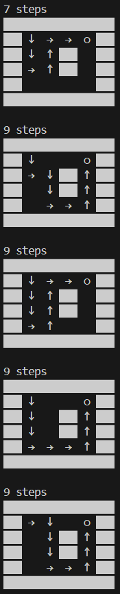

## Lecture 30 课程总结
1. fork-based DFS: 如果我们使用深度优先搜索，总是需要维护当前的 “搜索状态”。通常这是通过将状态作为参数传递实现的 (当然，也可以用维护全局状态的方式实现)。借助 fork()，我们可以在每个搜索分支创建一个当前状态的快照，实现并行搜索。

    并行搜索：通过创建子进程，程序可以同时在多个路径上进行搜索，这大大提高了搜索效率。每个子进程都会探索一个可能的路径，而父进程则负责等待所有子进程完成。

    ```C
    #include <stdio.h>
    #include <unistd.h>
    #include <stdint.h>
    #include <assert.h>
    #include <stdlib.h>
    #include <string.h>
    #include <errno.h>
    #include <sys/wait.h>

    #define DEST '+'
    #define EMPTY '.'

    struct move {
        int move, x, y;
    } moves[] = {
        {'>', 0, 1},
        {'v', 1, 0},
        {'<', 0, -1},
        {'^', -1, 0},
    };

    char map[][512] = {
        "######",
        "#...+#",
        "#..#.#",
        "#..#.#",
        "#....#",
        "######",
        "",
    };

    void display(int steps);
    void dfs(int x, int y, int steps);

    int main() {
        dfs(1, 1, 0);
    }


    void dfs(int x, int y, int steps) {
        // Each search level gets 1 second of delay.
        sleep(1);

        if (map[x][y] == DEST) {
            display(steps);
            exit(0);
        } else {
            int nfork = 0;

            for (struct move *m = moves; m < moves + 4; m++) {
                int x1 = x + m->x, y1 = y + m->y;
                int pid = fork();

                assert(pid >= 0);

                if (pid == 0) {
                    // Forked worker process

                    map[x][y] = m->move;
                    if (map[x1][y1] == DEST || map[x1][y1] == EMPTY) {
                        dfs(x1, y1, steps + 1);
                        // 只有下一个搜索的位置是DEST或EMPTY，才递归搜索
                        // 已搜索过的地方就不再重复了
                    }
                    exit(0);
                } else {
                    nfork++;

                    // If we wait here, the search will be serialized.
                    // waitpid(pid, NULL, 0);
                }
            }

            while (nfork--) // 等待所有子进程结束
                wait(NULL);
        }
    }

    void display(int steps) {
        #define append(buf, ...) sprintf(buf + strlen(buf), __VA_ARGS__)

        char buf[4096] = {0};

        append(buf, "%d steps\n", steps);
        for (int i = 0; map[i][0]; i++) {
            for (const char *s = map[i]; *s; s++) {
                const char *draw;
                switch (*s) {
                case EMPTY: draw = "   "; break;
                case DEST:  draw = " ○ "; break;
                case '>':   draw = " → "; break;
                case '<':   draw = " ← "; break;
                case '^':   draw = " ↑ "; break;
                case 'v':   draw = " ↓ "; break;
                default:    draw = "▇▇▇"; break;
                }
                append(buf, draw);
            }
            append(buf, "\n");
        }
        append(buf, "\n");

        write(STDOUT_FILENO, buf, strlen(buf));
    }
    ```

    可以看到越往后的steps都是一瞬间输出结果的，例如9 steps的所有结果都是同时输出的。

    { width="150" }