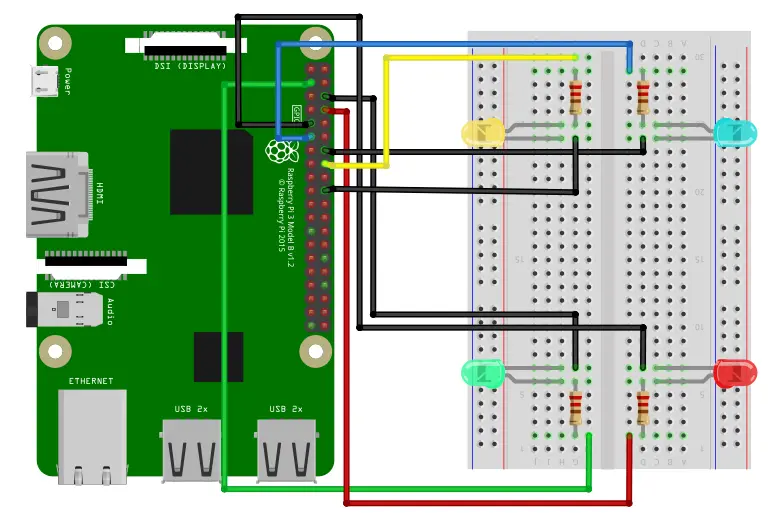

# 持久化

## Lecture 25 存储设备原理
!!! abstract "Take-away Messages"

    无论是内存还是持久存储，最终胜出的仍然是电——它的密度和速度是其他介质难以比拟的。但同时我们也看到，NAND Flash 作为持久存储时有着巨大的缺陷——写入寿命。但我们也看到了工业界竟然敢于试制这样跨时代的产品，在十多年的争议中终究成为了今天存储的主角。如果更快的 non-volatile memory 到来又退场，我们的计算机系统是否会发生翻天覆地的变化？

    欢迎到大家阅读课堂中的一些 blogs，以及自己收集一些有趣的资料，例如 [How do rewriteable CDs work?](https://www.scientificamerican.com/article/how-do-rewriteable-cds-wo/) 和 [Coding for SSDs](https://codecapsule.com/2014/02/12/coding-for-ssds-part-1-introduction-and-table-of-contents/)。海量的阅读帮助你形成正确的 “计算机科学世界观”，用计算机科学的方式处理问题。

1. 磁存储
    * 磁带：作为存储设备的分析
    
        成本与风险

        | 价格 | 容量 | 可靠性 |
        | ---- | ---- | ---- |
        | 低 - 廉价材料 | 高 | 存在机械部件、存在丢失风险 |
            
        读写性能

        | 顺序读写 | 随机读写 |
        | ---- | ---- |
        | 勉强 (需要等待定位) | 几乎完全不行 |
        
        今天的应用场景：冷数据的存档和备份

    * 磁盘：作为存储设备的分析

        成本与风险

        | 价格 | 容量 | 可靠性 |
        | ---- | ---- | ---- |
        | 低 - 高密度低成本 | 高 - 2.5D，上万磁道 | 存在机械部件 |
            
        读写性能

        | 顺序读写 | 随机读写 |
        | ---- | ---- |
        | 较高 | 勉强 (需要等待定位) |
        
        今天的应用场景：计算机系统的主力数据存储，例如服务器：4 x 4TB HDD (RAID0)

    * 软盘：作为存储设备的分析（软盘：把读写头和盘片分开——实现数据移动）

        | 价格 | 容量 | 可靠性 |
        | ---- | ---- | ---- |
        | 低 - 低成本材料 | 高 - 裸露介质，密度受限 | 低 |
            
        读写性能

        | 顺序读写 | 随机读写 |
        | ---- | ---- |
        | 低 | 低 |

        今天的应用场景：存盘按钮

2. 坑存储
    * Compact Disk (CD, 1980)：在反射平面 (1) 上挖上粗糙的坑 (0)，激光扫过表面，就能读出坑的信息来

        | 价格 | 容量 | 可靠性 |
        | ---- | ---- | ---- |
        | 极低 - “压盘” 复制 | 高 | 高 - 多种保护层 |
            
        读写性能

        | 顺序读写 | 随机读写 |
        | ---- | ---- |
        | 一般 | 低 |

        今天的应用场景：作为数字收藏

        最大的困难：挖坑容易填坑难

        - CD/R: 用激光器烧出一次性的坑 + append-only 数据结构
        - CD/RW: [PCM (Phase-change Material)](https://www.scientificamerican.com/article/how-do-rewriteable-cds-wo/)

3. 电存储
    * Flash Memory
    

        | 价格 | 容量 | 可靠性 |
        | ---- | ---- | ---- |
        | 低 - 大规模集成电路 | 极高 | 高 - 随便摔 |
            
        读写性能

        | 顺序读写 | 随机读写 |
        | ---- | ---- |
        | 极高 | 极高 |

## Lecture 26 输入输出设备
!!! abstract "Take-away Messages"

    输入/输出设备是 “与处理器交换数据” 接口——因此，我们的设备可以实现得任意复杂，甚至是一个完整的计算机系统。从我们今天的打印机、SSD、GPU，都遵循了这个模式，在 CPU 的统一管理和调度下各自完成各自的功能。

1. 实现输入/输出：一根线、一条指令 (树莓派上就有)
    * GPIO (General Purpose Input/Output)（一根可以读写数据的线）
        - 极简的模型：Memory-mapped I/O 直接读取/写入电平信号
    
        { width=500 }

2. I/O 设备 = <span style="color:lightblue;">一个能与 CPU 交换数据的接口/控制器</span>
    * 就是 “几组约定好功能的线” (寄存器)
        - 通过握手信号从线上读出/写入数据
    * 给寄存器 “赋予” 一个内存地址 (Address Decoder)
        - CPU 可以直接使用指令 (in/out/MMIO) 和设备交换数据
        - 是的，就这么简单

        { width=500 }

    * 例子 (1): 串口 (UART)，通用异步收发传输器（Universal Asynchronous Receiver/Transmitter）
    
        “COM1” (Communication 1)
        
        ```C
        #define COM1 0x3f8

        static int uart_init() {
        outb(COM1 + 2, 0);   // 控制器相关细节
        outb(COM1 + 3, 0x80);
        outb(COM1 + 0, 115200 / 9600);
        ...
        }

        static void uart_tx(AM_UART_TX_T *send) {
        outb(COM1, send->data);
        }

        static void uart_rx(AM_UART_RX_T *recv) {
        recv->data = (inb(COM1 + 5) & 0x1) ? inb(COM1) : -1;
        }
        ```

    * 例子 (2): 键盘控制器 IBM PC/AT 8042 PS/2 (Keyboard) Controller
        - Port 0x60 (data), 0x64 (status/command)
        - command = 0xED → LED 灯控
        - command = 0xF3 → 设置重复速度和重复延迟

        { width=200 }

    * 例子 (3): 磁盘控制器 ATA (Advanced Technology Attachment)
        - IDE 接口磁盘 (40pin data 很 “肥” 的数据线 + 4pin 电源)
        - primary: 0x1f0 - 0x1f7; secondary: 0x170 - 0x177

        ```C
        void readsect(void *dst, int sect) {
            waitdisk();
            out_byte(0x1f2, 1);          // sector count (1)
            out_byte(0x1f3, sect);       // sector
            out_byte(0x1f4, sect >> 8);  // cylinder (low)
            out_byte(0x1f5, sect >> 16); // cylinder (high)
            out_byte(0x1f6, (sect >> 24) | 0xe0); // drive
            out_byte(0x1f7, 0x20);       // command (write)
            waitdisk();
            for (int i = 0; i < SECTSIZE / 4; i ++)
                ((uint32_t *)dst)[i] = in_long(0x1f0); // data
        }
        ```

    * 例子 (4): 打印机 - 打印机将字节流描述的文字/图形打印到纸张上
        - PostScript 一种描述页面布局的 DSL (Page DL)

3. 管理更多的 I/O 设备：

    （1）我们不想造一台 “设备定死” 的计算机 ➡️ 总线：一个特殊的 I/O 设备

    - 提供设备的 “虚拟化”：注册和转发
        + 把收到的地址 (总线地址) 和数据转发到相应的设备上
        + 例子: port I/O 的端口就是总线上的地址
            + IBM PC 的 CPU 其实只看到这一个 I/O 设备
    - 这样 CPU 只需要直连一个总线就行了！
        + 今天 PCI 总线肩负了这个任务
            + 总线可以桥接其他总线 (例如 PCI → USB)
        + `lspci -tv` 和 `lsusb -tv`: 查看系统中总线上的设备
            + 概念简单，实际非常复杂……
            + 电气特性、burst 传输、中断、Plug and Play

    (2) CPU：只有一根中断线 ➡️ 我们需要一个 “仲裁器”
    
    - 收集各个设备中断，并选择一个发送给 CPU，并且完成对设备的应答
    - 例子
        + Intel 8259 PIC
            + programmable interrupt controller
            + 可以设置中断屏蔽、中断触发等……
        + APIC (Advanced PIC)
            + local APIC: 中断向量表, IPI, 时钟, ……
            + I/O APIC: 其他 I/O 设备

    (3) 解放 CPU 算力 ➡️ Direct Memory Access (DMA)

    - 操作系统：写入 1 GB 的数据到磁盘
        + 即便磁盘已经准备好，依然需要非常浪费时间的循环
        + out 指令写入的是设备缓冲区，需要去总线上绕一圈
            + cache disable; store 其实很慢的
        
        ```C
        for (int i = 0; i < 1 GB / 4; i++) {
            outl(PORT, ((u32 *)buf)[i]);
        }
        ```

    - 加一个通用处理器太浪费，不如加一个简单的
        + DMA: 只能执行 `memcpy(ATA0, buf, length);` 的处理器
        + 支持的几种类型的 memcpy
            + memory → memory
            + memory → device (register)
            + device (register) → memory
                + 实际实现：直接把 DMA 控制器连接在总线和内存上
                + Intel 8237A
        + 今天：PCI 总线支持 DMA
            + `sudo cat /proc/iomem`

4. 填补 CPU 的算力空白：GPU 和加速器
    * 计算机系统里充满了 “CPU”
        - CPU: 大核 + 小核 + 超小核
        - DMA: 执行 memcpy() 的 CPU
        - 打印机：解析执行 PCL/PostScript 的 CPU
        - 网卡：分拣以太网 packet (frame) 的 CPU
            + 它们都受到 CPU 的统一调配
    * GPU: 在系统里加一个专门画图的 CPU，不再需要那么多通用寄存器，循环可以直接用计数器实现

    ```C
    for (int x = 0; x < W; x++)
        for (int y = 0; y <= H; y++)
            for (int i = 0; i < n; i++)
                if (intersects(sprites[i], x, y)) {
                    fb[x][y] = sprites[i].pixel(x, y);
                }
    ```
## Lecture 27 文件和设备驱动
!!! abstract "Take-away Messages"

    任何实现了 struct file_operations 的操作系统对象可以都是 “文件”：可以是 /dev/null 这样的虚拟设备，可以是 /proc/stat 中的虚拟 “文件”，可以是一个管道，也可以是文件系统中普通的字节序列。

1. 应用程序：通过系统调用（open, read, write, mmap, ...）访问文件，求证：`strace readelf -h /bin/ls`。
    * 文件是 “虚拟磁盘”，把磁盘的一部分映射到地址空间，再自然不过了
    * 映射的长度超过文件大小会发生什么？➡️ SIGBUS

    ```C
    #include <stdio.h>
    #include <stdlib.h>
    #include <sys/mman.h>
    #include <sys/stat.h>
    #include <fcntl.h>
    #include <unistd.h>

    int main() {
        const char *filepath = "example.txt";
        int fd = open(filepath, O_RDWR);
        if (fd == -1) {
            perror("open");
            exit(EXIT_FAILURE);
        }

        struct stat sb;
        if (fstat(fd, &sb) == -1) {
            perror("fstat");
            close(fd);
            exit(EXIT_FAILURE);
        }

        size_t length = sb.st_size + 4096;
        void *addr = mmap(NULL, length, PROT_READ | PROT_WRITE, MAP_SHARED, fd, 0);
        if (addr == MAP_FAILED) {
            perror("mmap");
            close(fd);
            exit(EXIT_FAILURE);
        }

        // Overwrite this file.
        char *data = (char *)addr;
        for (size_t i = sb.st_size; i < length; ++i) {
            printf("Write byte %zu\n", i);
            fflush(stdout);
            data[i] = 'A';
        }

        if (munmap(addr, length) == -1) {
            perror("munmap");
        }
        close(fd);

        return 0;
    }
    ```

    ```bash
    yes | head -c 4000 > example.txt
    gcc -Wall -g overwrite.c -o overwrite
    ./overwrite
    Write byte 4000
    ...
    Write byte 4095
    Write byte 4096
    fish: Job 1, './overwrite' terminated by signal SIGBUS (Misaligned address error)
    ```

2. 实现文件：文件描述符可以访问 “一切”，操作系统内核是如何实现的？➡️ 如你所料：一个 switch-case
    
    ```C
    if (f->type == FD_PIPE)
    {
        r = piperead(f->pipe, addr, n);
    } 
    else if (f->type == FD_DEVICE) 
    {
        if (f->major < 0 || f->major >= NDEV || !devsw[f->major].read)
            return -1;
        r = devsw[f->major].read(1, addr, n);
    } 
    else if (f->type == FD_INODE)
    {
        ilock(f->ip);
        if ((r = readi(f->ip, 1, addr, f->off, n)) > 0)
            f->off += r;
        iunlock(f->ip);
    } 
    else 
    {
        panic("fileread");
    }
    ```

3. 设备驱动程序：一个 `struct file_operations` 的实现，把系统调用 “翻译” 成设备能听懂的数据，就是一段普通的内核代码
    * [/dev/null 的实现](https://elixir.bootlin.com/linux/v6.9.3/source/drivers/char/mem.c)
    * [/proc/stat 的实现](https://elixir.bootlin.com/linux/v6.9.3/source/fs/proc/stat.c)

4. ioctl：“非数据” 的设备功能几乎全部依赖 ioctl，“Arguments, returns, and semantics of ioctl() vary according to the device driver in question”

## Lecture 28 FAT 和 UNIX 文件系统
!!! abstract "Take-away Messages"

    把文件系统理解成一个 “数据结构”，就不难分析其中的重点和实现要点——我们总是把数据按照局部性组织起来，无论是 FAT 还是 bitmap/inode 的设计，都利用了这一点。另一个重要的设计是 “目录也是文件”——文件系统实现将目录文件中的数据作出解读，从而解析出其中的目录结构。

1. 文件系统：文件 = `struct file_operations`
    * 数据文件：hello.c, a.out, ...
        - 虚拟的磁盘
        - `vector<char>`
    * 设备驱动
        - null, nuke0, ...
    * 虚拟文件
        - 进程的地址空间, ...

2. 新需求：怎么管理系统中众多的文件？➡️ 信息的局部性：将虚拟磁盘 (文件) 组织成树状层次结构，逻辑相关的数据存放在相近的目录
    * UNIX 的设计：目录树的拼接
    * mount: <span style="color:lightblue;">将一个目录解析为另一个文件系统的根</span>
    * `mount(source, target, filesystemtype, mountflags, data);`
    * 再看 “最小 Linux”
        - 初始时只有 /dev/console 和几个文件
        - /proc, /sys, 甚至 /tmp 都没有
            + 答案：它们都是 mount 系统调用创建出来的
    * UNIX 一贯的设计哲学：灵活
        - Linux 安装时的 “mount point”
        - `/`, `/home`, `/var` 可以是独立的磁盘设备

3. Filesystem Hierarchy Standard: [FHS](https://refspecs.linuxfoundation.org/FHS_3.0/fhs/index.html) enables software and user to predict the location of installed files and directories.

    

4. 文件系统 API: 目录管理

    mkdir

    * 创建目录

    rmdir

    * 删除一个空目录
    * 没有 “递归删除” 的系统调用
        - rm -rf 会遍历目录，逐个删除 (试试 strace)

    getdents

    * 返回 count 个目录项 (ls, find, tree 都使用这个)
        - 更友好的方式：globbing

5. 硬 (hard) 链接
    
    需求：系统中可能有同一个运行库的多个版本

    * libc-2.27.so, libc-2.26.so, ...
    * 还需要一个 “当前版本的 libc”
        - 程序需要链接 “libc.so.6”，能否避免文件的一份拷贝？

    (硬) 链接：允许一个文件被多个目录引用

    * 文件系统实现的特性 (ls -i 查看)
        - 不能链接目录、不能跨文件系统
        - 删除文件的系统调用称为 “unlink” (refcount--)

6. 软 (symbolic) 链接
    
    软链接：在文件里存储一个 “跳转提示”
    
    * 软链接也是一个文件
        - 当引用这个文件时，去找另一个文件
        - 另一个文件的绝对/相对路径以文本形式存储在文件里
        - 可以跨文件系统、可以链接目录、……

    几乎没有任何限制
    
    * 类似 “快捷方式”
        - 链接指向的位置不存在也没关系
        - (也许下次就存在了)

7. 文件系统：实现

    如果是《数据结构》课？

    * 借助 RAM 自由布局目录和文件：文件系统就是一个 Abstract DataType (ADT)

    ```CPP
    class FSObject {
    };

    class File: FSObject {
        std::vector<char> content;
    };

    class Directory: FSObject {
        std::map<std::string,FSObject*> children;
    };
    ```

    回到《操作系统》课：对不起，没有 Random Access Memory

    * 我们只有 block device
    * 两个 API
        - `bread(int bid, struct block *b);`
        - `bwrite(int bid, struct block *b);`
    
    实现：

    * read, write, ftruncate, ...
    * mkdir, rmdir, readdir, link, unlink, ...
        - 用 bread/bwrite 模拟 RAM → 严重的读/写放大
        - 我们需要更适合磁盘的数据结构

8. FAT (File Allocation Table) 和 UNIX 文件系统

    用链表存储数据：两种设计

    (1) 在每个数据块后放置指针

    * 优点：实现简单、无须单独开辟存储空间
    * 缺点：数据的大小不是 $2^k$ ; 单纯的 lseek 需要读整块数据

    (2) 将指针集中存放在文件系统的某个区域

    * 优点：局部性好；lseek 更快
    * 缺点：集中存放的数据损坏将导致数据丢失

    哪种方式的缺陷是致命、难以解决的？➡️ (1)难以解决，对于(2)集中存储的指针容易损坏？存 n 份就行！

    FAT-12/16/32 (FAT entry，即 “next 指针” 的大小)

    

9. 一个有趣的问题：文件系统恢复
    * 快速格式化 = FAT 表丢失
        - 所有的文件内容 (包括目录文件) 都还在
        - 只是在数据结构眼里看起来都是 “free block”
    * 猜出文件系统的参数 (SecPerClus, BytsPerSec, ...)，恢复 next 关系

10. FAT: 性能与可靠性

    性能
    
    * ✅ 小文件简直太合适了
    * ❌ 但大文件的随机访问就不行了
        - 4 GB 的文件跳到末尾 (4 KB cluster) 有 $2^{20}$ 次 next 操作
        - 缓存能部分解决这个问题
    * 在 FAT 时代，磁盘连续访问性能更佳
        - 使用时间久的磁盘会产生碎片 (fragmentation)
        - malloc 也会产生碎片，不过对性能影响不太大

    可靠性
    
    * 维护若干个 FAT 的副本防止元数据损坏 (额外的开销)

11. ext2/UNIX 文件系统: Second Extended File System

    按对象方式集中存储文件/目录元数据

    * 增强局部性 (更易于缓存)
    * 支持链接

    为大小文件区分 fast/slow path

    * 小的时候应该用数组
        - 连链表遍历都省了
    * 大的时候应该用树 (B-Tree; Radix-Tree; ...)
        - 快速的随机访问

## Lecture 29 持久数据的可靠性
!!! abstract "Take-away Messages"

    存储系统支撑了当今的互联网工业——每个 SSD 都是 “套娃” 的计算机系统；它们又组成了大规模存储网络，构成了我们今天的数字世界。实现低成本、高性能、高可靠的存储并不是一个十分简单的问题，这也是计算机产业让我们感到激动的原因。

1. 实现可靠的磁盘：RAID，存储设备的虚拟化
    * Redundant Array of Inexpensive (Independent) Disks (RAID)
    * 把多个 (不可靠的) 磁盘虚拟成一块非常可靠且性能极高的虚拟磁盘
    * RAID (虚拟化) = 虚拟块号到 (磁盘, 块号) 的 “映射”
    * 虚拟磁盘块可以存储在任何物理磁盘上
        - 物理磁盘读写可以并行
        - 存储 > 1 份即可实现容错
    * RAID-5: Rotating Parity，使 Parity 均匀分布在各个磁盘

    { width=400 }

2. 实现可靠的文件系统：崩溃一致性 (Crash Consistency). 

    !!! info "Crash Consistency"

        Move the file system from one consistent state (e.g., before the file got appended to) to another atomically (e.g., after the inode, bitmap, and new data block have been written to disk).

    * File System Checking (FSCK)：根据磁盘上已有的信息，恢复出 “最可能” 的数据结构
    * Jouraling：先用 append-only 记录日志，等待落盘，再更新数据结构
