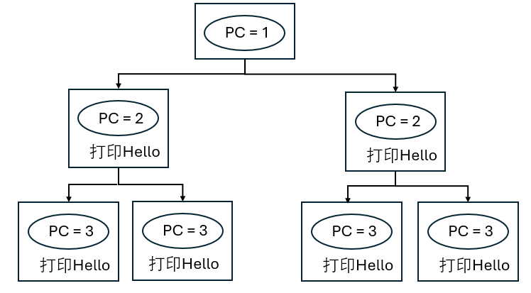
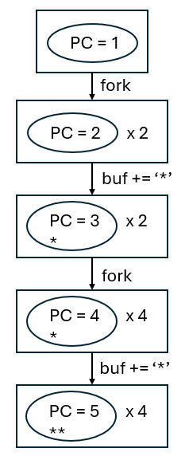
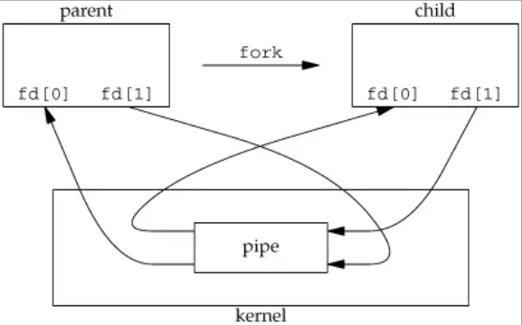
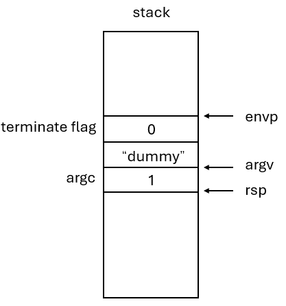
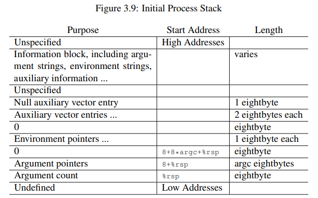

# 虚拟化

## Lecture 14 操作系统上的进程
!!! abstract "Take-away Messages"

    因为 “程序 = 状态机”，操作系统上进程 (运行的程序) 管理的 API 很自然地就是状态机的管理。在 UNIX/Linux 世界中，以下三个系统调用创建了整个 “进程世界”，不论是我们常用的 IDE 和浏览器，还是编译时在后台调用的 gcc。其中：
    
    * fork: 对当前状态机状态进行完整复制
    * execve: 将当前状态机状态重置为某个可执行文件描述的状态机
    * exit: 销毁当前状态机
        
    在对这个概念有了绝对正确且绝对严谨的理解后，操作系统也就显得不那么神秘了。

1. fork: 创建状态机。做一份状态机完整的复制 (内存、寄存器现场)。
    ```C
    pid_t fork(void);
    ```

    fork() 的行为

    * 立即复制状态机
        - 包括所有信息的完整拷贝
            + 每一个字节的内存
            + 打开的文件 (共享)
            + ……
            + 复制失败返回 -1
                + errno 会返回错误原因 (man fork)

    * 如何区分两个状态机？
        * 新创建进程：得到的返回值是 0
        * 执行 fork 的父进程：得到的返回值是子进程的进程号

2. 阅读以下程序，写出运行结果
    ```C
    pid_t x = fork();
    pid_t y = fork();
    printf("%d %d\n", x, y);
    ```

    输出：
    ```bash
    19489 19490
    19489 0
    0 19491
    0 0
    ```
    

    ```C
    for (int i = 0; i < 2; i++) {
        fork();
        printf("Hello\n");
    }
    ```
    输出：6个Hello
    ```C
    Hello
    Hello
    Hello
    Hello
    Hello
    Hello
    ```

    程序等价于：
    ```C
    fork();
    printf("Hello\n");
    fork();
    printf("Hello\n");
    ```
    

    然而，`./demo-2 | wc -l`输出的是`8`。原因：在终端里换行打印时使用的是line buffer，此时打印6个；重定向到文件或使用管道时使用的是full buffer，此时会打印8个，没有刷新buffer，导致所有带有值的buffer也被fork了。`man setbuf`可以看到有三种模式`_IONBF unbuffered`/`_IOLBF line buffered`/`_IOFBF fully buffered`。
    此时程序等价于：
    ```C
    fork();
    buf += "Hello";
    fork();
    buf += "Hello";
    flush(buf);
    ```
    

3. execve：重置状态机。将当前进程重置成一个可执行文件描述状态机的初始状态。

    ```C
    int execve(const char *filename,
               char * const argv[], char * const envp[]);
    // 三个参数：可执行文件的路径、传递给 main 函数的参数和环境变量。
    ```
    execve 行为

    * 执行名为 `filename` 的程序
    * 允许对新状态机设置参数 `argv` (v) 和环境变量 `envp` (e)
        - 刚好对应了 `main()` 的参数！
    * execve 是唯一能够 “执行程序” 的系统调用
        - 因此也是一切进程 strace 的第一个系统调用

4. UNIX 中实现 “创建新状态机” 的方式：fork + execve （相当于spawn）
    ```C
    int pid = fork();
    if (pid == -1) {
        // fork失败
        perror("fork"); goto fail;
    } else if (pid == 0) {
        // Child
        execve(...);
        // 如果 execve 成功执行，它将替换当前进程的内存空间并开始执行新的程序，
        // 因此 perror("execve") 不会被执行。perror("execve") 只会在 execve
        // 调用失败时执行
        perror("execve"); goto fail;
    } else {
        // Parent
        ...
    }
    ```

    demo:
    ```C
    #include <unistd.h>
    #include <stdio.h>

    int main() {
        char *const argv[] = {
            "/bin/bash",
            "-c",
            "env",
            NULL,
        };

        char *const envp[] = {
            "HELLO=WORLD",
            NULL,
        };

        // Reset the state machine to "/bin/bash"
        execve(argv[0], argv, envp);

        // We are here only on error.
        printf("Hello, World!\n");
    }
    ```
    输出：
    ```bash
    PWD=/home/user/jyy_os_2024/lecture/lect14/execve-demo
    HELLO=WORLD
    SHLVL=0
    _=/usr/bin/env
    ```
    这比直接在bash里执行`/bin/bash -c env`得到的一大堆输出更加简单，是因为我们在代码里的环境变量evnp只保留了`HELLO=WORLD`（当然实际上执行execve还是有PWD/SHLVL等被加上的环境变量）。

5. _exit()：销毁状态机。立即摧毁状态机，允许有一个返回值。子进程终止会通知父进程。
    ```C
    void _exit(int status);
    ```

    结束程序执行的三种方法

    * exit(0)
        - provided by libc
        - 会调用 atexit
    * _exit(0)
        - 执行 “exit_group” 系统调用终止整个进程 (所有线程)
        - 不会调用 atexit 
    * syscall(SYS_exit, 0)
        - 执行 “exit” 系统调用终止当前线程
        - 不会调用 atexit（libc当然不了解系统调用，也就无法在退出时调用libc的atexit函数）

## Lecture 15 进程的地址空间
!!! abstract "Take-away Messages"

    状态机的视角自然地将我们引入 “内存到底是什么” 的问题——它的答案同样也很自然：带有访问权限控制的连续内存段。我们可以通过 <span style="color:lightblue;">mmap、munmap、mprotect</span> 三个系统调用调整状态机的地址空间，包括分配匿名的内存、映射文件内容到内存、修改访问权限等（增/删/改）。更有趣的是操作系统有 “能够实现一切应用程序” 的需求，调试器也不在话下——这也给了我们入侵其他进程地址空间的机制。

1. 以下程序的 (可能) 输出是什么？
    ```C
    int main()
    {
        int x = *(int *)main;
        printf("%x\n", x);    // fa1e0ff3（小端）
        printf("%p\n", main); //0x556b3315c149，每次不一样
    }
    ```

    ```bash
    objdump -d a.out
    0000000000001149 <main>:
    1149:       f3 0f 1e fa             endbr64 
    114d:       55                      push   %rbp
    114e:       48 89 e5                mov    %rsp,%rbp
    1151:       48 83 ec 10             sub    $0x10,%rsp
    ...
    ```
2. 查看进程的地址空间：

    * /proc/[pid]/maps

        ```bash
        linux$ ps
        PID TTY          TIME CMD
        18222 pts/3    00:00:00 dbus-launch
        22713 pts/3    00:00:01 bash
        29368 pts/3    00:00:00 ps
        linux$ vi /proc/22713/maps
        55e7a0632000-55e7a0711000 r-xp 0002f000 08:20 1241                       /usr/bin/bash
        55e7a0711000-55e7a074b000 r--p 0010e000 08:20 1241                       /usr/bin/bash
        55e7a074c000-55e7a0750000 r--p 00148000 08:20 1241                       /usr/bin/bash
        55e7a0750000-55e7a0759000 rw-p 0014c000 08:20 1241                       /usr/bin/bash
        ...
        7ffdf9eb0000-7ffdf9ed2000 rw-p 00000000 00:00 0                          [stack]
        7ffdf9f79000-7ffdf9f7d000 r--p 00000000 00:00 0                          [vvar]
        7ffdf9f7d000-7ffdf9f7f000 r-xp 00000000 00:00 0                          [vdso]
        ```

        无需陷入内核的系统调用: vvar (data)/vdso (code)。例如时间这样的数据，只有操作系统有，而应用程序只是读时间戳，不会改它，对于这样只读的数据，无需进入操作系统内核。因此，**操作系统里只读的数据可以通过内存的方式共享给进程**。

    * pmap [pid]

        ```bash
        linux$ pmap 22713
        22713:   /bin/bash
        000055e7a0603000    188K r---- bash
        000055e7a0632000    892K r-x-- bash
        000055e7a0711000    232K r---- bash
        000055e7a074c000     16K r---- bash
        000055e7a0750000     36K rw--- bash
        000055e7a0759000     44K rw---   [ anon ]
        000055e7a1dbc000   1832K rw---   [ anon ]
        ...
        ```

    * gdb cmd: `info proc mappings`

3. 管理进程地址空间：在状态机状态上增加/删除/修改一段可访问的内存

    ```C
    // 映射
    void *mmap(void *addr, size_t length, int prot, int flags,
               int fd, off_t offset);
    int munmap(void *addr, size_t length);

    // 修改映射权限
    int mprotect(void *addr, size_t length, int prot);
    ```

    例子：

    ```C
    #include <unistd.h>
    #include <stdint.h>
    #include <stdio.h>
    #include <stdlib.h>
    #include <sys/mman.h>

    #define GiB * (1024LL * 1024 * 1024)

    int main() {
        volatile uint8_t *p = mmap(
            NULL,
            8 GiB,
            PROT_READ | PROT_WRITE,
            MAP_ANONYMOUS | MAP_PRIVATE,
            -1, 0
        );

        printf("mmap: %lx\n", (uintptr_t)p);

        if ((intptr_t)p == -1) {
            perror("cannot map");
            exit(1);
        }

        *(p + 2 GiB) = 1;
        *(p + 4 GiB) = 2;
        *(p + 7 GiB) = 3;
        printf("Read get: %d\n", *(p + 4 GiB));
        printf("Read get: %d\n", *(p + 6 GiB));
        printf("Read get: %d\n", *(p + 7 GiB));
    }
    ```

    ```python
    import hexdump
    import mmap

    with open('/dev/sda', 'rb') as fp:
        mm = mmap.mmap(fp.fileno(),
                    prot=mmap.PROT_READ, length=128 << 30)
        hexdump.hexdump(mm[:512]) # 将磁盘sda的128GiB映射到内存，并查看前512字节
    ```
4. 入侵进程地址空间

    * 调试器 (gdb)
        - gdb 可以任意观测和修改程序的状态
    * Profiler (perf)
        - M3 中借助它理解程序的性能瓶颈

    例子：金山游侠

    * 地址空间那么大，哪个才是 “金钱”？
        - 包含动态分配的内存，每次地址都不一样
        - 思路：Everything is a state machine
            + 观察状态机的 trace，就知道哪个是金钱了

    * 查找 + Filter
        - 进入游戏时 exp = 4950
        - 打了个怪 exp = 5100
        - 符合 4950 → 5100 变化的内存地址是很少的
            + 好了，出门就是满级了

    knight.c: `sudo ./knight VirtualBoxVM` -> `s 5000` -> spend 800 -> `s 4200` -> `w 1000000`
    ```C
    #include <string>
    #include <vector>
    #include <algorithm>
    #include <iostream>
    #include <regex>
    #include <cstdio>
    #include <unistd.h>
    #include <fcntl.h>
    using std::string, std::to_string;

    struct Game {
        string name; // Name of the traced process
        int pid;     // Pid of the traced process
        int fd;      // Memory file of the traced process
        
        std::vector<uintptr_t> remain; // Watched addresses

    public:
        Game(string proc_name):
            name(proc_name),
            pid(stoi(run("pidof " + proc_name))) {

            // See: proc(5)
            string memfile = "/proc/" + to_string(pid) + "/mem";

            // We need root permission to open this file;
            // otherwise it would be too dangerous.
            fd = open(memfile.c_str(), O_RDWR);
            if (fd < 0) {
                perror(memfile.c_str());
                exit(1);
            }
        }

        ~Game() {
            close(fd);
        }

        void search_for(uint32_t val) {
            if (remain.size() == 0) {
                // No match. Start a new round of search.

                string maps = run("pmap -x " + to_string(pid));

                std::regex r(
                    R"(^([0-9a-f]+)\s+(\d+)\s+(\d+)\s+(\d+)\s+rw.*)"
                );

                std::istringstream iss(maps);
                for (string line; std::getline(iss, line); ) {
                    std::smatch match;
                    if (std::regex_search(line, match, r)) {
                        uintptr_t start = stoll(match[1].str(), nullptr, 16);
                        uintptr_t size = stoll(match[2], nullptr, 10) * 1024;
                        printf("Scanning %lx--%lx\n", start, start + size);

                        // Copy process memory to local
                        std::unique_ptr<uint32_t[]> mem(new uint32_t [size / 4]);
                        lseek(fd, start, SEEK_SET);
                        size = read(fd, mem.get(), size);

                        for (uintptr_t off = 0; off < size; off += 4) {
                            if (mem[off / 4] == val) {
                                // Found a match!
                                remain.push_back(start + off);
                            }
                        }
                    }
                }
            } else {
                // Search in the watched values.

                std::erase_if(remain, [this, val](uintptr_t addr) {
                    return load(addr) != val;
                });
            }
            printf("There are %ld match(es).\n", remain.size());
        }

        void reset() {
            remain.clear();
        }

        void overwrite(uint32_t val) {
            int nwrite = 0;
            for (uintptr_t addr : remain) {
                store(addr, val);
                nwrite++;
            }
            printf("%d value(s) written.\n", nwrite);
        }

    private:
        uint32_t load(uintptr_t addr) {
            // Load 32-bit value from another address space
            uint32_t val;
            lseek(fd, addr, SEEK_SET);
            read(fd, &val, sizeof(val));
            return val;
        }

        void store(uintptr_t addr, uint32_t val) {
            // Store 32-bit value to another address space
            lseek(fd, addr, SEEK_SET);
            write(fd, &val, sizeof(val));
        }

        static string run(const string &cmd) {
            std::array<char,128> buf;
            string result;

            FILE *pipe = popen(cmd.c_str(), "r");
            if (!pipe) {
                perror(cmd.c_str());
                exit(1);
            }

            while (fgets(buf.data(), buf.size(), pipe) != nullptr) {
                result += buf.data();
            }

            pclose(pipe);
            return result;
        }
    };


    int main(int argc, char *argv[]) {
        Game g(argv[1]);
        uint32_t val;
        char buf[64];

        printf(
            "Usage:\n"
            "  - s 100: search for value\n"
            "  - w 99999: overwrite value (for search matches)\n"
            "  - r: reset search\n\n"
        );

        while (!feof(stdin)) {
            printf("(%s %d) ", g.name.c_str(), g.pid);
            scanf("%s", buf);

            switch (buf[0]) {
                case 'q': return 0;
                case 's': scanf("%d", &val); g.search_for(val); break;
                case 'w': scanf("%d", &val); g.overwrite(val); break;
                case 'r': g.reset(); break;
            }
        }
    }
    ```

5. 给进程发送 GUI (键盘/鼠标)事件

    * 做个驱动 (可编程键盘/鼠标)
    * 利用操作系统/窗口管理器提供的 API
        - xdotool
        - ydotool
        - evdev (按键显示脚本；主播常用)
    
    例子：实现按键精灵，实现按键精灵不必入侵进程的地址空间。操作系统管理了 I/O 设备，我们相应模拟出按键的事件即可。当然，我们也可以为进程像游戏修改器那样注入按键事件。

    `sudo ./anjian`，then open https://js13kgames.com/games/spacebar-clicker/index.html
    ```bash
    #!/bin/bash

    # Needs sudo. Try:
    # https://js13kgames.com/games/spacebar-clicker/index.html

    echo 'Start in 5 seconds...'
    ydotoold &> /dev/null &
    sleep 5

    for _ in $(seq 1 200)
    do
        ydotool type ' '
        sleep 0.01
    done
    ```

6. 改变进程对时间的感知

    程序 = 状态机
    
    * “计算指令” 是不能感知时间的
        - spin count 计时会出现 “机器变快，游戏没法玩” 的情况
        - syscall 是感知时间的唯一方法
    
    * “劫持” 和时间相关的 syscall/库函数
        - 改变程序对时间的认知
        - 就像手表调快/慢了一样

    例子：变速齿轮 `./gear 10 tetris`

    gear：实际上就是个python脚本，调用 gdb 调试 tetris 游戏，劫持 gettimeofday 系统调用，实现变速齿轮。
    ```python
    #!/usr/bin/env python3

    import subprocess
    import sys

    try:
        ratio, exe = sys.argv[1:]
    except:
        print(f'Example: {sys.argv[0]} 10 tetris  # 10X speedup')
        exit(1)

    subprocess.run(
        [
            'gdb',
            '-ex', f'set $gear_ratio = {ratio}',
            '-x', 'gear-gdb.py',
            exe,
        ]
    )
    ```

    ```python
    import gdb
    import datetime

    ratio = float(gdb.parse_and_eval('$gear_ratio'))

    # Get the current time
    start = datetime.datetime.now()

    def hacked_time():
        now = datetime.datetime.now()
        
        # The speed of the clock is adjusted
        t = start + (now - start) * ratio

        tv_sec = int(t.timestamp())
        tv_usec = t.microsecond
        return (tv_sec, tv_usec)

    class SetTimevalBreakpoint(gdb.Breakpoint):
        def __init__(self):
            super(SetTimevalBreakpoint, self).__init__(
                'gettimeofday',
                gdb.BP_BREAKPOINT,
                internal=False
            )

        def stop(self):
            tv_sec, tv_usec = hacked_time()

            # Replace the function body
            gdb.execute(
                'set *(struct timeval *)($rdi) = {{ {}, {} }}'
                    .format(tv_sec, tv_usec)
            )
            gdb.execute('set $rax = 0')
            gdb.execute('return')

            return False  # Continue execution

    SetTimevalBreakpoint()
    gdb.execute('run')
    ```

7. 软件动态更新：我们可以通过 patch 函数的头部为一个跳转实现对一个函数的 “运行时热更新”。

    ```C
    #include <stdio.h>
    #include <string.h>
    #include <sys/mman.h>
    #include <stdint.h>
    #include <assert.h>

    __attribute__((noinline)) void foo() {
        printf("In old function %s\n", __func__);
    }

    __attribute__((noinline)) void foo_new() {
        printf("In new function %s\n", __func__);
    }

    // 48 b8 (64-bit imm)   movabs $imm,%rax
    // ff e0                jmpq   *%rax
    const char PATCH[] = "\x48\xb8--------\xff\xe0";

    void DSU(void *func, void *func_new) {
        int flag = PROT_WRITE | PROT_READ | PROT_EXEC, rc, np;

        // Grant write permission to the memory
        // We must handle boundary cases
        uintptr_t fn = (uintptr_t)func;
        uintptr_t base = fn & ~0xfff;
        if (fn + sizeof(PATCH) > base + 4096) {
            np = 2;  // Cross page boundary
        } else {
            np = 1;
        }
        printf("np = %d\n", np);

        rc = mprotect((void *)base, np * 4096, flag);
        assert(rc == 0);  // Not expecting a failure
    
        // Patch the first instruction (this is UB in C spec)
        memcpy(func, PATCH, sizeof(PATCH));
        memcpy((char *)func + 2, &func_new, sizeof(func_new));

        // Revoke the write permission
        rc = mprotect((void *)base, np * 4096, PROT_READ | PROT_EXEC);
        assert(rc == 0);  // Not expecting a failure
    }

    int main() {
        setbuf(stdout, NULL);
        foo();
        DSU(foo, foo_new);  // Dynamic software update
        foo();
    }
    ```

## Lecture 16 系统调用和UNIX Shell
!!! abstract "Take-away Messages"

    通过 freestanding 的 shell，我们阐释了 “可以在系统调用上创建整个操作系统应用世界” 的真正含义：操作系统的 API 和应用程序是互相成就、螺旋生长的：有了新的应用需求，就有了新的操作系统功能。而 UNIX 为我们提供了一个非常精简、稳定的接口 (fork, execve, exit, pipe ,...)，纵然有沉重的历史负担，它在今天依然工作得很好。

1. 操作系统对象：

    * 进程和地址空间
        - 进程管理：fork, execve, exit
        - 内存管理：mmap, munmap, mprotect
    * 文件和设备
        - 文件：有 “名字” 的对象，例如字节流 (终端) 或字节序列 (普通文件；包括 /proc/*)
        - 文件描述符 (file descriptor，Windows中叫handle句柄)：<span style="color:lightblue;">指向操作系统对象的 “指针”</span>
        - Everything is a file，通过指针可以访问 “一切”
        - 对象的访问都需要指针：open, close, read/write (解引用), lseek (指针内赋值/运算), dup (指针间赋值)
    * IPC Endpoints (Inter-Process Communication，进程间通信)
        - 管道：一个特殊的 “文件” (流)
            + 由读者/写者共享
            + 读口：支持 read `fd[0]`
            + 写口：支持 write `fd[1]`
        - 匿名管道
            + 返回两个文件描述符
            + 进程同时拥有读口和写口
        ```C
        int pipe(int pipefd[2]);
        ```

2. 文件描述符是一个用于访问文件或其他输入/输出资源的 “指针”。在 Unix 和类 Unix 操作系统中，文件描述符是一个非负整数，用于表示一个打开的文件、管道、网络连接或其他类似的资源。当一个程序打开一个文件或创建一个数据流时，操作系统会返回一个文件描述符，程序可以通过这个描述符来读取、写入或操作对应的文件或资源。

    ```C
    #include <stdio.h>
    #include <fcntl.h>
    #include <unistd.h>

    void try_open(const char *fname) {
        int fd = open(fname, O_RDWR);
        // fd is a "pointer" to a kernel object.

        printf("open(\"%s\") = %d\n", fname, fd);

        if (fd < 0) {
            perror(fname);
            goto release;
        } else {
            // ...
        }

    release:
        if (fd >= 0) {
            close(fd);
        }
    }

    int main() {
        try_open("/something/not/exist");
        try_open("/dev/sda"); // hard drive
    }
    ```

3. UNIX 管道 (pipe) 是一种典型的进程间通信机制，允许数据在不同的进程之间单向流动。管道可以被视为一种特殊的文件，其中一个进程将数据写入管道的一端，而另一个进程从另一端读取数据。

    * pipe read 在没有数据时会等待
    * pipe write 在有读者打开时，会写入操作系统的缓冲区并返回
    * write 如果 “不太多”，一对 write-read 是原子的
    * write 如果超过 PIPE_BUF，可能会被拆成多份
    * 如果读者关闭，会收到 SIGPIPE 信号
        - 经常看到的 “Broken Pipe”
    * “看不到” 的 SIGPIPE
        - `yes | head -n 1`
        - `(yes; echo $? > /dev/stderr) | head -n 1` (返回141而非0，所以实际上还是有SIGPIPE发生)
    * “看得到” 的 SIGPIPE
        - `python3 -c 'while True: print(1)' | head -n 1`

    

    named_pipe.c:
    ```C
    #include <stdio.h>
    #include <stdlib.h>
    #include <string.h>
    #include <fcntl.h>
    #include <sys/stat.h>
    #include <unistd.h>
    #include <errno.h>

    // We also have UNIX domain sockets for local inter-process
    // communication--they also have a name in the file system
    // like "/var/run/docker.sock". This is similar to a named
    // pipe.
    #define PIPE_NAME "/tmp/my_pipe"

    void pipe_read() {
        int fd = open(PIPE_NAME, O_RDONLY);
        char buffer[1024];

        if (fd == -1) {
            perror("open");
            exit(1);
        }

        // Read from the pipe
        int num_read = read(fd, buffer, sizeof(buffer));
        if (num_read > 0) {
            printf("Received: %s\n", buffer);
        } else {
            printf("No data received.\n");
        }
        close(fd);
    }

    void pipe_write(const char *content) {
        // Open the pipe for writing
        int fd = open(PIPE_NAME, O_WRONLY);

        if (fd == -1) {
            perror("open");
            exit(1);
        }

        // Write the message to the pipe
        write(fd, content, strlen(content) + 1);
        close(fd);
    }

    int main(int argc, char *argv[]) {
        if (argc < 2) {
            fprintf(stderr, "Usage: %s read|write [message]\n", argv[0]);
            return 1;
        }

        // Create the named pipe if it does not exist
        if (mkfifo(PIPE_NAME, 0666) == -1) {
            if (errno != EEXIST) {
                perror("mkfifo");
                return 1;
            }
        } else {
            printf("Created " PIPE_NAME "\n");
        }

        if (strcmp(argv[1], "read") == 0) {
            pipe_read();
        } else if (strcmp(argv[1], "write") == 0) {
            pipe_write(argv[2]);
        } else {
            fprintf(stderr, "Invalid command. Use 'read' or 'write'.\n");
            return 1;
        }

        return 0;
    }
    ```

    anonymous-pipe.c：父进程持有写口，子进程持有读口。
    ```C
    #include <stdio.h>
    #include <stdlib.h>
    #include <unistd.h>
    #include <string.h>
    #include <sys/wait.h>

    void do_parent(int fd) {
        const char *msg = "Hello, world!";

        printf("[%d] Write: '%s'\n", getpid(), msg);
        write(fd, msg, strlen(msg) + 1);

        close(fd);

        // Wait for the child to finish
        wait(NULL);

        printf("[%d] Done.\n", getpid());
    }

    void do_child(int fd) {
        static char buf[1024];

        ssize_t num_read = read(fd, buf, sizeof(buf));
        if (num_read == -1) {
            perror("read");
            exit(EXIT_FAILURE);
        }

        printf("[%d] Got: '%s'\n", getpid(), buf);

        // Close the read end of the pipe
        close(fd);
    }

    int main() {
        int pipefd[2];

        // Create a pipe
        if (pipe(pipefd) == -1) {
            perror("pipe");
            exit(EXIT_FAILURE);
        }

        // Fork the current process
        pid_t pid = fork();
        if (pid == -1) {
            perror("fork");
            exit(EXIT_FAILURE);
        }

        if (pid == 0) {
            // Child
            close(pipefd[1]); // Close unused write end
            do_child(pipefd[0]);
        } else {
            // Parent
            close(pipefd[0]); // Close unused read end
            do_parent(pipefd[1]);
        }

        return 0;
    }
    ```

4. sh.c debug：可以清楚地看到，进程3的标准输出`1`向管道里写数据，然后执行`runcmd(pcmd->left);`进程4的标准输入`0`从管道里读数据，然后执行`runcmd(pcmd->right);`


    ```bash
    Process 3 (11026)
    0 <-> /dev/pts/7
    1 --> [=== 2123156 ===]
    2 <-> /dev/pts/7

    Process 4 (11699)*
        0 <-- [=== 2123156 ===]
        1 <-> /dev/pts/7
        2 <-> /dev/pts/7

    112                 runcmd(pcmd->right);
    ```

5. 以下报错的原因：`>`和`|`一样，都是先把两边的文件描述符准备好，也就是说`sudo echo hello`和打开`/etc/a.txt`是分开执行的，因此无权限打开`/etc/a.txt`

    ```bash
    $ echo hello > /etc/a.txt
    bash: /etc/a.txt: Permission denied

    $ sudo echo hello > /etc/a.txt
    bash: /etc/a.txt: Permission denied
    ```

## Lecture 17 C 标准库和实现
!!! abstract "Take-away Messages"

    在系统调用和语言机制的基础上，libc 为我们提供了开发跨平台应用程序的 “第一级抽象”。在此基础上构建起了万千世界：C++ (扩充了 C 标准库)、Java、浏览器世界……今天，C 语言在应用开发方面有很多缺陷，但仍然为 “第一级抽象” 提供了一个有趣的范本。

1. C里的 `_start` 函数是程序执行的起点。当一个C程序被编译和链接成可执行文件后，操作系统会将程序加载到内存中，并跳转到 `_start` 函数开始执行。`_start` 函数通常是由编译器和链接器自动生成的，它负责初始化程序运行所需的环境，然后调用 `main` 函数。也就是说，`_start`函数是操作系统和二进制文件之间的约定（在libc里的Scrt1.o会帮忙定义好）。以下可以看到Entry point address是0x4019f5，正是`_start`的地址。

    ```bash
    linux$ readelf -h sh
    ELF Header:
    Magic:   7f 45 4c 46 02 01 01 00 00 00 00 00 00 00 00 00 
    Class:                             ELF64
    Data:                              2's complement, little endian
    Version:                           1 (current)
    OS/ABI:                            UNIX - System V
    ABI Version:                       0
    Type:                              EXEC (Executable file)
    Machine:                           Advanced Micro Devices X86-64
    Version:                           0x1
    Entry point address:               0x4019f5
    Start of program headers:          64 (bytes into file)
    Start of section headers:          23696 (bytes into file)
    Flags:                             0x0
    Size of this header:               64 (bytes)
    Size of program headers:           56 (bytes)
    Number of program headers:         8
    Size of section headers:           64 (bytes)
    Number of section headers:         19
    Section header string table index: 18

    linux$ objdump -d sh | less
    00000000004019f5 <_start>:
    4019f5:       f3 0f 1e fa             endbr64 
    4019f9:       55                      push   %rbp
    4019fa:       48 89 e5                mov    %rsp,%rbp
    4019fd:       b8 00 00 00 00          mov    $0x0,%eax
    401a02:       e8 e9 fe ff ff          call   4018f0 <main>
    401a07:       be 00 00 00 00          mov    $0x0,%esi
    401a0c:       bf 3c 00 00 00          mov    $0x3c,%edi
    401a11:       b8 00 00 00 00          mov    $0x0,%eax
    401a16:       e8 e5 f5 ff ff          call   401000 <syscall>
    401a1b:       90                      nop
    401a1c:       5d                      pop    %rbp
    401a1d:       c3                      ret
    ```

2. <span style="color:lightblue;">系统调用是地基，C 语言是框架。</span>glibc 的代码有非常沉重的历史包袱，更适合学习的 libc 实现：[musl libc](https://musl.libc.org/)

    使用musl-gcc来编译，而不是gcc，看下musl-gcc的真面目：musl-gcc通过.specs脚本来控制编译器不要链接glibc而是链接自己的libc。
    
    ```bash
    linux$ cat (which musl-gcc)
    #!/bin/sh
    exec "${REALGCC:-x86_64-linux-gnu-gcc}" "$@" -specs "/usr/lib/x86_64-linux-musl/musl-gcc.specs"
    ```

3. debug dummy.c

    ```C
    int main() {
        return 1;
    }
    ```

    <figure markdown> 
        { width="300" }
        <figcaption>操作系统将这些内容放入栈中</figcaption>
    </figure>

    env.c：

    ```C
    #include <stdio.h>

    // A mysteriously defined symbol.
    // Someone must defined it elsewhere.
    extern char **environ;

    // Like this even more mysterious one.
    // "end" can be of any type.
    extern void ******************************end;

    int main(int argc, char *argv[], char *envp[]) {
        printf("environ: %p\n", environ);
        printf("envp:    %p\n", envp);

        for (char **env = environ; *env; env++) {
            // key=value
            printf("%s\n", *env);
        }

        end = NULL; // ???
    }
    ```

    输出:

    ```bash
    environ: 0x7ffdb556d2d8
    envp:    0x7ffdb556d2d8
    SHELL=/bin/bash
    COLORTERM=truecolor
    ...
    ```

    <a id="system-v-abi"></a>
    [System V ABI](https://jyywiki.cn/OS/manuals/sysv-abi.pdf)里定义了规范：

    { width="500" }

    其他状态 (主要是内存) 则是由可执行文件指定，详情看[Lecture 19](#minimal-loader)。

4. libc对系统调用与环境的抽象

    什么是stdout？

    ```C
    static unsigned char buf[BUFSIZ+UNGET];
    hidden FILE __stdout_FILE = {
        .buf = buf+UNGET,
        .buf_size = sizeof buf-UNGET,
        .fd = 1,
        .flags = F_PERM | F_NORD,
        .lbf = '\n',
        .write = __stdout_write,
        .seek = __stdio_seek,
        .close = __stdio_close,
        .lock = -1,
    };
    FILE *const stdout = &__stdout_FILE;
    ```

5. 所有 API 都可能失败，errno 是进程共享还是线程独享？➡️ 线程独享，gdb调试可以看到errno是tls (Thread Local Storage)的。

6. malloc() 的观察：我们需要管理的对象
    * 小对象：字符串、临时对象等；生存周期可长可短
    * 中对象：容器、复杂的对象；更长的生存周期
    * 大对象：巨大的容器、分配器；很长的生存周期

    设置两套系统：

    * Fast path (System I)
        - 性能极好、并行度极高、覆盖大部分情况
        - 但有小概率会失败 (fall back to slow path)
    * Slow path (System II)
        - 不在乎那么快
        - 但把困难的事情做好
    * 计算机系统里有很多这样的例子 (比如 cache)

    malloc: Fast Path 设计 ➡️ 立即在线程本地分配完成。浪费一点空间，但使所有 CPU 都能并行地申请内存
    
    * 线程都事先瓜分一些 “领地” (thread-local allocation buffer)
    * 默认从自己的领地里分配
        - 除了在另一个 CPU 释放，acquire lock 几乎总是成功
    * 如果自己的领地不足，就从全局的池子里借一点

    malloc: Slow Path 设计 ➡️ pgalloc()

7. 如何调试进入 musl libc

    ```bash
    tar -xzf musl-1.2.5.tar.gz  # 解压后进入
    cd musl-1.2.5
    ./configure --enable-debug  # 这步是关键!
    make && make install        # 编译并安装到 /usr/local/musl
    echo 'export PATH="/usr/local/musl/bin:$PATH"' >>  ~/.bashrc
    source ~/.bashrc            # 修改环境变量 path 并生效
    ```

## Lecture 18 Linux 操作系统
!!! abstract "Take-away Messages"

    我们从 CPU Reset 后的 “硬件初始状态” 到操作系统加载完 init 进程后的 “软件初始状态”，从此以后，计算机系统中的一切都是由应用程序主导的，操作系统只是提供系统调用这一服务接口。正是系统调用 (包括操作系统中的对象) 这个稳定的、向后兼容的接口随着历史演化和积累，形成了难以逾越的技术屏障，在颠覆性的技术革新到来之前，另起炉灶都是非常困难的。

1. 启动 Linux - Initial RAM FS

    硬件 (ISA) → 操作系统对象/系统调用 → libc → 系统工具 (coretuils, busybox, ...) → 应用程序 (xfce, vscode)

    ```bash
    make initramfs # 需要/boot/vmlinuz，wsl里没有，就没有做下去了
    make
    make run
    /bin/busybox ls
    ```

    ```bash
    exec switch_root /newroot/ /init
    # switch_root 程序首先将当前的根文件系统（initramfs）卸载。
    # 然后，它将新根文件系统（/newroot/）挂载到 / 目录。
    # 接下来，它执行新根文件系统中的初始化程序 /init，以启动系统的初始化进程。
    # 最后，当前的 shell 进程被替换为新的初始化进程，系统继续启动。
    # (exec：这是一个 shell 内置命令，用于执行指定的命令并替换当前的 shell 进程。)
    ```

    最小 Linux: 我们可以在 initramfs 中放置任意的数据——包括应用程序、内核模块 (驱动)、数据、脚本……操作系统世界已经开始运转；但直到执行 switch_root (pivot_root) (注意调用switch_root的pid必须是1)，才真正开始 今天 Linux 应用世界 (systemd) 的启动。

    ```bash
    linux$ ls /sbin/init # 现代的Linux启动用的是/sbin/init
    lrwxrwxrwx /sbin/init -> /lib/systemd/systemd
    ```

2. Initramfs: 并不是我们实际看到的 Linux

    启动的初级阶段

    * 加载剩余必要的驱动程序，例如磁盘/网卡
    * 挂载必要的文件系统
    * 将根文件系统和控制权移交给另一个程序，例如 systemd (system and service manager)

    启动的第二级阶段

    * 看一看系统里的 /sbin/init 是什么？
    * 计算机系统没有魔法 (一切都有合适的解释)
        - pstree 埋下的伏笔得到解答：pstree输出的根是systemd

    ```bash
    linux$ pstree
    systemd─┬─.vasd───.vasd───4*[.vasd]
            ├─ModemManager───2*[{ModemManager}]
            ├─NetworkManager───2*[{NetworkManager}]
            ├─accounts-daemon───2*[{accounts-daemon}]
            ├─acpid
            ├─at-spi-bus-laun─┬─dbus-daemon
            │                 └─3*[{at-spi-bus-laun}]
            ├─at-spi2-registr───2*[{at-spi2-registr}]
            ├─avahi-daemon───avahi-daemon
            ├─colord───2*[{colord}]
            ├─containerd───11*[{containerd}]
            ├─containerd-shim─┬─dumb-init─┬─bash───Xvfb
            │                 │           ├─2*[conhost.exe]
            │                 │           ├─...
            │                 │           └─wineserver
            │                 └─12*[{containerd-shim}]
            ├─containerd-shim─┬─dumb-init─┬─bash───Xvfb
            │                 │           └─mount.ntfs
            │                 └─12*[{containerd-shim}]
            ├─3*[containerd-shim─┬─dumb-init─┬─bash───Xvfb]
            │                    │           └─mount.ntfs]
            │                    └─11*[{containerd-shim}]]
            ├─cron
            ├...
            └─xrdp-sesman
    ```


## Lecture 19 可执行文件和加载
!!! abstract "Take-away Messages"

    可执行文件是一个描述状态机初始状态的数据结构 (字节序列)；加载器就是把这个 “初始状态” 搬运到操作系统中的程序。用数据结构的眼光看可执行文件，就不难发现它不好阅读的原因：它的设计者并没有打算让你阅读它。这样的难题在《操作系统》课程中经常出现；而我们的应对方法是先理解一个粗糙但重要的模型，然后在此基础上理解工业级实现面临的挑战和问题。

1. 什么是可执行文件？➡️ 进程初始状态的描述

    * 一个操作系统中的对象 (文件)
    * 一个字节序列 (我们可以把它当字符串编辑)
    * 一个描述了状态机初始状态的数据结构

    ELF: Executable and Linkable Format，[binutils](https://www.gnu.org/software/binutils/) 中的工具可以让我们查看其中的重要信息

2. UNIX a.out ➡️ “assembler output”
    
    以前的版本：一个相对平坦的数据结构

    ```C
    struct exec {
        uint32_t  a_midmag;  // Machine ID & Magic
        uint32_t  a_text;    // Text segment size
        uint32_t  a_data;    // Data segment size
        uint32_t  a_bss;     // BSS segment size (存储未初始化的全局变量和静态变量)
        uint32_t  a_syms;    // Symbol table size
        uint32_t  a_entry;   // Entry point
        uint32_t  a_trsize;  // Text reloc table size
        uint32_t  a_drsize;  // Data reloc table size
    };
    ```

3. Funny Linkable Executable

    核心设计思路

    * 一切都对人类直接可读 (所有信息都在局部)
    * 回归链接和加载中的核心概念：<span style="color:lightblue;">代码、符号、重定位</span> (多个文件链接起来必需符号、重定位。符号：main函数里一个global的变量x，别人可以用它；重定位：我用了一个变量x，是别人定义的)

    代码 (🔢)、符号 (📤)、重定位 (❓)：凑齐这三要素，我们就可以做可执行文件了！

    ```C
    🔢: ff ff ff ff ff ff ff
    🔢: ff ff ff ff ff ff ff
    📤: _start
    🔢: 48 c7 c0 3c 00 00 00
    🔢: 48 c7 c7 2a 00 00 00
                  ^
                  |
            This byte is return code (42).
    🔢: 0f 05 ff ff ff ff ff
    🔢: ff ff ff ff ff ff ff
    ❓: i32(unresolved_symbol - 0x4 - 📍)
    ```

    ```bash
    linux$ ./minimal.fle ; echo $?
    42    # 对应于minimal.fle里的 2a (return code)
    ```

    开头的`48 c7`是move指令，结尾的`0f 05`是syscall指令。

4. foo.c

    ```C
    #include "minilib.h"

    // Global data
    extern int n;
    char msg[] = "Hello World!\n";

    int foo() {
        return n;
    }
    ```

    ```bash
    linux$ make
    ./cc -Wall -g -Os foo.c -o foo.o
    ./cc -Wall -g -Os libc.c -o libc.o
    ./cc -Wall -g -Os main.c -o main.o
    ./ld foo.fle libc.fle main.fle -o hello
    ```

    foo.fle

    ```C
    {
        "type": ".obj",
        ".text": [
            "🏷️: _text",
            "📤: foo",
            "🔢: f3 0f 1e fa 8b 05",
            "❓: i32(n - 0x4 - 📍)",
            "🔢: c3"
        ],
        ".data": [
            "📤: msg",
            "🔢: 48 65 6c 6c 6f 20 57 6f 72 6c 64 21 0a 00"
        ],
        ".bss": []
    }
    ```
5. 生成可执行文件

    (1) 预处理

    * 源代码 (.c) → 源代码 (.i)          ➡️ `gcc -E foo.c -o foo.i`
    * Ctrl-C & Ctrl-V (#include)
    * 字符串替换
    * 今天：我们有[过程宏](https://doc.rust-lang.org/reference/procedural-macros.html)

    (2) 编译 (cc)

    * 源代码 (.i) → 汇编代码 (.s)         ➡️ `gcc -S foo.i -o foo.s`
    * “高级状态机” 到 “低级状态机” 的翻译
    * 最终生成带标注的指令序列

    (3) 汇编 (as)

    * 汇编代码 (.s) → 目标文件 (.o)       ➡️ `gcc -c foo.s -o foo.o`
    * 文件 = sections (.text, .data, .rodata.str.1, ...)
        - 对于 ELF，每个 section 有它的权限、内存对齐等信息
    * section 中的三要素
        - 代码 (字节序列)
        - 符号：标记 “当前” 的位置
        - 重定位：暂时不能确定的数值 (链接时确定)

    (4) 链接 (ld)                         ➡️ `gcc foo.o -o foo`

    * 多个目标文件 (.o) → 可执行文件 (a.out)
    * 合并所有的 sections
        - 分别合并 .text, .data, .bss 中的代码
        - 把 sections “平铺” 成字节序列
        - 确定所有符号的位置
        - 解析全部重定位
    * 得到一个可执行文件
        - (程序初始内存状态的描述)

6. 程序的加载：把 “字节序列” 搬到内存

    * 没错，就只做这一件事
    * 然后设置正确的 PC，开始运行

    ```python
    mem = mmap.mmap(
        fileno=-1, length=len(bs),
        prot=mmap.PROT_READ | mmap.PROT_WRITE | mmap.PROT_EXEC,
        flags=mmap.MAP_PRIVATE | mmap.MAP_ANONYMOUS,
    )
    mem.write(bs)
    mem.flush()
    call_pointer(mem, fle['symbols']['_start'])
    ```

7. `#!` - Shebang

    UNIX 对 # 注释的 “妙用”：在 UNIX 的早期，为了能更方便地将脚本作为可执行文件，实现了 #! 开头的 “可执行文件”，并沿用至今。Shebang 会调用第一行中执行的命令和参数，并把这个脚本文件作为命令行参数传入。

    file.bin:
    ```C
    #!A B C
    // 操作系统会执行 execve(A, ["A", "B C", "file.bin"], envp)
    ```

    example1:

    A.c如下，编译后得到可执行文件A
    
    ```C
    #include <stdio.h>

    int main(int argc, char *argv[]) {
        for (int i = 0; i < argc; i++) {
            printf("argv[%d] = %s\n", i, argv[i]);
        }
    }
    ```

    good脚本内容如下：

    ```bash
    #!A B C

    This can be any script.
    ```

    执行结果：
    ```bash
    linux$ ./good 1 2
    argv[0] = A
    argv[1] = B C
    argv[2] = ./good
    argv[3] = 1
    argv[4] = 2
    ```

    example2:

    b文件内容如下：
    ```bash
    #! /usr/bin/env python3

    print("Hello World");
    ```

    执行结果：
    ```bash
    linux$ ./b
    Hello World
    ```

8. ELF例子：a.c

    ```C
    int n;
    __thread int x;         // in tbss, t means thread local
    __thread int x1 = 100;  // in tdata, 已初始化的数据在data节
    static __thread int y;

    extern __thread int z;

    int foo()
    {
        return z; // 可以看到R_X86_64_GOTTPOFF z - 4
    }
    ```

    ```bash
    linux$ gcc -c fPIE a.c
    gcc: warning: fPIE: linker input file unused because linking not done
    gcc: error: fPIE: linker input file not found: No such file or directory
    linux$ ls
    total 8.0K
    -rw-r--r-- 1 chaofu chaofu 1.7K Nov  8 19:26 a.o
    -rw-r--r-- 1 chaofu chaofu  122 Nov  8 19:26 a.c
    linux$ readelf -a a.o
    ELF Header:
    Magic:   7f 45 4c 46 02 01 01 00 00 00 00 00 00 00 00 00 
    Class:                             ELF64
    Data:                              2's complement, little endian
    Version:                           1 (current)
    OS/ABI:                            UNIX - System V
    ABI Version:                       0
    Type:                              REL (Relocatable file)
    Machine:                           Advanced Micro Devices X86-64
    Version:                           0x1
    Entry point address:               0x0
    Start of program headers:          0 (bytes into file)
    Start of section headers:          688 (bytes into file)
    Flags:                             0x0
    Size of this header:               64 (bytes)
    Size of program headers:           0 (bytes)
    Number of program headers:         0
    Size of section headers:           64 (bytes)
    Number of section headers:         15
    Section header string table index: 14

    Section Headers:
    [Nr] Name              Type             Address           Offset
        Size              EntSize          Flags  Link  Info  Align
    [ 0]                   NULL             0000000000000000  00000000
        0000000000000000  0000000000000000           0     0     0
    [ 1] .text             PROGBITS         0000000000000000  00000040
        0000000000000014  0000000000000000  AX       0     0     1
    [ 2] .rela.text        RELA             0000000000000000  00000200
        0000000000000018  0000000000000018   I      12     1     8
    [ 3] .data             PROGBITS         0000000000000000  00000054
        0000000000000000  0000000000000000  WA       0     0     1
    [ 4] .bss              NOBITS           0000000000000000  00000054
        0000000000000004  0000000000000000  WA       0     0     4
    [ 5] .tbss             NOBITS           0000000000000000  00000054
        0000000000000008  0000000000000000 WAT       0     0     4
    [ 6] .tdata            PROGBITS         0000000000000000  00000054
        0000000000000004  0000000000000000 WAT       0     0     4
    [ 7] .comment          PROGBITS         0000000000000000  00000058
        000000000000002c  0000000000000001  MS       0     0     1
    [ 8] .note.GNU-stack   PROGBITS         0000000000000000  00000084
        0000000000000000  0000000000000000           0     0     1
    [ 9] .note.gnu.pr[...] NOTE             0000000000000000  00000088
        0000000000000020  0000000000000000   A       0     0     8
    [10] .eh_frame         PROGBITS         0000000000000000  000000a8
        0000000000000038  0000000000000000   A       0     0     8
    [11] .rela.eh_frame    RELA             0000000000000000  00000218
        0000000000000018  0000000000000018   I      12    10     8
    [12] .symtab           SYMTAB           0000000000000000  000000e0
        00000000000000f0  0000000000000018          13     4     8
    [13] .strtab           STRTAB           0000000000000000  000001d0
        000000000000002a  0000000000000000           0     0     1
    [14] .shstrtab         STRTAB           0000000000000000  00000230
        0000000000000079  0000000000000000           0     0     1
    Key to Flags:
    W (write), A (alloc), X (execute), M (merge), S (strings), I (info),
    L (link order), O (extra OS processing required), G (group), T (TLS),
    C (compressed), x (unknown), o (OS specific), E (exclude),
    D (mbind), l (large), p (processor specific)

    There are no section groups in this file.

    There are no program headers in this file.

    There is no dynamic section in this file.

    Relocation section '.rela.text' at offset 0x200 contains 1 entry:
    Offset          Info           Type           Sym. Value    Sym. Name + Addend
    00000000000b  000900000016 R_X86_64_GOTTPOFF 0000000000000000 z - 4

    Relocation section '.rela.eh_frame' at offset 0x218 contains 1 entry:
    Offset          Info           Type           Sym. Value    Sym. Name + Addend
    000000000020  000200000002 R_X86_64_PC32     0000000000000000 .text + 0
    No processor specific unwind information to decode

    Symbol table '.symtab' contains 10 entries:
    Num:    Value          Size Type    Bind   Vis      Ndx Name
        0: 0000000000000000     0 NOTYPE  LOCAL  DEFAULT  UND 
        1: 0000000000000000     0 FILE    LOCAL  DEFAULT  ABS a.c
        2: 0000000000000000     0 SECTION LOCAL  DEFAULT    1 .text
        3: 0000000000000004     4 TLS     LOCAL  DEFAULT    5 y
        4: 0000000000000000     4 OBJECT  GLOBAL DEFAULT    4 n
        5: 0000000000000000     4 TLS     GLOBAL DEFAULT    5 x
        6: 0000000000000000     4 TLS     GLOBAL DEFAULT    6 x1
        7: 0000000000000000    20 FUNC    GLOBAL DEFAULT    1 foo
        8: 0000000000000000     0 NOTYPE  GLOBAL DEFAULT  UND _GLOBAL_OFFSET_TABLE_
        9: 0000000000000000     0 TLS     GLOBAL DEFAULT  UND z

    No version information found in this file.

    Displaying notes found in: .note.gnu.property
    Owner                Data size        Description
    GNU                  0x00000010       NT_GNU_PROPERTY_TYPE_0
        Properties: x86 feature: IBT, SHSTK
    ```

9. 加载 ELF 文件

    * 将多段字节序列复制到地址空间中
        - 分别赋予可读/可写/可执行权限
    * 然后跳转到指定的 entry (默认为 _start) 执行
    * ELF 是 “二进制数据结构”，`readelf -l` 描述了如何加载它
        - Offset: segment 在文件中的偏移量
        - VirtAddr: 段在内存中应当被加载到的起始地址
        - PhysAddr (一般不用)
        - FileSiz: 段在文件中的字节数
        - MemSiz: 段在内存中的字节数 (可能大于文件大小)
        - Flags: 权限，例如 RWE
        - Align: 虚拟地址的对齐

    ```bash
    linux$ ./loader minimal 
    Hello, OS World
    linux$ ./minimal 
    Hello, OS World
    linux$ readelf -l minimal 

    Elf file type is EXEC (Executable file)
    Entry point 0x401000
    There are 2 program headers, starting at offset 64

    Program Headers:
    Type           Offset             VirtAddr           PhysAddr
                    FileSiz            MemSiz              Flags  Align
    LOAD           0x0000000000000000 0x0000000000400000 0x0000000000400000
                    0x00000000000000b0 0x00000000000000b0  R      0x1000
    LOAD           0x0000000000001000 0x0000000000401000 0x0000000000401000
                    0x0000000000000058 0x0000000000000058  R E    0x1000

    Section to Segment mapping:
    Segment Sections...
    00     
    01     .text 
    ```

    <a id="minimal-loader"></a>
    意思是，loader应当将minimal这个文件的offset为0的地方，大小为0xb0的一段区域搬到操作系统中虚拟内存的0x400000位置处；将offset为0x1000，大小为0x58的一段区域搬到操作系统中虚拟内存的0x401000位置处。然后准备好[initial process stack](#system-v-abi)里的argc/argv/envp等，再跳转到Entry point 0x401000，即可开始执行minimal。

    (静态 ELF 加载器: Linux 操作系统可以直接使用 execve 系统调用加载一个程序，实现状态机的 “重置”；同时，我们也可以自己动手模拟 execve 系统调用的行为：将 ELF 文件中需要加载的部分映射到内存，并根据 [ABI](https://jyywiki.cn/OS/manuals/sysv-abi.pdf) 构建正确的进程初始栈和寄存器，我们就能实现二进制文件的 “加载”。)

## Lecture 20 动态链接和加载
!!! abstract "Take-away Messages"

    Bugs (包括并发 bugs) 一直以来困扰着所有软件工程的实践者。我们不仅要应对 specification crisis (定义到底什么是对的)，甚至即便知道 specification，也难以应对现代软件的复杂性。为了部分应对这一点从而实现 “更正确” 的软件，我们把对程序的预期表达在程序中 (race-free, lock ordering, ...)，而不是让程序在自然状态下悄悄进入有问题的状态，就是我们目前解决程序调试问题的折中办法。“山寨” sanitizer 给我们带来的启发则是：如果我们能清楚地追溯到问题产生的本源，我们就总是能找到好的应对方法——山寨的 sanitizers 在暗中帮助你实现 fail-fast 的程序，从而减轻你调试问题的负担。

## Lecture 21 系统调用、中断和上下文切换
!!! abstract "Take-away Messages"

    Bugs (包括并发 bugs) 一直以来困扰着所有软件工程的实践者。我们不仅要应对 specification crisis (定义到底什么是对的)，甚至即便知道 specification，也难以应对现代软件的复杂性。为了部分应对这一点从而实现 “更正确” 的软件，我们把对程序的预期表达在程序中 (race-free, lock ordering, ...)，而不是让程序在自然状态下悄悄进入有问题的状态，就是我们目前解决程序调试问题的折中办法。“山寨” sanitizer 给我们带来的启发则是：如果我们能清楚地追溯到问题产生的本源，我们就总是能找到好的应对方法——山寨的 sanitizers 在暗中帮助你实现 fail-fast 的程序，从而减轻你调试问题的负担。

## Lecture 22 进程的实现
!!! abstract "Take-away Messages"

    Bugs (包括并发 bugs) 一直以来困扰着所有软件工程的实践者。我们不仅要应对 specification crisis (定义到底什么是对的)，甚至即便知道 specification，也难以应对现代软件的复杂性。为了部分应对这一点从而实现 “更正确” 的软件，我们把对程序的预期表达在程序中 (race-free, lock ordering, ...)，而不是让程序在自然状态下悄悄进入有问题的状态，就是我们目前解决程序调试问题的折中办法。“山寨” sanitizer 给我们带来的启发则是：如果我们能清楚地追溯到问题产生的本源，我们就总是能找到好的应对方法——山寨的 sanitizers 在暗中帮助你实现 fail-fast 的程序，从而减轻你调试问题的负担。

## Lecture 23 处理器调度
!!! abstract "Take-away Messages"

    Bugs (包括并发 bugs) 一直以来困扰着所有软件工程的实践者。我们不仅要应对 specification crisis (定义到底什么是对的)，甚至即便知道 specification，也难以应对现代软件的复杂性。为了部分应对这一点从而实现 “更正确” 的软件，我们把对程序的预期表达在程序中 (race-free, lock ordering, ...)，而不是让程序在自然状态下悄悄进入有问题的状态，就是我们目前解决程序调试问题的折中办法。“山寨” sanitizer 给我们带来的启发则是：如果我们能清楚地追溯到问题产生的本源，我们就总是能找到好的应对方法——山寨的 sanitizers 在暗中帮助你实现 fail-fast 的程序，从而减轻你调试问题的负担。

## Lecture 24 状态机模型的应用
!!! abstract "Take-away Messages"

    Bugs (包括并发 bugs) 一直以来困扰着所有软件工程的实践者。我们不仅要应对 specification crisis (定义到底什么是对的)，甚至即便知道 specification，也难以应对现代软件的复杂性。为了部分应对这一点从而实现 “更正确” 的软件，我们把对程序的预期表达在程序中 (race-free, lock ordering, ...)，而不是让程序在自然状态下悄悄进入有问题的状态，就是我们目前解决程序调试问题的折中办法。“山寨” sanitizer 给我们带来的启发则是：如果我们能清楚地追溯到问题产生的本源，我们就总是能找到好的应对方法——山寨的 sanitizers 在暗中帮助你实现 fail-fast 的程序，从而减轻你调试问题的负担。
