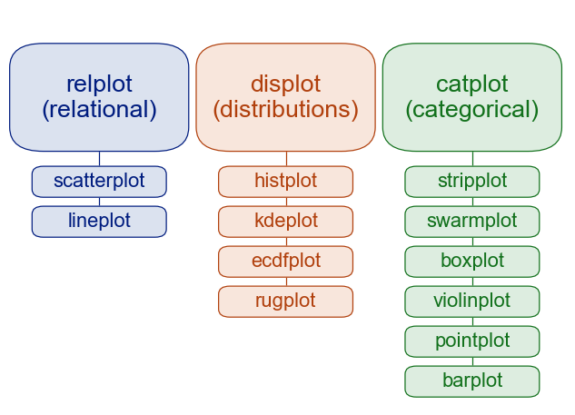
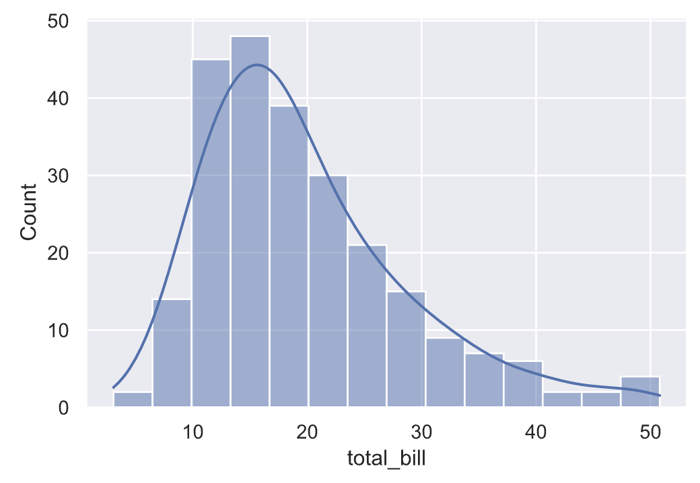
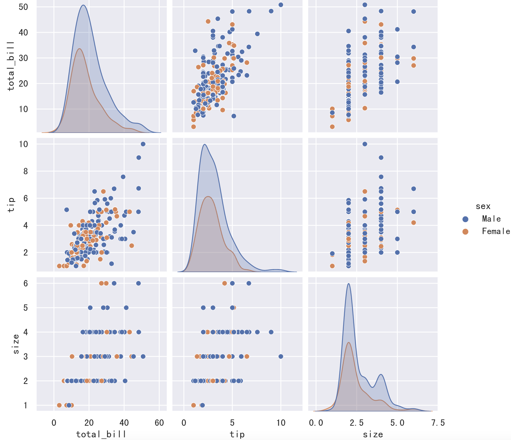
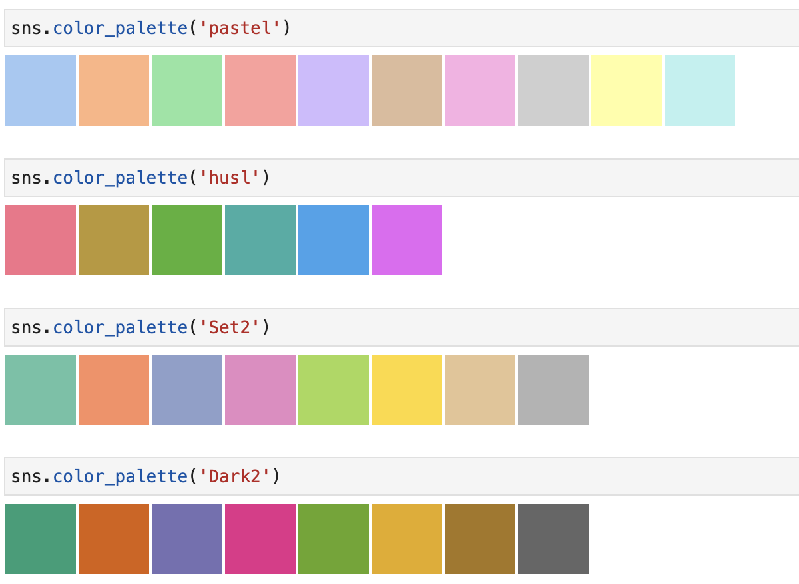
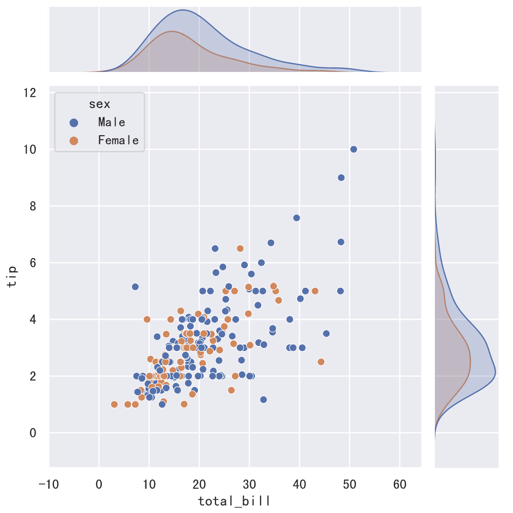
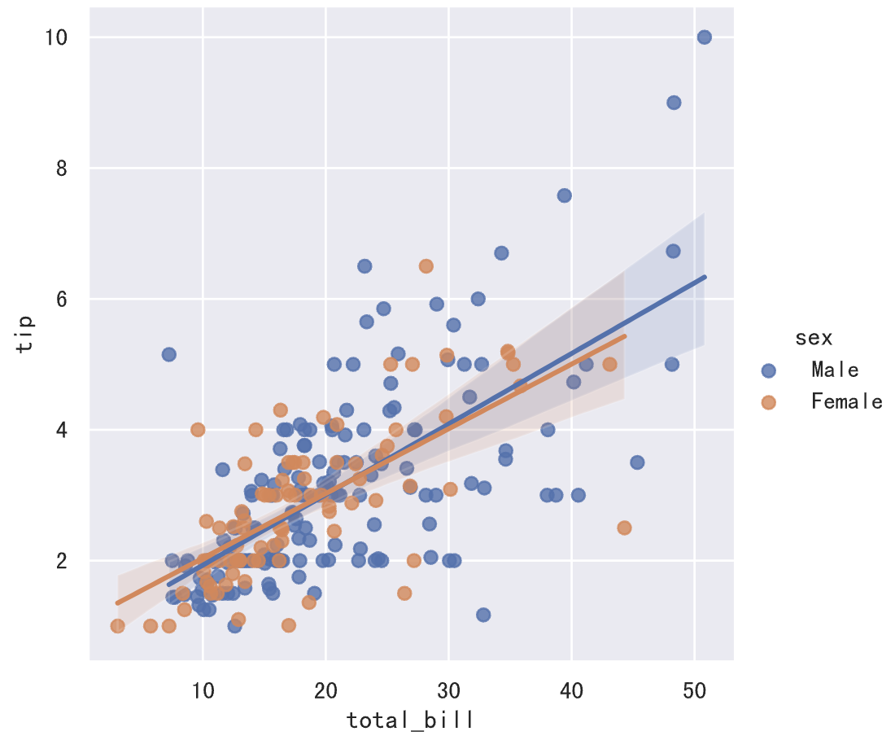
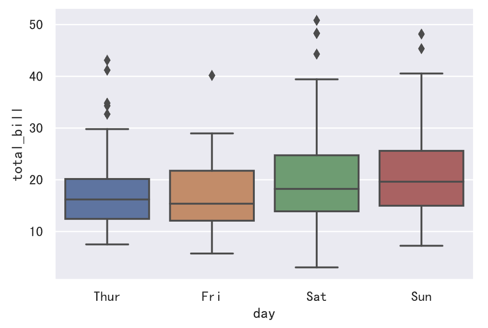
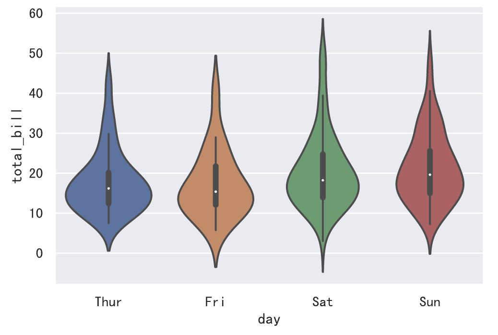
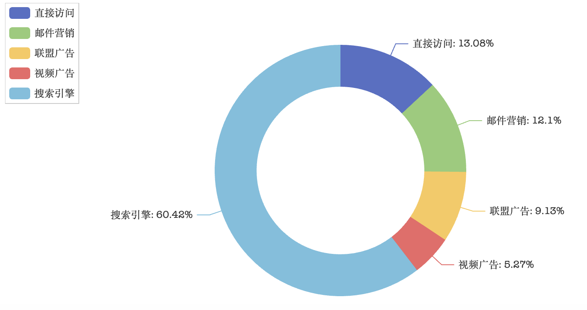
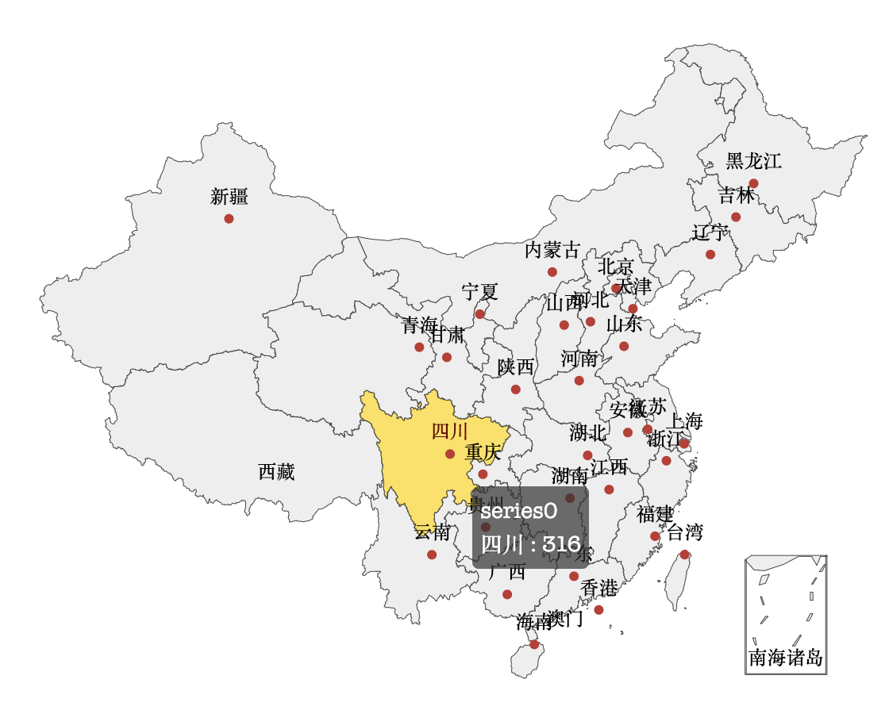

## 数据可视化-3

通过前面的学习，我们已经对数据可视化工具 matplotlib 有一个初步的认知。大家可能也会发现了，matplotlib 提供的函数虽然强大，但是参数太多，要想对图表进行深度的定制就需要修改一系列的参数，这一点对新手并不友好。另一方面，使用 matplotlib 定制的统计图是静态图表，可能在某些需要交互效果的场景下并不合适。为了解决这两个问题，我们为大家介绍两个新的可视化工具，一个是 seaborn，一个是 pyecharts。

### Seaborn

Seaborn 是建立在 matplotlib 之上的数据可视化工具，它相当于是对 matplotlib 进行了更高级的封装，而且 seaborn 也能跟 pandas 无缝整合，让我们可以用更少的代码构建出更好的统计图表，帮助我们探索和理解数据。Seaborn 包含但不局限于以下描述的功能：

1. 面向数据集的 API，可用于检查多个变量之间的关系。
1. 支持使用分类变量来显示观察结果或汇总统计数据。
1. 能够可视化单变量或双变量分布以及在数据子集之间进行比较的选项
1. 各类因变量线性回归模型的自动估计与作图。
1. 集成调色板和主题，轻松定制统计图表的视觉效果。

可以使用 Python 的包管理工具 pip 来安装 seaborn。

```Bash
pip install seaborn
```

在 Jupyter 中，可以直接使用魔法指令进行安装，如下所示。

```Bash
%pip install seaborn
```

下面，我们用 seaborn 自带的数据集为例，为大家简单的展示 seaborn 的用法和强大之处，想要深入研究 seaborn 的读者可以自行阅读官方[文档](https://seaborn.pydata.org/tutorial.html)和并查看官方作品集中的[示例。](https://seaborn.pydata.org/examples/index.html)根据官方示例来编写自己的代码是一个不错的选择，简单的说就是保留官方代码，将数据换成自己的数据即可。下图展示了 seaborn 绘制图表的函数，可以看出，seaborn 的这些函数主要支持我们通过绘制图表来探索数据的关系、分布和分类。



使用 seaborn，首先需要导入该库并设置主题，代码如下所示。

```Python
import seaborn as sns

sns.set_theme()
```

如果需要在图表上显示中文，还需要用之前讲过的方法修改 matplotlib 的配置参数，代码如下所示。

```Python
import matplotlib.pyplot as plt

plt.rcParams['font.sans-serif'].insert(0, 'SimHei')
plt.rcParams['axes.unicode_minus'] = False
```

> **注意**：上面的代码必须放在调用 set_theme 函数之后，否则调用 set_theme 函数时又会重新修改 matplotlib 配置参数中的字体设置。

加载官方的 Tips 数据集（就餐小费数据）。

```Python
tips_df = sns.load_dataset('tips')
tips_df.info()
```

运行结果如下所示，其中 total_bill 表示账单总金额，tip 表示小费的金额，sex 是顾客的性别，smoker 表示顾客是否抽样，day 代表星期几，time 代表是午餐还是晚餐，size 是就餐人数。

```
<class 'pandas.core.frame.DataFrame'>
RangeIndex: 244 entries, 0 to 243
Data columns (total 7 columns):
 #   Column      Non-Null Count  Dtype   
---  ------      --------------  -----   
 0   total_bill  244 non-null    float64 
 1   tip         244 non-null    float64 
 2   sex         244 non-null    category
 3   smoker      244 non-null    category
 4   day         244 non-null    category
 5   time        244 non-null    category
 6   size        244 non-null    int64   
dtypes: category(4), float64(2), int64(1)
memory usage: 7.4 KB
```

由于数据集是联网加载的，上述代码可能因为 SSL 的原因无法获取到数据，可以尝试先运行下面的代码，然后再加载数据集。

```Python
import ssl

ssl._create_default_https_context = ssl._create_unverified_context
```

如果我们希望了解账单金额的分布，可以使用下面的代码来绘制分布图。

```Python
sns.histplot(data=tips_df, x='total_bill', kde=True)
# 核密度估计（KDE）曲线
```



如果想了解变量之间的两两关系，我们可以绘制点对图，代码和效果如下所示。

```Python
sns.pairplot(data=tips_df, hue='sex')
# hue 参数来指定一个分类变量
```



如果对上面图表的颜色不满意，还可以通过 palette 参数选择 seaborn 自带的“调色板”来修改颜色，这种方式相比于自行指定颜色或使用随机颜色方便和靠谱了很多，下图为大家展示了部分 seaborn 自带的“调色板”。



我们可以将上面的代码稍作修改，看看运行结果有什么差别。

```Python
sns.pairplot(data=tips_df, hue='sex', palette='Dark2')
```

接下来，我们为 total_bill 和 tip 两组数据绘制联合分布图，代码如下所示。

```Python
sns.jointplot(data=tips_df, x='total_bill', y='tip', hue='sex')
```



上面清晰的展示了，total_bill 和 tip 之间存在正相关关系，这一点我们也可以通过 DataFrame 对象的 corr 方法进行验证。接下来，我们可以建立回归模型来拟合这些数据点，而 seaborn 的线性回归模型图已经帮我们实现了这项功能，代码如下所示。

```Python
sns.lmplot(data=tips_df, x='total_bill', y='tip', hue='sex')
```



如果我们希望了解账单金额的集中和离散趋势，可以绘制箱线图或小提琴图，代码如下所示，我们将数据按星期四、星期五、星期六和星期天分别进行展示。

```Python
sns.boxplot(data=tips_df, x='day', y='total_bill')
```



```Python
sns.violinplot(data=tips_df, x='day', y='total_bill')
```



> **说明**：相较于箱线图，小提琴图没有标注异常点而是显示了数据的整个范围，另一方面，小提琴图很好的展示了数据的分布（密度轨迹）。

### Pyecharts

Echarts 原来是百度开发的一个前端图表库，2018年1月16日，ECharts 进入 Apache Incubator 进行孵化，目前已经是 Apache 软件基金会的顶级项目。凭借着良好的交互性和精巧的图表设计，ECharts 得到了众多开发者的认可，而 pyecharts 就是基于 Python 语言对 ECharts 进行了包装，让 Python 开发者也可以使用 ECharts 绘制外观精美且交互性强的统计图表。

可以使用 Python 的包管理工具 pip 来安装 pyecharts。

```Bash
pip install pyecharts
```

在 JupyterLab 中，可以直接使用魔法指令进行安装，如下所示。

```Bash
%pip install pyecharts
```

如果想在 JupyterLab 中使用 pyecharts 绘图，我们还需要做一些准备工作，主要是修改 pyecharts 的配置，代码如下所示。

```python
from pyecharts.globals import CurrentConfig, NotebookType

CurrentConfig.NOTEBOOK_TYPE = NotebookType.JUPYTER_LAB
```

接下来，我们通过来自于 pyecharts 官方网站新手教程中的一个例子，来认识 pyecharts。当然，我们对官网的例子进行一些调整，代码如下所示。

```Python
from pyecharts.charts import Bar
from pyecharts import options as opts

# 创建柱状图对象并设置初始参数（宽度、高度）
bar_chart = Bar(init_opts=opts.InitOpts(width='600px', height='450px'))
# 设置横轴数据
bar_chart.add_xaxis(["衬衫", "羊毛衫", "雪纺衫", "裤子", "高跟鞋", "袜子"])
# 设置纵轴数据（第一组）
bar_chart.add_yaxis("商家A", [25, 20, 36, 10, 75, 90])
# 设置纵轴数据（第二组）
bar_chart.add_yaxis("商家B", [15, 12, 30, 20, 45, 60])
# 设置纵轴数据（第三组）
bar_chart.add_yaxis("商家C", [12, 32, 40, 52, 35, 26])
# 添加全局配置参数
bar_chart.set_global_opts(
    # 横轴相关的参数
    xaxis_opts=opts.AxisOpts(
        axislabel_opts=opts.LabelOpts(color='navy')
    ),
    # 纵轴相关的参数（标签、最小值、最大值、间隔）
    yaxis_opts=opts.AxisOpts(
        axislabel_opts=opts.LabelOpts(color='navy'),
        min_=0,
        max_=100,
        interval=10
    ),
    # 标题相关的参数（内容、链接、位置、文本样式）
    title_opts=opts.TitleOpts(
        title='2022年销售数据展示',
        pos_left='2%',
        title_textstyle_opts=opts.TextStyleOpts(
            color='navy',
            font_size=16,
            font_family='苹方-简',
            font_weight='bold'
        )
    ),
    # 工具箱相关的参数
    toolbox_opts=opts.ToolboxOpts(
        orient='vertical',
        pos_left='right'
    )
)
# 加载绘图需要的JavaScript文件
bar_chart.load_javascript()
```

在执行完上面的代码后，我们就可以通过调用`bar`对象的方法来完成对图表的渲染。如果直接使用`render`方法，那么绘制好的统计图表将保存到一个 HTML 文件中，打开该文件也能够看到绘制好的统计图表，而`render_notebook`方法则是将图表渲染到浏览器窗口中。

```python
bar_chart.render_notebook()
```

上面代码的运行效果如下图所示。值得一提的是，下图中的标题、图例、右侧的工具箱都是可以点击的，大家可以点击它们看看会有什么样的效果，ECharts 的魅力就在于它的交互效果，大家一定要试一试。


接下来，我们也是通过一个官方示例，看看如何绘制饼图。

```Python
import pyecharts.options as opts
from pyecharts.charts import Pie

# 准备饼图需要的数据
x_data = ["直接访问", "邮件营销", "联盟广告", "视频广告", "搜索引擎"]
y_data = [335, 310, 234, 135, 1548]
data = [(x, y) for x, y in zip(x_data, y_data)]

# 创建饼图对象并设置初始化参数
pie_chart = Pie(init_opts=opts.InitOpts(width="800px", height="400px"))
# 向饼图添加数据
pie_chart.add(
    '', 
    data_pair=data,
    radius=["50%", "75%"],
    label_opts=opts.LabelOpts(is_show=False),
)
# 设置全局配置项
pie_chart.set_global_opts(
    # 配置图例相关的参数
    legend_opts=opts.LegendOpts(
        pos_left="legft",
        orient="vertical"
    )
)
# 设置数据系列配置参数
pie_chart.set_series_opts(
    # 设置不显示工具提示
    tooltip_opts=opts.TooltipOpts(is_show=False),
    # 设置饼图标签的样式
    label_opts=opts.LabelOpts(formatter="{b}({c}): {d}%")
)
pie_chart.load_javascript()
```

```python
pie_chart.render_notebook()
```

运行上面的代码，效果如下图所示。



需要提醒大家注意的是，pyecharts 并不能直接使用 NumPy 的 ndarray 和 Pandas 的 Series、DataFrame 为其提供数据，它需要的是 Python 原生的数据类型。可能大家也注意到了，上面的代码中，我们使用的都是列表、元组这样的数据类型。

最后，我们来看看如何绘制地图，绘制地图首先需要安装额外的依赖库来获取地图相关信息，命令如下所示。

```Bash
pip install echarts-countries-pypkg echarts-china-provinces-pypkg echarts-china-cities-pypkg echarts-china-counties-pypkg
```

在 Jupyter 中，可以直接使用魔法指令进行安装，如下所示。

```Bash
%pip install echarts-countries-pypkg
%pip install echarts-china-provinces-pypkg
%pip install echarts-china-cities-pypkg
%pip install echarts-china-counties-pypkg
```

> **说明**：上面的四个库分别包含了世界各国、中国省级行政区域、中国市级行政区域、中国区/县级行政区域的数据。

然后，我们将全国各省的数据放在一个列表中，代码如下所示。

```Python
data = [
    ('广东', 594), ('浙江', 438), ('四川', 316), ('北京', 269), ('山东', 248),
    ('江苏', 234), ('湖南', 196), ('福建', 166), ('河南', 153), ('辽宁', 152),
    ('上海', 138), ('河北', 86), ('安徽', 79), ('湖北', 75), ('黑龙江', 70), 
    ('陕西', 63), ('吉林', 59), ('江西', 56), ('重庆', 46), ('贵州', 39),
    ('山西', 37), ('云南', 33), ('广西', 24), ('天津', 22), ('新疆', 21),
    ('海南', 18), ('内蒙古', 14), ('台湾', 11), ('甘肃', 7), ('广西壮族自治区', 4),
    ('香港', 4), ('青海', 3), ('新疆维吾尔自治区', 3), ('内蒙古自治区', 3), ('宁夏', 1)
]
```

接下来，我们使用 pyecharts 在地图上标记各省抖音大V人数。

```Python
import pyecharts.options as opts
from pyecharts.charts import Map

map_chart = Map(init_opts=opts.InitOpts(width='1000px', height='1000px'))
map_chart.add('', data, 'china', is_roam=False)
map_chart.load_javascript()
```

```python
map_chart.render_notebook()
```

代码的运行效果如下图所示，将鼠标置于地图上时，会高亮对应的省并看到相关的信息。



和 seaborn 一样，我们建议大家参考官方提供的示例来使用 pyecharts，我们可以在 pyecharts [官方网站](https://pyecharts.org/#/zh-cn/)的左侧导航栏中找到“图表类型”选项，下面每种类型的图表都有对应的官方示例，很多代码是可以直接使用的，我们需要做的就是将数据换成自己的数据。